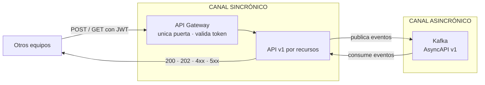

# NN — Contratos inter-equipos (<servicio>)

> **Con quién hablamos, qué les pedimos, qué les damos, por dónde y en qué formato.**
> Punto de entrada para cualquier sesión de integración. Resume los contratos desde
> afuera hacia adentro, con los ojos de los equipos que nos integran.

---

## Estado vigente — contratos v1

El contrato ejecutable es [`contracts/<servicio>-v1.openapi.yaml`](contracts/<servicio>-v1.openapi.yaml)
para HTTP y [`contracts/<servicio>-v1.asyncapi.yaml`](contracts/<servicio>-v1.asyncapi.yaml)
para Kafka. Todas las rutas usan `/api/<n>/**`, los servicios se identifican con M2M
`aud=<n>-service`, y la correlación usa `traceparent` + `X-Request-Id`.

| Par | Responsabilidad acordada |
|---|---|
| `<equipo-a>` | [qué hace respecto de nosotros] |
| `<equipo-b>` | [·] |

---

## 0. Cómo leemos los contratos

| Regla | Por qué importa |
|---|---|
| **El API Gateway es la única puerta** | Nadie llega directo al servicio: ni HTTP, ni gRPC, ni llamada interna. Todo pasa por el Gateway, que valida el token. |
| **Lo asincrónico viaja por Kafka** | Publicar un evento no es hacer un POST a otro microservicio. Canales distintos, garantías distintas. |
| **La correlación viaja en headers** | Cada request y evento propaga `traceparent` y `X-Request-Id`; los cuerpos no usan `trace_id`. |



---

## 1. Lo que exponemos (resumen del OpenAPI)

| Recurso | Método | Quién lo usa | Modo | Devuelve |
|---|---|---|---|---|
| `/<recurso>` | `POST` | `<equipo>` | sync | `201` + `Location` |
| `/<recurso>/{id}` | `GET` | `<equipo>` | sync | `200` / `404` |
| `/<accion-async>` | `POST` | `<equipo>` | async | `202` + `Location` a `/jobs/{id}` |

> Identidad y tenancy salen del token, no del body. Errores como Problem Details con
> `codigo` tipado.

## 2. Eventos que publicamos

### `<evento>.v1`

**Consumidores:** `<equipo>`

```json
{ "eventId": "uuid", "version": "1.0", "occurredAt": "ISO-8601", "producer": "<servicio>",
  "data": { "<campo>": "..." } }
```

## 3. Eventos que consumimos

| Evento | Lo publica | Qué dispara en nosotros |
|---|---|---|
| `<evento>.v1` | `<equipo>` | [·] |

**Estructura mínima que necesitamos:** [campos obligatorios y por qué].

> Pedir estos campos **antes** de que el equipo dueño cierre su contrato de eventos.
> Después es renegociar con varios equipos.

## 4. Lo que necesitamos de cada equipo

### `<equipo>`

- **Nos llaman para:** [endpoints]
- **Nos tienen que dar:** [datos / eventos / decisiones]
- **🔴 Bloqueo:** [lo que nos frena si no llega, con dueño y fecha]

## 5. Autenticación entre servicios

- Toda llamada sincrónica pasa por el API Gateway, que valida el JWT.
- **Nunca** confiamos en parámetros del cliente para identidad.
- **Nunca** exponemos la API directamente sin el Gateway.
- Acordado con todos: header, formato y claims mínimos del token interno
  (`aud=<n>-service`, scope por operación, usuario delegado).

## 6. Reglas generales

| Regla | Qué significa |
|---|---|
| `Idempotency-Key` obligatoria | Reintento por timeout no genera dos efectos |
| Correlación en todo | `traceparent` + `X-Request-Id` en request y evento |
| Errores tipados | Campo `codigo` estable, nunca string libre |
| No escribimos en bases ajenas | Devolvemos; el dueño persiste |
| Contrato = solo lo que existe | Un endpoint/campo no acordado no se publica |

## 7. Pendientes de integración

| ID | Tema | Equipos | Por qué urgente | Dueño / fecha |
|---|---|---|---|---|
| I-01 | [·] | [·] | [·] | 🔴 |
