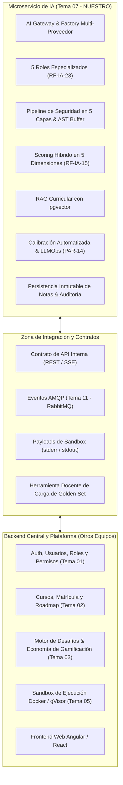
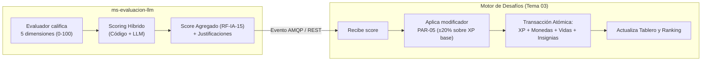
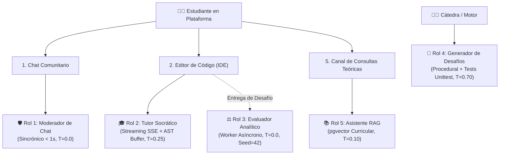

# 01 — Alcance, Responsabilidades y los 5 Roles de IA

> **Cátedra:** Programación IV — Back End · UTN FRC  
> **Tema 07:** Capa de Inteligencia Artificial y Evaluación LLM  
> **Propósito:** Definir con precisión quirúrgica el perímetro del microservicio de IA, la misión y contratos de los 5 roles canónicos (RF-IA-23), la frontera del XP frente al motor de desafíos, y los criterios de aceptación (DoD).

---

## 1. El Problema Pedagógico Central

El sistema de IA no es un chatbot genérico de asistencia inmediata tipo ChatGPT. Si la plataforma entregara la solución de código de inmediato ante las dudas del alumno:
* Los tests automáticos pasarían en verde, pero el estudiante **no desarrollaría el pensamiento computacional ni la habilidad de depuración (*debugging*)**.
* En instancias presenciales o entrevistas técnicas, no sabría razonar sin la máquina.

Por ello, el sistema adopta el **Método Socrático**:
1. Acompaña al estudiante directamente en el editor de código web (Monaco / IDE).
2. Lee los errores de compilación e inspecciona las fallas capturadas por el Sandbox de ejecución (`stderr`).
3. Orienta mediante preguntas guía, pistas conceptuales y analogías.
4. **Posee un blindaje de seguridad activo** que impide la entrega de soluciones completas o la ejecución de ataques de inyección (*Jailbreaks*).

---

## 2. Mapa de Responsabilidades y Frontera del XP

### 2.1. Lo que construye el Equipo de IA vs. Otros Equipos

### 2.2. La Frontera del XP: Por qué la IA no asigna puntos

> **Principio de Diseño:** La IA calcula y emite los números objetivos del desempeño (`score_agregado` de 0 a 100, desglose en 5 dimensiones, confianza y justificación); **el Motor de Desafíos (Tema 03) es el único dueño de la economía y asignación de XP**.

#### Razones Técnicas y de Negocio:
1. **Atomicidad Transaccional:** Otorgar XP, monedas, vidas, insignias y niveles es una operación indivisible en la base de datos de gamificación. Dos escritores independientes sobre la misma economía generarían condiciones de carrera.
2. **Desconocimiento del XP Base:** La IA desconoce las reglas de negocio globales (dificultad del ejercicio, bonus por tiempo, multiplicadores de racha). El score de IA es solo un factor multiplicador ($\pm 20\%$, PAR-05).
3. **Resiliencia y Degradación (RF-IA-27):** Si el proveedor de IA se cae temporalmente, el backend de la plataforma debe aceptar la entrega del alumno, otorgarle el XP base de inmediato y encolar el cálculo del score de IA para cuando el servicio se restablezca.

---

## 3. Especificación Técnica de los 5 Roles de IA (RF-IA-23)

El sistema descarta el concepto de "un solo prompt monolítico" y especializa la inferencia en 5 agentes con responsabilidades, ventanas de contexto e hiperparámetros independientes:

### Tabla Maestra de Especificación de Roles

| Rol | Misión Principal | Endpoint / Activador | Patrón de Ejecución | Timeout Máx. | Modelo Recomendado | $T$ | Top-P | Seed |
|---|---|---|---|---|---|---|---|---|
| **Rol 1: Moderador** | Evitar filtración de soluciones en canales sociales y censurar toxicidad (RF-CHT-09/10). | `POST /api/v1/moderation` | Sincrónico Bloqueante | `1.0 s` | GPT-5 nano / Gemini 3.5 Flash-Lite | `0.00` | `0.10` | `42` |
| **Rol 2: Tutor Socrático** | Guiar al alumno en el IDE mediante preguntas reflexivas sin revelar código resuelto (RF-IA-04/19). | `POST /api/v1/tutor/stream` | Sincrónico Streaming (SSE) | `45.0 s` | Gemini 3.5 Flash-Lite | `0.25` | `0.85` | `None` |
| **Rol 3: Evaluador** | Calificar la interacción en 5 dimensiones pedagógicas y justificar notas (RF-IA-13/15). | Evento AMQP `CHALLENGE_SUBMITTED` | Asíncrono Desacoplado | `120.0 s` | Claude Haiku 4.5 + Batch API | `0.00` | `0.00` | `42` |
| **Rol 4: Generador** | Crear enunciados procedurales de ejercicios y suites de prueba unitarias (RF-DES-05). | `POST /api/v1/challenges/generate` | Asíncrono con Gate Humano | `30.0 s` | Gemini 3.5 Flash-Lite | `0.70` | `0.95` | `None` |
| **Rol 5: Asistente RAG** | Responder consultas teóricas estrictamente ancladas a los apuntes oficiales (RF-IA-06/08). | `POST /api/v1/rag/query` | Sincrónico | `5.0 s` | Gemini 3.5 Flash-Lite | `0.10` | `0.50` | `42` |

---

## 4. Detalle Operativo de cada Rol

### 🛡️ Rol 1: Moderador de Chat (El Réferi Veloz)
* **Objetivo:** Escanear en tiempo real cada mensaje enviado en salas públicas o grupales.
* **Política Fail-Closed:** Si la llamada al LLM supera el timeout de `1.0 s` por saturación de red, el sistema **no publica el mensaje a ciegas**; lo retiene preventivamente retornando código de espera.
* **Salida Estructurada:** Retorna `is_safe: bool`, `contains_code_leak: bool`, `contains_toxicity: bool`, `reason: str`.

### 🎓 Rol 2: Tutor Socrático en el IDE (El Docente de Laboratorio)
* **Objetivo:** Intervenir cuando el estudiante se traba en el editor.
* **Anclaje a la Realidad (`<investigate_before_answering>`):** Recibe las salidas crudas del Sandbox Docker (`stderr`, trazas de error, excepciones no controladas) para responder sobre la causa raíz real del error.
* **Regla Inviolable:** **La solución de referencia jamás entra al contexto del prompt del tutor.** Lo que el modelo no conoce no lo puede filtrar. La validación de similitud corre en el Egress Filter externo mediante AST.

### ⚖️ Rol 3: Evaluador de Uso de IA (El Tribunal Forense)
* **Objetivo:** Analizar la transcripción completa de la interacción una vez finalizado el desafío.
* **Modelo Único Activo (RF-IA-25):** Para asegurar equidad académica, todos los estudiantes de una cohorte son evaluados por la misma versión de modelo y prompt activo.
* **Salida Estricta:** Emite notas normalizadas en 5 dimensiones (0 a 100), `confidence_score` (0.0 a 1.0) y un flag `requiere_auditoria_humana` si la confianza es $<0.70$ o por muestreo del 10% (PAR-10).

### 🧩 Rol 4: Generador de Desafíos y Pruebas Unitarias
* **Objetivo:** Crear variantes infinitas de ejercicios prácticos basados en el grafo de conocimientos del curso.
* **Estructura Requerida:** Todo desafío generado incluye enunciado en Markdown, firma de función, código esqueleto con docstrings y suite obligatoria de tests unitarios (`unittest` / `pytest` / JUnit).

### 📚 Rol 5: Asistente Conversacional RAG (El Bibliotecario Curricular)
* **Objetivo:** Atender dudas conceptuales sobre el material teórico cargado por los docentes.
* **Perímetro Curricular Estricto (RF-IA-06):** La consulta se busca vectorialmente en PostgreSQL (`pgvector`) filtrando por `curso_id`. Si la distancia de similitud supera el umbral de corte, el asistente declina la respuesta amablemente indicando que el tema no forma parte del programa oficial.

---

## 5. Criterios de Release del MVP (Definition of Done — DoD)

| DoD (PRD §19) | Requisito Exigido | Implementación en Microservicio de IA |
|---|---|---|
| **DoD 7** | Tutor socrático respeta reglas y evaluador desglosa 5 dimensiones. | Implementado en `TutorPipeline` con AST buffer y `EvaluatorPipeline` con Pydantic v2. |
| **DoD 7b** | Golden Set base cargado y puntuado por docentes. | Tabla `golden_set_records` en PostgreSQL y runner de calibración nocturna. |
| **DoD 7c** | Bloqueo draft $\to$ activo verificado ante falta de calibración. | Endpoint `/api/v1/calibration/status` consultado por el backend antes de publicar curso. |
| **DoD 11** | Degradación controlada ante caída de proveedores externos. | Reintentos con Tenacity + encolado asíncrono diferido (RF-IA-27). |
| **DoD 13** | Inmutabilidad y auditoría de rectificaciones docentes. | Tabla `scores_ia` con triggers PL/pgSQL + tabla `score_overrides`. |
