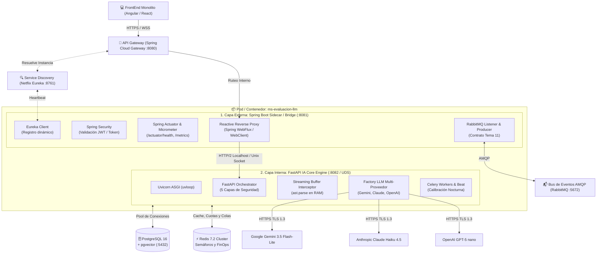

# 02 — Arquitectura Híbrida de Plataforma y Topología de Red

> **Cátedra:** Programación IV — Back End · UTN FRC  
> **Tema 07:** Capa de Inteligencia Artificial y Evaluación LLM  
> **Propósito:** Detallar el diseño de la **Arquitectura Híbrida (Java Spring Boot + Python FastAPI)** que cumple con el 100% de las normas impuestas por la cátedra de Programación IV y aprovecha el ecosistema nativo de IA y árboles sintácticos (AST) de Python.

---

## 1. El Marco Normativo de la Cátedra (Reglas No Negociables)

De acuerdo con `TUP_PIV_BE_PROPUESTA_ARQ.pdf`, la plataforma impone seis restricciones de infraestructura obligatorias:

| Regla de Plataforma | Exigencia Técnica | Implementación en Nuestro Servicio |
|---|---|---|
| **R-1: API Gateway Central** | Única puerta de entrada para clientes externos (FrontEnd). | Ningún cliente llama directo a la IA; todo pasa por Spring Cloud Gateway. |
| **R-2: Service Discovery Dinámico** | Todo microservicio debe registrarse al iniciar. | Registro dinámico en **Netflix Eureka Server**. |
| **R-3: Cero Comunicación Directa** | No se permiten llamadas HTTP directas entre microservicios. | Toda comunicación síncrona pasa por el Gateway; lo asíncrono va por el Bus. |
| **R-4: Base de Datos Exclusiva** | Cada microservicio es dueño único de su esquema y base. | PostgreSQL 16 con `pgvector` en base de datos dedicada y aislada. |
| **R-5: Bus de Eventos Compartido** | La comunicación asíncrona viaja por RabbitMQ (Tema 11). | Publicación de `EVALUATION_COMPLETED` y consumo de `CHALLENGE_SUBMITTED`. |
| **R-6: Responsabilidad Única** | Un solo dueño por entidad del dominio. | El microservicio emite el score; el Tema 03 (Motor) persiste el XP. |

---

## 2. La Solución Arquitectónica: Patrón Híbrido (Spring Cloud Sidecar + FastAPI Engine)

Para resolver el dilema entre las exigencias del entorno universitario (Java / Spring Cloud) y las ventajas técnicas indispensables para IA (FastAPI, Pydantic v2, AST parsers nativos, `uvloop`, SDKs oficiales de LLMs), implementamos una **Arquitectura Híbrida en Dos Capas**:



### ¿Por qué esta arquitectura es superior?
1. **100% Cumplimiento Cátedra:** Frente a los demás equipos y a los evaluadores de la materia, el microservicio expone un punto final Java Spring Boot totalmente integrado con **Eureka, Spring Cloud Gateway, RabbitMQ y Actuator**.
2. **Cero Overhead en Desarrollo:** La capa Java actúa como un *Reverse Proxy* reactivo ultraliviano (utilizando Spring WebFlux `WebClient` sin bloqueo de hilos). Pasa las peticiones HTTP y los flujos SSE directamente al motor Python en `localhost`.
3. **Máxima Potencia para IA:** Toda la lógica de inteligencia artificial, validaciones Pydantic v2, AST parsers, streaming con Buffer Interceptor y cálculo vectorial corre en Python 3.12 con `uvloop` de forma nativa.

---

## 3. Implementación de la Capa de Integración en Java (Spring Boot Bridge)

### 3.1. Configuración de Registro en Eureka (`application.yml`)
```yaml
server:
  port: 8081

spring:
  application:
    name: ms-evaluacion-llm
  rabbitmq:
    host: ${RABBITMQ_HOST:localhost}
    port: ${RABBITMQ_PORT:5672}
    username: ${RABBITMQ_USER:guest}
    password: ${RABBITMQ_PASS:guest}

eureka:
  client:
    service-url:
      defaultZone: http://${EUREKA_HOST:localhost}:8761/eureka/
    register-with-eureka: true
    fetch-registry: true
  instance:
    prefer-ip-address: true
    lease-renewal-interval-in-seconds: 10

management:
  endpoints:
    web:
      exposure:
        include: "health,info,metrics,prometheus"
  endpoint:
    health:
      show-details: always
```

### 3.2. Controlador Reactivo y Proxy SSE en Java (`AiBridgeController.java`)
```java
package ar.edu.utn.frc.tup.ai.controller;

import org.springframework.http.MediaType;
import org.springframework.http.codec.ServerSentEvent;
import org.springframework.web.bind.annotation.*;
import org.springframework.web.reactive.function.client.WebClient;
import reactor.core.publisher.Flux;
import reactor.core.publisher.Mono;

import java.util.Map;

@RestController
@RequestMapping("/api/v1")
public class AiBridgeController {

    private final WebClient pythonEngineClient;

    public AiBridgeController(WebClient.Builder webClientBuilder) {
        // Conexión interna local de alta velocidad hacia FastAPI
        this.pythonEngineClient = webClientBuilder
                .baseUrl("http://127.0.0.1:8082")
                .build();
    }

    /**
     * Proxy transparente para el Streaming SSE del Tutor Socrático
     */
    @PostMapping(value = "/tutor/stream", produces = MediaType.TEXT_EVENT_STREAM_VALUE)
    public Flux<ServerSentEvent<String>> streamTutorResponse(@RequestBody Map<String, Object> requestPayload) {
        return pythonEngineClient.post()
                .uri("/api/v1/tutor/stream")
                .contentType(MediaType.APPLICATION_JSON)
                .bodyValue(requestPayload)
                .retrieve()
                .bodyToFlux(String.class)
                .map(data -> ServerSentEvent.<String>builder()
                        .data(data)
                        .build());
    }

    /**
     * Proxy para moderación síncrona de chat
     */
    @PostMapping(value = "/moderation", produces = MediaType.APPLICATION_JSON_VALUE)
    public Mono<Map> moderateMessage(@RequestBody Map<String, Object> requestPayload) {
        return pythonEngineClient.post()
                .uri("/api/v1/moderation")
                .contentType(MediaType.APPLICATION_JSON)
                .bodyValue(requestPayload)
                .retrieve()
                .bodyToMono(Map.class);
    }
}
```

### 3.3. Listener de Eventos AMQP (Tema 11) en Java (`EvaluationEventListener.java`)
```java
package ar.edu.utn.frc.tup.ai.messaging;

import org.springframework.amqp.rabbit.annotation.RabbitListener;
import org.springframework.amqp.rabbit.core.RabbitTemplate;
import org.springframework.stereotype.Component;
import org.springframework.web.reactive.function.client.WebClient;

import java.util.Map;

@Component
public class EvaluationEventListener {

    private final WebClient pythonEngineClient;
    private final RabbitTemplate rabbitTemplate;

    public EvaluationEventListener(WebClient.Builder webClientBuilder, RabbitTemplate rabbitTemplate) {
        this.pythonEngineClient = webClientBuilder.baseUrl("http://127.0.0.1:8082").build();
        this.rabbitTemplate = rabbitTemplate;
    }

    @RabbitListener(queues = "queue.student.challenge.submitted")
    public void handleChallengeSubmittedEvent(Map<String, Object> eventPayload) {
        // Delega la evaluación pesada asíncrona al worker interno de FastAPI
        pythonEngineClient.post()
                .uri("/internal/v1/evaluations/enqueue")
                .bodyValue(eventPayload)
                .retrieve()
                .bodyToMono(Void.class)
                .subscribe();
    }
}
```

---

## 4. Estructura Interna del Motor Python FastAPI (Onion Architecture)

El motor de IA interno está organizado rigurosamente bajo la **Arquitectura de Cebolla (Onion / Clean Architecture)**:

```text
ai_engine/
├── api/                          # Capa 1: Routers HTTP y DTOs
│   ├── deps.py                   # Inyección de dependencias (DB, Redis, LLM)
│   └── v1/
│       ├── tutor.py              # POST /api/v1/tutor/stream (SSE)
│       ├── moderation.py         # POST /api/v1/moderation
│       ├── evaluator.py          # Evaluador y endpoints de scoring
│       ├── challenges.py         # Generador procedural de desafíos
│       └── rag.py                # Asistente de consultas teóricas
├── core/                         # Configuraciones globales
│   ├── config.py                 # Variables de entorno pydantic-settings
│   ├── finops_guard.py           # Control de cuotas de tokens en Redis
│   └── security.py               # Headers internos y sanitización
├── domain/                       # Modelos de Dominio y Esquemas
│   ├── schemas/                  # Pydantic v2 DTOs inmutables (frozen=True)
│   │   ├── tutor_dto.py
│   │   ├── evaluation_dto.py
│   │   └── common_dto.py
│   └── models/                   # Tablas ORM SQLAlchemy 2.0 (PostgreSQL 16)
│       ├── prompt_version.py
│       ├── score_ia.py
│       └── golden_set.py
├── services/                     # Capa 2: Seguridad, Pipelines y AST
│   ├── pipelines/
│   │   ├── tutor_pipeline.py     # Orquestación del tutor y SSE
│   │   ├── evaluation_pipeline.py# Scoring híbrido (código + LLM)
│   │   └── rag_pipeline.py       # Embeddings y búsqueda semántica
│   └── shields/
│       ├── harmlessness_shield.py# Capa 1: Filtro de intenciones (HTTP 400)
│       ├── pii_sanitizer.py      # Capa 2: Regex scrubber de datos sensibles
│       ├── prompt_builder.py     # Capa 3: Delimitación XML estricta
│       ├── redis_tracker.py      # Capa 4: Memoria anti-puzzle
│       └── egress_ast_filter.py  # Capa 5: Buffer Interceptor AST en RAM
└── infrastructure/               # Capa 3: Adaptadores y Persistencia
    ├── db/
    │   ├── session.py            # Pool asíncrono asyncpg / SQLAlchemy
    │   └── redis_pool.py         # Pool Redis Cluster async
    ├── llm/
    │   ├── base.py               # BaseLLMProvider (Interfaz abstracta)
    │   ├── factory.py            # LLMFactory multi-proveedor
    │   └── adapters/
    │       ├── gemini_adapter.py # Google Gemini 3.5 Flash-Lite
    │       ├── claude_adapter.py # Anthropic Claude Haiku 4.5
    │       └── openai_adapter.py # OpenAI GPT-5 nano
    └── celery_app/
        ├── worker.py             # Workers asíncronos en background
        └── beat.py               # Scheduler nocturno de calibración Drift
```

---

## 5. Inyección de Dependencias y Ciclo de Vida (`deps.py`)

Para garantizar que no existan fugas de memoria ni conexiones colgadas durante exámenes masivos de 120 alumnos concurrentes:

```python
from typing import AsyncGenerator
from fastapi import Depends
from redis.asyncio import Redis
from sqlalchemy.ext.asyncio import AsyncSession
from ai_engine.infrastructure.db.session import async_session_factory
from ai_engine.infrastructure.db.redis_pool import get_redis_client
from ai_engine.infrastructure.llm.factory import LLMFactory
from ai_engine.infrastructure.llm.base import BaseLLMProvider
from ai_engine.core.config import settings

async def get_db() -> AsyncGenerator[AsyncSession, None]:
    """Entrega una sesión asíncrona de PostgreSQL con rollback automático ante errores."""
    async with async_session_factory() as session:
        try:
            yield session
            await session.commit()
        except Exception:
            await session.rollback()
            raise

async def get_redis() -> AsyncGenerator[Redis, None]:
    """Entrega una conexión viva al pool de Redis Cluster."""
    client = await get_redis_client()
    yield client

def get_llm_provider(role: str = "tutor") -> BaseLLMProvider:
    """Instancia el adaptador de LLM configurado según el rol solicitado."""
    return LLMFactory.get_provider_for_role(role)
```
