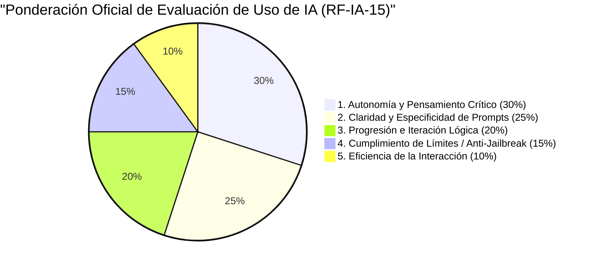
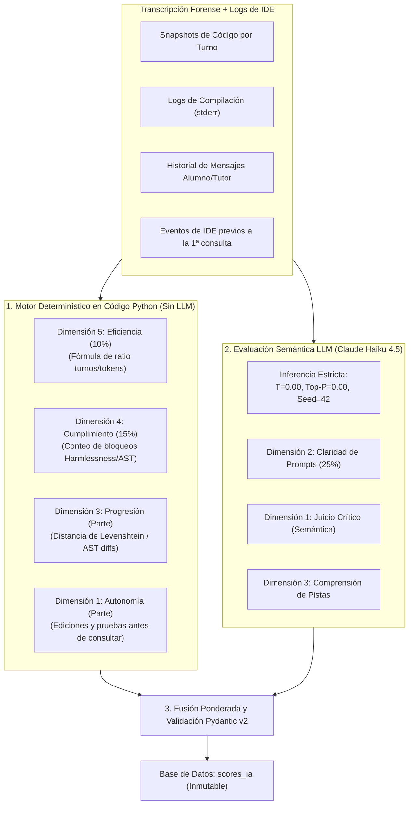
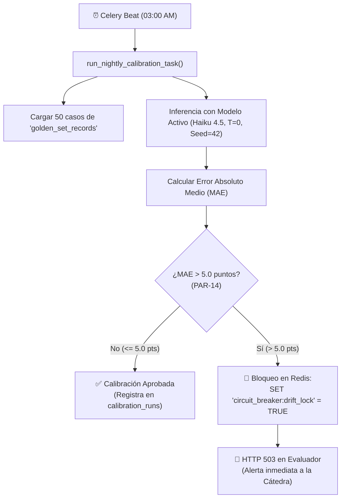

# 04 — Evaluación Analítica, Scoring Híbrido y LLMOps Drift

> **Cátedra:** Programación IV — Back End · UTN FRC  
> **Tema 07:** Capa de Inteligencia Artificial y Evaluación LLM  
> **Propósito:** Definir el sistema de calificación matemática en 5 dimensiones (RF-IA-15), el **Scoring Híbrido Determinístico** (cálculo algorítmico en código + juicio semántico en LLM con $T=0.0$ y semilla fija), la validación con Pydantic v2, el Golden Set docente y el **Circuit Breaker de Deriva (PAR-14)**.

---

## 1. La Fórmula Oficial de Calificación en 5 Dimensiones (RF-IA-15)

Cuando un estudiante entrega un desafío práctico, el **Evaluador Analítico (Rol 3)** procesa la transcripción forense completa de la sesión para emitir una nota de 0 a 100 basada en 5 dimensiones ponderadas:



$$\text{Score Final} = (D_1 \times 0.30) + (D_2 \times 0.25) + (D_3 \times 0.20) + (D_4 \times 0.15) + (D_5 \times 0.10)$$

---

## 2. El Gran Avance: Scoring Híbrido Determinístico

Uno de los principales problemas de delegar la evaluación exclusivamente a un LLM es la **variabilidad y el costo de inferencia**. En este proyecto demostramos rigor de ingeniería implementando un **Scoring Híbrido**:

> **Principio de Ingeniería:** Entre el **45% y el 60% de la rúbrica se calcula con código determinístico en Python**, reservando el modelo de lenguaje únicamente para evaluar la semántica y el razonamiento conceptual.



### Métricas Calculadas con Código Determinístico:
1. **Eficiencia (10%):** Si el alumno resolvió el desafío en 3 turnos concisos, recibe 100 pts; si requirió más de 12 turnos innecesarios, decae mediante una función sigmoidea matemática.
2. **Cumplimiento / Anti-Jailbreak (15%):** Si el alumno tiene 0 intentos de inyección y 0 bloques suprimidos por el filtro AST, recibe 100 pts. Cada intento detectado por la Capa 1 o Capa 5 resta 50 puntos de forma automática.
3. **Autonomía Previa:** Cantidad de líneas modificadas y ejecuciones de prueba realizadas en el IDE **antes de emitir la primera consulta al tutor**. Esto constituye la prueba más pura de autonomía real.
4. **Progresión Sintáctica:** Cálculo de la distancia de diffs entre el código del turno $N$ y el turno $N+1$ tras recibir la pista socrática.

---

## 3. Salida Estructurada y Validación con Pydantic v2

La salida del evaluador está estrictamente tipada con Pydantic v2 para impedir respuestas conversacionales o notas fuera de rango:

```python
from pydantic import BaseModel, Field, ConfigDict
import random

class EvaluationOutputDTO(BaseModel):
    model_config = ConfigDict(extra="forbid", frozen=True)

    # 1. Autonomía y Pensamiento Crítico (30%)
    score_autonomia: float = Field(..., ge=0.0, le=100.0, description="Nota 0-100")
    justificacion_autonomia: str = Field(..., min_length=15, max_length=500)

    # 2. Claridad de Prompts (25%)
    score_claridad: float = Field(..., ge=0.0, le=100.0)
    justificacion_claridad: str = Field(..., min_length=15, max_length=500)

    # 3. Progresión Lógica (20%)
    score_progresion: float = Field(..., ge=0.0, le=100.0)
    justificacion_progresion: str = Field(..., min_length=15, max_length=500)

    # 4. Cumplimiento / Anti-Jailbreak (15%)
    score_cumplimiento: float = Field(..., ge=0.0, le=100.0)
    justificacion_cumplimiento: str = Field(..., min_length=15, max_length=500)

    # 5. Eficiencia de Interacción (10%)
    score_eficiencia: float = Field(..., ge=0.0, le=100.0)
    justificacion_eficiencia: str = Field(..., min_length=15, max_length=500)

    # Nivel de Certeza del Modelo (0.0 a 1.0)
    confidence_score: float = Field(..., ge=0.0, le=1.0)

    def calcular_score_ponderado(self) -> float:
        """Aplica la fórmula oficial RF-IA-15."""
        total = (
            (self.score_autonomia * 0.30) +
            (self.score_claridad * 0.25) +
            (self.score_progresion * 0.20) +
            (self.score_cumplimiento * 0.15) +
            (self.score_eficiencia * 0.10)
        )
        return round(total, 2)

    def requiere_auditoria(self, sampling_rate: float = 0.10) -> bool:
        """
        Dispara la revisión manual por un docente (Human-in-the-Loop):
        1. Si la confianza es menor a 0.70.
        2. Si cae dentro del 10% aleatorio estadístico (PAR-10).
        """
        if self.confidence_score < 0.70:
            return True
        return random.random() < sampling_rate
```

---

## 4. LLMOps: El Golden Set y el Circuit Breaker de Deriva (PAR-14)

### 🌪️ El Problema del *Model Drift* (Deriva de Modelo)
Los proveedores como Anthropic o Google actualizan los pesos de sus modelos continuamente. Una actualización en mitad del cuatrimestre podría provocar que el evaluador se vuelva súbitamente más exigente o más permisivo, rompiendo la equidad académica.

### 🧪 La Solución Arquitectónica: Calibración Automatizada
1. **El Golden Set:** Una colección de **50 transcripciones de referencia** puntuadas por dos docentes de forma independiente con anclas de rúbrica explícitas.
2. **Tarea Nocturna en Celery Beat:** Todas las noches a las 03:00 AM se evalúan los 50 casos con el modelo activo oficial (RF-IA-25).
3. **Métrica de Control:** Se calcula el Error Absoluto Medio (MAE):
   $$\text{MAE} = \frac{1}{50} \sum_{i=1}^{50} |\text{Score}_{\text{IA}, i} - \text{Score}_{\text{Docente}, i}|$$
4. **El Circuit Breaker de PAR-14:** Si el $\text{MAE} > 5.0\text{ puntos}$, el sistema marca una clave de bloqueo en Redis (`circuit_breaker:drift_lock = true`) y **bloquea la emisión de notas con HTTP 503 (Service Unavailable)**, alertando a los docentes antes de que se publiquen calificaciones distorsionadas.



---

### Código de la Tarea de Calibración Nocturna (`calibration_task.py`)

```python
from celery import shared_task
import numpy as np
from ai_engine.infrastructure.db.session import async_session_factory
from ai_engine.infrastructure.db.redis_pool import get_redis_client
from ai_engine.domain.models.golden_set import GoldenSetModel, CalibrationRunModel
from ai_engine.infrastructure.llm.factory import LLMFactory
from ai_engine.domain.schemas.evaluation_dto import EvaluationOutputDTO

@shared_task(name="tasks.run_nightly_drift_calibration")
def run_nightly_drift_calibration():
    import asyncio
    
    async def _execute():
        async with async_session_factory() as session:
            redis = await get_redis_client()
            
            # 1. Cargar el Golden Set
            golden_records = await GoldenSetModel.get_all(session)
            if len(golden_records) < 50:
                return {"status": "SKIPPED", "reason": "Golden set incompleto"}
            
            provider = LLMFactory.get_evaluator_provider()
            diffs = []
            
            for record in golden_records:
                eval_result: EvaluationOutputDTO = await provider.evaluate_transcription(
                    transcription=record.transcription_payload,
                    temperature=0.0,
                    seed=42
                )
                score_ia = eval_result.calcular_score_ponderado()
                error_abs = abs(score_ia - record.expected_score_docente)
                diffs.append(error_abs)
            
            mae = float(np.mean(diffs))
            is_approved = mae <= 5.0 # PAR-14
            
            # 2. Registrar la corrida de calibración
            run_log = CalibrationRunModel(
                model_id=provider.model_id,
                mae_score=mae,
                status="APPROVED" if is_approved else "FAILED"
            )
            session.add(run_log)
            await session.commit()
            
            # 3. Accionar Circuit Breaker ante deriva
            if not is_approved:
                await redis.set("circuit_breaker:drift_lock", "true")
            else:
                await redis.delete("circuit_breaker:drift_lock")
                
            return {"status": "SUCCESS", "mae": mae, "approved": is_approved}

    return asyncio.run(_execute())
```
