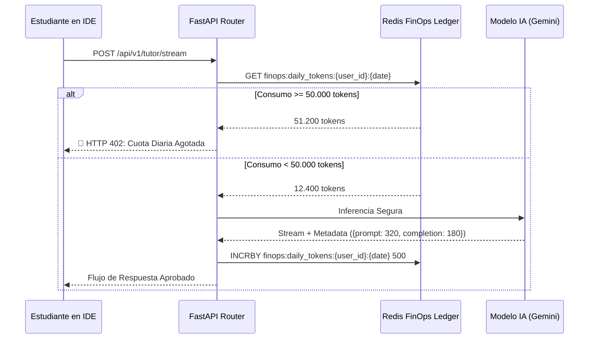

# 05 — Catálogo de Modelos, Presupuesto y FinOps

> **Cátedra:** Programación IV — Back End · UTN FRC  
> **Tema 07:** Capa de Inteligencia Artificial y Evaluación LLM  
> **Propósito:** Presentar el catálogo oficial de modelos asignados por rol, la justificación de hiperparámetros ($T=0$, seed fijo), el análisis de costos por cuatrimestre y los mecanismos de protección financiera (**FinOps - RF-IA-22**) con semáforos de concurrencia para 120 alumnos simultáneos (RF-NFR-03).

---

## 1. Catálogo Oficial de Modelos y Asignación por Rol

El microservicio utiliza una estrategia de optimización basada en la **relación costo-eficiencia**. No se recurre a modelos de gama alta innecesarios para tareas de clasificación o asistencia rápida:

| Rol / Función | Modelo Asignado | Costo por Millón (In / Out) | Justificación de Selección |
|---|---|---|---|
| **Rol 1: Moderador de Chat** | **GPT-5 nano** | USD 0,05 / USD 0,40 | Ultrarrápido, clasificación binaria pura sobre textos cortos ($<1.0\text{ s}$). |
| **Rol 2: Tutor Socrático (IDE)** | **Gemini 3.5 Flash-Lite** | USD 0,15 / USD 1,25 | Excelente seguimiento de restricciones negativas, streaming SSE fluido y ventana de contexto amplia. |
| **Rol 3: Evaluador Analítico** | **Claude Haiku 4.5 + Batch API** | USD 0,50 / USD 2,50 *(50% dto. Batch)* | Máxima consistencia de criterio y rigidez evaluativa sin desvíos. |
| **Rol 4: Generador de Desafíos** | **Gemini 3.5 Flash-Lite + Batch** | USD 0,075 / USD 0,625 *(50% dto. Batch)* | Capacidad de generación sintáctica y suites unitarias con revisión humana. |
| **Rol 5: Asistente Teórico RAG** | **Gemini 3.5 Flash-Lite** | USD 0,15 / USD 1,25 | Ingesta ágil de chunks y fidelidad estricta al contexto inyectado. |

---

## 2. Hiperparámetros de Inferencia por Rol

| Hiperparámetro | Rol 1: Moderador | Rol 2: Tutor IDE | Rol 3: Evaluador | Rol 4: Generador | Rol 5: RAG |
|---|---|---|---|---|---|
| **Temperatura ($T$)** | **`0.00`** | **`0.25`** | **`0.00`** | **`0.70`** | **`0.10`** |
| **Top-P (Nucleus)** | `0.10` | `0.85` | `0.00` | `0.95` | `0.50` |
| **Top-K** | `1` | `30` | `1` | `40` | `10` |
| **Seed** | `42` (Fijo) | `None` (Aleatorio) | `42` (Fijo/Reproducible) | `None` | `42` (Fijo) |
| **Max Output Tokens** | `256` | `1024` | `2048` | `2048` | `512` |

> 🏆 **Importancia de `temperature: 0.0` y `seed: 42` en el Evaluador:**  
> Garantiza que dos ejecuciones sobre la misma transcripción forense produzcan la misma evaluación numérica exacta, eliminando la varianza estocástica del LLM y garantizando justicia académica.

---

## 3. FinOps: Protección Financiera y Cuotas Diarias (RF-IA-22)

Para evitar que un script automatizado o un uso desmedido agote los fondos institucionales de la cuenta de API:

1. **Contabilidad Atómica en Redis:** Cada respuesta de IA reporta los tokens exactos consumidos (`prompt_tokens` + `completion_tokens`).
2. **Clave Diaria por Estudiante:** Se actualiza mediante comando atómico `INCRBY`:
   $$\text{Key: } \texttt{finops:daily\_tokens:\{student\_id\}:\{YYYY-MM-DD\}}$$
3. **Límite Asignado:** Cada estudiante cuenta con un límite estándar de **50.000 tokens/día** (equivalente a ~100 consultas socráticas profundas).
4. **Corte Automático:** Si el contador supera el umbral, FastAPI rechaza las consultas subsiguientes con **HTTP 402 (Quota Exceeded)** hasta la medianoche UTC.
5. **Auditoría Persistente:** De forma asíncrona, cada consumo se registra en la tabla `tokens_usage_ledger` de PostgreSQL para conciliación de costos.



---

### Código del Guardián FinOps (`finops_guard.py`)

```python
from datetime import datetime, timezone
from fastapi import HTTPException, status
from redis.asyncio import Redis
import uuid

DAILY_TOKEN_LIMIT = 50_000 # Cuota diaria por alumno (RF-IA-22)

class FinOpsGuard:
    @staticmethod
    def _get_key(user_id: uuid.UUID) -> str:
        today = datetime.now(timezone.utc).strftime("%Y-%m-%d")
        return f"finops:daily_tokens:{user_id}:{today}"

    @classmethod
    async def check_daily_quota(cls, user_id: uuid.UUID, redis: Redis) -> None:
        key = cls._get_key(user_id)
        current = await redis.get(key)
        if current and int(current) >= DAILY_TOKEN_LIMIT:
            raise HTTPException(
                status_code=status.HTTP_402_PAYMENT_REQUIRED,
                detail={
                    "error": "QUOTA_EXCEEDED",
                    "code": "FINOPS_DAILY_LIMIT_REACHED",
                    "message": "Has alcanzado el límite diario de consultas de IA asignado por la cátedra. Tu cuota se reinicia a las 00:00 UTC."
                }
            )

    @classmethod
    async def record_consumption(cls, user_id: uuid.UUID, total_tokens: int, redis: Redis) -> None:
        key = cls._get_key(user_id)
        pipe = redis.pipeline()
        pipe.incrby(key, total_tokens)
        pipe.expire(key, 172800) # TTL de 48 horas
        await pipe.execute()
```

---

## 4. Resiliencia y Concurrencia de 120 Alumnos en Examen (RF-NFR-03)

Para soportar el pico de 120 alumnos rindiendo simultáneamente sin colapsar las APIs externas:

1. **Semáforo Asíncrono (`asyncio.Semaphore(25)`):** Limita a un máximo de 25 peticiones concurrentes simultáneas al proveedor externo. El resto de las peticiones espera en una cola no bloqueante de pocos milisegundos en el bucle de eventos (`uvloop`).
2. **Tenacity Exponential Backoff con Jitter:** Ante errores transitorios de rate limit (`HTTP 429`), el cliente reintenta automáticamente con pausas aleatorias de $500\text{ ms}$, $1.5\text{ s}$, $3.0\text{ s}$ sin degradar la experiencia de usuario.

```python
from tenacity import retry, stop_after_attempt, wait_random_exponential, retry_if_exception_type
from google.genai.errors import APIError

@retry(
    retry=retry_if_exception_type(APIError),
    wait=wait_random_exponential(multiplier=0.5, max=5.0),
    stop=stop_after_attempt(3),
    reraise=True
)
async def resilient_llm_inference(provider_func, *args, **kwargs):
    """Ejecución tolerante a fallos transitorios con backoff exponencial."""
    return await provider_func(*args, **kwargs)
```

---

## 5. Estimación Presupuestaria Total del Cuatrimestre

Para una cohorte estándar de **120 estudiantes**:
* Promedio de 2 desafíos prácticos por semana durante 16 semanas = 32 desafíos/alumno.
* Promedio de 8 consultas al tutor por desafío $\approx 30.720\text{ consultas de tutor}$.
* 1 evaluación forense por entrega $\approx 3.840\text{ evaluaciones}$.
* **Costo Total Estimado del Cuatrimestre:** **USD 15 a USD 22**.
