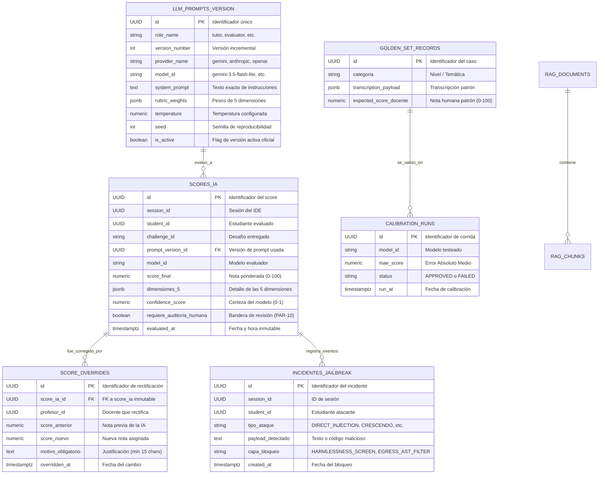

# 06 — Persistencia Relacional, DDL e Inmutabilidad Forense

> **Cátedra:** Programación IV — Back End · UTN FRC  
> **Tema 07:** Capa de Inteligencia Artificial y Evaluación LLM  
> **Propósito:** Especificar el modelo de datos relacional en **PostgreSQL 16 + pgvector**, el esquema DDL completo, los índices de optimización, los **triggers PL/pgSQL para inmutabilidad estricta de notas** y la **tabla de telemetría forense de incidentes de seguridad e inyecciones**.

---

## 1. Justificación de la Base de Datos Relacional Propia (R-4)

De acuerdo con las reglas no negociables de la cátedra (**R-4**), cada microservicio es dueño exclusivo de su persistencia. El microservicio de IA almacena:
1. **Historial Inmutable de Evaluaciones (`scores_ia`):** Toda nota emitida debe ser auditable meses después ante una apelación formal.
2. **Prompts Versionados (`llm_prompts_version`):** Trazabilidad exacta de qué versión de prompt e hiperparámetros evaluaron a cada estudiante (RF-IA-25).
3. **Libro de Actas de Rectificaciones (`score_overrides`):** Registro de cualquier modificación manual realizada por docentes (RF-IA-18).
4. **Telemetría Forense de Ataques (`incidentes_jailbreak`):** Registro detallado de cada intento de inyección bloqueado por las 5 capas de seguridad.
5. **Banco del Golden Set y Calibraciones (`golden_set_records`, `calibration_runs`):** Control de deriva del modelo (Drift PAR-14).
6. **Vectores de Contenido Teórico (`rag_chunks`):** Embeddings semánticos para el rol RAG mediante la extensión `pgvector`.

---

## 2. Diagrama Entidad-Relación (Mermaid)



---

## 3. Scripts DDL Completos en PostgreSQL 16

```sql
-- Extensiones requeridas
CREATE EXTENSION IF NOT EXISTS "uuid-ossp";
CREATE EXTENSION IF NOT EXISTS "vector";

-- ============================================================================
-- 1. TABLA: llm_prompts_version (Trazabilidad de Prompts)
-- ============================================================================
CREATE TABLE llm_prompts_version (
    id UUID PRIMARY KEY DEFAULT uuid_generate_v4(),
    role_name VARCHAR(50) NOT NULL, -- 'moderator', 'tutor', 'evaluator', 'generator', 'rag'
    version_number INTEGER NOT NULL,
    provider_name VARCHAR(50) NOT NULL, -- 'gemini', 'anthropic', 'openai'
    model_id VARCHAR(100) NOT NULL,
    system_prompt TEXT NOT NULL,
    rubric_weights JSONB NOT NULL,
    temperature NUMERIC(3,2) NOT NULL DEFAULT 0.00,
    top_p NUMERIC(3,2) NOT NULL DEFAULT 0.00,
    top_k INTEGER NOT NULL DEFAULT 1,
    seed INTEGER DEFAULT 42,
    is_active BOOLEAN NOT NULL DEFAULT FALSE,
    created_at TIMESTAMP WITH TIME ZONE DEFAULT CURRENT_TIMESTAMP,
    CONSTRAINT uq_role_version UNIQUE (role_name, version_number)
);

CREATE INDEX idx_prompts_active ON llm_prompts_version (role_name, is_active);

-- ============================================================================
-- 2. TABLA: scores_ia (Registro Inmutable de Calificaciones)
-- ============================================================================
CREATE TABLE scores_ia (
    id UUID PRIMARY KEY DEFAULT uuid_generate_v4(),
    session_id UUID NOT NULL,
    student_id UUID NOT NULL,
    challenge_id VARCHAR(64) NOT NULL,
    prompt_version_id UUID NOT NULL REFERENCES llm_prompts_version(id) ON DELETE RESTRICT,
    model_id VARCHAR(100) NOT NULL,
    score_final NUMERIC(5,2) NOT NULL CHECK (score_final >= 0.0 AND score_final <= 100.0),
    dimensiones_5 JSONB NOT NULL,
    confidence_score NUMERIC(3,2) NOT NULL CHECK (confidence_score >= 0.0 AND confidence_score <= 1.0),
    requiere_auditoria_humana BOOLEAN NOT NULL DEFAULT FALSE,
    evaluated_at TIMESTAMP WITH TIME ZONE DEFAULT CURRENT_TIMESTAMP
);

CREATE INDEX idx_scores_student ON scores_ia (student_id);
CREATE INDEX idx_scores_session ON scores_ia (session_id);
CREATE INDEX idx_scores_audit ON scores_ia (requiere_auditoria_humana) WHERE requiere_auditoria_humana = TRUE;
CREATE INDEX idx_scores_dimensiones_gin ON scores_ia USING GIN (dimensiones_5);

-- ============================================================================
-- 3. TRIGGER DE INMUTABILIDAD PARA scores_ia (Garantía Forense)
-- ============================================================================
CREATE OR REPLACE FUNCTION trg_prevent_score_mutation()
RETURNS TRIGGER AS $$
BEGIN
    RAISE EXCEPTION 'VIOLACIÓN DE INTEGRIDAD FORENSE: Las notas de scores_ia son estrictamente inmutables y no pueden ser modificadas ni eliminadas. Registre una rectificación en score_overrides.';
END;
$$ LANGUAGE plpgsql;

CREATE TRIGGER trg_scores_ia_inmutable
BEFORE UPDATE OR DELETE ON scores_ia
FOR EACH ROW
EXECUTE FUNCTION trg_prevent_score_mutation();

-- ============================================================================
-- 4. TABLA: score_overrides (Libro de Actas de Rectificaciones Docentes)
-- ============================================================================
CREATE TABLE score_overrides (
    id UUID PRIMARY KEY DEFAULT uuid_generate_v4(),
    score_ia_id UUID NOT NULL REFERENCES scores_ia(id) ON DELETE RESTRICT,
    profesor_id UUID NOT NULL,
    score_anterior NUMERIC(5,2) NOT NULL,
    score_nuevo NUMERIC(5,2) NOT NULL CHECK (score_nuevo >= 0.0 AND score_nuevo <= 100.0),
    motivo_obligatorio TEXT NOT NULL,
    overridden_at TIMESTAMP WITH TIME ZONE DEFAULT CURRENT_TIMESTAMP,
    CONSTRAINT chk_motivo_min_length CHECK (length(trim(motivo_obligatorio)) >= 15)
);

CREATE INDEX idx_overrides_score_id ON score_overrides (score_ia_id);
CREATE INDEX idx_overrides_profesor ON score_overrides (profesor_id);

-- ============================================================================
-- 5. TABLA: incidentes_jailbreak (Telemetría Forense de Ciberseguridad)
-- ============================================================================
CREATE TABLE incidentes_jailbreak (
    id UUID PRIMARY KEY DEFAULT uuid_generate_v4(),
    session_id UUID NOT NULL,
    student_id UUID NOT NULL,
    tipo_ataque VARCHAR(50) NOT NULL, -- 'DIRECT_INJECTION', 'CRESCENDO', 'SKELETON_KEY', 'AST_LEAK', 'MANY_SHOT'
    payload_detectado TEXT NOT NULL,
    capa_bloqueo VARCHAR(50) NOT NULL, -- 'HARMLESSNESS_SCREEN', 'EGRESS_AST_FILTER'
    created_at TIMESTAMP WITH TIME ZONE DEFAULT CURRENT_TIMESTAMP
);

CREATE INDEX idx_incidentes_student ON incidentes_jailbreak (student_id);
CREATE INDEX idx_incidentes_tipo ON incidentes_jailbreak (tipo_ataque);
CREATE INDEX idx_incidentes_fecha ON incidentes_jailbreak (created_at);

-- ============================================================================
-- 6. TABLA: golden_set_records & calibration_runs (LLMOps)
-- ============================================================================
CREATE TABLE golden_set_records (
    id UUID PRIMARY KEY DEFAULT uuid_generate_v4(),
    categoria VARCHAR(100) NOT NULL,
    transcription_payload JSONB NOT NULL,
    expected_score_docente NUMERIC(5,2) NOT NULL CHECK (expected_score_docente >= 0.0 AND expected_score_docente <= 100.0),
    created_at TIMESTAMP WITH TIME ZONE DEFAULT CURRENT_TIMESTAMP
);

CREATE TABLE calibration_runs (
    id UUID PRIMARY KEY DEFAULT uuid_generate_v4(),
    model_id VARCHAR(100) NOT NULL,
    mae_score NUMERIC(5,2) NOT NULL,
    status VARCHAR(20) NOT NULL, -- 'APPROVED', 'FAILED'
    run_at TIMESTAMP WITH TIME ZONE DEFAULT CURRENT_TIMESTAMP
);

-- ============================================================================
-- 7. TABLAS: RAG Curricular con pgvector
-- ============================================================================
CREATE TABLE rag_documents (
    id UUID PRIMARY KEY DEFAULT uuid_generate_v4(),
    curso_id VARCHAR(64) NOT NULL,
    titulo VARCHAR(255) NOT NULL,
    mimetype VARCHAR(50) NOT NULL,
    created_at TIMESTAMP WITH TIME ZONE DEFAULT CURRENT_TIMESTAMP
);

CREATE TABLE rag_chunks (
    id UUID PRIMARY KEY DEFAULT uuid_generate_v4(),
    document_id UUID NOT NULL REFERENCES rag_documents(id) ON DELETE CASCADE,
    chunk_index INTEGER NOT NULL,
    chunk_text TEXT NOT NULL,
    embedding vector(768) NOT NULL,
    created_at TIMESTAMP WITH TIME ZONE DEFAULT CURRENT_TIMESTAMP
);

CREATE INDEX idx_rag_embedding_hnsw ON rag_chunks USING hnsw (embedding vector_cosine_ops);
```

---

## 4. Consultas de Auditoría y Forense de Seguridad

### Consulta 1: Trazabilidad de Ataques por Alumno para el Dashboard Docente
```sql
SELECT 
    i.student_id,
    i.tipo_ataque,
    i.capa_bloqueo,
    i.payload_detectado,
    i.created_at,
    s.score_final AS nota_obtenida
FROM incidentes_jailbreak i
LEFT JOIN scores_ia s ON i.session_id = s.session_id
WHERE i.student_id = 'a1b2c3d4-0000-0000-0000-000000000001'
ORDER BY i.created_at DESC;
```
