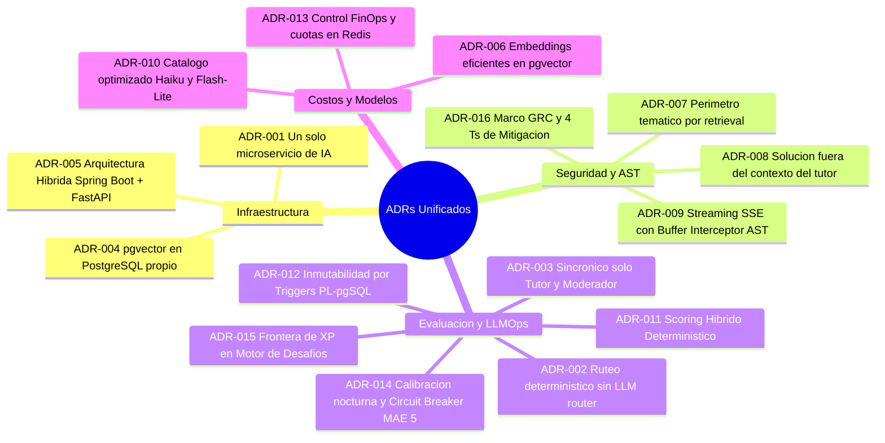

# 07 — Registro Consolidado de Decisiones de Arquitectura (ADR)

> **Cátedra:** Programación IV — Back End · UTN FRC  
> **Tema 07:** Capa de Inteligencia Artificial y Evaluación LLM  
> **Propósito:** Documentar formalmente las 16 decisiones arquitectónicas clave (Architecture Decision Records) adoptadas en el proyecto unificado, detallando contexto, decisión, fundamento, impacto y condición de revisión.

---

## Índice de Decisiones (ADR-001 al ADR-016)

---

### ADR-001 — Un único microservicio de IA como puerta a todos los LLM
* **Decisión:** Toda llamada a modelos de inteligencia artificial se centraliza en `ms-evaluacion-llm`. El frontend y el backend de negocio nunca interactúan directamente con proveedores externos.
* **Fundamento:** Centraliza requerimientos transversales: rate limits, logging forense, cuotas por usuario, conmutación de modelos (RF-IA-11) y degradación controlada (RF-IA-27).
* **Condición de Revisión:** Si surge una función con requerimientos de latencia $<50\text{ ms}$ que justifique bypass.

---

### ADR-002 — Sin orquestador basado en LLM; Ruteo determinístico
* **Decisión:** No existe un agente LLM intermedio que decida qué función ejecutar. El ruteo se realiza por el endpoint HTTP invocado.
* **Fundamento:** Un router LLM añade latencia ($>1\text{ s}$), costo innecesario y una superficie crítica de ataque de *Prompt Injection* sobre el flujo de control.
* **Condición de Revisión:** Si el producto migra a una caja de chat universal no estructurada.

---

### ADR-003 — Sincrónico solo para Tutor y Moderador; el resto por cola asíncrona
* **Decisión:** Evaluador analítico, generador de desafíos y calibración operan mediante workers desacoplados (Celery / RabbitMQ).
* **Fundamento:** Habilita el uso de Batch API (50% de descuento en costos), absorbe picos de exámenes masivos (RF-NFR-03) y cumple con la resiliencia de RF-IA-27 por diseño.
* **Condición de Revisión:** Si la plataforma exige corrección instantánea visual de respuestas teóricas antes de cerrar el examen.

---

### ADR-004 — PostgreSQL con extensión `pgvector` dedicada
* **Decisión:** Los embeddings semánticos se almacenan en la misma base relacional PostgreSQL 16 de la IA mediante `pgvector`.
* **Fundamento:** Para un corpus curricular universitario ($<50.000$ fragmentos), `pgvector` ofrece latencias $<10\text{ ms}$ con indexación HNSW sin la complejidad operativa de mantener un clúster dedicado (Qdrant/Pinecone).
* **Condición de Revisión:** Si el corpus supera los 500.000 chunks vectoriales.

---

### ADR-005 — Arquitectura Híbrida: Spring Boot Sidecar + FastAPI Engine
* **Decisión:** La interfaz oficial expuesta a la plataforma corre sobre **Java Spring Boot** (integrado con Netflix Eureka, Spring Cloud Gateway, Actuator y RabbitMQ Tema 11) conectado a un motor interno de alto rendimiento en **Python 3.12 (FastAPI + uvloop + Pydantic v2)**.
* **Fundamento:** Resuelve el conflicto entre las normas obligatorias de la cátedra de Programación IV y las capacidades indispensables de parsing AST (`ast.parse`) y el ecosistema de IA nativo de Python.
* **Condición de Revisión:** Si la cátedra aprueba formalmente el registro directo de FastAPI en Eureka y AMQP sin el puente Java.

---

### ADR-006 — Embeddings optimizados locales / ligeros en pgvector
* **Decisión:** Los vectores semánticos se calculan mediante modelos de embedding multilingües eficientes y se indexan en PostgreSQL.
* **Fundamento:** Reduce costos a USD 0 para indexación offline de apuntes docentes y preserva la privacidad institucional.
* **Condición de Revisión:** Si la calidad de recuperación semántica en español técnico resulta deficiente en los benchmarks.

---

### ADR-007 — El perímetro temático lo hace cumplir el retrieval, no el prompt
* **Decisión:** El aislamiento curricular (RF-IA-06) se ejecuta mediante filtros SQL `WHERE curso_id = :id` y umbrales de similitud en `pgvector`.
* **Fundamento:** Una instrucción en lenguaje natural en el prompt se puede vulnerar mediante ingeniería social; una cláusula `WHERE` en la base de datos es inviolable.
* **Condición de Revisión:** Ninguna. Es una regla de seguridad estricta.

---

### ADR-008 — La solución de referencia nunca entra al contexto del tutor
* **Decisión:** El prompt del Tutor Socrático recibe el enunciado, el código del alumno y los logs de error del Sandbox. **Jamás se inyecta el código resuelto oficial.**
* **Fundamento:** Principio de mínima exposición: no se puede filtrar lo que el modelo no conoce. Ningún *Jailbreak* puede extraer una solución inexistente en la memoria de contexto.
* **Condición de Revisión:** Ninguna.

---

### ADR-009 — Streaming SSE con Buffer Interceptor en RAM y filtro AST
* **Decisión:** El Tutor Socrático emite mediante Server-Sent Events (SSE). La prosa fluye en vivo; al abrir un bloque de código Markdown, el flujo se congela en RAM, parsea el AST al cierre y valida similitud $<70\%$ (PAR-11) antes de emitir.
* **Fundamento:** Elimina la latencia percibida por el alumno ($<800\text{ ms}$ TTFT) mientras garantiza al 100% el cumplimiento de la salvaguarda anti-fuga (RF-IA-20).
* **Condición de Revisión:** Si la comparación de AST genera demoras perceptibles ($>1.5\text{ s}$) en bloques de código de más de 200 líneas.

---

### ADR-010 — Catálogo optimizado y parámetros de reproducibilidad ($T=0$, Seed Fijo)
* **Decisión:** Evaluador en Claude Haiku 4.5 + Batch con **`temperature: 0.0` y `seed: 42`**; Tutor en Gemini 3.5 Flash-Lite ($T=0.25$); Moderador en GPT-5 nano ($T=0.0$).
* **Fundamento:** Garantiza consistencia evaluativa entre estudiantes de la misma cursada y reduce los costos globales del cuatrimestre a $< \text{USD } 22$.
* **Condición de Revisión:** Si el modelo activo no supera el umbral de calibración de PAR-14 contra el Golden Set.

---

### ADR-011 — Scoring Híbrido Determinístico (Código + LLM)
* **Decisión:** Entre el 45% y el 60% de los componentes de la rúbrica (eficiencia, cumplimiento de guardarraíles, diffs de AST, autonomía previa a la 1ª consulta) se calcula con algoritmos matemáticos en código Python. El LLM se reserva para la evaluación semántica y conceptual.
* **Fundamento:** Máxima reproducibilidad, inmunidad a inyecciones en el cálculo de notas y reducción del 50% de tokens evaluativos.
* **Condición de Revisión:** Si la cátedra modifica la fórmula ponderada de las 5 dimensiones.

---

### ADR-012 — Inmutabilidad de notas forzada por Triggers en PostgreSQL
* **Decisión:** La tabla `scores_ia` posee un trigger PL/pgSQL `BEFORE UPDATE OR DELETE` que bloquea cualquier mutación. Toda rectificación docente se registra en la tabla append-only `score_overrides` con motivo obligatorio ($\ge 15$ caracteres).
* **Fundamento:** La inmutabilidad académica no puede depender de la disciplina de los programadores; debe ser garantizada a nivel del motor de base de datos para resistir auditorías forenses.
* **Condición de Revisión:** Ninguna.

---

### ADR-013 — Control FinOps y Cuotas Diarias en Redis (RF-IA-22)
* **Decisión:** Límite diario de 50.000 tokens por estudiante gestionado con contadores atómicos en Redis (`finops:daily_tokens:{id}:{date}`) y corte automático HTTP 402/429.
* **Fundamento:** Previene ataques de denegación de servicio financiero (*Denial of Wallet*) y garantiza previsibilidad presupuestaria institucional.
* **Condición de Revisión:** Si la cátedra aprueba incrementos de cuota para alumnos en proyectos finales.

---

### ADR-014 — Calibración Nocturna Automatizada y Circuit Breaker de Deriva (PAR-14)
* **Decisión:** Tarea Celery Beat nocturna (03:00 AM) que evalúa 50 casos del Golden Set. Si el MAE supera $\pm 5$ puntos, activa un flag en Redis y bloquea los endpoints con HTTP 503.
* **Fundamento:** Protege a los estudiantes de descalibraciones imprevistas por actualizaciones de pesos en los proveedores de IA en la nube.
* **Condición de Revisión:** Si se amplía el Golden Set a 100 casos.

---

### ADR-015 — Frontera Estricta de XP en el Motor de Desafíos
* **Decisión:** El microservicio de IA calcula y devuelve exclusivamente notas y justificaciones (0 a 100). El Motor de Desafíos (Tema 03) es el único encargado de traducir ese puntaje al modificador de XP ($\pm 20\%$, PAR-05) y persistir la economía de gamificación.
* **Fundamento:** Evita condiciones de carrera y transacciones distribuidas sobre los balances de puntos de los alumnos.
* **Condición de Revisión:** Ninguna.

---

### ADR-016 — Marco GRC de Mitigación de Riesgos (Las 4 T's de IBM) y Riesgo Residual
* **Decisión:** El microservicio adopta formalmente el marco de 4 estrategias de mitigación de IBM Security:
  1. **Evitación (*Avoidance*):** Prohibición a la IA de escribir directamente en la base de datos de usuarios o ejecutar código en el host.
  2. **Reducción (*Reduction*):** Pipeline concéntrico de 5 capas locales con Buffer AST en streaming.
  3. **Transferencia (*Transference*):** Aislamiento de la ejecución de código en Sandbox Docker con gVisor.
  4. **Aceptación (*Acceptance*):** Gestión del **Riesgo Residual (*Residual Risk*)** mediante supervisión docente (*Human-in-the-Loop*) con muestreo estadístico del 10% (PAR-10) y panel de auditoría de incidentes.
* **Fundamento:** Ningún sistema de LLM es 100% inmune. Reconocer formalmente el riesgo residual y mitigarlo con muestreo humano demuestra madurez de ingeniería frente a estándares internacionales (Gartner AI TRiSM, EU AI Act).
* **Condición de Revisión:** Si normativas universitarias exigen elevar el muestreo docente al 20%.
