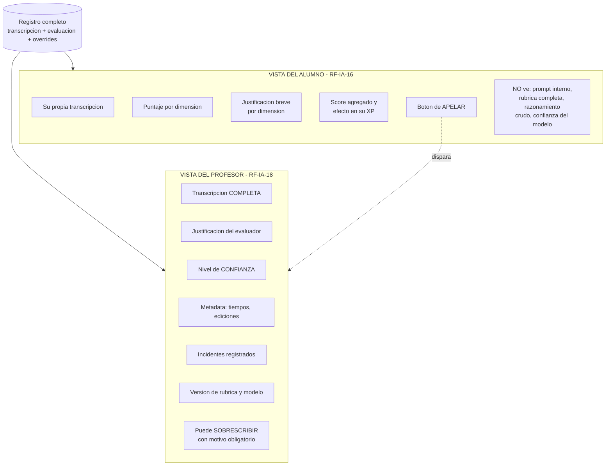

# 07 — Datos: trazabilidad, retención y Términos y Condiciones

> Qué se guarda de cada conversación, quién lo ve, cuánto dura, y el borrador de T&C. *Consolida los antiguos 14 y 20.*

---

# Parte A — Trazabilidad y transparencia


> Cómo se conservan las conversaciones con el tutor, las correcciones, y **el porqué de cada nota**,
> para que el alumno vea su desglose y el profesor pueda auditar y apelar.

## 1. Sí, está contemplado — y es transversal

No es un agregado: el PRD lo pide en ocho requerimientos distintos.

| Requerimiento | Qué obliga |
|---|---|
| **RF-IA-02** | Toda interacción alumno-IA se registra: **mensajes + metainformación** |
| **RF-IA-03** | La interacción con la IA **es parte de la evaluación académica** |
| **RF-IA-16** | El alumno ve el desglose por dimensión **con justificación breve** |
| **RF-IA-17** | El evaluador emite su **nivel de confianza**; los casos dudosos van a revisión |
| **RF-IA-18** | Apelación: el profesor ve **la transcripción completa + la justificación** y puede sobrescribir. Todo override auditado |
| **RF-IA-25** | Cada evaluación guarda `model_id` + `model_version` + `rubric_version` |
| **RF-NFR-01** | **No hay borrado físico.** La producción del alumno es "elemento de juicio" |
| **RF-NFR-10** | Retención de 5 años (PAR-16), purga nunca automática |

El fundamento está escrito con todas las letras en RF-NFR-01:

> *"la información producida por el alumno no se elimina porque constituye **elemento de juicio sobre
> su trabajo** — desafíos resueltos, código, transcripciones con el tutor de IA, scores, apelaciones
> y comunicación con el profesor"*

## 2. La distinción que cambia el diseño

Pediste guardar *"el pensamiento para llegar a la corrección"*. Hay que separar dos cosas que suenan
iguales y no lo son:

| | **Justificación** ✅ | **Razonamiento interno del modelo** ❌ |
|---|---|---|
| Qué es | Un campo de salida **diseñado**: texto breve por dimensión | El "pensamiento" crudo del modelo antes de responder |
| ¿Es confiable? | Sí — es parte del schema, validado | **No necesariamente.** Lo que un modelo dice que pensó no siempre es la causa real de su respuesta |
| ¿Es estable? | Sí, entre modelos y versiones | No. Cambia de formato y disponibilidad según el modelo |
| ¿Se puede mostrar? | **Sí, es lo que RF-IA-16 pide** | **No.** RF-IA-16 prohíbe exponer el prompt interno y las técnicas de gaming |

### Por qué no guardar el razonamiento crudo como respaldo de la nota

Tres razones concretas:

1. **Puede contradecir el puntaje.** Si el razonamiento dice una cosa y el score dice otra, acabás de
   crear una apelación que no podés defender. La justificación estructurada, en cambio, **es parte de
   la misma salida validada**.
2. **Enseña a hacer gaming.** RF-IA-16 lo dice explícito: sin exponer *"técnicas de gaming
   explotables"*. Si el alumno lee el razonamiento completo, aprende exactamente qué escribir para
   subir el puntaje — y ahí el score deja de medir lo que dice medir.
3. **Te ata al modelo.** RF-IA-29 exige que la rúbrica sea portable entre modelos. Si tu sistema de
   transparencia depende de un formato de razonamiento propio de un proveedor, dejás de ser agnóstico.

> **La regla:** pedile al modelo una **justificación explícita por dimensión** como campo de salida
> obligatorio, y guardá eso. Es lo que RF-IA-16 pide, es defendible en una apelación, y no depende
> del proveedor.

## 3. Qué se guarda exactamente

Tres registros separados. La separación importa: tienen ciclos de vida y audiencias distintas.

### 3.1 Registro de interacción (RF-IA-02) — mensaje por mensaje

```
mensaje_id, conversacion_id, intento_id, alumno_id, desafio_id, curso_id
rol: alumno | tutor
contenido
timestamp
tiempo_desde_mensaje_anterior       ← crítico, ver abajo
ediciones_de_codigo_desde_anterior  ← crítico, ver abajo
model_id, model_version, prompt_version
tokens_in, tokens_out, latencia, costo
incidentes: [jailbreak_detectado, bloqueo_antifuga, fuera_de_tema]
trace_id
```

> ### ⚠️ La metadata de tiempo no se puede reconstruir después
>
> RF-IA-13 dice que el evaluador puntúa la transcripción **"+ metadata: cantidad de mensajes, tiempos
> entre mensajes, ediciones de código"**.
>
> Esa metadata es la evidencia de la dimensión más pesada de la rúbrica — **autonomía, 30%**: si el
> alumno intentó antes de preguntar. Un alumno que pasa 4 minutos editando código y después pregunta
> no es lo mismo que uno que pregunta 8 segundos después de abrir el desafío.
>
> **Si no la capturás en el momento, se pierde para siempre.** No hay forma de deducir después cuánto
> tardó alguien entre dos mensajes. Es lo primero que hay que instrumentar.

### 3.2 Registro de evaluación — el que respalda la nota

```
evaluacion_id, intento_id, alumno_id, desafio_id, curso_id
tipo: evaluador_uso_ia | corrector_respuesta

-- Qué se evaluó
entrada_ref            (referencia a la conversación o la respuesta)
entrada_hash           (para detectar si algo se modificó después)

-- Con qué criterio  ← RF-IA-25
rubric_version
prompt_version
golden_set_version
model_id, model_version, proveedor

-- El resultado
dimensiones: [
  { nombre, puntaje_0_100, peso, justificacion_breve }
]
score_agregado
confianza              ← RF-IA-17

-- Estado y control
estado: aplicado | pendiente_calculo_diferido | pendiente_revision | apelado | sobrescrito
flags: [muestreo_auditoria, baja_confianza, cambia_umbral_p90, cohorte_multi_modelo]

-- Técnico
tokens, latencia, costo, trace_id, timestamp
```

**Los tres campos de versión (`rubric_version`, `prompt_version`, `model_version`) son lo que hace
defendible una apelación 8 meses después.** Sin ellos no podés responder "¿con qué criterio se lo
evaluó?", y RF-IA-13 aclara que un cambio de rúbrica **no recalcula puntajes históricos** — así que
el histórico tiene que saber bajo qué versión nació.

El flag `cohorte_multi_modelo` sale de RF-IA-33: si el ADMIN cambia el modelo evaluador con el curso
activo, los desafíos ya evaluados quedan marcados y el profesor tiene que poder considerarlo al
confirmar promociones.

### 3.3 Registro de override (RF-IA-18) — append-only

```
override_id, evaluacion_id
profesor_id, timestamp
score_anterior, score_nuevo
dimensiones_anteriores, dimensiones_nuevas
motivo (texto obligatorio)
origen: apelacion_del_alumno | muestreo_auditoria | revision_por_baja_confianza
```

**Nunca sobrescribe la evaluación original: agrega un registro.** La evaluación pasa a estado
`sobrescrito` pero conserva sus valores.

**Por qué append-only:** si el override pisara el valor original, se perdería la evidencia de que
hubo una corrección — y eso es justamente lo que hay que poder auditar. El PRD pide guardar *"score
anterior/nuevo"*, lo cual solo tiene sentido si el anterior sobrevive.

## 4. Las dos vistas: alumno y profesor

El PRD las separa a propósito. **No son la misma pantalla con distinto permiso: son contenidos
distintos.**



### Qué NO ve el alumno, y por qué

| Oculto | Motivo |
|---|---|
| El prompt interno del evaluador | RF-IA-16 lo prohíbe expresamente |
| La rúbrica completa con sus anclas | Enseñaría a escribir para el evaluador en vez de para aprender |
| El nivel de confianza del modelo | Un "confianza: 0,4" visible invita a apelar todo por sistema |
| El razonamiento crudo | Ver §2 |

Lo que **sí** ve: su puntaje por dimensión, una justificación breve de cada uno, el efecto en su XP,
y la vía de apelación. Suficiente para entender la nota; insuficiente para gamificarla.

> **El principio detrás:** transparencia sobre el **resultado**, no sobre el **mecanismo**. Es el
> mismo criterio de RF-IA-10 y RF-CHT-12 con los bloqueos: se avisa que pasó, no cómo se detectó.

## 5. Reproducibilidad: qué se puede prometer y qué no

Un punto honesto que conviene tener claro antes de que alguien lo pregunte en una apelación.

| | ¿Se puede? |
|---|---|
| **Auditar** — reconstruir qué entró, con qué criterio, qué modelo y qué salió | ✅ **Sí, y es lo que importa** |
| **Re-ejecutar** y obtener el mismo puntaje | ❌ **No.** Los LLM no son determinísticos |

Aunque guardes la entrada exacta, el modelo exacto y la versión exacta, **volver a correrlo puede dar
un puntaje distinto**. Eso no es un defecto de tu sistema: es cómo funcionan estos modelos.

**Consecuencia de diseño:** la evaluación guardada **es** el registro de la nota, no una receta para
regenerarla. Por eso se guarda la salida completa —puntajes y justificaciones— y no solo los
parámetros de entrada.

Y por eso el mecanismo de RF-IA-18 es **override humano**, no "volver a correr el evaluador": ante
una apelación, decide una persona. Re-ejecutar el modelo no resolvería nada, porque el segundo
resultado no es más válido que el primero.

## 6. Retención: el mapa de PII

RF-NFR-01 trae un mapa explícito de dónde vive la PII, y **las transcripciones están en la lista**:

> *"registro de usuario; **transcripciones completas de las conversaciones con la IA (RF-IA-02)**;
> comunicación alumno↔profesor; código producido por el alumno; y registros de scores, apelaciones y
> overrides"*

Y aclara: *"Toda anonimización derivada de RF-NFR-10 debe alcanzar a **todos esos repositorios**, no
solo a la tabla de usuarios."*

**Traducción para vos:** cuando el ADMIN decida anonimizar un curso vencido, tu base tiene que poder
desvincular las transcripciones del titular **conservando el registro académico**. Si el `alumno_id`
está incrustado en el texto de las transcripciones, eso es imposible. Diseñá con el identificador
**afuera del contenido**, no adentro.

| Regla de RF-NFR-10 | Implicancia |
|---|---|
| La purga **nunca es automática** | Nada de jobs de borrado por vencimiento. Al vencer, el registro pasa a "pendiente de decisión" y se notifica |
| **Ante el silencio, se conserva** | El default seguro es no borrar |
| Toda decisión queda auditada | Quién, cuándo, alcance, motivo |
| Plazo: 5 años desde el archivado (PAR-16) | Con preaviso de 90 días (PAR-17) |

**Excepción única:** el chat social entre alumnos sí se purga físicamente al archivar el curso
(RF-CHT-08), salvo lo retenido por reporte (RF-CHT-14). Es lo único borrable de toda la plataforma —
y el motivo es que no es producción académica evaluable.

### Volumen: no es un problema

19.200 mensajes de tutor + 2.300 evaluaciones + 2.000 correcciones por cuatrimestre, en texto plano,
son **decenas de megabytes**. Cinco años de varias cohortes siguen siendo un volumen trivial para
Postgres. **No optimices por almacenamiento: optimizá por poder encontrar las cosas.**

## 6b. ¿Hay alguna política de privacidad que nos impida guardar los chats académicos?

**No. Al revés: el PRD obliga a guardarlos, y obliga a mostrárselos al docente y al alumno.**

La discusión ya se dio y quedó cerrada en la v2.1 del PRD. Estos son los requerimientos:

| Requerimiento | Qué dice |
|---|---|
| **RF-IA-02** | *"Toda interacción alumno-IA en desafíos prácticos **se registra** (mensajes + metainformación)"* — es obligación, no opción |
| **RF-IA-03** | *"La interacción con la IA **es parte de la evaluación académica**"* |
| **RF-IA-18** | En una apelación, *"el profesor **ve la transcripción completa** + la justificación del evaluador"* — mostrarla es requisito |
| **RF-IA-16** | El alumno ve su desglose por dimensión con justificación |
| **RF-NFR-01** | **No hay borrado físico de producción académica** |

### El fundamento, textual del PRD

> *"la información producida por el alumno **no se elimina porque constituye elemento de juicio sobre
> su trabajo** en ese período académico — desafíos resueltos, código, **transcripciones con el tutor
> de IA**, scores, apelaciones y comunicación con el profesor... En consecuencia, la plataforma **no
> ofrece supresión de datos académicos a pedido del titular**, y esa limitación se declara
> expresamente en los Términos y Condiciones."*

Es una decisión explícita del Product Owner, tomada a conciencia. **Es exactamente el caso de uso
que planteás: guardarlos para valorarlos y poder mostrarlos si hay revisión.**

### Las cinco condiciones que sí hay que cumplir

No es "guardar todo para siempre sin restricciones". La política tiene condiciones:

| # | Condición | Requerimiento |
|---|---|---|
| 1 | **Los T&C tienen que declararlo expresamente y en lenguaje llano**: que se conserva como elemento de juicio, por cuánto tiempo, y que **no hay supresión a pedido** | RF-NFR-09 |
| 2 | **Plazo acotado: 5 años** desde el archivado del curso, configurable. **No indefinido** — el PRD aclara que "indefinido" sería difícil de defender ante un reclamo | RF-NFR-10, PAR-16 |
| 3 | **La purga nunca es automática.** Al vencer, el registro pasa a "pendiente de decisión" y decide el ADMIN: extender o anonimizar. Ante el silencio, se conserva | RF-NFR-10 |
| 4 | **La anonimización tiene que poder alcanzar a las transcripciones**, no solo a la tabla de usuarios | RF-NFR-01 |
| 5 | **Al alumno no se le muestra todo**: ve su desglose y justificación, pero no el prompt interno ni las técnicas de gaming | RF-IA-16 |

> **La condición 4 tiene una consecuencia de diseño concreta y fácil de arruinar:** si el `alumno_id`
> queda incrustado **dentro del texto** de la transcripción, anonimizar se vuelve imposible. El
> identificador va afuera del contenido, siempre.

### La única excepción: el chat social

**Lo único que sí se borra físicamente** es el chat social entre alumnos, que se purga al archivar el
curso (RF-CHT-08), salvo lo retenido por reporte (RF-CHT-14).

El motivo está escrito: *"la conversación social entre pares no es producción académica evaluable"*.
El chat con el tutor, en cambio, sí lo es.

### 🔴 Dónde SÍ hay riesgo, y no es donde preguntás

**Guardar los chats es la parte segura. Lo expuesto es enviarlos a un tercero.**

RF-IA-11 lo marca con todas las letras:

> *"El uso de datos de alumnos se cubre mediante Términos y Condiciones... **Nota de riesgo: los T&C
> mitigan el riesgo contractual/reputacional pero no reemplazan un análisis formal de cumplimiento
> de protección de datos (Ley 25.326)**"*

Y RF-NFR-09 obliga a declarar en los T&C **qué proveedores de LLM están en uso y que a ellos se
envían las consultas y el código del alumno**.

| | Riesgo |
|---|---|
| **Guardar la transcripción en nuestra base** | 🟢 Bajo. Está expresamente previsto y fundamentado |
| **Mostrarla al docente y al alumno** | 🟢 Ninguno. Es requisito (RF-IA-16/18) |
| **Enviarla a un proveedor externo de LLM** | 🟡 Es lo que RSK-01 deja abierto |
| **Enviarla a un free tier que puede entrenar con ella** | 🔴 **Es el punto C-2 de [08](08-decisiones-y-pendientes.md), sin resolver** |

**El orden de preocupación va al revés de lo intuitivo.** Almacenar está resuelto por diseño; la
transferencia a terceros es lo que queda abierto — y es una consulta legal, no una decisión técnica.

### Lo que quedó deliberadamente fuera de alcance

El PRD lo lista como decisión consciente: *"Mecanismo de purga o anonimización de datos personales
(supresión a pedido del titular) — **Diferido, decisión consciente**"*, con referencia a RSK-11.

Es decir: **el equipo no tiene que construir el "derecho al olvido"**. Ya se decidió que no entra al
MVP y que la limitación se declara en los T&C.

> **Salvedad honesta:** esto es lo que el PRD define y fundamenta, no un dictamen legal. El propio
> documento dice que los T&C no reemplazan un análisis formal de cumplimiento de la Ley 25.326. Si
> la plataforma llegara a usarse con alumnos reales, ese análisis sigue haciendo falta — y no lo
> cierra ni el equipo de desarrollo ni el Product Owner.

## 7. Los huecos a decidir

| # | Hueco | Recomendación |
|---|---|---|
| 1 | **El corrector de respuestas no tiene transparencia especificada.** RF-IA-16 y RF-IA-18 hablan del evaluador | **Aplicarle lo mismo.** Es una nota igual que la otra. Es el mismo P-01 de [08](08-decisiones-y-pendientes.md) |
| 2 | ¿Se guarda el payload crudo enviado al proveedor, o solo el normalizado? | **Ambos**, al menos al principio: el normalizado para mostrar y apelar, el crudo para diagnosticar cuando algo salga raro. Es barato |
| 3 | ¿Cuánto dura una apelación abierta? | Definir un plazo. Una apelación sin resolver bloquea el cierre del curso igual que un score pendiente (RF-IA-34) |
| 4 | ¿El alumno ve las transcripciones de cursos ya cerrados? | Sí, mientras el dato exista. Es "elemento de juicio" sobre su propio trabajo |
| 5 | ¿Dónde vive la transcripción: base académica o base del `ai-service`? | **Base académica.** Es producción del alumno, sujeta a RF-NFR-10. El `ai-service` guarda su log técnico de llamadas, que es otra cosa |

**El punto 5 merece atención**, porque cruza la frontera entre equipos ([01](01-problema-y-alcance.md)):

| Dato | Dueño | Retención |
|---|---|---|
| Transcripción alumno-tutor | **Backend académico** | 5 años, RF-NFR-10 |
| Evaluaciones y overrides | **Backend académico** | 5 años, RF-NFR-10 |
| Log técnico de llamadas (tokens, costo, latencia, errores) | **`ai-service`** | Operativo, mucho más corto |

Son dos cosas distintas que se confunden fácil. El log técnico sirve para diagnosticar y controlar
costos; la transcripción es **evidencia académica**. Mezclarlos significa aplicarle 5 años de
retención a métricas operativas, o —peor— borrar evidencia académica al rotar logs.


---

# Parte B — Términos y Condiciones (borrador)


> ⚠️ **Borrador para revisión legal. No es un documento legal terminado.**
>
> Cubre los tres puntos que **RF-NFR-09 exige obligatoriamente** y usa lenguaje llano, como el mismo
> requerimiento pide. Pero el PRD también advierte (RF-IA-11, RSK-01) que los T&C *"mitigan el riesgo
> contractual/reputacional pero no reemplazan un análisis formal de cumplimiento de protección de
> datos (Ley 25.326)"*. **Antes de usarlo con alumnos reales tiene que pasar por revisión jurídica.**
>
> Los campos entre `[corchetes]` hay que completarlos.

---

## Nota de diseño: por qué los proveedores van en un anexo

RF-IA-35 permite al ADMIN dar de alta y de baja proveedores de LLM en cualquier momento, y RF-NFR-09
obliga a que los T&C digan **cuáles están en uso**. Si la lista está incrustada en el cuerpo del
documento, cada alta de proveedor obliga a reeditar y re-aceptar todo el texto.

**Por eso la lista va en el Anexo A, versionado por separado.** Sumar un proveedor actualiza el
anexo y dispara una notificación, sin tocar el cuerpo.

---
---

# Términos y Condiciones de Uso

**[NOMBRE DE LA PLATAFORMA]**
Versión **1.0** · Vigente desde **[FECHA]** · Anexo A versión **1.0**

---

## En resumen

Antes del texto completo, lo más importante en seis puntos:

1. **Tus conversaciones con el tutor de IA se guardan y forman parte de tu nota.** No son un chat
   privado: son parte de tu trabajo académico.
2. **Tu producción académica no se borra a pedido.** Se conserva como constancia de tu trabajo
   durante **5 años** desde el cierre del curso.
3. **El chat social con tus compañeros sí se borra** cuando el curso se archiva. No te sirve como
   respaldo de nada.
4. **Tus consultas y tu código se envían a proveedores externos de inteligencia artificial.** La
   lista está en el Anexo A.
5. **Las encuestas son anónimas de verdad.** Nadie puede saber qué respondiste, ni siquiera un
   administrador.
6. **La IA nunca te va a dar la solución.** Está diseñada para guiarte, y pedirle que resuelva por
   vos afecta tu puntaje.

---

## 1. Qué es esta plataforma y quién la opera

Es una plataforma de aprendizaje de programación operada por **[INSTITUCIÓN]**. Los estudiantes
avanzan resolviendo desafíos, acumulan experiencia y recompensas, y cuentan con asistencia de
agentes de inteligencia artificial.

Al crear tu cuenta aceptás estos términos. Si no estás de acuerdo, no podés usar la plataforma.

## 2. Quién puede usarla

- El alta requiere un **correo institucional** y que tu legajo figure en el padrón del curso.
- Tu cuenta es **personal e intransferible**. No compartas tus credenciales.
- Es obligatorio activar un **segundo factor de autenticación (2FA)**.
- Si vinculás una cuenta de GitHub, es una **cuenta de trabajo para los desafíos prácticos**, no un
  método para iniciar sesión.

## 3. Qué información se recopila

| Categoría | Qué incluye |
|---|---|
| **Datos de tu cuenta** | Nombre, correo institucional, legajo, curso al que pertenecés |
| **Tu producción académica** | Código que escribís, entregas, respuestas a desafíos teóricos y prácticos |
| **Tus conversaciones con la IA** | Todos los mensajes que intercambiás con el tutor, más información sobre cómo interactuaste: cuántos mensajes enviaste, cuánto tiempo pasó entre ellos y cuántas veces editaste tu código |
| **Tus resultados** | Experiencia, monedas, vidas, insignias, puntajes, apelaciones |
| **Tu comunicación con el profesor** | Mensajes directos dentro de la plataforma |
| **Datos de uso** | Fechas y horas de actividad |

## 4. Cómo funciona la asistencia de inteligencia artificial

### 4.1 Qué hace y qué no hace

El tutor de IA está diseñado para **guiarte, no para resolver por vos**. Puede explicarte conceptos,
hacerte preguntas que te ayuden a pensar, señalarte documentación y sugerirte estrategias.

**Nunca te va a entregar la solución final, fragmentos de código resueltos, ni respuestas directas a
preguntas teóricas.** Es una decisión pedagógica, no una limitación técnica.

### 4.2 Tu conversación con la IA forma parte de tu evaluación

**Este es el punto más importante de estos términos.** Tu forma de usar la IA se evalúa
automáticamente al terminar cada desafío, con criterios fijos e iguales para todos los estudiantes de
la plataforma:

- Qué tan claros y específicos son tus pedidos
- Si construís sobre las respuestas anteriores
- Si intentaste resolver antes de preguntar y si cuestionás lo que te sugieren
- La relación entre mensajes útiles y mensajes de relleno
- Si respetaste los límites del sistema

Ese puntaje **modifica la experiencia que ganás** por el desafío: puede sumarte o restarte hasta un
porcentaje definido por la administración de la plataforma.

**Vas a poder ver tu puntaje desglosado**, con una explicación breve de cada criterio, y **pedir que
lo revise una persona** si no estás de acuerdo. Tu profesor puede modificarlo, y toda modificación
queda registrada.

### 4.3 Qué no vas a poder ver

Para que la evaluación siga siendo justa para todos, **no se muestran** las instrucciones internas
del sistema ni el detalle de cómo se detectan los intentos de eludirlo. Conocerlos permitiría obtener
puntajes altos sin haber aprendido, que es exactamente lo que el mecanismo busca evitar.

### 4.4 Límites de uso

Hay un máximo de interacciones con la IA por desafío y por día. Los valores vigentes se muestran en la
plataforma.

### 4.5 Intentos de eludir las restricciones

Pedirle a la IA que te dé la solución, o intentar que ignore sus instrucciones, **queda registrado
como incidente y es visible para tu profesor**, además de afectar tu puntaje. No hay margen de
tolerancia: cada intento se registra.

### 4.6 Si la IA no está disponible

Si el servicio de IA no funciona, **podés resolver y entregar tu desafío igual**. En ese caso el
puntaje de uso de IA no te suma ni te resta: no se penaliza a nadie por no haber usado una
herramienta que no estaba disponible.

## 5. Proveedores externos de inteligencia artificial

**Tus consultas al tutor y el código que escribís se envían a proveedores externos** para que la
inteligencia artificial pueda procesarlos y responderte.

La lista de proveedores en uso está en el **Anexo A** de este documento. Esa lista puede cambiar: si
se incorpora un proveedor nuevo, se actualiza el anexo y se te notifica.

**No se envía tu nombre, tu legajo ni tu correo** a esos proveedores. Sí se envía el contenido de tus
consultas y de tu código.

## 6. Qué se conserva, por cuánto tiempo, y qué no se borra

### 6.1 Tu producción académica se conserva

Todo lo que producís en la plataforma —**desafíos resueltos, código, conversaciones con el tutor de
IA, puntajes, apelaciones y tu comunicación con el profesor**— se conserva porque constituye
**constancia de tu trabajo** durante ese período académico.

Sirve para justificar tu calificación, resolver una apelación tuya o de un compañero, y responder
ante cualquier revisión posterior del resultado académico.

### 6.2 No hay borrado a pedido sobre ese material

**Tenés que saberlo claramente: no podés pedir que se borre tu producción académica.** Ni durante el
curso ni después. Es una limitación deliberada de la plataforma y es la contrapartida de que ese
material sirva como constancia de tu trabajo.

Si se da de baja tu cuenta, **la baja es lógica**: dejás de poder operar, pero tu producción
académica permanece.

### 6.3 Por cuánto tiempo

**5 años desde que se archiva el curso**, salvo que la administración disponga un plazo distinto.

Cumplido el plazo, la información no se borra automáticamente: pasa a revisión de la administración,
que decide si extender la conservación o **anonimizarla** — desvincularla de tu identidad de forma
irreversible, conservando el registro académico sin que pueda atribuirse a vos.

### 6.4 El chat social entre estudiantes sí se elimina

Las conversaciones sociales con tus compañeros **se eliminan de forma permanente cuando el curso se
archiva**. No es producción académica evaluable.

**Consecuencia práctica: ese canal no te sirve como respaldo de nada.** Si algo te importa,
guardalo en otro lado.

**Única excepción:** si un mensaje fue reportado o bloqueado por moderación, se conserva junto con su
contexto inmediato hasta que el caso se resuelva, aunque el curso ya esté archivado.

### 6.5 Las encuestas son anónimas

Las encuestas de satisfacción **no se vinculan con tu identidad**. No es una cuestión de permisos:
la información se guarda de forma que no existe manera de saber quién respondió qué, **ni siquiera
para un administrador**.

Sí queda registrado que participaste —para saber quién falta responder— pero eso está separado del
contenido de tu respuesta.

## 7. Convivencia y moderación

### 7.1 Qué no está permitido

Lenguaje ofensivo o discriminatorio · acoso · contenido sexual o violento · spam o contenido ajeno a
lo académico · **compartir soluciones de desafíos con otros estudiantes** · intentar eludir la
restricción de solo texto.

### 7.2 Cómo se modera

Un agente automático revisa **todos los mensajes antes de entregarlos**. Si tu mensaje se bloquea,
recibís un aviso de que no se envió, sin el detalle de cómo se detectó — para que el filtro no pueda
aprenderse y evadirse.

Podés pedirle a tu profesor que revise un mensaje bloqueado.

### 7.3 Integridad académica

Compartir soluciones o hacer pasar trabajo ajeno como propio es una falta de integridad académica,
con las consecuencias que disponga **[INSTITUCIÓN]**.

## 8. Tus derechos

- **Acceso:** podés consultar en cualquier momento tus datos, tu producción, tus conversaciones con la
  IA y tus puntajes.
- **Rectificación:** si un dato personal tuyo es incorrecto, podés pedir que se corrija.
- **Revisión humana:** podés pedir que una persona revise cualquier puntaje asignado
  automáticamente.
- **Límite:** por lo explicado en la sección 6.2, **el derecho de supresión no alcanza a tu
  producción académica**.

Para ejercerlos, escribí a **[CORREO DE CONTACTO]**.

## 9. Seguridad

Se aplican medidas técnicas para proteger tu información, incluido el segundo factor obligatorio.
Ninguna medida es infalible: si detectás un acceso indebido a tu cuenta, avisá de inmediato a
**[CORREO DE CONTACTO]**.

## 10. Cambios en estos términos

Si cambian, se te avisa dentro de la plataforma antes de que entren en vigencia.

**Los cambios en el Anexo A** (proveedores de IA) también se notifican, aunque no modifiquen el
cuerpo de estos términos.

## 11. Contacto

**[INSTITUCIÓN]** — **[CORREO DE CONTACTO]** — **[DIRECCIÓN]**

---

# Anexo A — Proveedores de inteligencia artificial en uso

**Versión 1.0 · Vigente desde [FECHA]**

Estos son los proveedores a los que se envían tus consultas y tu código:

| Proveedor | Para qué se usa | Dónde procesa | Política de datos |
|---|---|---|---|
| [PROVEEDOR 1] | [Tutor / evaluación / generación / moderación] | [PAÍS O REGIÓN] | [ENLACE] |
| [PROVEEDOR 2] | [...] | [...] | [ENLACE] |

**Historial de cambios**

| Versión | Fecha | Cambio |
|---|---|---|
| 1.0 | [FECHA] | Versión inicial |

---
---

# Qué falta para poder publicarlo

## Campos a completar

- [ ] Nombre de la plataforma e institución responsable
- [ ] Correo de contacto y domicilio
- [ ] Fecha de vigencia
- [ ] **Anexo A: los proveedores concretos**, para qué función se usa cada uno, en qué región
      procesan y el enlace a su política de datos
- [ ] El porcentaje concreto del modificador de experiencia (sección 4.2)
- [ ] Los límites de uso vigentes (sección 4.4)

## Decisiones pendientes que afectan el texto

| Decisión | Dónde impacta | Estado |
|---|---|---|
| **¿Se usa free tier con datos de alumnos?** | Sección 5 y Anexo A. Si el proveedor puede entrenar con los datos, **hay que decirlo** | 🔴 C-2, sin resolver |
| ¿Qué proveedores concretos? | Anexo A completo | Depende de la calibración del evaluador |
| ¿El corrector de respuestas también se declara? | Sección 4.2 hoy habla del uso de IA; si el corrector es automático, corresponde declararlo | 🟡 P-01 |

## Lo que este borrador no reemplaza

**Revisión jurídica.** El PRD lo dice expresamente en RF-IA-11: los T&C mitigan el riesgo
contractual y reputacional, pero **no reemplazan un análisis formal de cumplimiento de la Ley
25.326**. Los dos puntos que más conviene llevar a esa revisión:

1. **La ausencia de supresión a pedido** sobre lo académico (sección 6.2). Es defendible por la
   finalidad de conservar constancia del trabajo, pero no es automático.
2. **La transferencia de datos a proveedores fuera del país** (sección 5). Es el punto más expuesto
   del diseño, y el PRD lo deja abierto como RSK-01.

## Cobertura de RF-NFR-09

Los tres puntos que el requerimiento exige, y dónde están:

| Exigido por RF-NFR-09 | Sección |
|---|---|
| Que la producción académica se conserva como elemento de juicio, por el plazo definido, **y que no existe supresión a pedido** | **6.1, 6.2, 6.3** |
| Que el chat social **no se conserva** y se elimina al archivar, con la excepción por reporte; y que las encuestas son anónimas | **6.4, 6.5** |
| **Qué proveedores de LLM están en uso** y que a ellos se envían las consultas y el código | **5 + Anexo A** |

Y el requisito de forma —*"de forma expresa y en lenguaje llano"*— se cumple con el resumen inicial
de seis puntos y con la redacción en segunda persona a lo largo del documento.
