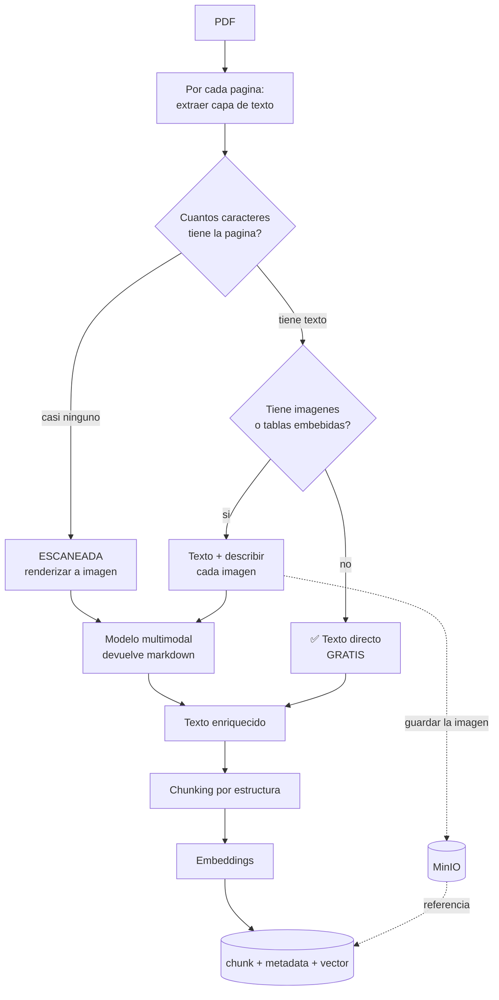

# 12 — Almacenamiento e ingesta de documentos

> Dónde vive cada dato, cuántos almacenes hacen falta y por qué, y cómo se baja a texto un PDF que
> tiene imágenes.

## 1. La respuesta corta

> **Tres almacenes, pero una sola base de datos.**

| Almacén | Qué es | Qué guarda | ¿Se puede perder? |
|---|---|---|---|
| **PostgreSQL + pgvector** | **La base de datos** | Todo lo que importa: transcripciones, evaluaciones, golden set, chunks, embeddings, configuración | 🔴 **No.** Es la fuente de verdad |
| **Redis** | Caché y cola | Trabajos pendientes, contadores de cuota, caché de retrieval | 🟡 Se reconstruye — pero la cola necesita persistencia |
| **MinIO** | Almacenamiento de objetos | Los PDF originales y las imágenes extraídas | 🟡 Solo si nadie más los tiene |

**La distinción importa:** Postgres es la base de datos *de registro*. Redis y MinIO son
infraestructura de apoyo. Si mañana se borra Redis, el servicio se recupera; si se borra Postgres,
perdiste producción académica.

## 2. PostgreSQL — la única base de datos

### Por qué una sola, y por qué esta

La cátedra impone *"cada servicio es dueño exclusivo de su base"*. Eso significa **una base propia
para el Tema 07**, no una compartida. Pero adentro de esa base, **todo va junto**:

| Razón | Detalle |
|---|---|
| **Los datos están relacionados** | Una evaluación referencia una transcripción, que referencia un intento, que referencia un curso-cohorte. Partirlo en varias bases obliga a resolver joins a mano |
| **pgvector evita una base vectorial** | Los embeddings viven en la misma base que su metadata. Podés filtrar por `curso_cohorte_id` **y** buscar por similitud en una sola consulta |
| **Transaccionalidad** | Guardar una evaluación con sus 5 dimensiones tiene que ser atómico |
| **Un solo backup** | Y un solo modelo de permisos |

### Qué guarda, por grupo

| Grupo | Tablas | Por qué acá |
|---|---|---|
| **Conversación** | `mensaje`, `evento_ide`, `transcripcion_features` | Producción académica: 5 años de retención (RF-NFR-10) |
| **Evaluación** | `evaluacion`, `dimension`, `override` | Es una nota. Transaccional y auditable |
| **Calibración** | `golden_set`, `entrada_golden`, `puntaje_docente`, `calibracion` | Irreemplazable. Ver §5 |
| **RAG** | `documento`, `chunk` (con la columna `vector`) | pgvector |
| **Configuración** | `modelo_por_funcion`, `parametro` | Editable por ADMIN, RF-IA-24 |
| **Observabilidad** | `llamada_llm` | Alto volumen, append-only. Ver la nota |

> **Sobre `llamada_llm`:** es la tabla que más crece — un registro por llamada al modelo, ~63.000 por
> cuatrimestre. **No la mezcles con lo académico:** tiene retención operativa (meses), no de 5 años.
> Si algún día molesta, se particiona por fecha o se mueve afuera. **Al principio, misma base.**

### La extensión

`pgvector` es una extensión de Postgres, no otro servicio. Se instala con `CREATE EXTENSION vector;`
y agrega un tipo de columna. **No es un componente más que operar.**

## 3. Redis — cola, cuotas y caché

### Las tres cosas que hace

| Uso | Por qué Redis y no Postgres |
|---|---|
| **Cola de trabajos con prioridades** | Postgres como cola funciona pero requiere polling y bloqueos. Redis está hecho para esto |
| **Contadores de cuota** (RF-IA-22) | Incrementos atómicos con expiración automática. En Postgres es una tabla con contención |
| **Caché de retrieval y embeddings** | Lecturas de milisegundos con TTL |

> 🔄 **Revisado:** a 120 usuarios probablemente **no haga falta Redis**. Ver
> [06](06-operacion-e-ingenieria.md), Parte 6, para el análisis completo y la recomendación actualizada.

### ⚠️ La cola necesita persistencia

**Un trabajo perdido es un score que nunca llega**, y un curso que no se puede cerrar (RF-IA-34).

Redis en memoria pura pierde la cola al reiniciar. **Hay que activar persistencia (AOF)**, o usar
RabbitMQ si la plataforma ya lo tiene para el bus de eventos.

> Si el bus de eventos de la plataforma es RabbitMQ, **evaluá usarlo también para la cola interna** —
> un componente menos que operar. Pero ojo: son cosas distintas (§ [02](02-arquitectura-y-stack.md)),
> y no hay que mezclar los canales.

## 4. MinIO — tu idea, y cuándo se justifica

**La intuición es correcta:** los binarios no van en la base de datos.

| Razón | Detalle |
|---|---|
| **Los PDF pesan** | Un apunte con imágenes son 10-50 MB. Guardarlos como `bytea` infla la base y hace lentos los backups |
| **Los backups se vuelven inmanejables** | La base pasa de decenas de MB a varios GB, y el dump deja de ser rápido |
| **Es compatible con S3** | Si algún día migran a la nube, es un cambio de configuración |
| **Separa responsabilidades** | Datos estructurados en Postgres, blobs en almacenamiento de objetos |

### 🔴 Pero primero hay que resolver quién es dueño del archivo

**El profesor sube el material a la plataforma. ¿A qué servicio llega?**

| Opción | Cómo funciona | Veredicto |
|---|---|---|
| **A — El archivo es de quien lo recibe** (probablemente Tema 02) | Ellos lo guardan; nos pasan la referencia. Lo leemos, extraemos, indexamos. **No guardamos copia** | ✅ **Recomendado** |
| **B — Nosotros lo guardamos** | Recibimos el archivo y lo persistimos en nuestro bucket | 🟡 Duplica 50 MB por documento |

**Recomendación: opción A.** Guardamos la **referencia al objeto** (bucket + key) y un **hash del
contenido**, no el archivo. Respeta la propiedad del dato y evita duplicar binarios.

**El hash sirve para dos cosas:** detectar que el profesor subió una versión nueva (hay que
reindexar) y verificar que el archivo no cambió desde que se indexó.

> **MinIO no viola la regla de "cada servicio dueño de su base".** Es infraestructura compartida,
> igual que el bus de eventos, con un bucket por servicio. Pero **hay que acordarlo en la sesión de
> integración**: si cada equipo levanta su propio MinIO, son doce.

### Para la demo, no hace falta

**Leé el PDF de una carpeta local.** MinIO es un contenedor más que no aporta nada a demostrar el
mecanismo. Se agrega cuando haya plataforma de verdad.

## 5. El caso especial: el golden set

**Vive en Postgres, pero además se exporta a archivo y se versiona en git.**

| Por qué | Detalle |
|---|---|
| Es **irreemplazable** | Son ~26 horas de trabajo docente. Si se pierde, no se puede calibrar, y **ningún curso arranca** |
| Es **contenido curado**, no dato transaccional | Cambia poco, tiene versiones, necesita historial y revisión |
| **Git hace exactamente eso** | Versionado, diff, historia, y queda respaldado en cada clon del repo |

Es la recomendación de almacenamiento menos obvia y una de las más útiles.

## 6. Lo que NO hace falta

| Tentación | Por qué no |
|---|---|
| **Base vectorial dedicada** (Pinecone, Qdrant, Weaviate) | A esta escala el corpus son miles de chunks, no millones. pgvector alcanza, y te deja filtrar por curso **y** buscar por similitud en una sola consulta |
| **MongoDB para las transcripciones** | Parecen "documentos", pero se consultan de forma muy relacional: por intento, por curso, por rango de fechas. Y son producción académica: querés transacciones |
| **Elasticsearch** | La búsqueda es semántica, no de texto completo. pgvector cubre el caso |
| **Una base por módulo** | Los 8 módulos son carpetas, no servicios. Una base |
| **Data warehouse** | 120 usuarios. Las consultas analíticas corren sobre la misma base sin despeinarse |

---

# La ingesta: de un PDF a chunks

## 7. Los cuatro casos, y solo uno es fácil

| Caso | Qué pasa | Frecuencia |
|---|---|---|
| **1 · PDF con capa de texto** | Se extrae directo. Gratis, rápido, perfecto | 🟢 La mayoría |
| **2 · PDF escaneado** | No hay texto que extraer. Solo píxeles | 🟡 Apuntes viejos, fotocopias |
| **3 · Texto + diagramas** | El texto sale, **los diagramas se pierden** | 🔴 **Muy común, y el más traicionero** |
| **4 · Tablas** | Salen, pero **la estructura se destruye** | 🟡 Común |

**El caso 3 es el que preguntás y el peor de los cuatro**, porque **no falla visiblemente**: la
extracción "funciona", nadie revisa, y el diagrama de arquitectura que explicaba todo simplemente no
está en el índice. El tutor después no puede responder sobre él y nadie entiende por qué.

## 8. El pipeline recomendado: híbrido por página

**No proceses todo el documento igual. Decidí página por página.**



### Los tres caminos

| Camino | Cuándo | Costo | Qué se gana |
|---|---|---|---|
| **Texto directo** | La página tiene texto y nada más | **USD 0** | Todo. Es el caso ideal |
| **Texto + descripción de imágenes** | Hay diagramas o figuras | ~USD 0,002 por imagen | **El diagrama se vuelve buscable** |
| **Página completa a multimodal** | Escaneada, o con tablas complejas | ~USD 0,002 por página | Texto, tablas y diagramas en un solo paso |

### Por qué describir la imagen en vez de OCR

**El OCR de un diagrama es ruido.** Un diagrama de clases OCR-eado devuelve `Usuario Curso
Inscripcion 1..* -->` sin ninguna relación entre las partes.

**Un modelo multimodal devuelve algo buscable:**

> *"Diagrama de clases con tres entidades: Usuario, Curso e Inscripción. Un Usuario puede tener
> muchas Inscripciones; cada Inscripción pertenece a un Curso. La relación es de muchos a muchos
> resuelta con una entidad intermedia."*

**Ese párrafo se puede indexar, recuperar y citar.** El OCR no.

**El OCR sigue sirviendo** para páginas escaneadas de puro texto, donde es más barato. Pero incluso
ahí, un modelo multimodal barato suele dar mejor resultado por casi el mismo precio.

### Guardá la imagen además de la descripción

El chunk lleva **el texto descriptivo** (para buscar) y **la referencia a la imagen** (para mostrar).

Así, cuando el profesor revisa una pregunta generada a partir de ese diagrama, **ve el diagrama**, no
una descripción de un diagrama.

## 9. Las herramientas concretas, en Java

| Necesidad | Herramienta | Nota |
|---|---|---|
| **Detectar el formato** | **Apache Tika** | Detecta tipo real, no por extensión |
| **Extraer texto de PDF** | **Apache PDFBox** (`PDFTextStripper`) | Maduro. Da texto por página |
| **Detectar si es escaneado** | PDFBox: contar caracteres por página | Menos de ~100 caracteres = sospechoso |
| **Renderizar página a imagen** | **PDFBox** (`PDFRenderer`) | Para mandar al modelo multimodal |
| **Extraer imágenes embebidas** | **PDFBox** (`PDImageXObject`) | Para guardarlas en MinIO |
| **Tablas** | **Tabula-java** | Solo tablas con líneas. Para el resto, multimodal |
| **OCR** | **Tess4J** (binding de Tesseract) | Requiere Tesseract instalado en el contenedor |
| **Describir imágenes** | **Modelo multimodal** por el AI Gateway | Gemini Flash-Lite es multimodal y barato |
| **DOCX / PPTX** | **Apache POI**, o Tika | Conservá la estructura de títulos |
| **Objetos** | **MinIO Java SDK** (compatible S3) | |

> **PDFBox cubre casi todo lo que necesitás.** Extraer texto, contar caracteres, renderizar páginas y
> sacar imágenes embebidas: las cuatro operaciones del pipeline salen de la misma librería.

## 10. Cuánto cuesta la ingesta

**Es un costo único por documento, no por consulta.**

| Documento | Procesamiento | Costo |
|---|---|---|
| 200 páginas, con capa de texto, sin imágenes | Extracción directa | **USD 0** |
| 200 páginas con 40 diagramas | Texto + describir 40 imágenes | **~USD 0,08** |
| 200 páginas escaneadas | 200 páginas a multimodal | **~USD 0,40** |
| Embeddings de 400 chunks | Local | **USD 0** |

> **Es el único lugar del proyecto donde conviene gastar sin pensarlo.** Un apunte bien procesado se
> amortiza en cada pregunta generada y en cada consulta al tutor. Y si sale mal, **falla todo lo de
> arriba y ningún prompt lo arregla.**

## 11. Detectar la ingesta mala ANTES de indexar

**Indexar basura es peor que no indexar**, porque el problema aparece semanas después como "el tutor
responde cualquier cosa".

| Verificación | Umbral | Qué hacer |
|---|---|---|
| Caracteres por página | < 100 | Marcar como escaneada → camino multimodal |
| Proporción de caracteres no imprimibles | > 5% | OCR sucio → avisar al profesor |
| Páginas sin ningún chunk generado | > 10% del documento | Algo salió mal → revisar antes de publicar |
| Chunks con menos de N tokens | | Probable corte defectuoso |
| Cobertura por unidad del curso | Alguna unidad sin chunks | Falta material o falló la extracción |

**Todas son determinísticas y baratas.** Corren en la ingesta y producen un reporte que el profesor
ve **antes** de que el curso se active.

## 12. Qué guarda cada chunk

```
chunk_id
documento_id
curso_template_id          ← el material cuelga del template
curso_cohorte_id           ← si es específico de una cohorte
unidad · tema              ← habilita el retrieval POR COBERTURA del generador
pagina · posicion          ← trazabilidad para el profesor
tipo                       ← teoria | ejemplo | definicion | ejercicio | diagrama
visibilidad                ← alumno | docente ← las soluciones NO se indexan con la teoría
idioma                     ← RF-NFR-08, cuesta cero hoy
texto                      ← el contenido
imagen_ref                 ← key en MinIO, si el chunk vino de una figura
vector                     ← pgvector
hash_documento             ← detectar que el original cambió
```

**Los tres campos que más se olvidan y más duelen después:**

| Campo | Si falta |
|---|---|
| `unidad` | **El retrieval por cobertura no se puede implementar** → 15 preguntas del mismo tema |
| `visibilidad` | Las soluciones terminan indexadas junto con la teoría → **el tutor las recupera** |
| `curso_cohorte_id` / `curso_template_id` | *"Después no hay forma de acotarlas sin migrar datos"* (cátedra, §1.4) |

## 13. Resumen para la arquitectura

| Componente | Contenedor | Cuándo aparece |
|---|---|---|
| **PostgreSQL + pgvector** | 1, propio y exclusivo | 🔴 Desde el paso 1 |
| **Redis** con persistencia | 1 | 🟡 Cuando aparezca la cola (paso 8+) |
| **MinIO** | Compartido con la plataforma | 🟢 Cuando haya subida real de archivos. **En la demo, carpeta local** |

**Para la demo local: solo Postgres.** Un PDF leído de una carpeta, chunks e embeddings en la misma
base. Los otros dos se agregan cuando duelan.
