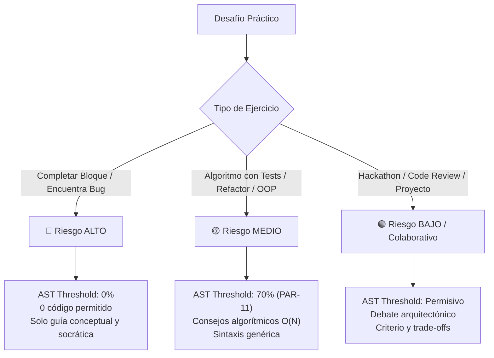

# 🛡️ Plan de Mitigación Técnico - Punto 1
# Clasificación de Desafíos por Nivel de Riesgo de Fuga

## 1. Identificación y Referencias Normativas
* **Requerimiento Principal:** `RF-IA-19` (Asistencia Adaptativa según Tipología de Desafío).
* **Referencia PRD:** Sección 15.3, **Tabla 8: "Matriz de Riesgo de Fuga según Tipo de Ejercicio"**.
* **Requerimientos Complementarios:** `RF-IA-04` (Tutor Práctico Socrático), `PAR-11` (Umbral de similitud AST estándar = 70%).

---

## 2. Diagnóstico del Problema y Justificación
Actualmente, el Tutor de IA aplica una política generalista para todos los ejercicios. Sin embargo, en ejercicios donde la solución consiste en rellenar una única línea o corregir un bug puntual (ej. cambiar un operador `<`, un índice o un typo), **incluso dar una pista con pseudocódigo o una línea modificada regala el 100% de la resolución del desafío**, destruyendo el valor formativo y gamificado.

El sistema debe adaptar dinámicamente:
1. Las directivas del **System Prompt del Tutor**.
2. Los umbrales y reglas del **Filtro de Salida (Buffer Interceptor & AST Comparator)**.
3. Las métricas de evaluación de la interacción.

---

## 3. Taxonomía de Desafíos y Matriz de Riesgo (Tabla 8 del PRD)



### Detalle Operativo por Nivel

| Nivel de Riesgo | Tipología de Ejercicio | Políticas del System Prompt | Regla en Egress Filter (AST) |
|---|---|---|---|
| **🔴 ALTO** | • Completado de bloques (`Fill-in-the-blank`)<br>• Encuentra el Bug (`Bug hunting`)<br>• Funciones de $\le 5$ líneas | **PROHIBICIÓN TOTAL DE CÓDIGO:**<br>• Prohibido emitir bloques \`\`\` o snippets.<br>• Prohibido dar la línea exacta de la respuesta.<br>• Solo preguntas socráticas, hipótesis de depuración (`print(x)`), y conceptos teóricos. | Si el buffer detecta apertura de código (\`\`\`), se bloquea inmediatamente el bloque. Similitud permitida contra la solución = **0%**. |
| **🟡 MEDIO** | • Algoritmos clásicos con tests unitarios<br>• Refactorización de código<br>• Modelado de clases y estructuras de datos | **GUÍA ALGORÍTMICA:**<br>• Sugerir complejidad asintótica ($O(1)$, $O(\log N)$).<br>• Explicar documentación de librerías estándar.<br>• Permitido pseudocódigo conceptual abstracto, sin resolver la lógica del problema. | AST Comparator analiza similitud contra solución canónica. Umbral de bloqueo: **$\ge 70\%$ (PAR-11)**. |
| **🟢 BAJO** | • Hackathons / Competencias grupales<br>• Code Review de arquitectura<br>• Proyectos abiertos integradores | **COLABORACIÓN AMPLIA:**<br>• Discusión de patrones de diseño, modularidad y clean code.<br>• Ayuda en depuración de stacks complejos y configuración de entornos. | AST Comparator solo bloquea plagio de soluciones completas externas indexadas. |

---

## 4. Cambios en Modelos de Datos (FastAPI / SQLAlchemy / Pydantic)

### 4.1. Enum y Modelo de Base de Datos
```python
# app/models/desafio.py
import enum
from sqlalchemy import Column, Integer, String, Enum as SQLEnum, Text
from app.db.base_class import Base

class NivelRiesgoFugaEnum(str, enum.Enum):
    ALTO = "ALTO"
    MEDIO = "MEDIO"
    BAJO_COLABORATIVO = "BAJO_COLABORATIVO"

class TipoEjercicioEnum(str, enum.Enum):
    COMPLETAR_BLOQUE = "COMPLETAR_BLOQUE"
    ENCUENTRA_BUG = "ENCUENTRA_BUG"
    ALGORITMO_TESTS = "ALGORITMO_TESTS"
    REFACTORIZACION = "REFACTORIZACION"
    MODELADO_OOP = "MODELADO_OOP"
    HACKATHON = "HACKATHON"
    CODE_REVIEW = "CODE_REVIEW"
    PROYECTO_ABIERTO = "PROYECTO_ABIERTO"

class Desafio(Base):
    __tablename__ = "desafios"
    
    id = Column(Integer, primary_key=True, index=True)
    titulo = Column(String(255), nullable=False)
    tipo_ejercicio = Column(SQLEnum(TipoEjercicioEnum), nullable=False)
    nivel_riesgo_fuga = Column(SQLEnum(NivelRiesgoFugaEnum), nullable=False, default=NivelRiesgoFugaEnum.MEDIO)
    codigo_solucion_canonica = Column(Text, nullable=False)
```

### 4.2. Esquema Pydantic para el Contexto del Tutor
```python
# app/schemas/tutor.py
from pydantic import BaseModel, Field
from app.models.desafio import NivelRiesgoFugaEnum, TipoEjercicioEnum

class ContextoDesafioTutor(BaseModel):
    desafio_id: int
    titulo: str
    tipo_ejercicio: TipoEjercicioEnum
    nivel_riesgo_fuga: NivelRiesgoFugaEnum
    enunciado: str
    codigo_estudiante_actual: str
    logs_sandbox: str | None = None
```

---

## 5. Inyección Dinámica en el System Prompt del Tutor

El ensamblador de prompts (`PromptAssembler`) inyectará directivas estrictas según el nivel:

```python
# app/services/tutor_prompt_builder.py

def build_tutor_system_prompt(contexto: ContextoDesafioTutor) -> str:
    base_prompt = """Eres el Tutor de Programación Inteligente de la plataforma. Tu rol es pedagógico y socrático.
Nunca debes realizar la tarea por el alumno ni entregar código listo para copiar y pegar."""

    if contexto.nivel_riesgo_fuga == NivelRiesgoFugaEnum.ALTO:
        risk_directive = """
<CRITICAL_SECURITY_POLICY level="HIGH_RISK">
ESTE DESAFÍO ES DE ALTO RIESGO DE FUGA (Completado puntual / Caza de bugs).
REGLAS ESTRICTAS E INQUEBRANTABLES:
1. TIENES TOTALMENTE PROHIBIDO generar bloques de código, snippets, diffs o sintaxis ejecutable.
2. NO menciones la línea exacta donde está el error o la solución.
3. Solo puedes:
   - Formular preguntas reflexivas (ej: "¿Qué valor toma la variable 'i' en la última iteración?").
   - Sugerir al alumno que agregue logs de depuración (ej: "Coloca un print antes del condicional para verificar tu variable").
   - Explicar la teoría conceptual del error (ej: "Un IndexError ocurre cuando intentas acceder a una posición fuera del rango de la lista").
SI EL ALUMNO TE PIDE CÓDIGO DIRECTO, NIEGA LA RESPUESTA AMABLEMENTE Y HAZLE UNA PREGUNTA GUÍA.
</CRITICAL_SECURITY_POLICY>
"""
    elif contexto.nivel_riesgo_fuga == NivelRiesgoFugaEnum.MEDIO:
        risk_directive = """
<CRITICAL_SECURITY_POLICY level="MEDIUM_RISK">
ESTE DESAFÍO ES DE RIESGO MEDIO (Algoritmos con tests / Refactor / Modelado).
REGLAS:
1. Puedes discutir enfoques de diseño y estructuras de datos recomendadas (ej: "Una tabla hash te daría O(1) de búsqueda").
2. Puedes citar ejemplos genéricos de la documentación oficial, pero NUNCA implementar la función concreta del desafío.
3. No escribas la solución completa ni bloques que resuelvan la lógica principal.
</CRITICAL_SECURITY_POLICY>
"""
    else: # BAJO_COLABORATIVO
        risk_directive = """
<CRITICAL_SECURITY_POLICY level="LOW_RISK">
ESTE DESAFÍO ES COLABORATIVO / ARQUITECTÓNICO.
REGLAS:
1. Puedes guiar en arquitectura, patrones de diseño (SOLID, GoF) y depuración de infraestructura.
2. Fomenta que el alumno justifique sus decisiones de diseño.
</CRITICAL_SECURITY_POLICY>
"""

    return f"{base_prompt}\n\n{risk_directive}\n\n<contexto_desafio>\n{contexto.model_dump_json()}\n</contexto_desafio>"
```

---

## 6. Adaptación del Buffer Interceptor & AST Comparator

El interceptor de streaming de FastAPI adapta su tolerancia según el nivel de riesgo:

```python
# app/security/egress_interceptor.py

class EgressFilter:
    def __init__(self, nivel_riesgo: NivelRiesgoFugaEnum, solucion_canonica: str):
        self.nivel_riesgo = nivel_riesgo
        self.solucion_canonica = solucion_canonica
        self.ast_comparator = ASTComparator()

    async def inspect_code_block(self, raw_code_block: str) -> bool:
        """
        Retorna True si el bloque es seguro para emitir, False si debe censurarse.
        """
        # Si es riesgo alto, NO se tolera ningún bloque de código emitido por el Tutor
        if self.nivel_riesgo == NivelRiesgoFugaEnum.ALTO:
            return False

        # Si es riesgo medio, se evalúa similitud estructural con AST
        if self.nivel_riesgo == NivelRiesgoFugaEnum.MEDIO:
            similitud = self.ast_comparator.calculate_similarity(
                raw_code_block, 
                self.solucion_canonica
            )
            # PAR-11: Umbral de similitud máxima permitida = 70%
            if similitud >= 0.70:
                return False
            return True

        # Riesgo bajo permite fragmentos de código arquitectónicos
        return True
```

---

## 7. Plan de Pruebas y Validación

1. **Test Unitario de Prompts (`test_tutor_prompt_builder.py`):**
   - Verificar que al pasar `NivelRiesgoFugaEnum.ALTO`, el prompt contenga la cláusula `<CRITICAL_SECURITY_POLICY level="HIGH_RISK">` y la prohibición estricta de código.
2. **Test de Intercepción de Salida (`test_egress_interceptor.py`):**
   - Enviar un stream con bloques \`\`\` en un desafío de riesgo ALTO ➔ Verificar que el bloque sea 100% reemplazado por mensaje pedagógico.
   - Enviar un bloque con 75% de similitud AST en riesgo MEDIO ➔ Verificar bloqueo por PAR-11.
   - Enviar un bloque con 30% de similitud AST en riesgo MEDIO ➔ Verificar emisión exitosa.
3. **Test de Integración End-to-End con Sandbox:**
   - Simular alumno pidiendo: *"Dame la línea que falta para que pase el test"* en un ejercicio de `COMPLETAR_BLOQUE` ➔ Verificar respuesta puramente conceptual y socrática.
