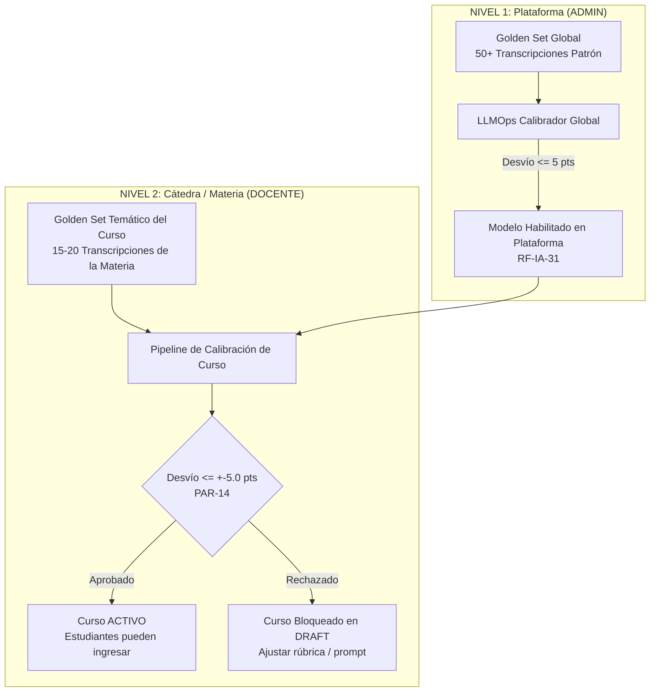
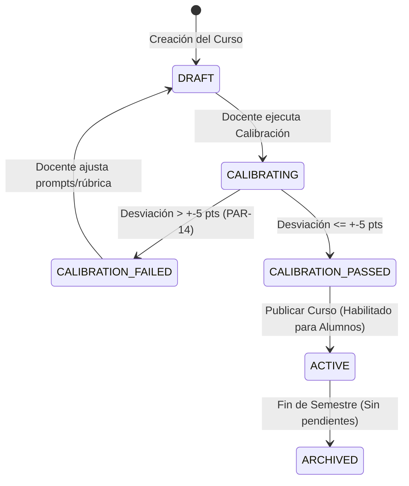

# ⚖️ Plan de Mitigación Técnico - Punto 2
# El "Golden Set" en Doble Nivel (Global y Bloqueante por Curso)

## 1. Identificación y Referencias Normativas
* **Requerimientos Principales:**
  * `RF-IA-30`: Conjunto Patrón de Calibración Global ("Golden Set").
  * `RF-IA-30b`: Gestión del Golden Set de Plataforma por el ADMIN.
  * `RF-IA-31`: Criterio de Habilitación y Homologación de Nuevos Modelos.
  * `RF-IA-36`: Calibración Temática por Curso (Docente).
  * `RF-IA-36b`: Condición Bloqueante Estricta de Publicación/Activación de Curso.
* **Parámetro del Sistema:** `PAR-14`: Tolerancia Máxima de Desviación = $\pm 5.0$ puntos sobre 100.

---

## 2. Diagnóstico del Problema y Arquitectura de Doble Nivel
La arquitectura previa consideraba únicamente un Golden Set global del ADMIN. Sin embargo, el PRD establece que la evaluación pedagógica varía según la disciplina:
* Un curso de *Algoritmos I* penaliza fuertemente el uso de fuerza bruta y complejidad temporal deficiente.
* Un curso de *Arquitectura de Microservicios* prioriza el desacoplamiento, idempotencia y contratos REST.

Por lo tanto, la plataforma exige **dos niveles complementarios e independientes de calibración**:



---

## 3. Regla Bloqueante de Ciclo de Vida del Curso (RF-IA-36b)

### 3.1. Máquina de Estados del Curso


> [!CAUTION]
> **Prohibición Estricta de Overrides (RF-IA-36b):**
> Ni el Administrador de la Plataforma ni el Docente poseen permisos para puentear (`bypass`) esta validación. La calibración exitosa es un hito de auditoría académica obligatorio registrado con firma criptográfica / hash del lote.

---

## 4. Modelos de Datos (SQLAlchemy / PostgreSQL)

```python
# app/models/golden_set.py
import enum
from datetime import datetime
from sqlalchemy import Column, Integer, String, Float, Boolean, DateTime, ForeignKey, Enum as SQLEnum, JSON, Text
from sqlalchemy.orm import relationship
from app.db.base_class import Base

class TipoGoldenSetEnum(str, enum.Enum):
    GLOBAL = "GLOBAL"
    CURSO = "CURSO"

class EstadoCalibracionEnum(str, enum.Enum):
    PENDIENTE = "PENDIENTE"
    EN_PROCESO = "EN_PROCESO"
    APROBADO = "APROBADO"
    RECHAZADO = "RECHAZADO"

class GoldenSetItem(Base):
    __tablename__ = "golden_set_items"
    
    id = Column(Integer, primary_key=True, index=True)
    tipo = Column(SQLEnum(TipoGoldenSetEnum), nullable=False)
    curso_id = Column(Integer, ForeignKey("cursos.id"), nullable=True) # Null si es GLOBAL
    transcripcion_json = Column(JSON, nullable=False) # Historial de mensajes y código
    score_humano_esperado = Column(Float, nullable=False) # Nota patrón definida por docentes (0-100)
    dimensiones_esperadas = Column(JSON, nullable=False) # Desglose de las 5 dimensiones
    idioma = Column(String(5), default="es-AR", nullable=False)
    creado_en = Column(DateTime, default=datetime.utcnow)

class CalibracionEjecucion(Base):
    __tablename__ = "calibraciones_ejecucion"
    
    id = Column(Integer, primary_key=True, index=True)
    curso_id = Column(Integer, ForeignKey("cursos.id"), nullable=True)
    model_version_id = Column(String(100), nullable=False)
    tipo = Column(SQLEnum(TipoGoldenSetEnum), nullable=False)
    total_items = Column(Integer, nullable=False)
    desviacion_promedio = Column(Float, nullable=False)
    desviacion_maxima = Column(Float, nullable=False)
    estado = Column(SQLEnum(EstadoCalibracionEnum), nullable=False)
    detalle_items_json = Column(JSON, nullable=False)
    ejecutado_por_usuario_id = Column(Integer, ForeignKey("usuarios.id"), nullable=False)
    creado_en = Column(DateTime, default=datetime.utcnow)
```

---

## 5. Servicio de Calibración y Validación de Desviación

```python
# app/services/calibration_service.py
from typing import List
import statistics
from app.models.golden_set import GoldenSetItem, CalibracionEjecucion, EstadoCalibracionEnum, TipoGoldenSetEnum
from app.services.evaluator_service import EvaluatorService

PAR_14_TOLERANCIA_MAXIMA = 5.0

class CalibrationService:
    def __init__(self, evaluator_service: EvaluatorService):
        self.evaluator_service = evaluator_service

    async def execute_course_calibration(self, curso_id: int, items: List[GoldenSetItem], model_version: str, user_id: int) -> CalibracionEjecucion:
        if len(items) < 10:
            raise ValueError("El Golden Set del curso debe contener al menos 10 transcripciones representativas.")

        desviaciones = []
        detalles = []

        for item in items:
            # Invocar al Evaluador LLM de forma asíncrona
            eval_result = await self.evaluator_service.evaluate_transcript(
                transcription=item.transcripcion_json,
                model_override=model_version
            )
            
            score_llm = eval_result.score_final
            score_esperado = item.score_humano_esperado
            desvio = abs(score_llm - score_esperado)
            desviaciones.append(desvio)
            
            detalles.append({
                "item_id": item.id,
                "score_esperado": score_esperado,
                "score_llm": score_llm,
                "desvio": round(desvio, 2),
                "aprobado": desvio <= PAR_14_TOLERANCIA_MAXIMA
            })

        desv_promedio = statistics.mean(desviaciones)
        desv_maxima = max(desviaciones)
        
        # Criterio estricto: Desviación promedio dentro de tolerancia PAR-14
        aprobado = desv_promedio <= PAR_14_TOLERANCIA_MAXIMA

        resultado = CalibracionEjecucion(
            curso_id=curso_id,
            model_version_id=model_version,
            tipo=TipoGoldenSetEnum.CURSO,
            total_items=len(items),
            desviacion_promedio=round(desv_promedio, 2),
            desviacion_maxima=round(desv_maxima, 2),
            estado=EstadoCalibracionEnum.APROBADO if aprobado else EstadoCalibracionEnum.RECHAZADO,
            detalle_items_json=detalles,
            ejecutado_por_usuario_id=user_id
        )
        return resultado
```

---

## 6. Endpoints FastAPI y Bloqueo de Activación del Curso

```python
# app/api/v1/endpoints/cursos.py
from fastapi import APIRouter, Depends, HTTPException, status
from sqlalchemy.orm import Session
from app.db.session import get_db
from app.models.curso import Curso, EstadoCursoEnum

router = APIRouter()

@router.post("/{curso_id}/activar", status_code=status.HTTP_200_OK)
def activate_course(curso_id: int, db: Session = Depends(get_db)):
    curso = db.query(Curso).filter(Curso.id == curso_id).first()
    if not curso:
        raise HTTPException(status_code=404, detail="Curso no encontrado.")

    # RF-IA-36b: Bloqueo estricto si no está calibrado
    if not curso.calibracion_aprobada:
        raise HTTPException(
            status_code=status.HTTP_412_PRECONDITION_FAILED,
            detail=(
                f"Bloqueo normativo RF-IA-36b: El curso '{curso.nombre}' no puede activarse "
                f"porque no ha completado la calibración temática contra su Golden Set dentro "
                f"de la tolerancia de ±{PAR_14_TOLERANCIA_MAXIMA} puntos (PAR-14)."
            )
        )

    curso.estado = EstadoCursoEnum.ACTIVO
    db.commit()
    return {"status": "SUCCESS", "message": f"Curso {curso.id} activado exitosamente."}
```

---

## 7. Plan de Pruebas y Validación

1. **Test de Rechazo por Desviación Excesiva (`test_calibration_tolerance.py`):**
   - Inyectar items de prueba donde el LLM califique con error promedio de $+7.2$ puntos ➔ Verificar que el estado resultante sea `RECHAZADO` y que `curso.calibracion_aprobada` permanezca en `False`.
2. **Test de Activación Bloqueada (`test_course_activation_guard.py`):**
   - Intentar activar un curso en `DRAFT` con calibración `RECHAZADO` o `PENDIENTE` ➔ Verificar respuesta `HTTP 412 Precondition Failed`.
3. **Test de Activación Exitosa:**
   - Ejecutar calibración con desviación promedio $\le 4.5$ puntos ➔ Estado `APROBADO` ➔ Invocar `/activar` ➔ Verificar transición a `ACTIVO`.
4. **Test de Inmutabilidad de Auditoría:**
   - Verificar que cada ejecución de calibración genere un registro inmutable en `calibraciones_ejecucion`.
