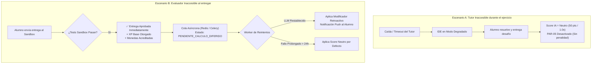

# 🔌 Plan de Mitigación Técnico - Punto 3
# Resiliencia ante Caídas: Score Neutro y Cálculo Diferido

## 1. Identificación y Referencias Normativas
* **Requerimiento Principal:** `RF-IA-27` (Resiliencia e Indisponibilidad de Dependencias Externas de IA).
* **Referencia PRD:** Sección 15.6 ("Políticas de Continuidad Académica ante Fallos de Infraestructura").
* **Requerimientos Complementarios:** `PAR-05` (Penalización por Exceso de Asistencia), `RF-IA-13` (Evaluador Analítico), `RF-DES-08` (Acreditación de Recompensas Gamificadas).

---

## 2. Principio Rector y Diagnóstico
> [!IMPORTANT]
> **Axioma Académico del PRD (RF-IA-27):**
> *"La indisponibilidad, latencia o fallo catastrófico de un proveedor externo de Inteligencia Artificial (Google Gemini, OpenAI, Anthropic) **JAMÁS** debe interrumpir el flujo de aprendizaje, la resolución de ejercicios ni la entrega a tiempo de un estudiante."*

El microservicio debe desacoplar la ejecución académica esencial (Sandbox, tests y entrega) de las llamadas a LLM mediante dos mecanismos de tolerancia a fallos:



---

## 3. Especificación Técnica de los Escenarios de Fallo

### 3.1. Escenario A: Tutor no disponible (Chat en Vivo)
1. **Comportamiento en Frontend (IDE):**
   - Si el endpoint de streaming del Tutor responde con error `HTTP 502/503/504` o agota el timeout de 3.0s, el IDE muestra un badge informativo: *"Asistente de IA en mantenimiento temporal. Puedes continuar programando normalmente."*
2. **Impacto en Puntuación de la Entrega:**
   - La sesión se etiqueta con `tutor_indisponible = True`.
   - Al evaluarse la entrega, el sistema no penaliza al alumno por falta de interacción o por no consultar al tutor.
   - El score de la Dimensión de IA se fija en **50/100 (Neutro)** y el parámetro `PAR-05` queda suspendido para esta entrega.

### 3.2. Escenario B: Evaluador no disponible al momento del Submit
1. **Procesamiento Inmediato:**
   - El microservicio de desafíos evalúa el código contra los tests unitarios en el Sandbox Docker/gVisor.
   - Si los tests pasan, se retorna `HTTP 200 OK` al alumno con el XP base y monedas inmediatamente visibles en su perfil.
2. **Cálculo Diferido (Asíncrono):**
   - El payload forense (código final, historial de chat previo si existió, logs) se encola en Redis Streams / Celery.
   - Estado de la evaluación: `PENDIENTE_CALCULO_DIFERIDO`.
   - Política de reintentos con **Exponential Backoff**: 10s, 30s, 2m, 10m, 1h (hasta 5 intentos).
   - Si el LLM no responde tras 24 horas, un cronjob de saneamiento aplica automáticamente `Score Neutro` para no dejar transacciones colgadas.

---

## 4. Modelos de Base de Datos (SQLAlchemy)

```python
# app/models/entrega.py
import enum
from datetime import datetime
from sqlalchemy import Column, Integer, String, Float, Boolean, DateTime, ForeignKey, Enum as SQLEnum, Text, JSON
from app.db.base_class import Base

class EstadoEvaluacionIAEnum(str, enum.Enum):
    COMPLETADA_EN_VIVO = "COMPLETADA_EN_VIVO"
    PENDIENTE_CALCULO_DIFERIDO = "PENDIENTE_CALCULO_DIFERIDO"
    COMPLETADA_DIFERIDA = "COMPLETADA_DIFERIDA"
    FALLO_APLICADO_NEUTRO = "FALLO_APLICADO_NEUTRO"

class EvaluacionUsoIA(Base):
    __tablename__ = "evaluaciones_uso_ia"
    
    id = Column(Integer, primary_key=True, index=True)
    entrega_id = Column(Integer, ForeignKey("entregas.id"), nullable=False, unique=True)
    curso_id = Column(Integer, ForeignKey("cursos.id"), nullable=False, index=True)
    estudiante_id = Column(Integer, ForeignKey("usuarios.id"), nullable=False, index=True)
    
    estado = Column(SQLEnum(EstadoEvaluacionIAEnum), nullable=False, default=EstadoEvaluacionIAEnum.COMPLETADA_EN_VIVO)
    score_final = Column(Float, nullable=True) # 0 a 100
    modificador_xp = Column(Float, nullable=True) # Factor multiplicador (ej. 1.15x, 0.90x, 1.0x)
    
    tutor_estuvo_indisponible = Column(Boolean, default=False, nullable=False)
    es_score_neutro = Column(Boolean, default=False, nullable=False)
    
    reintentos_fallidos = Column(Integer, default=0, nullable=False)
    ultimo_error_mensaje = Column(Text, nullable=True)
    payload_transcripcion = Column(JSON, nullable=False)
    
    creado_en = Column(DateTime, default=datetime.utcnow)
    procesado_en = Column(DateTime, nullable=True)
```

---

## 5. Pipeline del Endpoint de Entrega (FastAPI)

```python
# app/api/v1/endpoints/entregas.py
from fastapi import APIRouter, Depends, status
from app.schemas.entrega import EntregaCreateRequest, EntregaResponse
from app.services.sandbox_service import SandboxService
from app.services.evaluator_service import EvaluatorService
from app.tasks.celery_tasks import task_calcular_evaluacion_diferida
from app.models.entrega import EstadoEvaluacionIAEnum

router = APIRouter()

@router.post("/desafios/{desafio_id}/submit", response_model=EntregaResponse)
async def submit_challenge(
    desafio_id: int,
    payload: EntregaCreateRequest,
    sandbox: SandboxService = Depends(),
    evaluator: EvaluatorService = Depends()
):
    # 1. Ejecutar código en Sandbox (Paso crítico e incondicional)
    resultado_sandbox = await sandbox.run_tests(desafio_id, payload.codigo_estudiante)
    if not resultado_sandbox.tests_aprobados:
        return EntregaResponse(aprobado=False, feedback=resultado_sandbox.logs)

    # 2. Acreditación inmediata de Recompensas Base
    xp_base = 100
    monedas_base = 25

    # 3. Intentar Evaluación de IA con Timeout Estricto (Resiliencia RF-IA-27)
    try:
        resultado_ia = await evaluator.evaluate_with_timeout(
            payload.transcripcion_chat,
            payload.codigo_estudiante,
            timeout_seconds=2.0
        )
        estado_ia = EstadoEvaluacionIAEnum.COMPLETADA_EN_VIVO
        modificador_xp = resultado_ia.modificador_xp
        score_ia = resultado_ia.score_final
    except Exception as exc:
        # En caso de fallo o timeout, la entrega NO se frena: pasa a cálculo diferido
        estado_ia = EstadoEvaluacionIAEnum.PENDIENTE_CALCULO_DIFERIDO
        modificador_xp = 1.0  # Provisorio
        score_ia = None
        
        # Encolar en Celery/Redis para reintento en background
        task_calcular_evaluacion_diferida.delay(
            entrega_id=payload.entrega_id,
            transcripcion=payload.transcripcion_chat,
            codigo=payload.codigo_estudiante
        )

    return EntregaResponse(
        aprobado=True,
        xp_otorgado=int(xp_base * modificador_xp),
        monedas_otorgadas=monedas_base,
        estado_evaluacion_ia=estado_ia,
        mensaje="¡Desafío completado! Tu recompensa base ya fue acreditada."
    )
```

---

## 6. Worker de Reintentos Asíncronos (Celery Task)

```python
# app/tasks/celery_tasks.py
from app.tasks.celery_app import celery_app
from app.services.evaluator_service import EvaluatorService
from app.db.session import SessionLocal
from app.models.entrega import EvaluacionUsoIA, EstadoEvaluacionIAEnum
from datetime import datetime

@celery_app.task(bind=True, max_retries=5, default_retry_delay=30)
def task_calcular_evaluacion_diferida(self, entrega_id: int, transcripcion: dict, codigo: str):
    db = SessionLocal()
    eval_record = db.query(EvaluacionUsoIA).filter_by(entrega_id=entrega_id).first()
    
    try:
        evaluator = EvaluatorService()
        resultado = evaluator.evaluate_sync(transcripcion, codigo)
        
        eval_record.estado = EstadoEvaluacionIAEnum.COMPLETADA_DIFERIDA
        eval_record.score_final = resultado.score_final
        eval_record.modificador_xp = resultado.modificador_xp
        eval_record.procesado_en = datetime.utcnow()
        
        # Ajustar XP retroactivo si corresponde
        evaluator.apply_xp_adjustment(eval_record.estudiante_id, resultado.modificador_xp)
        db.commit()

    except Exception as exc:
        eval_record.reintentos_fallidos += 1
        eval_record.ultimo_error_mensaje = str(exc)
        db.commit()
        
        if self.request.retries >= self.max_retries:
            # Fallback final a Score Neutro para no dejar bloqueado el registro
            eval_record.estado = EstadoEvaluacionIAEnum.FALLO_APLICADO_NEUTRO
            eval_record.score_final = 50.0
            eval_record.modificador_xp = 1.0
            eval_record.es_score_neutro = True
            db.commit()
        else:
            raise self.retry(exc=exc, countdown=2 ** self.request.retries * 10)
    finally:
        db.close()
```

---

## 7. Plan de Pruebas y Validación

1. **Test de Simulación de Caída de LLM (`test_resilience_submit.py`):**
   - Mockear el cliente de OpenAI/Gemini para que lance `httpx.ConnectTimeout`.
   - Realizar un submit de entrega aprobada ➔ Verificar que el endpoint responda `HTTP 200 OK`, con `estado_evaluacion_ia == "PENDIENTE_CALCULO_DIFERIDO"` y recompensas base entregadas.
2. **Test de Recuperación de Worker (`test_celery_deferred_eval.py`):**
   - Ejecutar la tarea de Celery tras restablecer el mock del LLM ➔ Verificar que el estado cambie a `COMPLETADA_DIFERIDA` y se aplique el score final.
3. **Test de Fallback por Agotamiento de Reintentos:**
   - Forzar fallo en 5 reintentos consecutivos ➔ Verificar que el registro transicione a `FALLO_APLICADO_NEUTRO`, score fijado en 50.0 y no bloquee el sistema.
