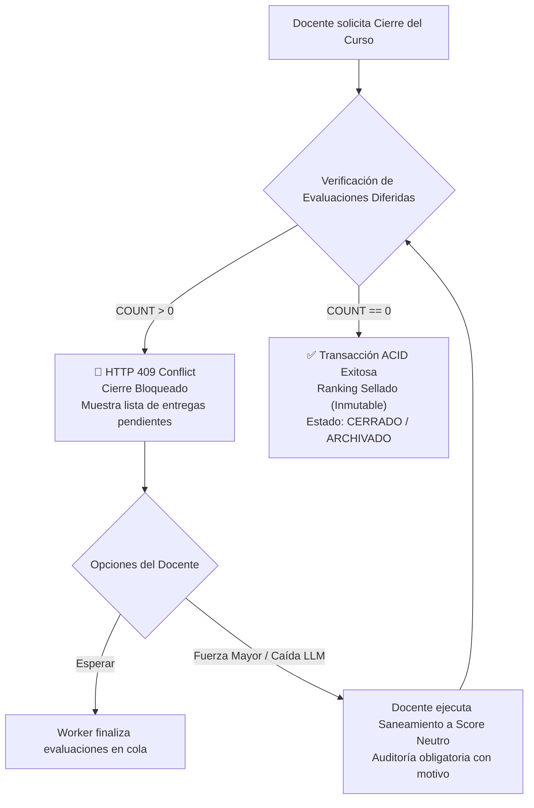

# 🔒 Plan de Mitigación Técnico - Punto 4
# Bloqueo de Cierre y Archivado de Cursos por Evaluaciones Diferidas

## 1. Identificación y Referencias Normativas
* **Requerimientos Principales:**
  * `RF-IA-34`: Bloqueo de Cierre/Archivado de Cursos con Evaluaciones de IA Pendientes.
  * `RF-RNK-10`: Sellado Inmutable de Ranking de Curso y Actas de Regularidad/Promoción.
* **Referencia PRD:** Sección 15.6 ("Consistencia Transaccional y Cierre de Ciclo Académico").

---

## 2. Diagnóstico del Problema y Justificación
Al finalizar un ciclo lectivo, el docente ejecuta el cierre del curso para:
1. **Sellar el Ranking Definitivo (RF-RNK-10):** Determinar podios, insignias y percentiles de corte.
2. **Emitir Actas Académicas:** Fijar la condición final de los estudiantes (Promovido P90, Regular, Libre).

### El Riesgo de Inconsistencia:
Si el curso se cierra mientras existen entregas en estado `PENDIENTE_CALCULO_DIFERIDO`, el posterior procesamiento asíncrono de los LLM inyectaría modificaciones de XP sobre un ranking ya sellado y actas ya comunicadas a las autoridades académicas.



---

## 3. Reglas de Negocio Estrictas

1. **Inmutabilidad Post-Cierre:** Una vez que un curso pasa a estado `CERRADO` o `ARCHIVADO`, la tabla de rankings y los modificadores de XP quedan congelados. Ningún worker o proceso en background puede alterar registros de ese `curso_id`.
2. **Validación Bloqueante Obligatoria:** Ningún docente ni administrador puede cerrar el curso si existe al menos una entrega en estado `PENDIENTE_CALCULO_DIFERIDO`.
3. **Mecanismo de Fuerza Mayor (Saneamiento Neutro):** Si un proveedor de IA sufre una indisponibilidad prolongada y el docente debe entregar actas impostergables por calendario universitario, se habilita una acción auditada para transformar los pendientes diferidos en `Score Neutro (50/100, factor 1.0x)`.

---

## 4. Modelos de Base de Datos y Transición de Estados

```python
# app/models/curso.py
import enum
from datetime import datetime
from sqlalchemy import Column, Integer, String, DateTime, Enum as SQLEnum, ForeignKey, Text
from app.db.base_class import Base

class EstadoCursoEnum(str, enum.Enum):
    DRAFT = "DRAFT"
    ACTIVO = "ACTIVO"
    CERRADO = "CERRADO"
    ARCHIVADO = "ARCHIVADO"

class CierreCursoLog(Base):
    __tablename__ = "cierres_curso_log"
    
    id = Column(Integer, primary_key=True, index=True)
    curso_id = Column(Integer, ForeignKey("cursos.id"), nullable=False, unique=True)
    cerrado_por_usuario_id = Column(Integer, ForeignKey("usuarios.id"), nullable=False)
    total_estudiantes = Column(Integer, nullable=False)
    total_entregas_evaluadas = Column(Integer, nullable=False)
    total_forzados_neutros = Column(Integer, default=0, nullable=False)
    motivo_forzado = Column(Text, nullable=True)
    hash_sellado_ranking = Column(String(64), nullable=False) # SHA-256 del snapshot final
    cerrado_en = Column(DateTime, default=datetime.utcnow)
```

---

## 5. Implementación de Endpoints y Servicios (FastAPI / PostgreSQL)

### 5.1. Endpoint de Chequeo Previo (`Pre-Close Check`)
```python
# app/api/v1/endpoints/cursos.py
from fastapi import APIRouter, Depends, HTTPException, status
from sqlalchemy.orm import Session
from sqlalchemy import func
from app.db.session import get_db
from app.models.entrega import EvaluacionUsoIA, EstadoEvaluacionIAEnum
from app.models.curso import Curso, EstadoCursoEnum

router = APIRouter()

@router.get("/{curso_id}/pre-close-check")
def pre_close_check(curso_id: int, db: Session = Depends(get_db)):
    curso = db.query(Curso).filter(Curso.id == curso_id).first()
    if not curso:
        raise HTTPException(status_code=404, detail="Curso no encontrado.")

    diferidos_pendientes = (
        db.query(EvaluacionUsoIA)
        .filter(
            EvaluacionUsoIA.curso_id == curso_id,
            EvaluacionUsoIA.estado == EstadoEvaluacionIAEnum.PENDIENTE_CALCULO_DIFERIDO
        )
        .all()
    )

    return {
        "curso_id": curso_id,
        "puede_cerrar": len(diferidos_pendientes) == 0,
        "total_pendientes_diferidos": len(diferidos_pendientes),
        "entregas_pendientes": [
            {
                "entrega_id": e.entrega_id,
                "estudiante_id": e.estudiante_id,
                "reintentos": e.reintentos_fallidos,
                "ultimo_error": e.ultimo_error_mensaje
            }
            for e in diferidos_pendientes
        ]
    }
```

### 5.2. Endpoint de Cierre con Bloqueo Transaccional
```python
import hashlib
import json
from app.models.curso import CierreCursoLog

@router.post("/{curso_id}/cerrar", status_code=status.HTTP_200_OK)
def cerrar_curso(curso_id: int, usuario_actual_id: int, db: Session = Depends(get_db)):
    # Iniciar transacción con lock exclusivo sobre el curso
    curso = db.query(Curso).filter(Curso.id == curso_id).with_for_update().first()
    if not curso:
        raise HTTPException(status_code=404, detail="Curso no encontrado.")
        
    if curso.estado in [EstadoCursoEnum.CERRADO, EstadoCursoEnum.ARCHIVADO]:
        raise HTTPException(status_code=400, detail="El curso ya se encuentra cerrado.")

    # RF-IA-34: Validación atómica de evaluaciones diferidas pendientes
    pendientes_count = (
        db.query(func.count(EvaluacionUsoIA.id))
        .filter(
            EvaluacionUsoIA.curso_id == curso_id,
            EvaluacionUsoIA.estado == EstadoEvaluacionIAEnum.PENDIENTE_CALCULO_DIFERIDO
        )
        .scalar()
    )

    if pendientes_count > 0:
        raise HTTPException(
            status_code=status.HTTP_409_CONFLICT,
            detail=(
                f"Bloqueo normativo RF-IA-34: No es posible cerrar el curso '{curso.nombre}' "
                f"porque existen {pendientes_count} evaluaciones de IA en estado "
                f"PENDIENTE_CALCULO_DIFERIDO. Espere a que finalicen o aplique saneamiento neutro."
            )
        )

    # Sellado de Ranking (RF-RNK-10)
    snapshot_ranking = obtener_snapshot_ranking(curso_id, db)
    hash_ranking = hashlib.sha256(json.dumps(snapshot_ranking, sort_keys=True).encode()).hexdigest()

    curso.estado = EstadoCursoEnum.CERRADO
    log_cierre = CierreCursoLog(
        curso_id=curso_id,
        cerrado_por_usuario_id=usuario_actual_id,
        total_estudiantes=len(snapshot_ranking),
        total_entregas_evaluadas=db.query(EvaluacionUsoIA).filter_by(curso_id=curso_id).count(),
        hash_sellado_ranking=hash_ranking
    )
    db.add(log_cierre)
    db.commit()

    return {
        "status": "SUCCESS",
        "message": f"Curso {curso_id} cerrado exitosamente. Ranking sellado con hash {hash_ranking[:12]}..."
    }
```

### 5.3. Endpoint de Saneamiento de Fuerza Mayor (Score Neutro)
```python
@router.post("/{curso_id}/forzar-saneamiento-neutro")
def forzar_saneamiento_neutro(
    curso_id: int,
    motivo: str,
    usuario_actual_id: int,
    db: Session = Depends(get_db)
):
    if len(motivo.strip()) < 20:
        raise HTTPException(
            status_code=400,
            detail="Debe justificar la causa de fuerza mayor para aplicar saneamiento neutro (mínimo 20 caracteres)."
        )

    pendientes = (
        db.query(EvaluacionUsoIA)
        .filter(
            EvaluacionUsoIA.curso_id == curso_id,
            EvaluacionUsoIA.estado == EstadoEvaluacionIAEnum.PENDIENTE_CALCULO_DIFERIDO
        )
        .all()
    )

    if not pendientes:
        return {"message": "No hay evaluaciones pendientes para sanear."}

    for ev in pendientes:
        ev.estado = EstadoEvaluacionIAEnum.FALLO_APLICADO_NEUTRO
        ev.score_final = 50.0
        ev.modificador_xp = 1.0
        ev.es_score_neutro = True
        ev.ultimo_error_mensaje = f"Forzado a neutro por Docente {usuario_actual_id}. Motivo: {motivo}"

    db.commit()
    return {
        "status": "SUCCESS",
        "total_saneados": len(pendientes),
        "message": f"Se aplicó score neutro a {len(pendientes)} evaluaciones pendientes."
    }
```

---

## 6. Plan de Pruebas y Validación

1. **Test de Bloqueo por Pendientes Diferidos (`test_course_close_guard.py`):**
   - Crear un curso con 2 entregas en `PENDIENTE_CALCULO_DIFERIDO`.
   - Invocar `POST /api/v1/cursos/{id}/cerrar` ➔ Verificar respuesta `HTTP 409 Conflict` y que el estado del curso permanezca en `ACTIVO`.
2. **Test de Saneamiento de Fuerza Mayor (`test_force_neutral_resolution.py`):**
   - Ejecutar `/forzar-saneamiento-neutro` con justificación válida ➔ Verificar que las evaluaciones pasen a `FALLO_APLICADO_NEUTRO`.
   - Reintentar el cierre del curso ➔ Verificar respuesta `HTTP 200 OK` y generación del `hash_sellado_ranking`.
3. **Test de Inmutabilidad de Ranking Post-Cierre:**
   - Intentar procesar una tarea asíncrona de Celery sobre una entrega de un curso ya en estado `CERRADO` ➔ Verificar que el worker aborte la operación sin modificar el XP ni el ranking sellado.
