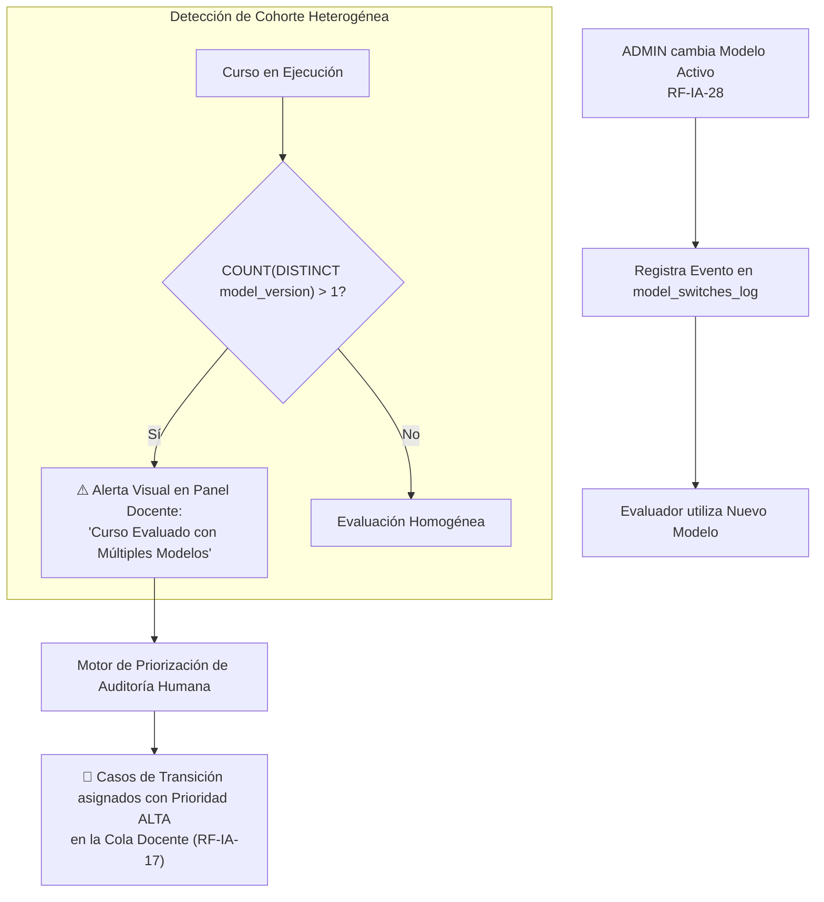

# 🔄 Plan de Mitigación Técnico - Punto 5
# Trazabilidad de Cohortes Afectadas por Cambio de Modelo Activo

## 1. Identificación y Referencias Normativas
* **Requerimientos Principales:**
  * `RF-IA-33`: Trazabilidad de Evaluaciones Multi-Modelo y Cohortes Heterogéneas.
  * `RF-IA-28`: Gestión del Modelo Evaluador Activo por el Administrador.
  * `RF-IA-25`: Unicidad del Modelo Evaluador Activo en Plataforma.
  * `RF-IA-17`: Ruteo Prioritario a la Cola de Auditoría Humana Docente.
* **Referencia PRD:** Sección 15.7 ("Gobernanza de Modelos, Drift y Auditoría de Cohortes").

---

## 2. Diagnóstico del Problema y Justificación
Dado que el Evaluador Analítico solo permite **un único modelo activo a nivel plataforma** (RF-IA-25), si el Administrador (ADMIN) actualiza el modelo en medio de un período lectivo (ej. migración de *Gemini 3.1 Flash* a *Claude 4 Sonnet* por mejoras de calibración o costos):
1. **Problema de Equidad (Sesgo Inter-Modelo):** Los alumnos evaluados en la primera mitad del semestre fueron calificados con una distribución de severidad distinta a los evaluados en la segunda mitad.
2. **Falta de Trazabilidad Forense:** Si no se registran metadatos inmutables, es imposible auditar reclamos de notas si el docente desconoce qué modelo generó la calificación.



---

## 3. Especificación de Reglas de Negocio

1. **Metadatos Inmutables de Evaluación:** Toda fila insertada en `evaluaciones_uso_ia` debe almacenar de forma permanente el `model_provider`, `model_version`, `prompt_version_id` y `rubric_hash` con el que fue calificada.
2. **Detección Automática de Heterogeneidad:** Si un curso posee entregas evaluadas por 2 o más versiones de modelo distintas durante su ciclo lectivo activo, el sistema etiqueta automáticamente el curso como **"Cohorte Heterogénea"**.
3. **Alerta Docente Proactiva:** El panel del profesor muestra un widget analítico comparativo con la distribución de notas antes y después del cambio de modelo.
4. **Priorización en la Cola de Auditoría Humana (RF-IA-17):** Las entregas evaluadas durante las primeras 72 horas posteriores a la activación del nuevo modelo reciben una ponderación de prioridad máxima en la cola de revisión docente.

---

## 4. Modelos de Base de Datos (SQLAlchemy)

```python
# app/models/model_governance.py
import enum
from datetime import datetime
from sqlalchemy import Column, Integer, String, DateTime, ForeignKey, Text, Float, JSON
from app.db.base_class import Base

class CambioModeloActivoLog(Base):
    __tablename__ = "cambios_modelo_activo_log"
    
    id = Column(Integer, primary_key=True, index=True)
    modelo_anterior_id = Column(String(100), nullable=False)
    modelo_nuevo_id = Column(String(100), nullable=False)
    proveedor_nuevo = Column(String(50), nullable=False)
    motivo_cambio = Column(Text, nullable=False)
    calibracion_global_score = Column(Float, nullable=False) # Desviación PAR-14 validada
    ejecutado_por_admin_id = Column(Integer, ForeignKey("usuarios.id"), nullable=False)
    timestamp_cambio = Column(DateTime, default=datetime.utcnow, index=True)
```

```python
# Modificación en app/models/entrega.py (EvaluacionUsoIA)
# Se agregan columnas de trazabilidad estricta:
class EvaluacionUsoIA(Base):
    __tablename__ = "evaluaciones_uso_ia"
    # ... campos anteriores ...
    model_provider = Column(String(50), nullable=False) # 'Google', 'OpenAI', 'Anthropic'
    model_version_id = Column(String(100), nullable=False) # 'gemini-3.1-flash-001', 'claude-3-7-sonnet'
    prompt_version_id = Column(String(50), nullable=False)
    rubric_hash = Column(String(64), nullable=False)
    score_confianza_llm = Column(Float, nullable=False) # 0.0 a 1.0
    prioridad_auditoria = Column(Integer, default=0, nullable=False, index=True) # 0 a 100
```

---

## 5. Servicio de Detección de Cohortes y Priorización de Auditoría

```python
# app/services/cohort_audit_service.py
from datetime import datetime, timedelta
from typing import List, Dict, Any
from sqlalchemy.orm import Session
from sqlalchemy import func, distinct
from app.models.entrega import EvaluacionUsoIA
from app.models.model_governance import CambioModeloActivoLog

class CohortAuditService:
    def __init__(self, db: Session):
        self.db = db

    def check_course_model_heterogeneity(self, curso_id: int) -> Dict[str, Any]:
        """
        Analiza si un curso fue evaluado con más de un modelo LLM.
        """
        modelos_usados = (
            self.db.query(
                EvaluacionUsoIA.model_version_id,
                EvaluacionUsoIA.model_provider,
                func.count(EvaluacionUsoIA.id).label("total_evaluaciones"),
                func.avg(EvaluacionUsoIA.score_final).label("promedio_score")
            )
            .filter(EvaluacionUsoIA.curso_id == curso_id)
            .group_by(EvaluacionUsoIA.model_version_id, EvaluacionUsoIA.model_provider)
            .all()
        )

        es_heterogeneo = len(modelos_usados) > 1

        return {
            "curso_id": curso_id,
            "es_cohorte_heterogenea": es_heterogeneo,
            "total_modelos_distintos": len(modelos_usados),
            "desglose_modelos": [
                {
                    "modelo": m.model_version_id,
                    "proveedor": m.model_provider,
                    "evaluaciones": m.total_evaluaciones,
                    "promedio_score": round(m.promedio_score or 0.0, 2)
                }
                for m in modelos_usados
            ],
            "alerta_docente": (
                "⚠️ Advertencia RF-IA-33: Este curso contiene evaluaciones con múltiples modelos de IA. "
                "Revise la cola de auditoría prioritaria."
                if es_heterogeneo else None
            )
        }

    def calculate_audit_priority(self, evaluacion: EvaluacionUsoIA) -> int:
        """
        Calcula el puntaje de prioridad (0-100) para la cola de revisión docente (RF-IA-17/33).
        """
        prioridad = 0
        
        # 1. ¿Bajo confidence score del LLM?
        if evaluacion.score_confianza_llm < 0.70:
            prioridad += 40

        # 2. ¿Evaluado durante la ventana de transición de cambio de modelo (72h)?
        ultimo_cambio = (
            self.db.query(CambioModeloActivoLog)
            .order_by(CambioModeloActivoLog.timestamp_cambio.desc())
            .first()
        )
        if ultimo_cambio:
            delta = abs((evaluacion.creado_en - ultimo_cambio.timestamp_cambio).total_seconds())
            if delta <= 72 * 3600: # 72 horas
                prioridad += 50 # Máxima prioridad por riesgo de deriva en transición

        return min(prioridad, 100)
```

---

## 6. Plan de Pruebas y Validación

1. **Test de Detección de Cohorte Heterogénea (`test_cohort_heterogeneity.py`):**
   - Insertar 10 entregas evaluadas con `gemini-3.1-flash` y 5 entregas evaluadas con `claude-3-7-sonnet` para el mismo `curso_id`.
   - Ejecutar `check_course_model_heterogeneity()` ➔ Verificar `es_cohorte_heterogenea == True` y cálculo de promedios por modelo.
2. **Test de Priorización de Auditoría en Transición (`test_audit_priority_boost.py`):**
   - Registrar un evento en `CambioModeloActivoLog`.
   - Evaluar una entrega generada 2 horas después del cambio ➔ Verificar que `prioridad_auditoria >= 50` y se encabece la cola docente.
3. **Test de Integridad de Metadatos:**
   - Asegurar que ninguna evaluación pueda guardarse con `model_version_id` nulo o vacío.
