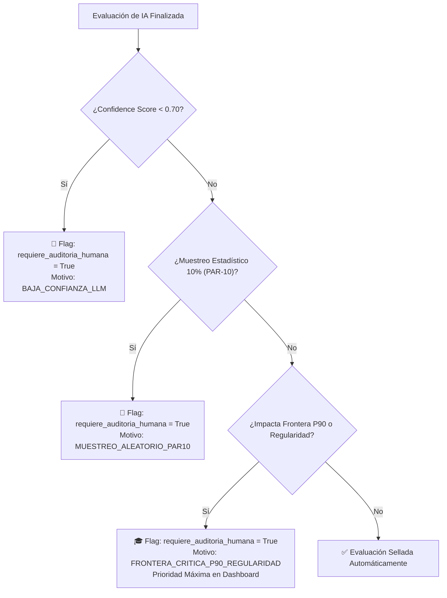

# 🎓 Plan de Mitigación Técnico - Punto 6
# Revisión Humana Obligatoria en Umbrales de Promoción P90 y Regularidad

## 1. Identificación y Referencias Normativas
* **Requerimiento Principal:** `RF-IA-17` (Muestreo y Disparadores de Revisión Humana Docente).
* **Parámetros del Sistema:** `PAR-10` (Muestreo Aleatorio del 10%), `P90` (Umbral de Percentil 90 para Promoción Directa).
* **Referencia PRD:** Sección 15.4 ("Auditoría Humana, Calificación Justa y Fronteras Académicas").

---

## 2. Diagnóstico del Problema y Justificación
El Evaluador de IA emite un score (0 a 100) que se traduce en un factor modificador de XP ($0.80\times$ a $1.20\times$).
* En la mayoría de las interacciones, este modificador genera variaciones recreativas en el ranking gamificado.
* **El Problema Crítico:** Cuando el puntaje total acumulado por el alumno está cerca de los umbrales determinantes del futuro académico:
  1. **Frontera de Promoción Directa (Percentil 90 / P90):** Define si el estudiante aprueba la materia sin rendir examen final.
  2. **Frontera de Regularidad:** Define si el alumno mantiene la condición de cursada o queda en condición de "Libre".

> [!CRITICAL]
> **Axioma Ético-Normativo (RF-IA-17):**
> Ninguna decisión académica que determine la promoción o reprobación de un estudiante puede quedar sellada automáticamente por un modelo de IA sin la supervisión y ratificación de un docente humano.

---

## 3. Matriz de Disparadores de Auditoría Humana (RF-IA-17)



---

## 4. Algoritmo de Detección de Fronteras Académicas

```python
# app/services/academic_boundary_service.py
from enum import Enum
from typing import Tuple
from sqlalchemy.orm import Session
from sqlalchemy import func
from app.models.usuario import Usuario
from app.models.curso import Curso

class CondicionAcademicaEnum(str, Enum):
    LIBRE = "LIBRE"
    REGULAR = "REGULAR"
    PROMOVIDO_P90 = "PROMOVIDO_P90"

class AcademicBoundaryDetector:
    def __init__(self, db: Session):
        self.db = db

    def calculate_course_p90_threshold(self, curso_id: int) -> float:
        """
        Calcula el valor de XP correspondiente al Percentil 90 del curso.
        """
        # Consulta de percentil continuo en PostgreSQL
        query = """
            SELECT percentile_cont(0.90) WITHIN GROUP (ORDER BY total_xp ASC)
            FROM curso_inscripciones
            WHERE curso_id = :curso_id
        """
        result = self.db.execute(query, {"curso_id": curso_id}).scalar()
        return float(result or 0.0)

    def evaluate_boundary_crossing(
        self,
        curso_id: int,
        estudiante_id: int,
        xp_actual: int,
        xp_delta_sin_ia: int,
        xp_delta_con_ia: int,
        umbral_regularidad: int = 500
    ) -> Tuple[bool, str]:
        """
        Determina si el modificador de IA altera la categoría académica del estudiante.
        """
        umbral_p90 = self.calculate_course_p90_threshold(curso_id)

        xp_total_sin_ia = xp_actual + xp_delta_sin_ia
        xp_total_con_ia = xp_actual + xp_delta_con_ia

        # Determinar condición hipotética SIN modificador de IA
        cond_sin_ia = CondicionAcademicaEnum.LIBRE
        if xp_total_sin_ia >= umbral_p90:
            cond_sin_ia = CondicionAcademicaEnum.PROMOVIDO_P90
        elif xp_total_sin_ia >= umbral_regularidad:
            cond_sin_ia = CondicionAcademicaEnum.REGULAR

        # Determinar condición real CON modificador de IA
        cond_con_ia = CondicionAcademicaEnum.LIBRE
        if xp_total_con_ia >= umbral_p90:
            cond_con_ia = CondicionAcademicaEnum.PROMOVIDO_P90
        elif xp_total_con_ia >= umbral_regularidad:
            cond_con_ia = CondicionAcademicaEnum.REGULAR

        if cond_sin_ia != cond_con_ia:
            motivo = (
                f"Impacto en Frontera Académica: El modificador de IA cambia la condición "
                f"del estudiante de '{cond_sin_ia.value}' a '{cond_con_ia.value}' "
                f"(XP Sin IA: {xp_total_sin_ia} vs XP Con IA: {xp_total_con_ia}, P90: {umbral_p90:.1f})."
            )
            return True, motivo

        return False, ""
```

---

## 5. Modelos de Base de Datos y Trazabilidad de Auditoría

```python
# app/models/auditoria_docente.py
import enum
from datetime import datetime
from sqlalchemy import Column, Integer, String, Float, Boolean, DateTime, ForeignKey, Text, Enum as SQLEnum
from app.db.base_class import Base

class MotivoAuditoriaEnum(str, enum.Enum):
    BAJA_CONFIANZA_LLM = "BAJA_CONFIANZA_LLM"
    MUESTREO_ALEATORIO_PAR10 = "MUESTREO_ALEATORIO_PAR10"
    FRONTERA_CRITICA_P90 = "FRONTERA_CRITICA_P90"
    FRONTERA_CRITICA_REGULARIDAD = "FRONTERA_CRITICA_REGULARIDAD"
    TRANSICION_CAMBIO_MODELO = "TRANSICION_CAMBIO_MODELO"

class AuditoriaDocenteRevision(Base):
    __tablename__ = "auditorias_docente_revisiones"
    
    id = Column(Integer, primary_key=True, index=True)
    evaluacion_id = Column(Integer, ForeignKey("evaluaciones_uso_ia.id"), nullable=False, unique=True)
    docente_id = Column(Integer, ForeignKey("usuarios.id"), nullable=False)
    
    score_original_llm = Column(Float, nullable=False)
    score_ratificado_docente = Column(Float, nullable=False)
    hubo_modificacion = Column(Boolean, default=False, nullable=False)
    
    observaciones_docente = Column(Text, nullable=False)
    auditado_en = Column(DateTime, default=datetime.utcnow)
```

---

## 6. Endpoint de Resolución Docente (FastAPI)

```python
# app/api/v1/endpoints/auditoria.py
from fastapi import APIRouter, Depends, HTTPException, status
from pydantic import BaseModel, Field
from sqlalchemy.orm import Session
from app.db.session import get_db
from app.models.entrega import EvaluacionUsoIA
from app.models.auditoria_docente import AuditoriaDocenteRevision

router = APIRouter()

class ResolucionAuditoriaSchema(BaseModel):
    evaluacion_id: int
    score_final_docente: float = Field(..., ge=0.0, le=100.0)
    observaciones: str = Field(..., min_length=15)

@router.post("/resolver", status_code=status.HTTP_200_OK)
def resolver_auditoria(
    payload: ResolucionAuditoriaSchema,
    docente_actual_id: int,
    db: Session = Depends(get_db)
):
    evaluacion = db.query(EvaluacionUsoIA).filter(EvaluacionUsoIA.id == payload.evaluacion_id).first()
    if not evaluacion:
        raise HTTPException(status_code=404, detail="Evaluación no encontrada.")

    hubo_cambio = abs(evaluacion.score_final - payload.score_final_docente) > 0.01

    revision = AuditoriaDocenteRevision(
        evaluacion_id=evaluacion.id,
        docente_id=docente_actual_id,
        score_original_llm=evaluacion.score_final,
        score_ratificado_docente=payload.score_final_docente,
        hubo_modificacion=hubo_cambio,
        observaciones_docente=payload.observaciones
    )
    
    # Actualizar score final inmutable de entrega con el veredicto del docente
    evaluacion.score_final = payload.score_final_docente
    evaluacion.requiere_auditoria_humana = False
    
    db.add(revision)
    db.commit()

    return {
        "status": "SUCCESS",
        "mensaje": "Auditoría registrada exitosamente. Score ratificado por el docente."
    }
```

---

## 7. Plan de Pruebas y Validación

1. **Test de Cruce de Frontera P90 (`test_p90_boundary_trigger.py`):**
   - Configurar un curso con P90 = 1000 XP.
   - Alumno con 920 XP recibe +70 XP base.
   - Sin IA: $920 + 70 = 990$ XP (No Promovido).
   - Con IA (modificador $1.20\times$): $920 + 84 = 1004$ XP (Promovido P90).
   - Verificar que `evaluate_boundary_crossing()` retorne `True` y se dispare `requiere_auditoria_humana = True`.
2. **Test de Muestreo Aleatorio PAR-10 (`test_random_sampling.py`):**
   - Ejecutar 1000 evaluaciones sintéticas y verificar que la tasa de muestreo aleatorio se ubique estadísticamente en $10\% \pm 1.5\%$.
3. **Test de Registro de Auditoría Inmutable:**
   - Resolver una auditoría modificando la nota del LLM (de 60 a 85) ➔ Verificar que se preserve `score_original_llm == 60`, `score_ratificado_docente == 85` y la firma del docente.
