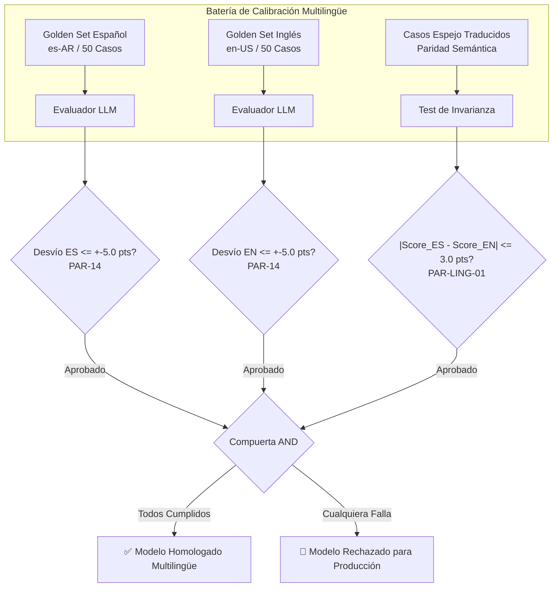

# 🌐 Plan de Mitigación Técnico - Punto 8
# Calibración Multilingüe e Invarianza de Rúbrica

## 1. Identificación y Referencias Normativas
* **Requerimientos Principales:**
  * `RF-IA-31`: Habilitación y Homologación de Modelos con Paridad Lingüística.
  * Sección 17 del PRD: "Internacionalización, Localización y Equidad Evaluativa".
  * `PAR-14`: Tolerancia Máxima de Desviación ($\pm 5.0$ puntos sobre 100).
* **Parámetro Específico:** `PAR-LING-01`: Umbral Máximo de Invarianza Semántica Inter-Lenguaje $\le 3.0$ puntos.

---

## 2. Diagnóstico del Problema y Justificación
Los modelos fundacionales de LLM (Gemini, Claude, GPT) presentan asimetrías debido a las diferencias de volumen en sus datos de pre-entrenamiento.
* **El Riesgo de Inequidad:** Si una materia ofrece desafíos o transcripciones en español y en inglés:
  1. El modelo podría calificar de forma más laxa o estricta una explicación conceptual en una lengua respecto a otra.
  2. Un modelo podría pasar la prueba del Golden Set en inglés pero desviarse severamente en español.

> [!IMPORTANT]
> **Principio de No Discriminación Lingüística (RF-IA-31 / Sec. 17):**
> Ningún modelo evaluador puede activarse en la plataforma si su rendimiento difiere significativamente entre los idiomas soportados. La calibración debe validarse **de forma aislada e independiente para cada locale**.



---

## 3. Requisitos Técnicos y Criterios de Aceptación

1. **Partición Estricta por Idioma:** Todo item del Golden Set debe poseer la etiqueta `idioma_codigo` (ISO 639-1 / BCP 47: `es-AR`, `en-US`, `pt-BR`).
2. **Evaluación de Deriva Independiente:**
   * Desviación absoluta promedio en Español: $\Delta_{\text{ES}} = |\text{Score}_{\text{LLM, ES}} - \text{Score}_{\text{Golden, ES}}| \le 5.0$.
   * Desviación absoluta promedio en Inglés: $\Delta_{\text{EN}} = |\text{Score}_{\text{LLM, EN}} - \text{Score}_{\text{Golden, EN}}| \le 5.0$.
3. **Test de Invarianza Semántica Translingüística (Pares Espejo):**
   * Se evalúan 20 transcripciones idénticas traducidas contextualmente.
   * La discrepancia media por par no debe exceder los 3.0 puntos:
     $$\frac{1}{N} \sum_{i=1}^{N} |\text{Score}_{\text{ES}, i} - \text{Score}_{\text{EN}, i}| \le 3.0$$

---

## 4. Modelos de Base de Datos (SQLAlchemy)

```python
# app/models/calibracion_multilingue.py
import enum
from datetime import datetime
from sqlalchemy import Column, Integer, String, Float, Boolean, DateTime, ForeignKey, JSON
from app.db.base_class import Base

class CalibracionMultilingueReporte(Base):
    __tablename__ = "calibraciones_multilingue_reportes"
    
    id = Column(Integer, primary_key=True, index=True)
    model_version_id = Column(String(100), nullable=False, index=True)
    
    desviacion_promedio_es = Column(Float, nullable=False)
    desviacion_promedio_en = Column(Float, nullable=False)
    desviacion_promedio_pt = Column(Float, nullable=True)
    
    score_invarianza_translingue = Column(Float, nullable=False) # Brecha media en casos espejo
    
    aprobado_es = Column(Boolean, nullable=False)
    aprobado_en = Column(Boolean, nullable=False)
    aprobado_invarianza = Column(Boolean, nullable=False)
    homologacion_global_aprobada = Column(Boolean, nullable=False)
    
    detalle_pares_espejo_json = Column(JSON, nullable=False)
    ejecutado_en = Column(DateTime, default=datetime.utcnow)
```

---

## 5. Servicio de Validación y Paridad Multilingüe

```python
# app/services/multilingual_calibration_service.py
from typing import List, Dict, Any
import statistics
from app.models.golden_set import GoldenSetItem
from app.models.calibracion_multilingue import CalibracionMultilingueReporte
from app.services.evaluator_service import EvaluatorService

PAR_14_TOLERANCIA_DESVIO = 5.0
PAR_LING_01_MAX_INVARIANZA = 3.0

class MultilingualCalibrationService:
    def __init__(self, evaluator_service: EvaluatorService):
        self.evaluator_service = evaluator_service

    async def execute_multilingual_benchmark(
        self,
        model_version: str,
        items_es: List[GoldenSetItem],
        items_en: List[GoldenSetItem],
        pares_espejo: List[Dict[str, Any]]
    ) -> CalibracionMultilingueReporte:
        # 1. Calibrar dataset Español
        desv_es = await self._calculate_language_drift(model_version, items_es)
        # 2. Calibrar dataset Inglés
        desv_en = await self._calculate_language_drift(model_version, items_en)

        # 3. Test de Invarianza en Casos Espejo
        brechas_espejo = []
        detalles_pares = []
        for par in pares_espejo:
            res_es = await self.evaluator_service.evaluate_transcript(par["transcripcion_es"], model_override=model_version)
            res_en = await self.evaluator_service.evaluate_transcript(par["transcripcion_en"], model_override=model_version)
            
            diff = abs(res_es.score_final - res_en.score_final)
            brechas_espejo.append(diff)
            detalles_pares.append({
                "par_id": par["id"],
                "score_es": res_es.score_final,
                "score_en": res_en.score_final,
                "brecha": round(diff, 2)
            })

        brecha_media = statistics.mean(brechas_espejo)

        aprob_es = desv_es <= PAR_14_TOLERANCIA_DESVIO
        aprob_en = desv_en <= PAR_14_TOLERANCIA_DESVIO
        aprob_inv = brecha_media <= PAR_LING_01_MAX_INVARIANZA
        homologado = aprob_es and aprob_en and aprob_inv

        return CalibracionMultilingueReporte(
            model_version_id=model_version,
            desviacion_promedio_es=round(desv_es, 2),
            desviacion_promedio_en=round(desv_en, 2),
            score_invarianza_translingue=round(brecha_media, 2),
            aprobado_es=aprob_es,
            aprobado_en=aprob_en,
            aprobado_invarianza=aprob_inv,
            homologacion_global_aprobada=homologado,
            detalle_pares_espejo_json=detalles_pares
        )

    async def _calculate_language_drift(self, model_version: str, items: List[GoldenSetItem]) -> float:
        desvios = []
        for item in items:
            res = await self.evaluator_service.evaluate_transcript(item.transcripcion_json, model_override=model_version)
            desvios.append(abs(res.score_final - item.score_humano_esperado))
        return statistics.mean(desvios) if desvios else 0.0
```

---

## 6. Adaptación de Prompts del Evaluador para Neutralidad de Idioma

El Evaluador Analítico incluye instrucciones explícitas para neutralizar el sesgo idiomático:

```python
# Directiva agregada al System Prompt del Evaluador:
PROMPT_NEUTRALIDAD_IDIOMATICA = """
<MULTILINGUAL_FAIRNESS_DIRECTIVE>
Debes evaluar con idéntico rigor y estándar conceptual independientemente de si la interacción,
las preguntas del estudiante o los comentarios del código están escritos en Español, Inglés o Portugués.
No penalices giros idiomáticos, regionalismos ni niveles de fluidez léxica. La evaluación se fundamenta
estrictamente en la lógica computacional, autonomía y pensamiento crítico.
</MULTILINGUAL_FAIRNESS_DIRECTIVE>
"""
```

---

## 7. Plan de Pruebas y Validación

1. **Test de Aprobación Multilingüe Plena (`test_multilingual_full_pass.py`):**
   - Ejecutar benchmark con $\Delta_{\text{ES}} = 3.2$, $\Delta_{\text{EN}} = 2.8$ y Brecha Espejo $= 1.5$ ➔ Verificar `homologacion_global_aprobada == True`.
2. **Test de Rechazo por Asimetría Lingüística (`test_multilingual_language_rejection.py`):**
   - Simular un modelo con $\Delta_{\text{EN}} = 2.0$ (Aprobado) pero $\Delta_{\text{ES}} = 6.4$ (Falla PAR-14) ➔ Verificar que el modelo quede **bloqueado para producción**.
3. **Test de Invarianza Semántica Translingüe (`test_semantic_invariance.py`):**
   - Evaluar un par espejo donde el modelo califica con 90 en inglés y 75 en español ($\text{brecha} = 15 > 3.0$) ➔ Verificar que falle la compuerta de invarianza.
