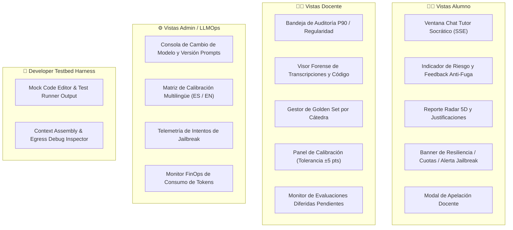

# 🖥️ Plan de Mitigación Técnico - Punto 9
# Arquitectura de Frontend, Vistas de Usuario y Workbench de Pruebas (Sección 15)

## 1. Identificación y Referencias Normativas
* **Requerimiento Principal:** Visualización, Operatividad y Pruebas Integrales de la Sección 15 del PRD.
* **Normativas Cubiertas:** `RF-IA-04` (Tutor Socrático), `RF-IA-10/13` (Telemetría de Jailbreak y Evaluación 5D), `RF-IA-17/18` (Auditoría Humana P90 y Apelaciones), `RF-IA-19` (Riesgo de Fuga), `RF-IA-22` (FinOps/Cuotas), `RF-IA-27` (Resiliencia y Cálculo Diferido), `RF-IA-30/30b/36` (Golden Set y Calibración), `RF-IA-31` (Invarianza Multilingüe), `RF-IA-33/34` (Trazabilidad y Bloqueo de Cursos).

---

## 2. Estrategia de Desacoplamiento: No Invadir Microservicios
Para no invadir las responsabilidades de otros microservicios (Ej. Runner de Código, Motor de Gamificación, Autenticación, Gestión de Cursos), el Frontend de IA se concibe bajo dos modalidades:
1. **Componentes Embebibles (SDK / UI Components en Angular):** Componentes visuales autónomos (Standalone Components con Signals) que reciben `@Input()`/@Output()` y consumen exclusivamente la API del Microservicio de IA.
2. **AI Developer Workbench & Testbed (Frontend Standalone en Angular):** Una aplicación frontend independiente desarrollada en **Angular (v18/v19+)** con Tailwind CSS / Angular Material que incluye un *Mock Harness* (simulador de código con Monaco Editor, logs de terminal, roles y tokens) para probar de punta a punta todo el backend de IA sin necesidad de levantar el resto de la plataforma.

---

## 3. Inventario Visual por Actor



---

## 4. Detalle de Componentes y Vistas

### 4.1. Vistas del Alumno (Experiencia en el IDE y Resultados)

#### 4.1.1. Ventana de Chat con el Tutor Socrático (`TutorChatWidget`)
* **Streaming en Vivo (SSE):** Conexión a `/api/v1/tutor/stream` con renderizado fluido tipo máquina de escribir y Markdown enriquecido (resaltado de sintaxis, bloques matemáticos).
* **Feedback de Egress Filter (Anti-Fuga):**
  * *Badge de Nivel de Riesgo del Desafío:* 🔴 Riesgo Alto (Guía 100% conceptual), 🟡 Medio (Guía algorítmica), 🟢 Bajo (Colaborativo).
  * *Notificación de Filtrado:* Si el modelo intenta emitir código restringido, la interfaz muestra un bloque estilizado: *«Pista socrática adaptada: se retiene el código para promover tu razonamiento autónomo»*.
* **Banners de Resiliencia y Control:**
  * *Modo Degradado / Resiliencia (HTTP 502/503/Timeout):* Banner ámbar no intrusivo: *«Asistente de IA en mantenimiento temporal. Puedes continuar programando normalmente.»*
  * *Alerta de Rate Limit / FinOps (HTTP 429 / 402):* Barra de progreso de cuota diaria consumida y cuenta regresiva de cooldown.
  * *Alerta de Intento de Manipulación (HTTP 400 `JAILBREAK_ATTEMPT`):* Mensaje de advertencia de seguridad con registro de infracción.

#### 4.1.2. Panel de Evaluación Analítica 5D (`AIEvaluationReport`)
* **Gráfico de Radar / Barras 5D:** Muestra las 5 dimensiones con sus ponderaciones:
  1. Autonomía y pensamiento crítico (30%)
  2. Claridad y especificidad de prompts (25%)
  3. Progresión e iteración lógica (20%)
  4. Cumplimiento de límites / Anti-Jailbreak (15%)
  5. Eficiencia de la interacción (10%)
* **Badge de Confianza y Estado:**
  * `Evaluación Definitiva (Confianza: 92%)`
  * `Pendiente Cálculo Diferido (Fallback Resiliencia)` (con spinner e ícono informativo)
  * `En Revisión Docente (Muestreo / P90)`
* **Explicabilidad Acordeón:** Justificación textual generada por el evaluador para cada dimensión.
* **Botón y Modal de Solicitud de Apelación:** Permite al alumno redactar un reclamo que se encola en la bandeja docente (`RF-IA-18`).

---

### 4.2. Vistas del Docente (Gestión Pedagógica y Auditoría)

#### 4.2.1. Bandeja de Auditoría P90 / Regularidad (`TeacherAuditQueue`)
* **Listado Filtrable:** Tabla con entregas que requieren supervisión (`requiere_auditoria_humana = True` por umbral P90, regularidad, baja confianza o muestreo del 10%).
* **Visor Forense Split-Screen:**
  * Panel Izquierdo: Chat completo Alumno-Tutor con snapshots de código en cada turno.
  * Panel Central: Puntuación propuesta por la IA y justificaciones.
  * Panel Derecho: Formulario de Override Docente con campo obligatorio `motivo_obligatorio` (auditado inmutablemente).

#### 4.2.2. Gestor de Golden Set y Calibrador de Cátedra (`CourseGoldenSetView`)
* **Editor de Transcripciones Golden:** Carga y edición de casos de prueba con sus scores canónicos esperados.
* **Botón «Ejecutar Calibración de Cátedra»:** Lanza la corrida y muestra la desviación ($\Delta \le \pm 5$ pts).
* **Indicador de Bloqueo de Curso:** Muestra si el curso está habilitado o bloqueado por calibración pendiente (`RF-IA-30b`).
* **Monitor de Diferidos:** Alerta visual que impide el cierre o archivado de curso si existen evaluaciones diferidas sin resolver (`RF-IA-34`).

---

### 4.3. Vistas de Administración y LLMOps

#### 4.3.1. Consola de Trazabilidad y Cambio de Modelo (`LLMOpsConsole`)
* **Selector de Modelo Activo:** Cambio entre Gemini, OpenAI y Claude con simulador de cohortes afectadas (`RF-IA-33`).
* **Matriz de Invarianza Multilingüe:** Comparador gráfico de desviaciones entre Español e Inglés (`RF-IA-31`).
* **Telemetría de Jailbreak en Tiempo Real:** Tabla con eventos detectados, severidad, payload crudo y sesión asociada.
* **Monitor FinOps de Tokens:** Gráfico de consumo de tokens por curso/cohorte y costos estimados.

---

## 5. El AI Developer Workbench (Harness Standalone para Testing)

Para que el equipo de desarrollo y QA pueda probar todos los endpoints del backend de IA sin desplegar el resto del sistema, la aplicación frontend incluye una barra superior de **Simulación de Contexto**:

```
+-----------------------------------------------------------------------------------------------+
| 🧪 AI DEVELOPER WORKBENCH | [Rol: Alumno v] [Riesgo: ALTO v] [Idioma: ES v] [Modelo: Gemini v]|
+------------------------------------+----------------------------------------------------------+
| 📝 MOCK CODE & SANDBOX HARNESS     | 💬 AI TUTOR / EVALUATOR TESTBED                          |
|                                    |                                                          |
| [Editor de Código Monaco / JS/PY]  | [Chat en tiempo real vía SSE]                            |
| def resolver():                    | > Tutor: ¡Hola! ¿Qué hipótesis tienes sobre el error?    |
|    return x + 1                    |                                                          |
|                                    | [Input Alumno...] [Enviar] [Inyectar Ataque Jailbreak]   |
| [Terminal / Mock Test Runner Logs] +----------------------------------------------------------+
| > Test 1: AssertionError at L12    | 🔍 DEBUGGER DE PAYLOADS & EGRESS                         |
| > Error: Expected 4 got 3          | • Raw Prompt Assembly (XML tags)                         |
|                                    | • Egress Filter: AST Diff (0% vs 70%)                    |
| [Botón: Simular Submit Entrega]    | • Token Usage: Prompt 320 | Completion 45                |
+------------------------------------+----------------------------------------------------------+
```

### Funciones del Workbench:
1. **Mock Code & Log Injector:** Permite pegar código y logs de error ficticios para verificar que el Tutor responda con anclaje a la realidad (`<investigate_before_answering>`).
2. **Jailbreak Preset Buttons:** Botones para disparar ataques conocidos (*DAN, Dev Mode, Base64, Prompt Leak*) y verificar el retorno HTTP 400 y la telemetría.
3. **Inspector de Ensamblado XML:** Muestra exactamente cómo el backend ensambla las etiquetas `<untrusted_student_input>`, `<previously_revealed_code>` y la rúbrica.
4. **Simulador de Fallas / Caídas:** Toggle para simular timeout o error 503 y verificar que el frontend degrade elegantemente al score neutro o badge de resiliencia.

---

## 6. Stack Tecnológico de Frontend (Angular)
* **Framework Principal:** **Angular (v18 / v19+)** con arquitectura de **Standalone Components**, control de flujo moderno (`@if`, `@for`, `@defer`) y reactividad granular mediante **Signals** (`signal()`, `computed()`, `effect()`).
* **Manejo de Estado y Reactividad:** Angular Signals + RxJS (`Observable`, `Subject`) para streams de eventos complejos.
* **Streaming Server-Sent Events (SSE):** Servicio Angular dedicado (`TutorStreamService`) utilizando `EventSource` nativo o `fetch-event-source` envuelto en un `Observable<string>` / `WritableSignal` para emitir los tokens del Tutor y procesar la respuesta socrática en tiempo real.
* **Editor de Código en Vivo:** `@monaco-editor/ngx` o `ngx-monaco-editor-v2` (Monaco Editor integrado para simular el IDE, resaltado de sintaxis, diff de código y bindings con signals).
* **Diseño y Componentes UI:** Tailwind CSS + Angular CDK / Angular Material o PrimeNG para diálogos modales, tooltips, tablas paginadas de auditoría y acordeones de explicabilidad.
* **Visualización y Gráficos:** `ng2-charts` (Chart.js wrapper para Angular) o `ngx-echarts` para renderizar el **Radar Chart 5D**, barras de calibración ($\Delta \pm 5$ pts) y telemetría de jailbreaks.
* **Renderizado de Markdown y Sintaxis:** `ngx-markdown` (con Prism.js / Highlight.js y KaTeX para renderizado de snippets de código y fórmulas matemáticas socráticas).
