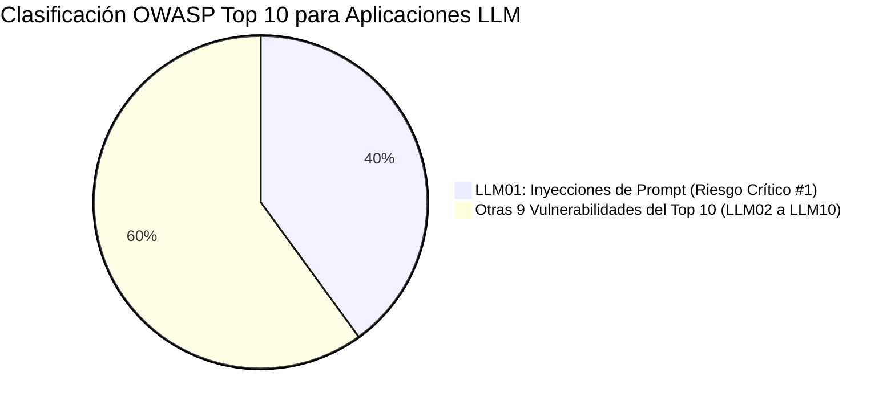
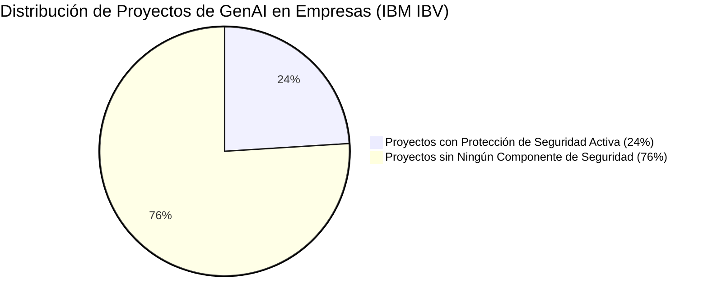
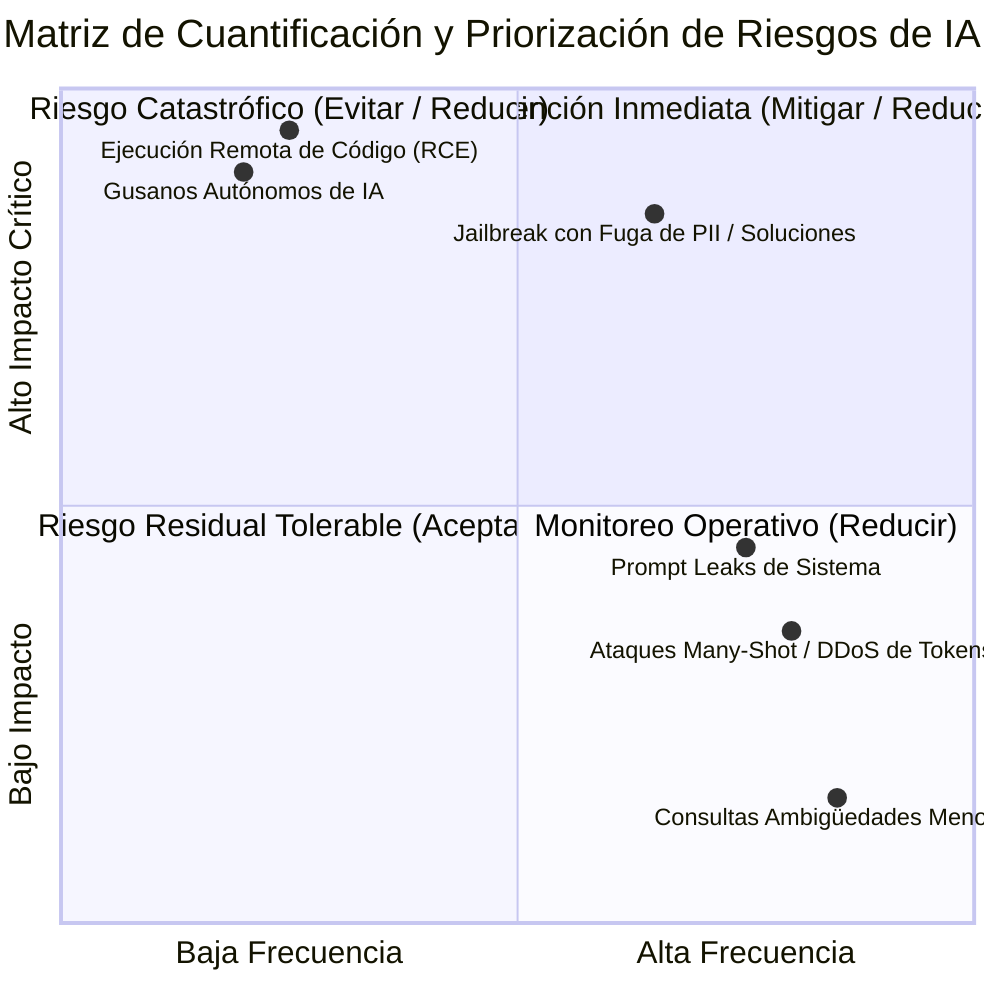

# 02: Estadísticas, Métricas, Cuantificación y Panorama de Riesgo Global

Este documento consolida el **100% de las métricas cuantitativas, estadísticas empíricas de compromiso, rankings de seguridad de la industria y marcos de cuantificación de riesgo** provistos por las investigaciones de **IBM**.

---

## 1. Posicionamiento Global de Amenazas: OWASP Top 10 para LLMs

El marco de seguridad de la fundación **OWASP (*Open Worldwide Application Security Project*)** clasifica a la **Inyección de Prompt como la vulnerabilidad de seguridad número uno (#1)** en aplicaciones impulsadas por modelos de lenguaje:

* **Identificador oficial:** **LLM01 - Prompt Injection**.
* **Gravedad:** Máxima prioridad de remediación debido a que afecta a la capa fundamental de interacción en lenguaje natural, sirviendo de catalizador para otras amenazas como Fuga de Datos Sensibles (*LLM06*), Ejecución de Plugins no Seguros (*LLM07*) y Fugas de Control de Acceso.

---

## 2. Métricas Empíricas de Ataque y Tiempos de Compromiso

Pruebas de penetración controladas y estudios empíricos analizados por IBM arrojan métricas alarmantes sobre la eficacia de los adversarios:

| Métrica de Ciberseguridad | Valor Reportado por IBM | Interpretación Operativa |
| :--- | :---: | :--- |
| **Tasa de éxito de ataques de jailbreak** | **20%** | 1 de cada 5 intentos de vulneración logra sortear el 100% de las defensas y guías éticas del modelo. |
| **Tiempo promedio para vulnerar el LLM** | **42 segundos** | Un atacante tarda menos de tres cuartos de minuto en comprometer el sistema. |
| **Número promedio de interacciones (turnos)** | **5 turnos** | En un diálogo de apenas 5 mensajes estructurados, el modelo cede ante la coerción. |
| **Tiempo récord de ruptura rápida** | **< 4 segundos** | En ataques directos optimizados, el filtro es superado instantáneamente en el primer turno. |
| **Tasa de fuga de datos en brechas exitosas** | **90%** | 9 de cada 10 ataques de jailbreak exitosos resultan en la **exfiltración directa de datos corporativos confidenciales**. |

---

## 3. Estado de la Seguridad en Proyectos de GenAI (IBM IBV)

El estudio del **IBM Institute for Business Value (IBV)** revela un profundo desbalance entre la velocidad de adopción y la protección activa en el entorno empresarial:

* **Conclusión del IBV:** Más de tres cuartas partes (**76%**) de las implementaciones corporativas de IA generativa operan actualmente sin salvaguardas de seguridad formales, exponiéndose a filtraciones masivas de propiedad intelectual y demandas regulatorias.

---

## 4. Impacto Financiero y Tendencias de Amenazas (Cost of a Data Breach 2026)

Los informes económicos y de inteligencia de amenazas de IBM evidencian el costo creciente de la inacción:

* **Costo Promedio Global de una Brecha de Datos:** **USD 4.99 Millones** por incidente (*IBM Cost of a Data Breach Report 2026*).
* **Incremento de Ciberataques Impulsados por IA:** Crecimiento interanual del **56%** en ataques orquestados mediante herramientas o agentes de inteligencia artificial (*IBM X-Force Threat Intelligence Index 2026*).
* **Continuidad del Negocio (*Business Continuity*):** Como advierte la guía de mitigación de riesgos de IBM, la falta de preparación ante incidentes inevitables puede transformar una falla menor en un colapso catastrófico que fuerce el cierre definitivo de la empresa.

---

## 5. Cuantificación y Niveles de Riesgo Aceptables (Risk Mitigation Framework)

La gestión de riesgos de IBM establece que las organizaciones deben clasificar y cuantificar sus riesgos bajo una matriz de **Severidad vs. Frecuencia** para determinar el **Nivel de Riesgo Aceptable (*Acceptable Level of Risk*)**:

### Conceptos Clave de Cuantificación:
1. **Riesgo Residual (*Residual Risk* o *"Leftover Risk"*):** Es el riesgo remanente inevitable que permanece después de aplicar todos los controles de mitigación y defensas en profundidad. El objetivo de la ingeniería no es el riesgo cero (imposible en sistemas no deterministas), sino reducir el riesgo a niveles tolerables sin destruir la utilidad del sistema.
2. **Línea Base de Referencia (*Reference Point*):** Umbral numérico acordado que define qué pérdida económica, tiempo de indisponibilidad o tasa de desvío es admisible para mantener la continuidad operacional.
3. **Métricas de Cumplimiento Regulatorio:** Métricas formales requeridas por marcos como la *EU AI Act* y auditorías de seguridad continua para garantizar que los modelos mantengan su alineación a lo largo del tiempo.

---

## 6. Reconocimientos y Evaluaciones de la Industria en GRC

Los análisis de IBM en materia de gobernanza, riesgo y cumplimiento (*Governance, Risk and Compliance* - GRC) cuentan con el respaldo de los principales evaluadores de tecnología del mundo:

* **Gartner® Magic Quadrant™ 2025 for GRC Tools, Assurance Leaders:** Reconoce a **IBM OpenPages** como Líder en la unificación y automatización de la gobernanza de riesgos corporativos e inteligencia artificial.
* **IDC 2025 SaaS CSAT Award Report for Financial GRC:** Calificación superior otorgada por clientes a IBM por valor, implementación, capacidades impulsadas por IA y seguridad de datos.
* **IDC MarketScape 2025 Worldwide GRC Software Vendor Assessment:** Destaca la capacidad de IBM para proporcionar funciones integrales y maduras de GRC transversal para grandes organizaciones.
* **Verdantix Green Quadrant:** Reconocimiento de soluciones de confiabilidad y digitalización de mantenimiento con visibilidad de riesgos en tiempo real.
