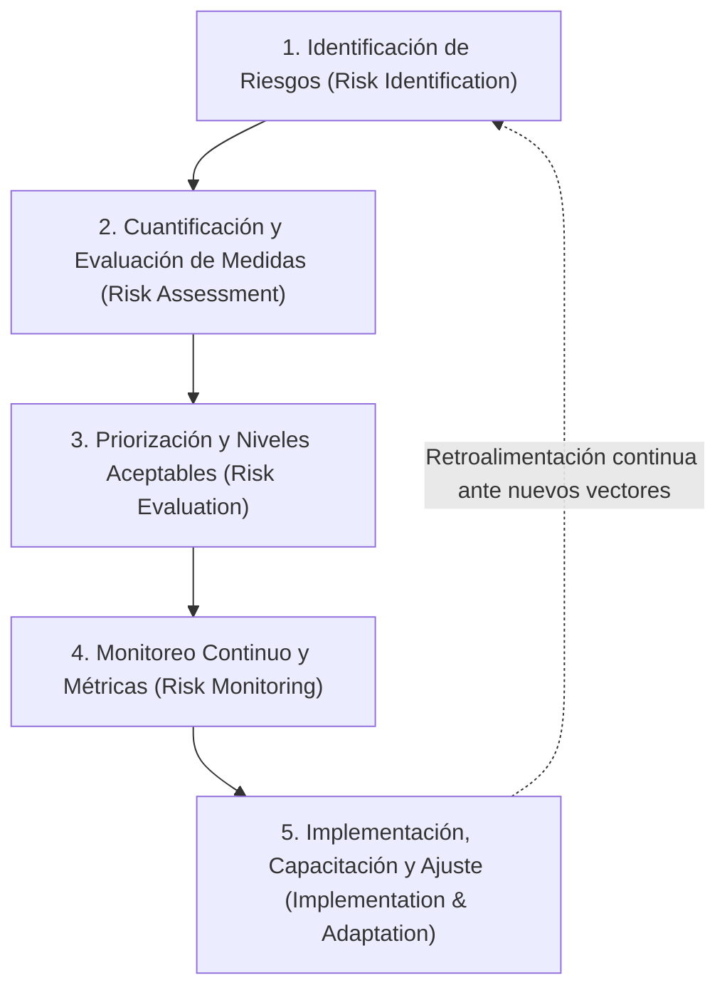
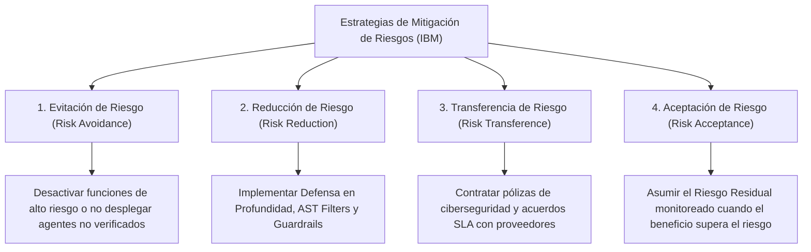
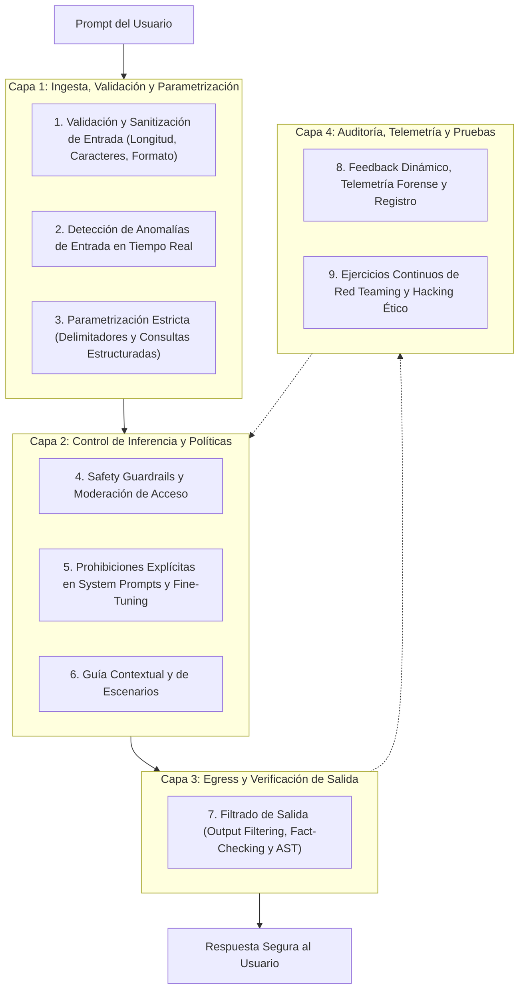

# 04: Estrategias de Mitigación, Ciclo de Gestión y Defensa en Profundidad

Este documento reúne el **100% de los marcos de mitigación de riesgos, ciclos metodológicos en 5 pasos, las 4 estrategias clásicas (4 T's) y las 9 capas técnicas de defensa en profundidad** detalladas en los informes de **IBM**.

---

## 1. Filosofía de Mitigación de Riesgos y Continuidad del Negocio

El informe de mitigación de riesgos de IBM define la mitigación como el proceso estratégico de **planificar y desarrollar opciones para reducir las amenazas a los objetivos organizacionales, disminuyendo el nivel de riesgo hasta niveles tolerables (*tolerable levels*)**.

### Principios Rectores:
1. **Inviabilidad del Riesgo Cero:** El objetivo de la mitigación de riesgos **no es eliminar el 100% de las amenazas** (lo cual es técnica y operacionalmente imposible en sistemas no deterministas como los LLMs), sino **planificar para incidentes inevitables y contener su impacto para preservar la continuidad del negocio (*business continuity*)**.
2. **Gestión del Riesgo Residual (*Residual Risk*):** Tras desplegar todas las contramedidas de seguridad, siempre existirá un "riesgo residual" o remanente. La organización debe monitorear y aceptar este riesgo dentro de límites estrictamente controlados.
3. **El Dilema de la Seguridad en LLMs:** Limitar excesivamente las entradas o salidas de un LLM puede degradar o anular las capacidades de adaptabilidad y comprensión del lenguaje natural que lo hacen útil. Además, **los propios detectores de inyecciones basados en IA son susceptibles a ser eludidos por inyecciones de prompt**. Por ello, se exige una arquitectura de capas superpuestas e independientes.

---

## 2. El Proceso de Mitigación de Riesgos en 5 Pasos (IBM)

IBM establece un ciclo estandarizado e iterativo para construir y mantener un plan de mitigación riguroso:

1. **Paso 1: Identificación de Riesgos (*Risk Identification*):**
   * Reconocimiento y evaluación de la presencia de amenazas de ciberseguridad (brechas de datos, inyecciones de prompt, jailbreaks, denegación de servicio de tokens).
   * Evaluación del impacto directo sobre operaciones, reputación, finanzas y usuarios.
2. **Paso 2: Evaluación y Cuantificación de Riesgos (*Risk Assessment & Quantification*):**
   * Establecimiento de niveles cuantitativos de riesgo para cada amenaza identificada.
   * Inspección exhaustiva de las medidas, procesos, filtros y controles existentes para estimar su capacidad real de contención.
3. **Paso 3: Evaluación y Priorización (*Risk Evaluation & Prioritization*):**
   * Comparación de severidad y consecuencias entre las diferentes amenazas.
   * Fijación formal del **Nivel de Riesgo Aceptable (*Acceptable Level of Risk*)**, sirviendo como línea base de referencia para dimensionar la asignación de recursos defensivos.
4. **Paso 4: Monitoreo Continuo (*Continuous Monitoring*):**
   * Seguimiento en tiempo real de las fluctuaciones en la severidad de los riesgos debido a la evolución de técnicas adversarias o cambios en el tráfico.
   * Mantenimiento de métricas rigurosas para asegurar el cumplimiento continuo con regulaciones vigentes (*EU AI Act*, ISO, SOC2).
5. **Paso 5: Implementación, Capacitación y Ajuste (*Implementation, Training & Adaptation*):**
   * Puesta en marcha de las salvaguardas técnicas en toda la infraestructura.
   * Capacitación continua de los equipos técnicos y operativos.
   * Auditorías regulares y **ajustes adaptativos** obligatorios cada vez que se detectan nuevas vulnerabilidades o varían las prioridades estratégicas.

---

## 3. Las Cuatro Estrategias Clásicas de Mitigación (Las 4 T's)

Frente a cada riesgo identificado en el ecosistema de IA, la organización debe aplicar una de las cuatro estrategias universales de mitigación:

1. **Evitación de Riesgo (*Risk Avoidance*):** Tomar la decisión de no ejecutar una acción o no implementar una función para evitar completamente la exposición al riesgo (ej. no permitir que un agente de IA ejecute código arbitrario en servidores de producción sin aislamiento físico).
2. **Reducción de Riesgo (*Risk Reduction / Mitigation*):** Diseñar e implementar controles tecnológicos y arquitectónicos para minimizar la probabilidad de ocurrencia o limitar la dispersión del daño (ej. filtros de entrada, análisis sintáctico AST, limitadores de tasa y minimización PII).
3. **Transferencia de Riesgo (*Risk Transference*):** Trasladar la carga financiera o legal del riesgo a un tercero (ej. pólizas de seguro de ciberriesgo que cubran costos derivados de brechas de datos o acuerdos de responsabilidad con proveedores cloud de LLM).
4. **Aceptación de Riesgo (*Risk Acceptance*):** Aceptar conscientemente la existencia del riesgo residual cuando el beneficio operacional o pedagógico supera con creces el riesgo potencial, manteniendo un monitoreo periódico dentro de un horizonte temporal acotado.

---

## 4. Principios Estratégicos Complementarios (IBM)

* **Principio de Mínimo Privilegio (*Principle of Least Privilege*):**
  * Conceder a los LLMs, agentes inteligentes y herramientas asociadas (APIs, funciones de base de datos) **únicamente los privilegios mínimos e indispensables** para cumplir su tarea.
  * *Impacto:* Aunque un atacante logre un jailbreak o una inyección de prompt, los privilegios restringidos del modelo impiden la exfiltración masiva de datos o el compromiso de la infraestructura (reducción del radio de impacto / *blast radius*).
* **Supervisión Humana (*Human in the Loop - HITL*):**
  * Obligatoriedad de verificación y autorización humana antes de que la IA ejecute acciones de alto impacto o irreversibles.
  * Práctica esencial no solo contra inyecciones de prompt, sino también para mitigar alucinaciones y errores lógicos del modelo.

---

## 5. Arquitectura de Defensa en Profundidad: Las 9 Capas Técnicas

### Detalle de las 9 Capas Técnicas:
1. **Safety Guardrails:** Moderación proactiva (bloqueo preventivo) y reactiva (interrupción ante abuso) con control de acceso por roles.
2. **Prohibiciones Explícitas (*Explicit Prohibitions*):** Directivas negativas tajantes en prompts y fine-tuning para fijar fronteras innegociables.
3. **Validación y Sanitización de Entrada:** Control de tipos, longitud máxima (anti Many-Shot) y depuración de caracteres de escape.
4. **Detección de Anomalías:** Monitoreo en tiempo real de desviaciones de comportamiento o variaciones estadísticas del lenguaje.
5. **Parametrización:** Aislamiento estructurado entre directivas del desarrollador y datos no confiables del usuario mediante formatos delimitados.
6. **Filtrado de Salida (*Output Filtering*):** Verificación de hechos (*fact-checking*), análisis de sensibilidad y análisis sintáctico de código para impedir fugas.
7. **Aprendizaje y Feedback Dinámico:** Registro forense estructurado y telemetría de fallos para el reentrenamiento y calibración continua.
8. **Guía Contextual y Basada en Escenarios:** Inyección de heurísticas y escenarios de toma de decisiones para guiar al modelo en dilemas éticos.
9. **Red Teaming:** Simulación sistemática y automatizada de ataques de jailbreak para auditar las defensas antes de su despliegue en producción.
