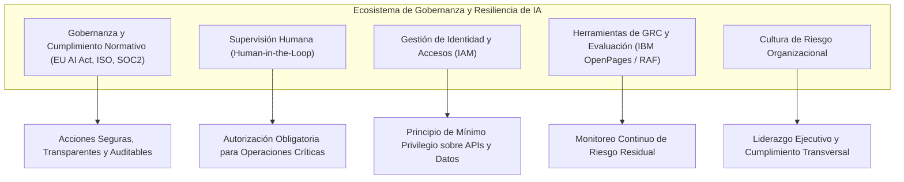
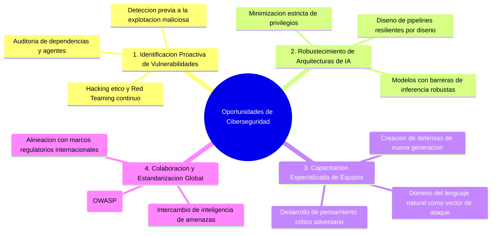

# 05: Frameworks, Gobernanza, Cultura de Riesgo y Oportunidades Defensivas

Este documento recopila el **100% de las directivas de gobernanza, plataformas GRC empresariales, mejores prácticas organizacionales y oportunidades estratégicas** detalladas en las investigaciones de **IBM**.

---

## 1. Gobernanza de IA y Supervisión Humana (*Human-in-the-Loop*)

El análisis de IBM establece que la seguridad en IA no es meramente un problema algorítmico, sino una disciplina integral de **gobernanza corporativa y gestión de riesgos (*Governance, Risk and Compliance* - GRC)**.

### Principios Fundamentales de Gobernanza:
1. **Supervisión Humana en Decisiones Críticas (*Human-in-the-Loop*):**
   * Exigir que operadores humanos verifiquen y aprueben las salidas de los modelos antes de que se ejecuten acciones de alto impacto (ej. calificaciones académicas determinantes, modificaciones en bases de datos o transferencias financieras).
2. **Preparación Regulatoria Internacional (*EU AI Act*):**
   * Establecer mecanismos transparentes, explicables y auditables para responder a los estándares legales internacionales exigidos para sistemas de IA clasificados de alto riesgo.
3. **Gestión de Identidad y Accesos (*Identity and Access Management* - IAM):**
   * Regular estrictamente qué usuarios, roles y aplicaciones tienen autorización para invocar determinados modelos, agentes o funciones de backend.

---

## 2. Las 4 Mejores Prácticas de Mitigación de Riesgos Organizacionales (IBM)

El informe de mitigación de riesgos de IBM detalla cuatro prácticas fundamentales para asegurar la efectividad operativa de cualquier plan de seguridad:

---

### 2.1. Mantener a los Interesados Informados (*Keep Stakeholders Informed*)
* La comunicación transparente y continua sobre los riesgos identificados debe fluir a través de toda la organización.
* Los riesgos clave con alto impacto organizacional (ej. vulnerabilidad a inyecciones de prompt o fugas de datos) deben ser monitoreados y comunicados claramente a todos los departamentos técnicos, legales y directivos.

---

### 2.2. Establecer una Sólida Cultura de Riesgo (*Establish a Strong Risk Culture*)
* La cultura de riesgo es el conjunto colectivo de valores, creencias y actitudes frente al riesgo que sostienen los miembros de una organización.
* **Liderazgo Ejecutivo:** La cultura de riesgo debe originarse y ser impulsada decididamente desde la **alta dirección (*executive level*)**. El compromiso con el cumplimiento, la seguridad y la ética no debe ser negociable y debe permear a todos los niveles de desarrollo y operación.

---

### 2.3. Desplegar Herramientas y Marcos de Evaluación de Riesgos (*Establish Risk Tools*)
* Implementación de **Marcos de Evaluación de Riesgos (*Risk Assessment Frameworks* - RAF)** y plataformas centralizadas de GRC.
* Estas herramientas automatizan el seguimiento cuantitativo de qué riesgos son altos o bajos, generando informes ejecutivos y técnicos para la toma de decisiones informada.

---

### 2.4. Realizar Evaluaciones de Riesgo Periódicas (*Conduct Regular Risk Assessments*)
* Mantener actualizado en todo momento el perfil de riesgo de la organización.
* Los líderes requieren datos, métricas y reportes vigentes para adaptar las defensas ante la aparición constante de nuevas técnicas de exploit en IA.

---

## 3. Ecosistema de Plataformas y Estándares de la Industria

IBM respalda sus metodologías en plataformas reconocidas como líderes mundiales por analistas independientes:

* **IBM OpenPages GRC Platform:**
  * *Reconocimientos:* Líder en el **2025 Gartner® Magic Quadrant™ for Governance, Risk and Compliance Tools (Assurance Leaders)**; galardonada en el **IDC 2025 SaaS CSAT Award Report for Financial GRC**; y posicionada en el **IDC MarketScape 2025 Worldwide GRC Software Vendor Assessment**.
  * *Función:* Unifica la gobernanza de riesgos, automatiza auditorías y proporciona visibilidad transversal en entornos cloud, locales e híbridos a través de *IBM Active Governance Services (AGS)*.
* **Gartner® Market Guide for AI TRiSM (*Trust, Risk and Security Management*):**
  * Marco para gestionar el inventario integral de modelos de IA, desplegar guardrails de seguridad activos y asegurar la confiabilidad en todos los casos de uso.
* **IBM watsonx.governance:**
  * Plataforma para dirigir, gestionar y monitorizar el ciclo de vida de los modelos generativos, acelerando la transparencia, la explicabilidad y el control de derivas (*drift*).
* **IBM Guardium Data Protection:**
  * Solución líder (*KuppingerCole Data Security Platforms* y estudio *Forrester Total Economic Impact - TEI*) para la protección de datos sensibles y cumplimiento de privacidad a lo largo de todo el ciclo de vida del dato.

---

## 4. El Jailbreak y las Inyecciones de Prompt como Oportunidad Estratégica

IBM enfatiza que el análisis profundo de estas amenazas no debe abordarse desde una postura reactiva de temor, sino como una **oportunidad de excelencia en ciberseguridad**:

1. **Identificación Proactiva (*Ethical Hacking*):** Simular ataques de inyección y jailbreak en fases de desarrollo permite parchar vulnerabilidades antes de que adversarios las exploten en producción.
2. **Robustecimiento de la Seguridad de la IA:** Comprender la colisión de formatos y las técnicas multironda impulsa el desarrollo de mejores técnicas de parametrización y filtros sintácticos.
3. **Capacitación y Mentalidad de Ciberseguridad:** Familiarizar a los desarrolladores con el hecho de que *"el lenguaje natural es ahora un vector de ataque"* (Chenta Lee) transforma la cultura de programación hacia modelos más seguros.
4. **Fomento de la Colaboración:** Promueve la adopción de estándares abiertos como el OWASP Top 10 for LLMs y la colaboración interdisciplinaria entre ingenieros de IA, especialistas en seguridad y organismos reguladores.
