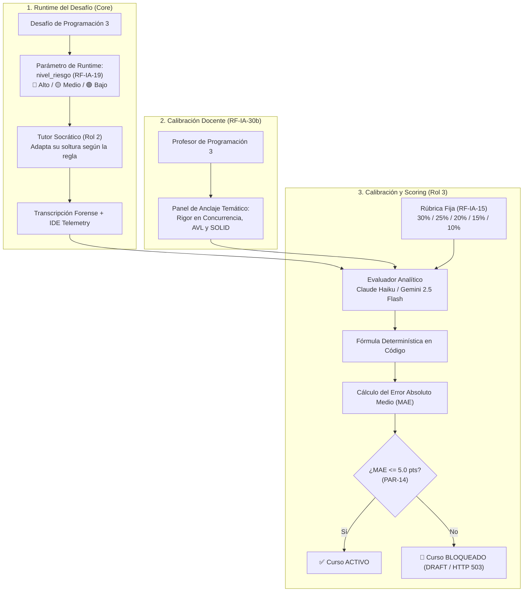

# 🌟 Demo Interactiva: Golden Set, Niveles de Riesgo (RF-IA-19) y Calibración Docente (RF-IA-30b)

> **Cátedra:** Programación III (Back End y Algoritmos Avanzados) · UTN FRC  
> **Área:** Capa de Inteligencia Artificial, Scoring Híbrido Determinístico y LLMOps  
> **Requerimientos PRD:** `RF-IA-13`, `RF-IA-15`, `RF-IA-19`, `RF-IA-20`, `RF-IA-29`, `RF-IA-30b`, `RF-IA-36` y `PAR-14`

Esta aplicación web interactiva demuestra en tiempo real el funcionamiento del **Golden Set docente**, el **Scoring Híbrido en 5 Dimensiones**, la **modulación de respuestas según el Nivel de Riesgo del Desafío (`RF-IA-19`)**, el **Panel de Anclaje Temático de Cátedra (`RF-IA-30b`)** y el **Disyuntor de Deriva (*Circuit Breaker*) de PAR-14**.

---

## 🏛️ Conceptos y Separación de Responsabilidades



---

## 🎯 Las Dos Secciones de la Demo

### 1. 🔍 Modo Debug Paso a Paso (Telemetría LLMOps)
Visualizador estilo *debugger* que muestra la ejecución interna del pipeline a través de **6 pasos secuenciales**:
1. **Paso 1 (Ingesta del Lote Golden Set):** Carga de 10 casos patrón con metadata de riesgo (`RF-IA-19`) y *ground-truth* docente.
2. **Paso 2 (Extracción Determinística en Código):** Extracción algorítmica sin LLM (ediciones previas, ejecuciones en IDE, conteo de turnos y filtros AST). Representa el **45% al 60%** de la rúbrica objetiva.
3. **Paso 3 (Inferencia Semántica LLM):** Evaluación cualitativa estricta ($T=0.00$, $\text{Seed}=42$) adaptada a las directivas de cátedra (`RF-IA-30b`) y validada con Pydantic v2.
4. **Paso 4 (Fusión Ponderada RF-IA-15):** Aplicación de la fórmula matemática oficial en código:
   $$\text{Score Final} = (D_1 \times 0.30) + (D_2 \times 0.25) + (D_3 \times 0.20) + (D_4 \times 0.15) + (D_5 \times 0.10)$$
5. **Paso 5 (Análisis de Desviación & MAE):** Comparación vectorial y cálculo del Error Absoluto Medio ($\text{MAE} = \frac{1}{N}\sum |\text{Score}_{\text{IA}} - \text{Score}_{\text{Docente}}|$).
6. **Paso 6 (Disyuntor de Deriva PAR-14):** Evaluación del umbral de $\pm 5.0$ puntos.
   - Si $\text{MAE} \le 5.0\text{ pts} \implies$ ✅ **CALIBRACIÓN APROBADA** (Curso `ACTIVE`).
   - Si $\text{MAE} > 5.0\text{ pts} \implies$ 🚨 **CIRCUIT BREAKER DISPARADO** (Curso `BLOQUEADO EN DRAFT` con `HTTP 503`).

---

### 2. 🎛️ Calibrador Interactivo con IA Real
Permite al docente experimentar en vivo con modelos reales de **Google Gemini**:
* **Panel de Calibración Docente y Anclaje Temático (`RF-IA-30b`):**
  * Ajuste de directivas de rigor conceptual para cada una de las 5 dimensiones.
  * Presets rápidos: *Estándar UTN*, *Alta Exigencia (Exámenes)* y *Formativo*.
  * Los pesos de plataforma (30%, 25%, 20%, 15%, 10%) permanecen bloqueados para asegurar consistencia transversal.
* **Niveles de Riesgo del Desafío (`RF-IA-19`):**
  * 🔴 **Riesgo Alto:** Exámenes cerrados (Completado de bloques / Encuentra el bug). Tutor puramente socrático.
  * 🟡 **Riesgo Medio:** Prácticos algorítmicos (Algoritmos con tests / Refactorización). Tutor conceptual.
  * 🟢 **Riesgo Bajo:** Evaluaciones de diseño (Code Review / Hackathon). Mayor libertad conversacional.
* **Evaluación en Tiempo Real y Radar 5D:** Gráfico radial (HTML5 Canvas) que compara el perfil docente vs el modelo de IA.
* **Calibración Lote Completo (Batch):** Ejecución masiva sobre los casos con barra de progreso, cálculo de MAE general y veredicto del estado del curso.

---

## 📊 La Rúbrica Oficial de 5 Dimensiones (RF-IA-15)

| Dimensión | Peso Plataforma | Qué Evalúa | Anclaje Temático Docente (RF-IA-30b) |
|---|---|---|---|
| **1. Autonomía y Pensamiento Crítico** | **🔒 30%** | Si el alumno investiga antes de consultar y valida hipótesis. | Exigir formulación de hipótesis técnicas y trade-offs de concurrencia/complejidad. |
| **2. Claridad de Prompts** | **🔒 25%** | Especificidad al formular problemas de ingeniería. | Exigir código relevante, contexto y stack trace exacto del error. |
| **3. Progresión Lógica** | **🔒 20%** | Construcción acumulativa sobre las pistas del tutor. | Exigir que el alumno reporte qué ocurrió tras aplicar la sugerencia antes de consultar de nuevo. |
| **4. Cumplimiento de Límites** | **🔒 15%** | Respeto a los guardarraíles según el nivel de riesgo (`RF-IA-19`). | Tolerancia cero a pedidos de código en Riesgo Alto; permitir diálogo de diseño en Riesgo Bajo. |
| **5. Eficiencia de Interacción** | **🔒 10%** | Densidad informativa y relación señal/ruido. | Priorizar mensajes con sustancia técnica; penalizar ráfagas de mensajes vacíos. |

---

## 🚀 Cómo Iniciar la Demo

### Método 1: Doble Clic Directo (100% Offline, sin servidor)
Abre el archivo `index.html` directamente en tu navegador web (Chrome, Edge, Firefox, Safari).

### Método 2: Con Servidor Node.js
```bash
cd "/Users/rcoleman/Documents/TPI_4to_semestre/Doc-Tpi-Programacion/Demos/Golden Set"
node server.js 3001
```
Luego accede a: **[http://localhost:3001](http://localhost:3001)**

---

## 🔑 Cómo Configurar tu API Key de Gemini

1. Ingresa a **[Google AI Studio](https://aistudio.google.com/)** y genera tu clave gratuita.
2. En la demo, pestaña **"Calibrador Interactivo Real"**, pega tu clave en el campo superior y presiona **"Guardar"**.
3. Presiona **"Probar"** para validar la conectividad antes de evaluar.

---

## ⌨️ Atajos de Teclado

* `1`: Ir a **Modo Debug Paso a Paso**
* `2`: Ir a **Calibrador Interactivo Real**
* `3`: Ver la **Rúbrica Oficial y Criterios 5D**
* `Espacio`: Pausar / Reanudar el *Auto-Play* en el Modo Debug
* `→` / `←`: Avanzar o retroceder pasos de depuración
* `Esc`: Cerrar modales
