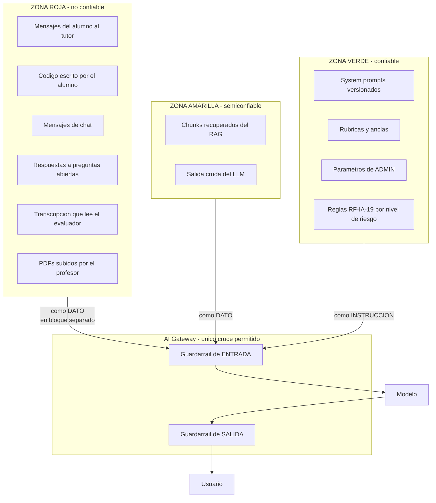
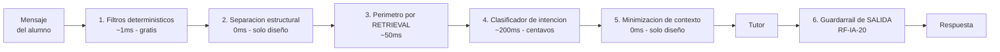
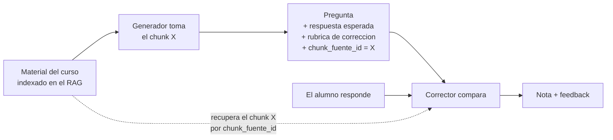
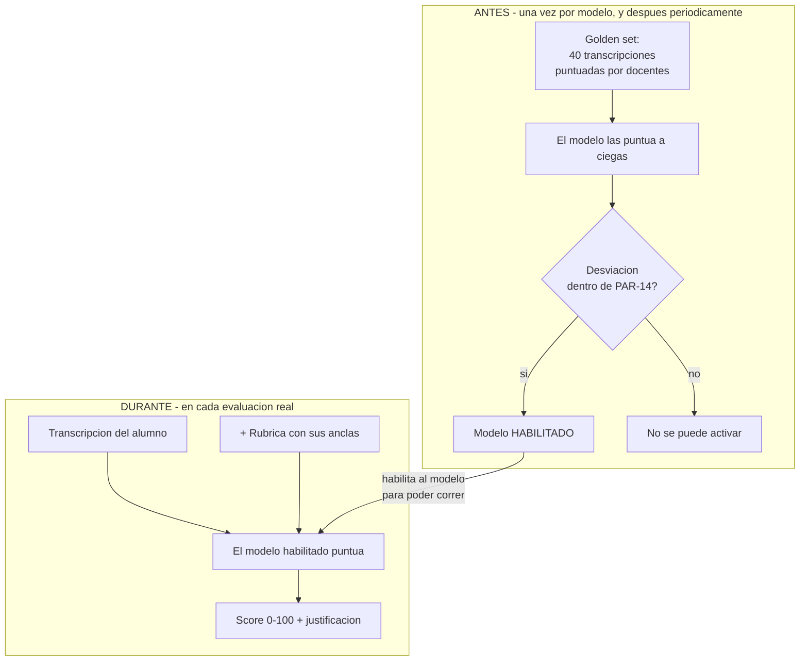
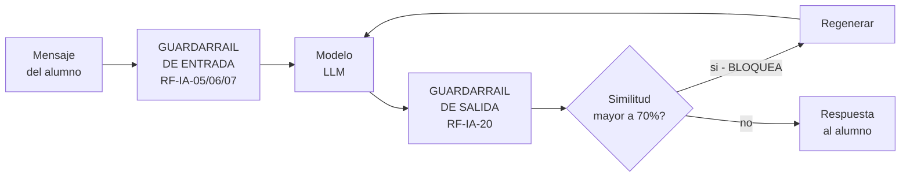

# 05 — Seguridad: prompt injection, fuga y guardarraíles

> **Perímetro técnico vigente.** Los guardarraíles viven en `llm-service`, expuesto solo por Gateway bajo `/api/llm/**`. La identidad y correlación confiables son las declaradas en [00](00-fuentes-de-verdad-y-convenciones.md).

> Fronteras de confianza, defensa en capas, y de dónde sale cada nota. *Consolida los antiguos 06 y 18.*

---

# Parte A — Prompt injection y fuga

Los dos riesgos que marcaste. El PRD los tiene registrados como riesgos **Altos**: RSK-09 (fuga de
solución) y los requerimientos RF-IA-07, RF-IA-10, RF-IA-14, RF-IA-20.

## 1. El principio que ordena todo

> **Todo texto que viene de un usuario es DATO. Nunca es una instrucción.**

Suena obvio y sin embargo es la causa del 90% de los problemas, porque el error se comete al escribir
el prompt: `f"Sos un tutor. El alumno pregunta: {mensaje}"`. En esa línea el mensaje del alumno y tu
instrucción quedaron **en el mismo plano**. El modelo no tiene forma de distinguirlos.

La solución no es "escribir un prompt más firme". Es **estructural**: instrucciones y datos viajan en
lugares distintos, y los datos van marcados como no confiables.

## 2. Mapa de fronteras de confianza

**La zona amarilla merece atención.** Los chunks del RAG parecen confiables porque los subió el
profesor — pero un PDF puede contener texto que el modelo lea como instrucción, sea por accidente
(un apunte que literalmente dice "ignorá las instrucciones anteriores" como ejemplo de un ataque) o
a propósito. **Los chunks recuperados entran como dato, igual que el mensaje del alumno.**

## 3. Defensa en capas contra prompt injection

Ninguna capa alcanza sola. Cinco capas, de más barata a más cara:

### Capa 1 — Filtros determinísticos (RF-IA-05)

Regex y heurísticas para lo evidente: frases tipo "ignorá las instrucciones anteriores", "actuá
como", "modo desarrollador", intentos de delimitadores falsos, base64 sospechoso (que RF-CHT-10 pide
explícitamente detectar), longitud anómala.

**No atrapa a nadie inteligente, pero es gratis y saca el ruido.** Su valor real es que no gasta ni
tokens ni latencia.

### Capa 2 — Separación estructural (la más importante)

El mensaje del alumno **nunca** se concatena dentro de la instrucción. Va como un bloque de contenido
separado, con marcadores, y la instrucción del sistema dice explícitamente qué hacer con él.

Esta capa **no cuesta nada** — es solo cómo armás el pedido — y es la que más ataques frena.

### Capa 3 — Perímetro temático por retrieval (RF-IA-06)

Este es el truco que más rinde y casi nadie usa.

RF-IA-06 dice: *"el modelo opera solo dentro del perímetro temático del curso"*. El reflejo es
escribirlo en el system prompt: "solo respondé sobre temas del curso". **Eso se puede sortear
hablando.**

La versión robusta: **el perímetro lo hace cumplir el retrieval, no el prompt.**

1. Toda consulta al tutor recupera chunks del curso, **filtrando por `curso_id` en el servidor**.
2. Si nada supera un piso de similitud, no hay contexto que darle al modelo.
3. Sin contexto, el tutor responde "esto está fuera del alcance del curso" — y esa decisión la tomó
   **tu código**, no el modelo.

**Ventaja decisiva:** es determinístico. No hay prompt que lo convenza, porque no hay modelo
involucrado en la decisión. Y de paso aísla cursos entre sí: un alumno de curso A no puede sacar
contenido del curso B ni pidiéndolo bien.

> **Regla:** el filtro `curso_id` se arma **en el servidor a partir de la sesión**, jamás con un
> parámetro que mande el cliente. Un `curso_id` que viene del navegador es un `curso_id` que el
> alumno puede cambiar.

### Capa 4 — Clasificador de intención

Una llamada barata a un modelo chico que clasifica el mensaje: `legítimo | pide_solución |
fuera_de_tema | ofensivo | jailbreak`.

**El problema es la latencia:** si corre antes del tutor, sumás una ida y vuelta completa al camino
crítico. Dos formas de resolverlo:

| Opción | Cómo | Costo en latencia |
|---|---|---|
| Secuencial | Clasificar, después llamar al tutor | +200-400 ms **antes** de empezar |
| **En paralelo** ✅ | Disparar clasificador y tutor a la vez; **retener la respuesta** hasta que el clasificador conteste | ~0, porque el clasificador es más rápido que el tutor |

**Usá la paralela.** Como el guardarraíl de salida (capa 6) ya obliga a retener la respuesta antes de
mostrarla, retenerla también para el clasificador **no cuesta nada adicional**. Las dos restricciones
se pagan con la misma moneda.

### Capa 5 — Minimización de contexto (la defensa definitiva)

> **El tutor no puede filtrar lo que no tiene.**

Es la defensa más fuerte contra RF-IA-04 y RSK-09, y es puramente de diseño:

| Qué | ¿Va al contexto del tutor? |
|---|---|
| Enunciado del desafío | ✅ Sí |
| Código actual del alumno | ✅ Sí |
| Teoría del curso (chunks RAG) | ✅ Sí |
| Reglas de RF-IA-19 según el nivel de riesgo del desafío | ✅ Sí |
| **Solución de referencia** | ❌ **NUNCA** |
| **Tests ocultos** | ❌ **NUNCA** |
| **Respuestas esperadas de teóricos** | ❌ **NUNCA** |

Ningún jailbreak puede extraer del modelo algo que el modelo no vio.

**El detalle que resuelve la aparente contradicción con RF-IA-20:** ese requerimiento pide comparar la
respuesta del tutor contra el código esperado. Pero **esa comparación la hace el guardarraíl de
salida, en tu código, fuera del contexto del modelo.** La solución de referencia vive en el
gateway; nunca entra en un prompt.

### Capa 6 — Guardarraíl de salida anti-fuga (RF-IA-20)

Antes de mostrar cualquier respuesta del tutor en un desafío práctico:

1. Extraer el código que la IA haya propuesto (si hay).
2. Normalizarlo: renombrar variables, sacar comentarios y formato. **Comparación de AST cuando el
   lenguaje lo permite** — es mucho más robusta que comparar texto, porque atrapa la misma solución
   con nombres distintos, que es exactamente lo que RF-IA-19 prohíbe ("ni con nombres de variables
   distintos si el contexto es identificable").
3. Comparar contra la solución esperada.
4. Si la similitud supera **PAR-11 (default 70%)** → **bloquear y regenerar**. Nunca mostrar.

### 🔴 La consecuencia de UX que hay que ver ahora, no en marzo

**RF-IA-20 hace imposible el streaming token a token en desafíos prácticos.**

No podés bloquear una respuesta que el alumno ya está leyendo. La lógica es inescapable: para
comparar, necesitás la respuesta completa; para tenerla completa, no la mostraste.

Tres opciones, con su costo:

| Opción | Cómo se ve | Costo |
|---|---|---|
| **Sin streaming** en prácticos | Indicador de "pensando" y después la respuesta entera | Latencia percibida alta. Es lo más simple y lo más seguro |
| **Streaming con retención selectiva** ✅ | Se transmite la prosa; los bloques de código se retienen hasta validar | Complejo de implementar, buena UX |
| **Streaming a un buffer invisible** | Se transmite internamente, se valida, se revela de golpe | Igual que "sin streaming" para el usuario, pero el backend arranca antes |

**Recomendación:** arrancá sin streaming en desafíos prácticos y **compensá con velocidad de modelo**
(por eso el tutor va en un modelo rápido — ver [03](03-modelos-costos-y-contexto.md)). El streaming con
retención selectiva es una mejora de Fase 2, no del MVP.

En desafíos de **riesgo bajo** (hackathon, code review — RF-IA-19) sí podés hacer streaming pleno,
porque ahí no hay una única solución correcta contra la cual comparar.

## 4. Fuga de información: los cinco canales

"Fuga" acá tiene cinco significados distintos y cada uno tiene su defensa.

### Canal 1 — Fuga de la solución al alumno (RSK-09, riesgo Alto)

Ya cubierto: minimización de contexto (capa 5) + guardarraíl de salida (capa 6) + reglas
diferenciadas por nivel de riesgo (RF-IA-19).

Las tres reglas de RF-IA-19, resumidas:

| Nivel | Desafíos | Qué puede hacer la IA |
|---|---|---|
| **Alto** | Completado de bloques, Encuentra el bug | Solo: explicar en palabras qué debería lograr, preguntas socráticas, estrategia de debugging, señalar la *naturaleza* del error. **Nunca la línea exacta ni la corrección** |
| **Medio** | Algoritmos con tests, refactorización, modelado | Enfoques conceptuales, documentación, buenas prácticas. Sin código ni pseudocódigo tan específico que equivalga a dictarla |
| **Bajo** | Hackathon, code review | Mayor libertad conversacional |

**Implementación:** el nivel de riesgo es un atributo del tipo de desafío, y determina **qué reglas se
inyectan** en el prompt del tutor y **qué umbral** usa el guardarraíl de salida. Es configuración de
plataforma versionada junto con la rúbrica (RF-IA-21), no por curso.

### Canal 2 — Fuga entre alumnos

- Aislamiento por `curso_id` en el retrieval, resuelto en el servidor (capa 3).
- Aislamiento por `usuario_id` en el historial de conversación.
- El moderador de chat detecta **intento de compartir soluciones** — está listado explícitamente en
  RF-CHT-10.
- Ninguna respuesta del tutor se cachea ni se comparte entre alumnos.

### Canal 3 — Fuga hacia el proveedor de LLM

Es la que tiene consecuencias legales. RF-NFR-09 obliga a declarar en los T&C **qué proveedores están
en uso y que a ellos se envían las consultas y el código del alumno**. RSK-01 y la Ley 25.326 quedan
como riesgo abierto.

Mitigaciones concretas:

| Medida | Efecto |
|---|---|
| **Enviar solo lo mínimo** | Nunca mandes nombre, legajo, email ni ranking. El modelo no los necesita para tutorear ni para corregir |
| **Corregir a ciegas** | El corrector no sabe de quién es la respuesta. Menos PII y menos sesgo, de un tiro |
| **Seudonimizar identificadores** | Si necesitás un id en el prompt, que sea opaco y de un solo uso |
| **Registrar qué se envió y a quién** | RF-NFR-09 exige transparencia; sin log no la podés demostrar |
| **Verificar la política de retención del proveedor** | Y en particular **la del free tier**, que suele permitir entrenar con tus datos. Ver [03](03-modelos-costos-y-contexto.md) §4b |
| **Modelo local para lo sensible** | La única mitigación que elimina el canal en vez de acotarlo |

### Canal 4 — Fuga del prompt del sistema

Un alumno que extrae el system prompt aprende cómo evadirlo, y RF-IA-16 pide explícitamente **no
exponer el prompt interno del evaluador ni técnicas de gaming explotables**.

Defensas: no poner secretos en el prompt (el prompt no es un lugar seguro, nunca), y detectar en el
guardarraíl de salida si la respuesta contiene fragmentos literales del system prompt.

**Y una precisión importante:** asumí que el prompt es extraíble. Diseñá para que **saberlo no
sirva de nada**. Si el perímetro lo hace el retrieval y la fuga la frena el guardarraíl de salida,
conocer el prompt no le da al alumno ninguna ventaja.

### Canal 5 — Fuga por el RAG

Si el índice mezcla cursos, o guarda material del profesor que no debía ser visible (soluciones,
parciales viejos), el tutor lo va a recuperar tarde o temprano.

- Namespace por curso, filtro en servidor.
- **Marcar los documentos con nivel de visibilidad** en la ingesta: material del alumno vs material
  docente. Las soluciones **no se indexan en el mismo espacio** que la teoría.
- Un parcial generado no se indexa hasta después de tomarse.

## 5. Jailbreak: qué hacer cuando pasa (RF-IA-10)

El PRD es específico y conviene seguirlo al pie:

| Regla | Qué significa |
|---|---|
| **Bloqueo silencioso** | El tutor rechaza con un mensaje genérico, **sin explicar el mecanismo de detección** — para no enseñar a evadirlo. Mismo principio que RF-CHT-12 en el chat |
| **Cada intento es un incidente** | **No hay umbral de tolerancia.** Uno solo ya genera incidente |
| **Visible al profesor** | En su dashboard, con la transcripción del intento |
| **Cuenta 15% en la rúbrica** | Dimensión "cumplimiento de límites" (RF-IA-15). **No anula el bonus** — fue evaluado y descartado por el PO |

Diseñá el mensaje genérico de rechazo **una sola vez** y usalo para todos los casos. Si el mensaje
varía según el motivo, el alumno aprende a mapear el detector probando.

## 6. Checklist de seguridad

Para ir tachando:

**Entrada**
- [ ] Ningún texto de usuario se concatena dentro de una instrucción del sistema
- [ ] Los chunks del RAG entran como dato, no como instrucción
- [ ] Filtros determinísticos antes de gastar tokens
- [ ] Clasificador de intención en paralelo, no secuencial
- [ ] `curso_id` y `usuario_id` se derivan de la sesión, nunca del cliente
- [ ] Límites de uso por usuario aplicados antes de llamar al proveedor (RF-IA-22)

**Contexto**
- [ ] La solución de referencia **jamás** entra al prompt del tutor
- [ ] Los tests ocultos **jamás** entran al prompt del tutor
- [ ] Sin PII en los prompts: ni nombre, ni legajo, ni email
- [ ] El corrector trabaja a ciegas de la identidad

**Salida**
- [ ] Comparación de similitud contra la solución antes de mostrar (RF-IA-20)
- [ ] Comparación por AST donde el lenguaje lo permita
- [ ] Bloqueo + regeneración, nunca mostrar y después arrepentirse
- [ ] Detección de fragmentos del system prompt en la respuesta
- [ ] Validación de schema en toda salida estructurada

**Evaluador**
- [ ] La transcripción viaja como bloque de datos marcado
- [ ] El evaluador no tiene ninguna herramienta ni acceso a nada
- [ ] Intento de injection detectado = incidente + señal para la dimensión de límites
- [ ] Rangos de la salida validados contra el schema

**Auditoría**
- [ ] Toda interacción registrada con metadata (RF-IA-02)
- [ ] Todo incidente de jailbreak con su transcripción (RF-IA-10)
- [ ] Todo override de score auditado (RF-IA-18)
- [ ] Log de qué datos se enviaron a qué proveedor (RF-NFR-09)

---

# Parte B — Fuentes de verdad y dónde corre cada guardarraíl

> De dónde sale cada nota, qué rol cumple el golden set, y en qué punto exacto del flujo corre la
> salvaguarda anti-fuga.

## 1. Hay tres notas distintas y cada una tiene su fuente

| Nota | Qué mide | Su fuente de verdad |
|---|---|---|
| **Nota del parcial** | Si la respuesta está bien | La respuesta esperada + la rúbrica de esa pregunta, **más el chunk del que salió la pregunta** |
| **Score de uso de IA** (0-100) | Cómo el alumno usó al tutor | La rúbrica de 5 dimensiones con sus anclas |
| **XP final** | Progreso académico | La calcula el Tema 10, no vos. Combina XP base + calidad + tiempo + tu score |

**No las mezcles.** La primera la produce el corrector; la segunda, el evaluador; la tercera no es tuya.

## 2. La corrección sí usa el RAG — pero de una forma específica

**Corrección de la observación anterior.** En un intercambio previo dije que el corrector no usa el
RAG. Es más preciso decir esto:

> **El RAG es la fuente de verdad última, porque la pregunta se generó desde ahí. Pero al corregir
> no se hace una búsqueda nueva: se usa el chunk exacto del que salió la pregunta.**

### Cómo funciona la cadena

### Por qué el chunk trazado y no una búsqueda libre

| | Chunk trazado ✅ | Búsqueda libre en el RAG ❌ |
|---|---|---|
| Qué recupera | Exactamente el fragmento del que nació la pregunta | Lo que más se parezca a la respuesta *del alumno* |
| Riesgo | Ninguno | **Si el alumno responde algo de otro tema, la búsqueda le trae material que respalda su error** |
| Costo | Una lectura por id | Una búsqueda vectorial por corrección |
| Determinismo | Total | Depende del texto del alumno |

Ese riesgo del medio es el que lo decide: una búsqueda guiada por la respuesta del alumno **encuentra
lo que el alumno dijo, no lo que la pregunta evaluaba**.

### Para qué sirve tener el chunk a mano

El caso que lo justifica: **el alumno da una respuesta válida que la rúbrica no previó.** Sin el
fragmento fuente, el corrector la marca mal porque no coincide con la esperada. Con el fragmento, puede
verificar que está respaldada por el material y aceptarla.

Es la diferencia entre corregir contra una plantilla y corregir contra el contenido.

## 3. El golden set NO participa de ninguna nota individual

**Corrección importante.** El golden set no es un insumo de la corrección ni del scoring de un alumno.

| | Golden set | Rúbrica |
|---|---|---|
| Cuándo se usa | **Antes**, para habilitar el modelo. Y periódicamente, para detectar deriva | **En cada** evaluación |
| Contra qué | Transcripciones ya puntuadas por docentes | La conversación o respuesta concreta |
| Qué produce | Un veredicto sobre el **modelo**: pasa o no pasa PAR-14 | Un puntaje sobre el **alumno** |
| ¿Va en el prompt? | **No** | **Sí** |

**El golden set es el examen de admisión del modelo, no un insumo de cada corrección.** Si lo metieras
en el prompt de cada evaluación, tendrías prompts enormes, costo multiplicado, y —lo peor— dejarías
de tener una vara independiente contra la cual medirlo.

### El único punto donde se tocan

RF-IA-13 pide que la rúbrica tenga **anclas de ejemplo (few-shot)** para los niveles bajo, medio y
alto de cada dimensión. Esas anclas **pueden salir del golden set**: elegís algunas entradas
representativas y las incluís en la rúbrica.

Pero entonces son parte de **la rúbrica**, no del golden set en tiempo de ejecución. Y hay una regla:

> **Una transcripción usada como ancla en la rúbrica no puede usarse además para calibrar.** Si el
> modelo ya la vio como ejemplo, acertarla no prueba nada. Separá los dos conjuntos desde el
> principio.

## 4. La salvaguarda anti-fuga corre en la SALIDA, no en la entrada

**Acá la intuición estaba invertida, y el punto importa mucho.**

La salvaguarda no puede correr antes de que el pedido llegue al modelo, por una razón simple:

> **Lo que la salvaguarda revisa es la respuesta del propio modelo. Antes de llamarlo, esa respuesta
> todavía no existe.**

RF-IA-20 lo dice textual:

> *"**Antes de enviar cualquier respuesta del tutor de IA** en un desafío práctico, el sistema debe
> correr una verificación automática de similitud entre el código propuesto por la IA y el código
> real esperado... Si la similitud supera el umbral, **la respuesta se bloquea y se regenera antes de
> mostrarse al alumno**."*

### Pero la intuición de "es una capa más" es correcta — hay guardarraíles de los dos lados

| | **Guardarraíl de entrada** | **Guardarraíl de salida** |
|---|---|---|
| Corre | Antes de llamar al modelo | Después de que el modelo respondió |
| Revisa | El mensaje **del alumno** | La respuesta **del modelo** |
| Busca | Prompt injection, jailbreak, tema fuera del curso, lenguaje ofensivo | Que la respuesta no contenga la solución |
| Requerimiento | RF-IA-05 / 06 / 07 / 10 | **RF-IA-20 — la salvaguarda anti-fuga** |
| Si falla | Rechaza con mensaje genérico + incidente | **Bloquea y regenera** |
| ¿Lo ve el alumno? | Un rechazo genérico | Nada. Se regenera en silencio |

Así que había dos capas y la salvaguarda es la de la derecha.

### Las dos consecuencias de que esté en la salida

**1. Obliga a bufferear la respuesta.** No se puede hacer streaming token a token en desafíos
prácticos: no podés bloquear algo que el alumno ya está leyendo. Ver [05](05-seguridad.md) §3.

**2. Te pone en el camino de respuesta del tutor.** Es el argumento de
[02](02-arquitectura-y-stack.md) §2b para el alcance del Tema 07: la cátedra te asignó la
salvaguarda, y la salvaguarda vive entre el modelo y el alumno. **No se puede ser dueño de ella sin
estar ahí.**

### Y necesita un dato que hoy no tenés

Para comparar hace falta **la solución esperada del desafío**, que vive en el Tema 05. Es el punto
B-1 de [08](08-decisiones-y-pendientes.md).

> **Nota de diseño:** esa solución vive en el guardarraíl, **nunca en el prompt del tutor**. El tutor
> jamás la ve — por eso no la puede filtrar por más jailbreak que le hagan. La comparación ocurre
> afuera del modelo, en tu código.

## 5. El cuadro corregido

| Función | Fuente de verdad | ¿RAG? | ¿Golden set? |
|---|---|---|---|
| **Tutor** | Material del curso (búsqueda por consulta) | ✅ Sí | ❌ No |
| **Generar preguntas** | Material del curso (por cobertura de temas) | ✅ Sí | ❌ No |
| **Corregir una respuesta** | Respuesta esperada + rúbrica + **chunk de origen** | ✅ Sí, por `chunk_fuente_id` | ❌ No |
| **Evaluador de uso de IA** | Rúbrica de 5 dimensiones con anclas | ❌ No | ⚠️ Solo para **habilitar** el modelo, no para puntuar |
| **Salvaguarda anti-fuga** | La solución esperada del desafío (Tema 05) | ❌ No | ❌ No |
| **Calibración** | **Golden set** — puntajes de docentes | ❌ No | ✅ **Es su único insumo** |
