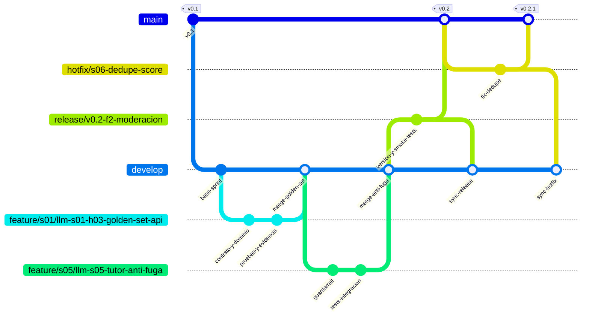

# Gitflow de `llm-service`

Este repositorio desarrolla `llm-service` en tres fases y 19 sprints de dos semanas. Se trabaja con un backlog y cinco parejas efectivas; las ramas representan integración, no equipos separados.

El modelo es GitFlow: las ramas permanentes son `main` y `develop`; las temporales son `feature/*`, `release/*` y `hotfix/*`.

## Diagrama



Lectura rápida:

- Una `feature/*` nace de `develop` y vuelve a ella mediante Pull Request (PR).
- `release/*` se crea al cerrar una entrega; se publica en `main`, se etiqueta y luego se sincroniza de regreso a `develop`.
- Aunque `hotfix/*` se vea entre `main` y `develop`, **nace desde `main`**, vuelve primero a `main` y se integra inmediatamente en `develop`.
- El diagrama muestra ejemplos representativos; la rama de una feature debe identificar siempre el sprint y la historia o tarea técnica real.

## Ramas

| Rama | Origen | Destino | Vida útil | Uso |
|---|---|---|---|---|
| `main` | inicial | — | permanente | Código estable, versiones publicadas y demos demostrables. Protegida. |
| `develop` | `main`, una vez | `release/*` | permanente | Integración continua del sprint. Protegida. |
| `feature/<sprint>/<id>-<slug>` | `develop` | `develop` | días a una semana | Una historia o paquete técnico pequeño. |
| `release/vX.Y[-fase]` | `develop` | `main` y `develop` | cierre de entrega | Preparación de release; solo fixes y documentación. |
| `hotfix/<slug>` | `main` | `main` y `develop` | horas, por urgencia | Incidente crítico de una versión publicada. |

### `main` — versión estable

Solo recibe PR aprobados desde `release/*` o `hotfix/*`. Cada versión estable se etiqueta aquí. No admite push directo ni force-push.

### `develop` — integración continua

Se abre desde `main` una única vez. Recibe las features terminadas y debe compilar y pasar pruebas en todo momento. No admite push directo ni force-push.

### `feature/*` — historia o tarea técnica

Una feature nace de `develop`, se implementa con commits pequeños y se integra por PR con squash. Se elimina después del merge.

**Convención de nombres:**

```text
feature/sNN/llm-sNN-hNN-<slug>
feature/sNN/llm-sNN-ttNN-<slug>
```

Ejemplos:

```text
feature/s01/llm-s01-h03-golden-set-api
feature/s05/llm-s05-tutor-anti-fuga
feature/s06/llm-s06-outbox-score
feature/s14/llm-s14-ingesta-pdf
```

No usar nombres de otro proyecto ni ramas por pareja.

### `release/*` — preparación de entrega

Nace de `develop` al cierre del sprint o fase. Solo permite ajustes de versión, fixes menores, documentación, pruebas de regresión y evidencia; no se incorporan features nuevas. Tras validar la entrega, se mergea a `main`, se crea el tag y se mergea también a `develop` para conservar los ajustes finales.

Ejemplos: `release/v0.1-f1-mvp-academico`, `release/v0.2-f2-moderacion`, `release/v1.0-f3-rag-personalizacion`.

### `hotfix/*` — corrección urgente

Nace de `main` solo para un defecto crítico que no puede esperar a la próxima entrega. Una vez validado, se mergea a `main`, se etiqueta una versión patch y se integra inmediatamente en `develop`.

Ejemplo: `hotfix/s06-dedupe-score`.

## Flujo operativo

1. El Tech Lead crea y protege `develop` desde `main`.
2. En la Planning se asignan sprint, historia o tarea técnica, pareja, dependencia y criterio de aceptación.
3. La persona asignada crea una `feature/*` desde `develop`.
4. Se implementa en orden: contrato, dominio o migración, caso de uso, adaptadores, seguridad/resiliencia, observabilidad, pruebas y evidencia.
5. Se abre PR hacia `develop`; nunca se hace push directo.
6. Si la review y la Definition of Done (DoD) pasan, se integra con squash y se elimina la feature.
7. Al cierre de la entrega se crea `release/*`, se ejecutan pruebas y smoke tests, se mergea a `main`, se etiqueta y se sincroniza a `develop`.
8. Ante un incidente crítico, se abre `hotfix/*` desde `main`, se valida y se mergea a ambas ramas, incrementando únicamente el patch.

## Reglas de merge

| Origen | Destino | Condición |
|---|---|---|
| `feature/*` | `develop` | PR aprobado por al menos un reviewer, DoD completa, CI verde y merge con squash. |
| `develop` | `release/*` | Cierre de sprint o fase, entregable demostrable y Sprint Goal cumplido. |
| `release/*` | `main` | PR aprobado por Tech Lead, pruebas de regresión, Docker/demo y smoke tests correctos. |
| `release/*` | `develop` | Inmediatamente después de publicar en `main`. |
| `hotfix/*` | `main` | PR fast-track aprobado por Tech Lead y validación del incidente. |
| `hotfix/*` | `develop` | Inmediatamente después de integrar el hotfix en `main`. |

Además de esas condiciones:

- Ejecutar CI, `git diff --check`, pruebas, Docker/demo y adjuntar evidencia.
- Incluir un reviewer de la pareja y al consumidor afectado si se cambia un contrato, evento o dato.
- Los cambios incompatibles de OpenAPI/AsyncAPI requieren adenda o versionado aprobado.
- Una migración Flyway aplicada no se edita: se agrega otra.
- Están prohibidos secretos, `.env`, prompts en logs, datos académicos, push directo y force-push en ramas protegidas.
- Nunca mergear `feature/*` directamente a `main` ni hacia otra `feature/*`.

## Versionado y fases

| Caso | Cambio de versión | Ejemplo |
|---|---|---|
| S1–S10 · F1 académico | minor inicial | `v0.1` |
| S11–S13 · F2 moderación | minor | `v0.2` |
| S14–S19 · F3 RAG/personalización | major | `v1.0` |
| Corrección urgente | patch | `v0.2` → `v0.2.1` |
| Fix menor dentro de `release/*` antes de publicar | no crea tag separado | continúa como `v0.2` |

Un hotfix nunca incrementa la versión minor: sobre `v0.2` debe publicarse `v0.2.1`, no `v0.3`. Los tags se crean solo en `main`.

## Mapeo sprint → GitFlow

| Evento | Acción |
|---|---|
| Inicio del sprint: comenzar una historia o tarea | Crear `feature/sNN/llm-sNN-hNN-<slug>` desde `develop`. |
| Historia terminada y DoD cumplida | PR de `feature/*` hacia `develop`, con merge squash. |
| Fin de sprint: entregable demostrable | Crear `release/vX.Y[-fase]` desde `develop`; validar; PR a `main`, tag y sincronización a `develop`. |
| Bug crítico en versión estable | Crear `hotfix/<slug>` desde `main`; fix; PR a `main`, tag patch y sincronización a `develop`. |

## Protección recomendada

Configurar estas reglas en GitHub para `main` y `develop`:

| Regla | `main` | `develop` |
|---|---|---|
| Requerir PR antes de mergear | Sí | Sí |
| Mínimo de approvals | 1 | 1 |
| Requerir checks de CI | Sí | Sí |
| Prohibir push directo | Sí | Sí |
| Prohibir force-push | Sí | Sí |
| Eliminar rama al mergear | N/A | Sí, para features |

El detalle operativo está en [Plan de ejecución/05-flujo-diario-y-git.md](../Plan%20de%20ejecucion/05-flujo-diario-y-git.md), el [playbook](../Plan%20de%20ejecucion/06-playbook-de-construccion.md) y el [backlog](../Plan%20de%20ejecucion/07-backlog-ejecutable-sprints.md).
