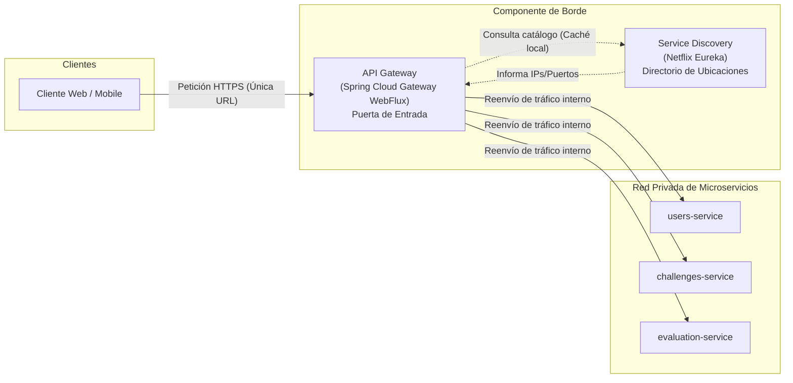

# 01 — Principios de Arquitectura, Reglas de Red y Responsabilidades

> **Componente de Borde · Tema 01 · UTN FRC**  
> Definición formal de la puerta de entrada única del sistema, aislamiento de red y separación de responsabilidades entre el Gateway y los Microservicios.

---

## 1. Conceptos Fundamentales

El sistema distribuye sus capacidades en dos componentes clave de infraestructura de borde:



### Analogía del Edificio
* **API Gateway (La Recepción):** Es la única entrada física al edificio. Controla credenciales, verifica identificación, aplica medidas de seguridad y acompaña o deriva al visitante a la oficina correspondiente.
* **Service Discovery / Eureka (El Directorio Interno):** Es el tablero que informa en qué piso y número de oficina se encuentra temporalmente cada departamento. No recibe ni atiende visitas; solo mantiene actualizado el directorio.

---

## 2. Reglas Estrictas de Red e Infraestructura

La arquitectura impone el principio de **puerta única verificable** a nivel de red física y lógica. Ningún servicio puede evadir este control.

```
Regla de Tráfico Obligatoria:
  Internet  ──────►  API Gateway  ──────►  Microservicio Destino
  Micro A   ──────►  API Gateway  ──────►  Microservicio B

Tráficos BLOQUEADOS por Red:
  ❌ Internet  ──────►  Microservicio (DIRECTO)
  ❌ Micro A   ──────►  Micro B (DIRECTO)
```

### Directivas de Red por Entorno

| Entorno | Mecanismo de Aislamiento | Regla de Configuración |
|---|---|---|
| **Docker / Compose** | Red privada tipo `bridge` interna | Los microservicios **NUNCA publican puertos al host** (`ports: - "8080:8080"` prohibido en micros; usar solo `expose: - 8080`). Solo el `api-gateway` expone puertos públicos (ej. `8080` o `443`). |
| **Kubernetes** | `ClusterIP` + `NetworkPolicy` | Los microservicios solo tienen Services de tipo `ClusterIP`. Las `NetworkPolicy` rechazan todo tráfico entrante que no provenga del pod del `api-gateway`. |

---

## 3. Matriz de Responsabilidades: Gateway vs. Microservicio

El Gateway actúa como un **guardián de infraestructura y frontera técnica**, pero **carece de conocimiento funcional sobre el dominio de negocio**.

### Regla Mnemotécnica
> *«Si una decisión necesita datos del dominio, pertenece al microservicio; si protege la frontera técnica, pertenece al Gateway.»*

| Capacidad | ¿Pertenece al Gateway? | ¿Pertenece al Microservicio? | Explicación y Detalle Técnico |
|---|:---:|:---:|---|
| **Puerta única y exposición de red** |  **SÍ** | ❌ NO | Es el único componente expuesto al exterior. Bloquea accesos directos. |
| **Autenticación técnica de JWT** |  **SÍ** | ❌ NO | Valida firma criptográfica (JWKS / RS256), issuer (`iss`), audience (`aud`), algoritmo y vigencia (`exp`, `nbf`). |
| **Ruteo dinámico** |  **SÍ** | ❌ NO | Resuelve nombres lógicos a instancias disponibles consultando Eureka. |
| **Propagación limpia de identidad** |  **SÍ** | ❌ NO | Elimina headers externos sensibles enviados por clientes maliciosos e inyecta headers de confianza (`X-User-Id`, `X-Principal-Type`, etc.). |
| **Protección técnica de rutas internas** |  **SÍ** | ❌ NO | Exige tokens técnicos de servicio y valida `type=service`, scopes y audiences requeridos. |
| **Resiliencia de infraestructura** |  **SÍ** | ❌ NO | Aplica timeouts, rate limiting (429), retry controlado y circuit breakers (503). |
| **Trazabilidad y observabilidad de borde** |  **SÍ** | ❌ NO | Inicia/propaga `X-Request-Id`, `traceparent` (W3C Trace Context) y genera métricas de latencia/throughput. |
| **Autorización de negocio / permisos** | ❌ NO |  **SÍ** | Determinar qué operaciones de negocio puede realizar un rol funcional lo decide el microservicio (ej. con anotaciones `@PreAuthorize` o `@RolesAllowed`). |
| **Resolución de Ownership / ABAC** | ❌ NO |  **SÍ** | Determinar si un estudiante es dueño de un desafío, si pertenece a una comisión o si un docente es titular de un curso es competencia exclusiva del microservicio dueño de la entidad. |
| **Conocimiento del Dominio** | ❌ NO |  **SÍ** | El Gateway desconoce conceptos como "desafío", "curso", "legajo", "evaluación" o "racha". Solo conoce paths técnicos (`/api/users/**`). |
| **Emisión y renovación de tokens** | ❌ NO |  **SÍ** | La emisión de credenciales de usuario y tokens técnicos pertenece a `users-service` (o Authorization Server dedicado). El Gateway solo valida. |
| **Persistencia de permisos de dominio** | ❌ NO |  **SÍ** | El Gateway no almacena bases de datos de permisos ni tablas de usuarios. |
| **Manejo de estado / Sesiones** | ❌ NO | ❌ NO | La arquitectura es **completamente stateless**. No existen sesiones en memoria ni en servidor; todo viaja autocontenido en tokens JWT. |

---

## 4. Los Cuatro Escenarios Soportados por el Gateway

Toda interacción en la plataforma cae exactamente en uno de los siguientes 4 escenarios:

```mermaid
graph TD
    subgraph Escenario1["1. Login Público"]
        E1["POST /api/users/public/auth/login"] --> G1[Gateway permitAll] --> U1[users-service emite JWT]
    end

    subgraph Escenario2["2. Request de Usuario"]
        E2["GET /api/users/me\nBearer JWT"] --> G2[Gateway valida JWT + propaga identidad] --> U2[users-service autoriza y responde]
    end

    subgraph Escenario3["3. Request de Servicio M2M"]
        E3["GET /api/users/profile/{id}\nToken Técnico de Servicio"] --> G3[Gateway valida type=service y scope] --> U3[users-service verifica caller y responde]
    end

    subgraph Escenario4["4. Destino con Falla"]
        E4["Cualquier ruta con fallo downstream"] --> G4[Gateway Circuit Breaker / Timeout] --> FB["503 / 504 + Problem Details RFC 7807"]
    end
```



1. **Login Público (`POST /api/users/public/auth/login`):**
   * Configurado como `permitAll` en el Gateway.
   * La petición llega a `users-service`, que valida credenciales de usuario y emite un JWT firmado con clave privada (RS256).
2. **Request de Usuario Autenticado (`GET /api/users/me`):**
   * El cliente envía `Authorization: Bearer <user-jwt>`.
   * El Gateway valida la firma contra el JWKS público, remueve headers sospechosos del cliente, inyecta `X-Principal-Type: user` y `X-User-Id`, y delega la autorización de negocio al microservicio.
3. **Request de Microservicio a Microservicio (`GET /api/users/profile/{id}`):**
   * El Micro A genera o solicita un token técnico de servicio (M2M) de corta duración.
   * La petición pasa por el Gateway. El Gateway valida que el token sea `type=service`, comprueba audience y scope técnico, y reenvía al Micro B con `X-Service-Id` e identidad delegada (si aplica).
4. **Destino con Falla o Degradación:**
   * Si una instancia no responde o supera el timeout de ruta, el Circuit Breaker del Gateway intercepta la falla y devuelve `503 Service Unavailable` o `504 Gateway Timeout` con estructura estándar RFC 7807 (`Problem Details`) y correlation ID para soporte.
