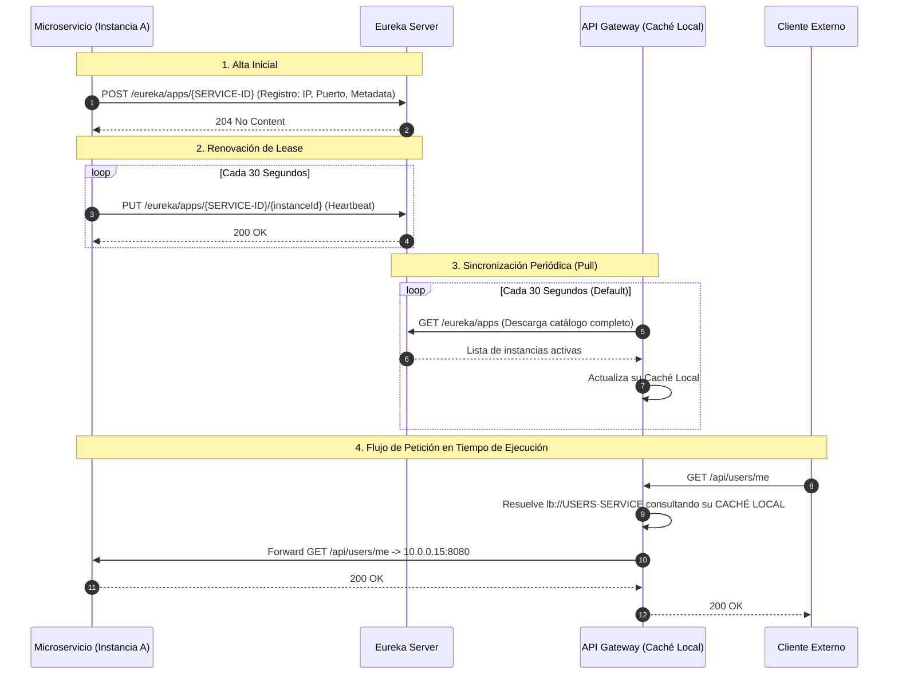

# 02 — Service Discovery con Netflix Eureka

> **Componente de Borde · Tema 01 · UTN FRC**  
> Guía técnica de registro dinámico, ciclo de vida de instancias, sincronización por caché y configuración estándar para microservicios.

---

## 1. El Problema que Resuelve Service Discovery

En entornos contenerizados (Docker / Kubernetes), las instancias de microservicios son efímeras: se escalan, se reinician y cambian de IP de forma dinámica.

| Paradigma | Mecanismo | Problema / Beneficio |
|---|---|---|
| **SIN Service Discovery** | El Gateway o los servicios deben mantener IPs y puertos fijos en archivos de configuración (`localhost:8081`, `10.0.0.15:8080`). | Un reinicio de contenedor o un escalado horizontal deja obsoleta la configuración de inmediato, requiriendo despliegues manuales. |
| **CON Netflix Eureka** | Los microservicios se registran dinámicamente con un **nombre lógico** (`users-service`). El Gateway descarga el registro en una **caché local** y balancea peticiones. | Ningún componente guarda IPs fijas. Los contenedores pueden cambiar de host o IP sin alterar el ruteo externo. |

---

## 2. Los 3 Elementos Publicados por cada Microservicio

Al iniciar, cada microservicio publica y mantiene ante Eureka tres datos obligatorios:

```
┌─────────────────────────────────────────────────────────────┐
│                 REGISTRO EN EUREKA SERVER                   │
├─────────────────────────┬───────────────────────────────────┤
│ 1. Nombre Lógico        │ spring.application.name           │
│    (Service ID)         │ Ej: users-service                 │
├─────────────────────────┼───────────────────────────────────┤
│ 2. Ubicación de Red     │ host + port (IP privada efímera)  │
│    (Instancia)          │ Ej: 10.0.0.15:8080                │
├─────────────────────────┼───────────────────────────────────┤
│ 3. Lease y Estado       │ Heartbeat: cada 30s               │
│    (Salud)              │ Expiración: 90s | Status: UP      │
└─────────────────────────┴───────────────────────────────────┘
```

> [!NOTE]
> `Actuator` influye en el estado de Eureka (`UP` / `DOWN` / `OUT_OF_SERVICE`) únicamente si se habilita `eureka.client.healthcheck.enabled=true`. Esto garantiza que un servicio con la base de datos caída no reciba tráfico aunque el proceso Java siga vivo.

---

## 3. El Ciclo de Vida Real de Eureka

Eureka **NO es un proxy de red ni un router**. Es un plano de control. Por ende, el Gateway **no consulta a Eureka en cada petición HTTP**.



### Tolerancia y Ventanas de Desfase
* **Expiración de Lease (90 segundos):** Si una instancia muere abruptamente y deja de enviar latidos, Eureka esperará hasta 90 segundos antes de marcarla como inactiva.
* **Caché en el Gateway:** Puede existir un desfase de unos segundos entre que una instancia cae y el Gateway renueva su copia local.
* **Mecanismo de Protección:** El *Service Discovery no reemplaza los timeouts ni los circuit breakers*. Si el Gateway intenta enviar tráfico a una IP recién caída de la caché, el **Timeout** y el **Retry seguro** del Gateway desvían la llamada inmediatamente a otra instancia sana sin afectar al usuario.

---

## 4. ¿Qué Significa `lb://` en la Práctica?

Cuando en Spring Cloud Gateway se configura un destino con el esquema:

```yaml
uri: lb://USERS-SERVICE
```

1. El prefijo `lb://` activa el componente **Spring Cloud LoadBalancer**.
2. El LoadBalancer intercepta el Service ID (`USERS-SERVICE`).
3. Busca en la copia local del registro todas las instancias marcadas con `Status = UP`.
4. Aplica el algoritmo de balanceo (por defecto *Round Robin*) y selecciona una IP/Puerto concreta (`10.0.0.15:8080`).
5. Transmite la petición por Netty sin modificar el path final acordado.

---

## 5. Configuración Mínima Estandarizada para Microservicios

Todos los microservicios del proyecto deben incluir las dependencias de **Spring Cloud Netflix Eureka Client** y **Spring Boot Starter Actuator**, manteniendo las siguientes propiedades de configuración:

### Formato `application.yml` (Recomendado)

```yaml
spring:
  application:
    name: users-service # Convención obligatoria: kebab-case con sufijo -service

eureka:
  client:
    service-url:
      defaultZone: ${EUREKA_URL:http://localhost:8761/eureka/}
    register-with-eureka: true
    fetch-registry: false # En micros normales es false; true solo si descubre otros servicios vía Eureka
    healthcheck:
      enabled: true # Delega el status a Spring Boot Actuator

management:
  endpoints:
    web:
      exposure:
        include: health,info,prometheus
  endpoint:
    health:
      show-details: when_authorized
      probes:
        enabled: true
```

### Formato `application.properties`

```properties
# Nombre lógico canónico (siempre en minúsculas)
spring.application.name=users-service

# URL del servidor Eureka parametrizable por variable de entorno
eureka.client.service-url.defaultZone=${EUREKA_URL:http://localhost:8761/eureka/}

# Publicación de la propia instancia
eureka.client.register-with-eureka=true

# Descarga del catálogo (false si el micro no consulta Eureka directamente)
eureka.client.fetch-registry=false

# Vinculación del estado con Actuator
eureka.client.healthcheck.enabled=true
```

### Reglas de Configuración por Rol

| Componente | `register-with-eureka` | `fetch-registry` | Observaciones |
|---|:---:|:---:|---|
| **Microservicio Estándar** (`users-service`, `challenges-service`) | `true` | `false` | Se publica para ser descubierto. Realiza llamadas salientes a través del Gateway por DNS interno (`http://api-gateway:8080`), por lo que no necesita descargar el registro de Eureka. |
| **Microservicio Consumidor Vía Discovery** | `true` | `true` | Solo en caso de que resuelva URLs internas mediante LoadBalancer local. |
| **API Gateway** (`api-gateway`) | `false` (u opcional) | `true` | **Obligatorio `fetch-registry: true`** para mantener actualizada su tabla de ruteo. Si se registra en Eureka, debe ser excluido explícitamente del locator para evitar autorutas hacia sí mismo. |
| **Eureka Server** (`eureka-server`) | `false` | `false` | Es el servidor central de registro. |
