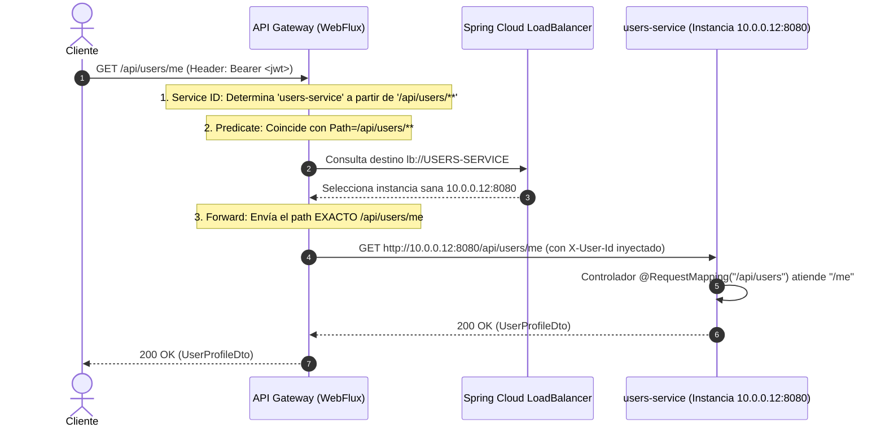

# 03 — Convenciones de Nombres, Contratos de API y Ruteo Dinámico

> **Componente de Borde · Tema 01 · UTN FRC**  
> Definición del estándar de nomenclatura en tres niveles, modelo de ruteo dinámico gobernado y convención de base paths en controladores Spring Boot.

---

## 1. Ruteo Estático vs. Ruteo Dinámico Gobernado

Para comunicar a los clientes con los microservicios sin crear cuellos de botella operativos, el sistema adopta el modelo de **Discovery Dinámico Gobernado**.

```
┌──────────────────────────────────────┐     ┌──────────────────────────────────────┐
│       RUTEO ESTÁTICO MANUAL          │     │     DINÁMICO GOBERNADO (NUESTRA      │
│     (Catálogo Fijo en Gateway)       │     │              ELECCIÓN)               │
├──────────────────────────────────────┤     ├──────────────────────────────────────┤
│ ❌ Alta manual por cada nuevo micro.  │     │  Onboarding automático por          │
│ ❌ Archivo yml central crece sin fin.│     │    convención estándar.              │
│ ❌ Cuello de botella en equipo       │     │  Eureka aporta instancias vivas en   │
│    Gateway.                          │     │    tiempo real.                      │
│ ❌ Código repetido para políticas    │     │  Filtros globales y políticas        │
│    idénticas.                        │     │    genéricas para todos.             │
│                                      │     │  Riesgos mitigados con Allowlist /   │
│                                      │     │    `include-expression`.             │
└──────────────────────────────────────┴─────┴──────────────────────────────────────┘
```

---

## 2. El Contrato de Nombres en Tres Lugares

Para asegurar interoperabilidad entre los equipos de desarrollo y el Gateway, se debe respetar estrictamente la convención de nomenclatura:

```
NIVEL 1: Repositorio Git (Trazabilidad de Código)
         tpi-{nombre}            ──►  Ejemplo: tpi-users, tpi-evaluaciones

NIVEL 2: Eureka Service ID (Identidad Lógica)
         {nombre}-service        ──►  Ejemplo: users-service, evaluaciones-service

NIVEL 3: Prefijo de URL en el Gateway (API Pública)
         /api/{nombre}/**        ──►  Ejemplo: /api/users/**, /api/evaluaciones/**
```

### Tabla de Derivación Canónica

| Módulo / Dominio | Nombre del Repositorio | `spring.application.name` | Prefijo Público en Gateway | URI de Balanceo Interno |
|---|---|---|---|---|
| **Usuarios y Auth** | `tpi-users` | `users-service` | `/api/users/**` | `lb://USERS-SERVICE` |
| **Desafíos y Gamificación** | `tpi-challenges` | `challenges-service` | `/api/challenges/**` | `lb://CHALLENGES-SERVICE` |
| **Evaluaciones y Calificación** | `tpi-evaluations` | `evaluations-service` | `/api/evaluations/**` | `lb://EVALUATIONS-SERVICE` |
| **Notificaciones y Mailing** | `tpi-mailing` | `mailing-service` | `/api/mailing/**` | `lb://MAILING-SERVICE` |
| **API Gateway** | `tpi-gateway` | `api-gateway` | *N/A (Excluido de rutas)* | *N/A (Sin autoruta)* |

> [!IMPORTANT]
> El nombre del repositorio Git (`tpi-{nombre}`) solo sirve para organización de proyectos entre equipos; **no participa del ruteo**.  
> El componente `DiscoveryLocatorConfig` del Gateway toma exclusivamente el `spring.application.name`, convierte a minúsculas y remueve el sufijo `-service` para generar el prefijo `/api/{nombre}/**`.

---

## 3. Estructura de Rutas Públicas vs. Privadas

Dentro de cada microservicio, los endpoints se dividen en dos categorías según su exposición:

```
┌─────────────────────────────────┐      ┌─────────────────────────────────┐
│     /api/{nombre}/public/**     │      │        /api/{nombre}/**         │
├─────────────────────────────────┤      ├─────────────────────────────────┤
│ • Endpoints abiertos a internet │      │ • Endpoints protegidos.         │
│   (ej: login, registro, JWKS).  │      │ • Exigen JWT válido en Gateway. │
│ • permitAll() en Gateway solo   │      │ • El micro autoriza por rol con │
│   para rutas documentadas.      │      │   @RolesAllowed / @PreAuthorize │
│ • Ej: /api/users/public/login   │      │ • Ej: /api/users/me             │
└─────────────────────────────────┘      └─────────────────────────────────┘
```

### Dos Excepciones Técnicas Controladas
1. **`/.well-known/jwks.json`:** Endpoint público del emisor de identidad (`users-service`), donde expone las claves públicas RSA para que el Gateway y otros servicios validen la firma de los JWT sin compartir secretos simétricos.
2. **`/api/users/auth/token`:** Endpoint de emisión de tokens técnicos (Machine-to-Machine). Exige autenticación mediante *Client Credentials* o *mTLS*. **NUNCA debe quedar abierto sin credenciales.**

---

## 4. Implementación en Controladores Spring Boot

Para evitar discrepancias entre el path evaluado por el Gateway y el path recibido en los controladores Java, **el contrato conserva el path completo**.

### 1. Declaración en `application.properties` o `application.yml`

```properties
# Base paths para el microservicio (ejemplo: users-service)
app.api.public-path=/api/users/public
app.api.private-path=/api/users
```

### 2. Uso en los Controllers

```java
// Endpoints Públicos (Ej. Login / Autenticación)
@RestController
@RequestMapping("${app.api.public-path}/auth")
public class AuthPublicController {

    @PostMapping("/login")
    public ResponseEntity<LoginResponse> login(@Valid @RequestBody LoginRequest request) {
        // Lógica de emisión de JWT
        return ResponseEntity.ok(authService.authenticate(request));
    }
}

// Endpoints Protegidos (Ej. Perfil de Usuario)
@RestController
@RequestMapping("${app.api.private-path}")
public class UserProfileController {

    @GetMapping("/me")
    @RolesAllowed({"ROLE_USER", "ROLE_ADMIN"})
    public ResponseEntity<UserProfileDto> getMyProfile(
            @RequestHeader("X-User-Id") String userId,
            @RequestHeader("X-Principal-Type") String principalType) {
        
        return ResponseEntity.ok(userService.getUserProfile(userId));
    }
}
```

---

## 5. Anatomía de una Petición End-to-End Sin Ambigüedad



### Resumen de la Regla de Forwarding:
* **Entrada externa:** `GET /api/users/me`
* **Destino de balanceo:** `lb://USERS-SERVICE`
* **Path enviado al backend:** `/api/users/me` (Sin reescrituras mágicas destructivas; el backend mapea explícitamente el prefijo de su API).
