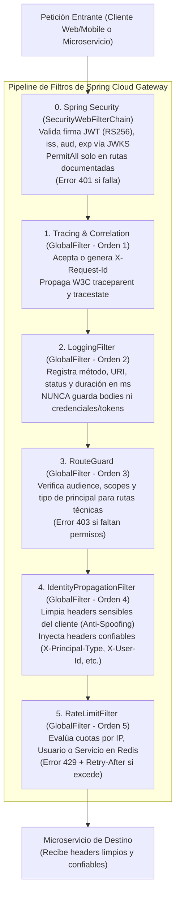

# 04 — Seguridad, Pipeline de Filtros y Propagación de Identidad

> **Componente de Borde · Tema 01 · UTN FRC**  
> Especificación del pipeline de seguridad de Spring Cloud Gateway WebFlux, validación de JWT mediante JWKS, sanitización de headers e inyección de contexto verificado.

---

## 1. El Pipeline de Seguridad y Trazabilidad

El Gateway procesa cada petición entrante a través de un pipeline secuencial ordenado. Cada capa cumple una función técnica estricta antes de reenviar el tráfico a la red privada:



> [!IMPORTANT]
> `Spring Security` y los `GlobalFilter` operan en cadenas reactivas distintas. Su orden relativo y comportamiento deben ser garantizados mediante la anotación `@Order` y pruebas de integración automáticas.

---

## 2. Validación Criptográfica del Token JWT

Para desacoplar el Gateway de la base de datos de usuarios, la validación se realiza de forma **stateless** mediante claves asimétricas (**RS256**).

```
1. users-service (Auth Server) ─────► Firma el JWT con su Clave Privada RSA.
2. users-service expone       ─────► /.well-known/jwks.json (Claves Públicas).
3. API Gateway                ─────► ReactiveJwtDecoder consulta el JWKS,
                                     valida la firma en memoria y verifica:
                                     • iss (Issuer esperado)
                                     • aud (Audience esperada)
                                     • exp (Expiración no vencida)
                                     • alg (Algoritmo permitido: RS256)
```

---

## 3. Prevención de Header Spoofing y Propagación Limpia

Un atacante externo podría enviar headers como `X-User-Id: 1` o `X-Roles: ROLE_ADMIN` para suplantar identidad. El Gateway **elimina incondicionalmente todos los headers sensibles provenientes de internet** antes de inyectar los valores autenticados.

```mermaid
flowchart LR
    subgraph ClienteExterno["Petición Externa (Insegura)"]
        direction TB
        H1["Authorization: Bearer <jwt_valido>"]
        H2["X-User-Id: 999 (MALICIOSO)"]
        H3["X-Roles: ROLE_ADMIN (MALICIOSO)"]
    end

    subgraph Gateway["API Gateway (IdentityPropagationFilter)"]
        direction TB
        F1["1. Descarta H2 y H3 por completo"]
        F2["2. Extrae 'sub' y 'roles' del token verificado"]
        F3["3. Inyecta headers internos de confianza"]
    end

    subgraph Backend["Microservicio Privado"]
        direction TB
        HB1["X-Principal-Type: user"]
        HB2["X-User-Id: user-123 (Legítimo)"]
        HB3["X-User-Roles: ROLE_USER"]
        HB4["X-Request-Id: 550e8400-e29b..."]
        HB5["traceparent: 00-4bf92f3577b34da6a3ce929d0e0e4736..."]
    end

    ClienteExterno --> Gateway --> Backend
```



### Contrato de Headers Hacia los Microservicios

| Header Inyectado | Valores Posibles | Descripción |
|---|---|---|
| `X-Principal-Type` | `user` \| `service` | Indica si el emisor de la petición es un usuario final o un proceso interno/servicio. |
| `X-User-Id` | `String` (UUID / Legajo) | Identificador único del usuario autenticado (presente si `Principal-Type = user`). |
| `X-User-Roles` | `ROLE_USER`, `ROLE_ADMIN`, etc. | Lista separada por comas o JSON con los roles de seguridad del usuario. |
| `X-Service-Id` | `challenges-service`, etc. | Identificador del microservicio llamador (presente si `Principal-Type = service`). |
| `X-Service-Scopes` | `users.profile.read`, etc. | Permisos técnicos delegados al microservicio llamador. |
| `X-Delegated-User` | `String` (ID de usuario) | Opcional: ID del usuario original cuando un servicio opera en su nombre. |
| `X-Request-Id` | `UUID` | Identificador único de correlación para seguimiento de logs y auditoría. |
| `traceparent` | Formato W3C Trace Context | Contexto de trazabilidad distribuida para OpenTelemetry / APM. |

---

## 4. Códigos de Estado Emitidos por el Gateway

Cuando una petición no cumple los contratos del Gateway, este responde inmediatamente sin sobrecargar a los microservicios:

```
┌───────┬───────────────────────────────────┬──────────────────────────────────────┐
│ HTTP  │ Causa en el Gateway               │ Acción Esperada del Cliente          │
├───────┼───────────────────────────────────┼──────────────────────────────────────┤
│  401  │ Token ausente, firma inválida,    │ Reautenticarse contra el servicio    │
│       │ issuer incorrecto o token vencido.│ de auth (login).                     │
├───────┼───────────────────────────────────┼──────────────────────────────────────┤
│  403  │ Intento de acceder a ruta interna │ Verificar credenciales de servicio,  │
│       │ sin scopes o audience suficiente. │ clientId o permisos técnicos.        │
├───────┼───────────────────────────────────┼──────────────────────────────────────┤
│  429  │ Tasa de peticiones superada       │ Respetar el header Retry-After       │
│       │ (Rate Limiting).                  │ antes de volver a intentar.          │
├───────┼───────────────────────────────────┼──────────────────────────────────────┤
│  503  │ Sin instancias en Eureka o        │ Esperar apertura de Circuit Breaker  │
│       │ Circuit Breaker abierto.          │ o activación de nodos de respaldo.   │
├───────┼───────────────────────────────────┼──────────────────────────────────────┤
│  504  │ El microservicio tardó más del    │ Falla de timeout downstream; revisar │
│       │ response-timeout configurado.     │ rendimiento del microservicio.       │
└───────┴───────────────────────────────────┴──────────────────────────────────────┘
```

> [!NOTE]
> Las autorizaciones funcionales de negocio (ej. *"este usuario no puede modificar este curso"*) devuelven `403 Forbidden` generado directamente por el **microservicio de negocio**, no por el Gateway.
