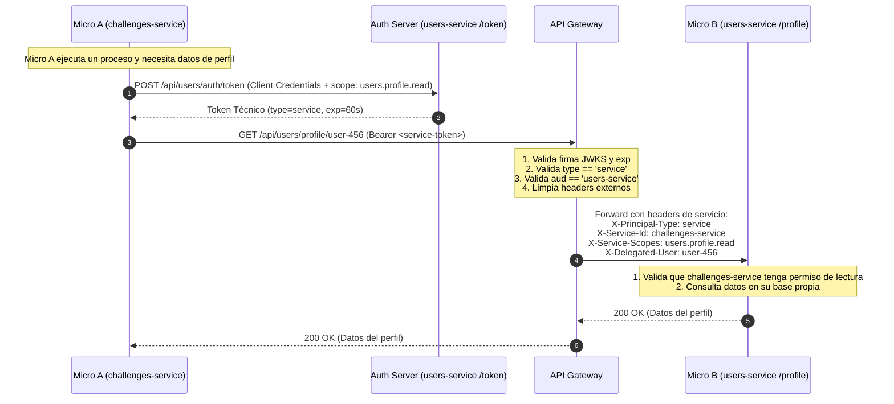

# 05 — Comunicación Micro a Micro (M2M) y Tokens Técnicos

> **Componente de Borde · Tema 01 · UTN FRC**  
> Reglas de interacción entre microservicios, ciclo de vida de tokens técnicos de servicio (Machine-to-Machine) y propagación de identidad delegada.

---

## 1. La Regla de Oro: Toda Llamada Vuelve al Gateway

En nuestra arquitectura **no existe la comunicación síncrona directa entre microservicios**.

```
Arquitectura Permitida:
  ┌─────────────┐         ┌─────────────────┐         ┌─────────────┐
  │   Micro A   │ ──────► │   API Gateway   │ ──────► │   Micro B   │
  └─────────────┘         └─────────────────┘         └─────────────┘

Arquitectura BLOQUEADA:
  ┌─────────────┐                                     ┌─────────────┐
  │   Micro A   │ ─────────────── ❌ ───────────────► │   Micro B   │
  └─────────────┘                                     └─────────────┘
```

### ¿Por qué Toda Llamada Pasa por el Gateway?
1. **Frontera de Seguridad Homogénea:** El microservicio de destino (Micro B) solo atiende y confía en el API Gateway; no necesita abrir puertos ni autenticar múltiples orígenes dispersos.
2. **Resiliencia Centralizada:** Las llamadas internas también se benefician de Circuit Breakers, Timeouts, Retries automáticos y Rate Limiting si un servicio entra en bucle.
3. **Trazabilidad Distribuida Completa:** Cada salto interno mantiene intacto el árbol de `traceparent` y `X-Request-Id`, permitiendo auditar la cadena exacta de llamadas.

---

## 2. Diferencia Crítica: Identidad de Servicio vs. Identidad de Usuario

```
┌────────────────────────────────────────┬────────────────────────────────────────┐
│          IDENTIDAD DE USUARIO          │          IDENTIDAD DE SERVICIO         │
│             (User Token)               │             (Service Token)            │
├────────────────────────────────────────┼────────────────────────────────────────┤
│ • Representa a una persona física      │ • Representa a un proceso/microservicio│
│   (alumno, docente, admin).            │   (evaluations, challenges, mailing).  │
│ • Emitido tras login con credenciales. │ • Emitido mediante Client Credentials  │
│ • Contiene legajo, roles de negocio.   │   o certificados mTLS.                 │
│ • type = "user"                        │ • type = "service"                     │
│ • Vence en minutos u horas.            │ • Token de muy corta vida (ej. 60 seg).│
│ • aud = API pública general.           │ • aud = microservicio específico.      │
│                                        │ • scope = capacidad técnica acotada.   │
└────────────────────────────────────────┴────────────────────────────────────────┘
```

---

## 3. Contrato Mínimo del Token Técnico de Servicio

Cuando el `challenges-service` necesita solicitar datos al `users-service`, solicita un token técnico al servidor de autorización con la siguiente estructura en el payload JWT:

```json
{
  "sub": "challenges-service",
  "type": "service",
  "aud": "users-service",
  "scope": "users.profile.read",
  "on_behalf_of": "user-456",
  "iat": 1716290000,
  "exp": 1716290060,
  "iss": "https://auth.tpi.frc.utn.edu.ar"
}
```

### Desglose de Claims
* `sub`: Nombre lógico del servicio que origina la llamada (`challenges-service`).
* `type`: Literal `"service"` (permite al Gateway diferenciarlo de un usuario humano).
* `aud`: Nombre del microservicio destinatario (`users-service`). El Gateway rechaza tokens con `aud` no coincidente.
* `scope`: Permiso técnico granular y específico (`users.profile.read`).
* `on_behalf_of` *(Opcional)*: Identificador del usuario final cuando la operación se ejecuta en su contexto.
* `exp`: Tiempo de vida muy corto (típicamente **60 segundos**), minimizando riesgos ante fugas de credenciales.

---

## 4. Secuencia Completa de Invocación Backend-to-Backend



---

## 5. Prácticas Prohibidas y Antipatrones

> [!CAUTION]
> Las siguientes prácticas vulneran la arquitectura y serán rechazadas en las revisiones de código y defensas:

1. ❌ **Reenviar el JWT de Usuario entre Microservicios:**  
   Nunca propague el token del usuario final para autenticar llamadas internas. El token de usuario posee permisos amplios y expiración prolongada; si un microservicio intermedio es comprometido, el atacante obtiene acceso total en nombre del usuario.
2. ❌ **Llamadas Backend Anónimas o Sin Autenticar:**  
   Ningún endpoint interno puede quedar sin validar token técnico. Toda llamada entre servicios debe certificar qué componente está consumiendo la API.
3. ❌ **Endpoint `/auth/token` Desprotegido:**  
   El endpoint de emisión de credenciales técnicas debe requerir obligatoriamente `Client Secret` robusto o autenticación mutua TLS (`mTLS`).
4. ❌ **Llamadas HTTP Directas entre IPs de Microservicios:**  
   Cualquier llamada tipo `http://users-service:8080` que evada el Gateway viola la política de red y fallará en Kubernetes/Docker debido a las reglas de aislamiento.
