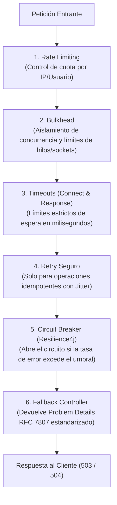

# 06 — Resiliencia, Observabilidad y Endpoints Operativos

> **Componente de Borde · Tema 01 · UTN FRC**  
> Políticas de tolerancia a fallos en capas (Resilience4j + Netty), métricas de observabilidad y endpoints de operación en Spring Boot Actuator.

---

## 1. La Cadena de Protección de Resiliencia

Un Circuit Breaker por sí solo no previene el agotamiento de memoria o descriptores de sockets. La resiliencia efectiva requiere una **secuencia ordenada de 6 capas defensivas**:



---

## 2. Detalle de los Mecanismos de Tolerancia

### A. Timeout y Bulkhead
* **Connect Timeout:** Tiempo máximo para establecer la conexión TCP con la instancia del microservicio (ej. `500 ms`).
* **Response Timeout:** Tiempo máximo de espera por la respuesta HTTP completa (ej. `3000 ms`).
* **Bulkhead:** Asigna un pool máximo de conexiones concurrentes por cada `serviceId`. Si `challenges-service` se congela, solo consume su cuota asignada y no degrada la atención hacia `users-service`.

### B. Circuit Breaker por Service ID
* Cada microservicio registrado posee su propia instancia de Circuit Breaker en Resilience4j.
* **Estado Closed:** El tráfico fluye normalmente mientras la tasa de fallos esté por debajo del umbral (ej. < 50%).
* **Estado Open:** Si el microservicio supera el umbral de fallas continuas o timeouts, el circuito se abre y desvía inmediatamente al Fallback sin intentar contactar al backend.
* **Estado Half-Open:** Tras una ventana de descanso (ej. 10s), envía peticiones de prueba para verificar si el microservicio se recuperó.

### C. Retry Seguro y Reglas de Idempotencia
* **Métodos Permitidos:** Solo se reintentan métodos naturalmente idempotentes (`GET`, `PUT`, `DELETE`) o peticiones que incluyan un header explícito `Idempotency-Key`.
* **Prohibición:** **NUNCA reintentar peticiones `POST` de negocio no idempotentes** (evita duplicación de cobros, otorgamiento múltiple de XP o registros duplicados).
* **Backoff + Jitter:** Los reintentos aplican espera exponencial aleatoria para evitar que todos los reintentos golpeen al microservicio simultáneamente (efecto manada).
* **Respeto a 429:** Si un destino responde con `429 Too Many Requests`, el Gateway respeta el valor del header `Retry-After`.

---

## 3. Formato Estándar de Fallback (RFC 7807 Problem Details)

Cuando el Circuit Breaker interviene o expira un Timeout, el `FallbackController` atiende la ruta interna `forward:/fallback/**` y emite una respuesta uniforme en formato `application/problem+json`:

```json
{
  "type": "https://api.tpi.frc.utn.edu.ar/errors/service-unavailable",
  "title": "Service Unavailable",
  "status": 503,
  "detail": "El servicio de destino (challenges-service) no responde o se encuentra en mantenimiento.",
  "instance": "/api/challenges/123/submit",
  "traceId": "550e8400-e29b-41d4-a716-446655440000",
  "timestamp": "2026-09-03T10:15:30Z"
}
```

---

## 4. Endpoints Operativos de Gestión (Actuator)

El Gateway expone endpoints específicos para orquestadores (Docker Compose / Kubernetes) y sistemas de monitoreo (Prometheus / Grafana).

```
┌─────────────────────────────────────────────────────────────────────────────┐
│                    ENDPOINTS OPERATIVOS DEL GATEWAY                         │
├──────────────────────────────────┬──────────────────────────────────────────┤
│ GET /actuator/health/liveness    │ Comprueba que el proceso de la JVM está  │
│                                  │ vivo y no bloqueado.                     │
├──────────────────────────────────┼──────────────────────────────────────────┤
│ GET /actuator/health/readiness   │ Comprueba si el Gateway está listo para  │
│                                  │ recibir tráfico (Eureka y Redis OK).     │
├──────────────────────────────────┼──────────────────────────────────────────┤
│ GET /actuator/prometheus         │ Expone métricas en formato OpenMetrics:  │
│                                  │ latencias p95/p99, error rates, retries, │
│                                  │ estado de circuit breakers.              │
├──────────────────────────────────┼──────────────────────────────────────────┤
│ forward:/fallback/**             │ Ruta interna no expuesta a internet para │
│                                  │ derivación de fallbacks de resiliencia.  │
└──────────────────────────────────┴──────────────────────────────────────────┘
```

> [!WARNING]
> Los endpoints de `/actuator/**` **NUNCA deben exponerse públicamente a Internet**. Deben configurarse en un puerto de administración separado (`management.server.port=8081`) o filtrarse a nivel de red para acceso exclusivo de Kubernetes y herramientas de monitoreo.

---

## 5. Trazabilidad Distribuida y Logging Seguro

1. **W3C Trace Context (`traceparent`):** Cada petición que ingresa al Gateway adquiere o preserva un identificador de traza distribuida estándar (`00-{traceId}-{spanId}-{traceFlags}`). Este header se propaga a todos los microservicios aguas abajo.
2. **Correlation ID (`X-Request-Id`):** UUID asignado a cada interacción para correlacionar los logs del Gateway con los logs del microservicio y las bases de datos.
3. **Política de Logs:**
   * ✅ Se registra: Método HTTP, URI, Código de Estado HTTP, Duración de la petición (ms), `X-Request-Id`, IP de origen.
   * ❌ Prohibido en logs: Cuerpos de mensajes (`request/response body`), tokens JWT, contraseñas, claves privadas o datos personales identificables (PII).
