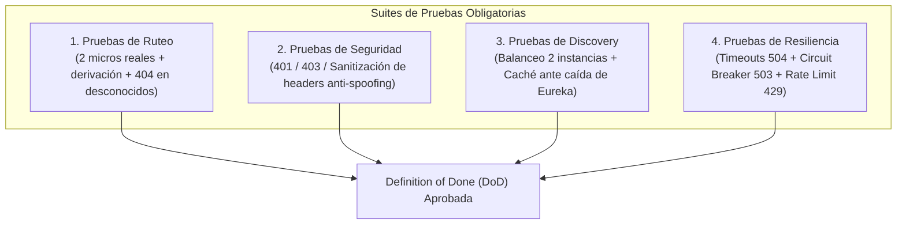

# 07 — Pruebas Obligatorias de Integración y Definition of Done (DoD)

> **Componente de Borde · Tema 01 · UTN FRC**  
> Matriz de verificación arquitectónica y criterios de aceptación requeridos antes de dar por integrada cualquier pieza de software.

---

## 1. Las Cuatro Familias de Pruebas Obligatorias

La arquitectura de borde no se considera validada únicamente con pruebas unitarias aisladas. Para su homologación técnica, deben superarse satisfactoriamente las siguientes cuatro suites de pruebas de integración:

---

## 2. Matriz de Casos de Prueba por Familia

### Familia 1: Ruteo y Contratos de URL

| ID | Caso de Prueba | Entrada / Estímulo | Comportamiento Esperado | Criterio de Éxito |
|---|---|---|---|---|
| **RUT-01** | Derivación Dinámica | `GET /api/users/me` | El Gateway normaliza `users`, consulta `lb://USERS-SERVICE` y reenvía. | Código `200 OK` con payload del backend. |
| **RUT-02** | Integridad de Path | `GET /api/challenges/active` | El microservicio recibe el path exacto `/api/challenges/active` en su controlador. | Controlador mapea la ruta sin error `404`. |
| **RUT-03** | Servicio No Admitido | `GET /api/servicio-fantasma/test` | El servicio no existe o está fuera del `include-expression`. | Código `404 Not Found` inmediato. |
| **RUT-04** | Ausencia de Autoruta | `GET /api/api-gateway/actuator` | Petición intentando rutear hacia el propio Gateway como backend. | Bloqueo o `404 Not Found`. Sin loop infinito. |

---

### Familia 2: Seguridad y Manejo de Identidad

| ID | Caso de Prueba | Entrada / Estímulo | Comportamiento Esperado | Criterio de Éxito |
|---|---|---|---|---|
| **SEG-01** | Token Inválido / Expirado | `GET /api/users/me` con JWT vencido | Spring Security rechaza la petición en el borde. | Código `401 Unauthorized` inmediato. |
| **SEG-02** | Ruta Pública Legítima | `POST /api/users/public/auth/login` | Endpoint abierto documentado en `permitAll()`. | Petición alcanza al backend sin requerir token. |
| **SEG-03** | Header Spoofing (Anti-Suplantación) | Petición con `X-User-Id: 9999` y `X-Roles: ROLE_ADMIN` inyectados por el cliente malicioso | El filtro `IdentityPropagationFilter` descarta los headers externos y coloca los del JWT real (`user-123`). | El backend procesa la petición con identidad `user-123`, ignorando `9999`. |
| **SEG-04** | Acceso M2M con Scope Inválido | Llamada de servicio sin scope `users.profile.read` | `InternalRouteGuard` evalúa claims del token técnico. | Código `403 Forbidden` emitido por el Gateway. |

---

### Familia 3: Service Discovery y Balanceo

| ID | Caso de Prueba | Entrada / Estímulo | Comportamiento Esperado | Criterio de Éxito |
|---|---|---|---|---|
| **DIS-01** | Balanceo Round-Robin | 10 peticiones consecutivas a `/api/users/ping` con 2 instancias levantadas | El LoadBalancer reparte 5 peticiones a la Instancia A y 5 a la Instancia B. | Logs confirman balanceo equitativo. |
| **DIS-02** | Baja de Instancia | Se apaga la Instancia B | Eureka detecta la falta de latidos y el Gateway redirige el 100% a la Instancia A. | Cero caídas para el usuario final. |
| **DIS-03** | Resiliencia ante Caída de Eureka | Se detiene el contenedor de Eureka Server | El Gateway sigue atendiendo tráfico gracias a su copia local en memoria. | Disponibilidad del 100% durante el apagón de Eureka. |
| **DIS-04** | Aislamiento de Red Privada | Petición HTTP directa desde el host al puerto `8082` del microservicio privado | Regla de Docker / Kubernetes rechaza la conexión. | `Connection Refused` o `Timeout` de red. |

---

### Familia 4: Resiliencia y Observabilidad

| ID | Caso de Prueba | Entrada / Estímulo | Comportamiento Esperado | Criterio de Éxito |
|---|---|---|---|---|
| **RES-01** | Timeout de Respuesta | Backend forzado a demorar 5 segundos (timeout configurado en 3s) | Gateway corta la conexión al cumplirse el timeout. | Código `504 Gateway Timeout` con `Problem Details`. |
| **RES-02** | Apertura de Circuit Breaker | 20 peticiones consecutivas que devuelven error `500` en el backend | El Circuit Breaker pasa a estado `OPEN`. | Petición 21 devuelve `503 Service Unavailable` en <5ms sin invocar al backend. |
| **RES-03** | No Reintento de POST | Fallo en petición `POST /api/challenges/submit` | La política de Retry detecta método no idempotente. | La petición **no se reintenta**, evitando doble ejecución. |
| **RES-04** | Rate Limiting | Cliente supera la cuota de 50 peticiones por minuto | El filtro de tasa rechaza los excesos. | Código `429 Too Many Requests` con header `Retry-After`. |
| **RES-05** | Trazabilidad de Punta a Punta | Petición con `X-Request-Id: test-uuid` | El identificador viaja en logs del Gateway, backend y respuesta. | Header `X-Request-Id` idéntico en la respuesta final. |

---

## 3. Criterio de Aceptación: Definition of Done (DoD)

Para considerar formalmente entregado el Componente de Borde o la integración de un nuevo microservicio al ecosistema del TPI, se debe cumplir la siguiente lista de verificación:

- [ ] **Implementación Ejecutable:** Todos los servicios inician correctamente mediante `docker-compose up` sin intervención manual ni errores de arranque.
- [ ] **Mínimo de 2 Servicios Integrados:** Gateway + Eureka comunicando funcionalmente al menos 2 microservicios de negocio (`users-service` y un segundo servicio como `challenges-service`).
- [ ] **Contratos OpenAPI Versionados:** Cada microservicio expone su contrato OpenAPI/Swagger accesible internamente.
- [ ] **100% de Pruebas de las 4 Familias en Verde:** Ejecución automatizada de tests de integración que validen ruteo, seguridad, discovery y resiliencia.
- [ ] **Cero Puertos Expuestos Innecesarios:** Solo el Gateway tiene puertos mapeados hacia el host exterior.
