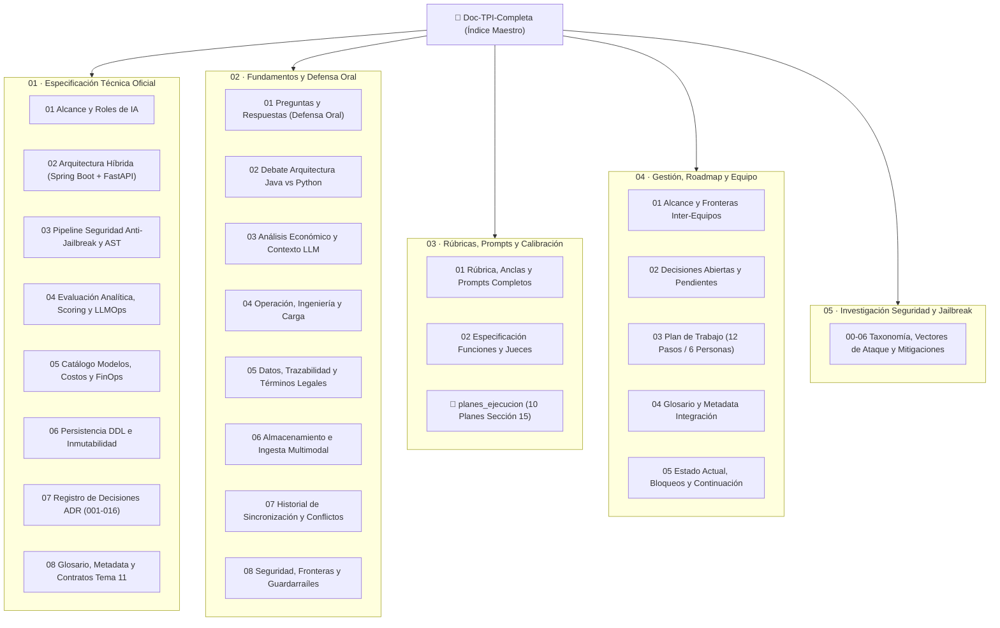

# 📚 Documentación Técnica y Estratégica Completa — Microservicio de IA (Tema 07)

> **Cátedra:** Programación IV — Back End · Tecnicatura Universitaria en Programación (2.º Año, 4.º Cuatrimestre) · **UTN FRC**  
> **Proyecto:** Plataforma de Aprendizaje Gamificado · **Tema 07: Capa de Inteligencia Artificial y Evaluación LLM**  
> **Estado:** Repositorio Documental Centralizado y Unificado (Consolida la Especificación Técnica, Fundamentos de Cátedra, Rúbricas y Planes de Ejecución)  
> **Fecha de Actualización:** 2026-09-01

---

## 🗺️ Mapa General del Repositorio Unificado

Esta carpeta consolida **todo el conocimiento del Tema 07** en un único lugar organizado, eliminando inconsistencias y preservando tanto la especificación formal del microservicio como los fundamentos estratégicos, planes de equipo, taxonomías de seguridad y borradores de prompts.

---

## 🧭 Guías de Lectura según tu Rol o Necesidad

| Tu Objetivo / Rol | Rutas recomendadas |
|---|---|
| 💻 **Desarrollador / Arquitecto Backend** | [01_ESPECIFICACION_TECNICA/02_ARQUITECTURA_HIBRIDA_Y_PLATAFORMA.md](./01_ESPECIFICACION_TECNICA/02_ARQUITECTURA_HIBRIDA_Y_PLATAFORMA.md) [01_ESPECIFICACION_TECNICA/06_PERSISTENCIA_DDL_E_INMUTABILIDAD.md](./01_ESPECIFICACION_TECNICA/06_PERSISTENCIA_DDL_E_INMUTABILIDAD.md) [01_ESPECIFICACION_TECNICA/03_PIPELINE_SEGURIDAD_ANTI_JAILBREAK_Y_AST.md](./01_ESPECIFICACION_TECNICA/03_PIPELINE_SEGURIDAD_ANTI_JAILBREAK_Y_AST.md) |
| 🎓 **Defensa Oral frente a Docentes** | [02_FUNDAMENTOS_Y_DEFENSA_ORAL/01_PREGUNTAS_Y_RESPUESTAS_DEFENSA.md](./02_FUNDAMENTOS_Y_DEFENSA_ORAL/01_PREGUNTAS_Y_RESPUESTAS_DEFENSA.md) *(22 preguntas con pros y contras)* [01_ESPECIFICACION_TECNICA/07_REGISTRO_DE_DECISIONES_ADR.md](./01_ESPECIFICACION_TECNICA/07_REGISTRO_DE_DECISIONES_ADR.md) |
| 🧑‍🏫 **Docente / Calibración Académica** | [03_RUBRICAS_PROMPTS_Y_CALIBRACION/01_RUBRICA_ANCLAS_Y_PROMPTS_COMPLETOS.md](./03_RUBRICAS_PROMPTS_Y_CALIBRACION/01_RUBRICA_ANCLAS_Y_PROMPTS_COMPLETOS.md) [01_ESPECIFICACION_TECNICA/04_EVALUACION_ANALITICA_SCORING_HIBRIDO_Y_LLMOPS.md](./01_ESPECIFICACION_TECNICA/04_EVALUACION_ANALITICA_SCORING_HIBRIDO_Y_LLMOPS.md) |
| 🛡️ **Seguridad, Auditoría y Guardarraíles** | [01_ESPECIFICACION_TECNICA/03_PIPELINE_SEGURIDAD_ANTI_JAILBREAK_Y_AST.md](./01_ESPECIFICACION_TECNICA/03_PIPELINE_SEGURIDAD_ANTI_JAILBREAK_Y_AST.md) [05_INVESTIGACION_SEGURIDAD_Y_JAILBREAK/00_INDICE_ANALISIS_IBM.md](./05_INVESTIGACION_SEGURIDAD_Y_JAILBREAK/00_INDICE_ANALISIS_IBM.md) |
| 👥 **Gestión y Coordinación de Integración** | [04_GESTION_ROADMAP_Y_EQUIPO/03_PLAN_DE_TRABAJO_12_PASOS_6_PERSONAS.md](./04_GESTION_ROADMAP_Y_EQUIPO/03_PLAN_DE_TRABAJO_12_PASOS_6_PERSONAS.md) [04_GESTION_ROADMAP_Y_EQUIPO/05_ESTADO_ACTUAL_BLOQUEOS_Y_CONTINUACION.md](./04_GESTION_ROADMAP_Y_EQUIPO/05_ESTADO_ACTUAL_BLOQUEOS_Y_CONTINUACION.md) |

---

## 📁 Estructura Detallada del Repositorio

### Sección 1: [01_ESPECIFICACION_TECNICA/](./01_ESPECIFICACION_TECNICA/)
*Especificación formal, arquitectura definitiva, bases de datos y decisiones de diseño consolidadas.*

* **[01_ALCANCE_Y_ROLES_DE_IA.md](./01_ESPECIFICACION_TECNICA/01_ALCANCE_Y_ROLES_DE_IA.md)**: Los 5 roles de IA (Tutor, Evaluador, Generador, Corrector, Moderador), interfaces de servicio y frontera con el motor de desafíos (XP).
* **[02_ARQUITECTURA_HIBRIDA_Y_PLATAFORMA.md](./01_ESPECIFICACION_TECNICA/02_ARQUITECTURA_HIBRIDA_Y_PLATAFORMA.md)**: Patrón Sidecar Spring Cloud (Eureka, Gateway, AMQP) conectado al motor FastAPI Python (Onion Architecture, uvloop).
* **[03_PIPELINE_SEGURIDAD_ANTI_JAILBREAK_Y_AST.md](./01_ESPECIFICACION_TECNICA/03_PIPELINE_SEGURIDAD_ANTI_JAILBREAK_Y_AST.md)**: Las 5 capas de defensa activa, Buffer Interceptor en streaming SSE y comparación sintáctica AST (umbral 70%).
* **[04_EVALUACION_ANALITICA_SCORING_HIBRIDO_Y_LLMOPS.md](./01_ESPECIFICACION_TECNICA/04_EVALUACION_ANALITICA_SCORING_HIBRIDO_Y_LLMOPS.md)**: Fórmula en 5 dimensiones (RF-IA-15), scoring determinístico, Golden Set y Circuit Breaker de deriva (PAR-14).
* **[05_CATALOGO_MODELOS_COSTOS_Y_FINOPS.md](./01_ESPECIFICACION_TECNICA/05_CATALOGO_MODELOS_COSTOS_Y_FINOPS.md)**: Selección de modelos (Gemini Flash-Lite, Haiku 4.5, GPT-5 nano), hiperparámetros y cuotas en Redis.
* **[06_PERSISTENCIA_DDL_E_INMUTABILIDAD.md](./01_ESPECIFICACION_TECNICA/06_PERSISTENCIA_DDL_E_INMUTABILIDAD.md)**: Scripts DDL PostgreSQL 16 + `pgvector`, triggers PL/pgSQL para inmutabilidad forense de notas e índices GIN/HNSW.
* **[07_REGISTRO_DE_DECISIONES_ADR.md](./01_ESPECIFICACION_TECNICA/07_REGISTRO_DE_DECISIONES_ADR.md)**: Registro consolidado ADR-001 al ADR-016 con fundamentos y condiciones de revisión.
* **[08_GLOSARIO_METADATA_Y_CONTRATOS_CATEDRA.md](./01_ESPECIFICACION_TECNICA/08_GLOSARIO_METADATA_Y_CONTRATOS_CATEDRA.md)**: Contratos de eventos AMQP compartidos con Tema 11, DTOs y glosario terminológico unificado.

---

### Sección 2: [02_FUNDAMENTOS_Y_DEFENSA_ORAL/](./02_FUNDAMENTOS_Y_DEFENSA_ORAL/)
*Argumentación profunda, análisis con pros y contras, debates técnicos y marco legal.*

* **[01_PREGUNTAS_Y_RESPUESTAS_DEFENSA.md](./02_FUNDAMENTOS_Y_DEFENSA_ORAL/01_PREGUNTAS_Y_RESPUESTAS_DEFENSA.md)**: 22 preguntas clave estructuradas en *Respuesta corta → Por qué sí → Por qué no (honesto) → Qué la cambiaría*.
* **[02_DEBATE_ARQUITECTURA_JAVA_VS_PYTHON.md](./02_FUNDAMENTOS_Y_DEFENSA_ORAL/02_DEBATE_ARQUITECTURA_JAVA_VS_PYTHON.md)**: Comparativa capa por capa entre Java Spring Cloud y Python FastAPI, y por qué la solución híbrida es la óptima.
* **[03_ANALISIS_ECONOMICO_Y_CONTEXTO_LLM.md](./02_FUNDAMENTOS_Y_DEFENSA_ORAL/03_ANALISIS_ECONOMICO_Y_CONTEXTO_LLM.md)**: Desglose de costos por token, presupuestos por cuatrimestre (~USD 5 a 22) y técnicas de compresión de contexto.
* **[04_OPERACION_INGENIERIA_Y_CARGA.md](./02_FUNDAMENTOS_Y_DEFENSA_ORAL/04_OPERACION_INGENIERIA_Y_CARGA.md)**: Absorción de picos de carga (RF-NFR-03), colas con prioridades, idempotencia y testing de sistemas no determinísticos.
* **[05_DATOS_TRAZABILIDAD_Y_TERMINOS_LEGALES.md](./02_FUNDAMENTOS_Y_DEFENSA_ORAL/05_DATOS_TRAZABILIDAD_Y_TERMINOS_LEGALES.md)**: Trazabilidad académica, transparencia de notas (RF-IA-16), borrador de Términos y Condiciones y retención de 5 años.
* **[06_ALMACENAMIENTO_E_INGESTA_MULTIMODAL.md](./02_FUNDAMENTOS_Y_DEFENSA_ORAL/06_ALMACENAMIENTO_E_INGESTA_MULTIMODAL.md)**: Roles de PostgreSQL, Redis y MinIO, junto al pipeline de extracción de texto y diagramas desde PDFs docentes.
* **[07_HISTORIAL_DE_SINCRONIZACION_Y_CONFLICTOS.md](./02_FUNDAMENTOS_Y_DEFENSA_ORAL/07_HISTORIAL_DE_SINCRONIZACION_Y_CONFLICTOS.md)**: Análisis histórico de los 6 conflictos originales entre la guía didáctica y la estrategia inicial del equipo.
* **[08_SEGURIDAD_FRONTERAS_Y_GUARDARRAILES.md](./02_FUNDAMENTOS_Y_DEFENSA_ORAL/08_SEGURIDAD_FRONTERAS_Y_GUARDARRAILES.md)**: Mapa detallado de fronteras de confianza (Zona Roja, Amarilla, Verde) y guardarraíles de entrada y salida.

---

### Sección 3: [03_RUBRICAS_PROMPTS_Y_CALIBRACION/](./03_RUBRICAS_PROMPTS_Y_CALIBRACION/)
*Ingeniería pedagógica, anclas de evaluación, plantillas de prompts y planes de ejecución técnica.*

* **[01_RUBRICA_ANCLAS_Y_PROMPTS_COMPLETOS.md](./03_RUBRICAS_PROMPTS_Y_CALIBRACION/01_RUBRICA_ANCLAS_Y_PROMPTS_COMPLETOS.md)**: Definición completa de las 5 dimensiones, sus descriptores de ancla (Bajo, Medio, Alto) y las plantillas de prompts de cada rol.
* **[02_ESPECIFICACION_FUNCIONES_Y_JUECES.md](./03_RUBRICAS_PROMPTS_Y_CALIBRACION/02_ESPECIFICACION_FUNCIONES_Y_JUECES.md)**: Detalle del generador de evaluaciones, los dos jueces del sistema (analítico y moderador) y el banco de calibración.
* **[planes_ejecucion/](./03_RUBRICAS_PROMPTS_Y_CALIBRACION/planes_ejecucion/)**:
  * `00_INDICE_MAESTRO.md`: Guía de los planes de ejecución.
  * `01_PLAN_CLASIFICACION_RIESGO_FUGA.md`: Clasificación multinivel de riesgo de fuga.
  * `02_PLAN_GOLDEN_SET_DOBLE_NIVEL.md`: Curación y validación del Golden Set docente.
  * `03_PLAN_RESILIENCIA_Y_CALCULO_DIFERIDO.md`: Desacople de evaluación ante caídas de LLMs (RF-IA-27).
  * `04_PLAN_BLOQUEO_CIERRE_CURSOS.md`: Regla de bloqueo estricta si la calibración no está aprobada.
  * `05_PLAN_TRAZABILIDAD_CAMBIO_MODELO.md`: Auditoría ante rotación o actualización de modelos (RF-IA-25).
  * `06_PLAN_AUDITORIA_UMBRALES_P90.md`: Monitoreo y ajuste estadístico del umbral AST.
  * `07_PLAN_REGISTRO_JAILBREAK_INCIDENTES.md`: Registro estructurado de incidentes de seguridad (RF-IA-10).
  * `08_PLAN_CALIBRACION_MULTILINGUE.md`: Soporte y calibración en lenguajes múltiples.
  * `09_PLAN_FRONTEND_Y_WORKBENCH_TESTING.md`: Herramienta de interfaz para workbench de calibración docente.

---

### Sección 4: [04_GESTION_ROADMAP_Y_EQUIPO/](./04_GESTION_ROADMAP_Y_EQUIPO/)
*Coordinación del grupo de 6 desarrolladores, dependencias con otros temas y semáforos de bloqueo.*

* **[01_ALCANCE_Y_FRONTERAS_INTER_EQUIPOS.md](./04_GESTION_ROADMAP_Y_EQUIPO/01_ALCANCE_Y_FRONTERAS_INTER_EQUIPOS.md)**: Matriz de responsabilidades frente a los otros 5 equipos de la cátedra.
* **[02_DECISIONES_ABIERTAS_Y_PENDIENTES.md](./04_GESTION_ROADMAP_Y_EQUIPO/02_DECISIONES_ABIERTAS_Y_PENDIENTES.md)**: Inventario de definiciones pendientes y puntos a acordar en las sesiones de integración.
* **[03_PLAN_DE_TRABAJO_12_PASOS_6_PERSONAS.md](./04_GESTION_ROADMAP_Y_EQUIPO/03_PLAN_DE_TRABAJO_12_PASOS_6_PERSONAS.md)**: Hoja de ruta en 12 pasos agrupados en 4 semanas para 6 integrantes con entregables asignados.
* **[04_GLOSARIO_Y_METADATA_INTEGRACION.md](./04_GESTION_ROADMAP_Y_EQUIPO/04_GLOSARIO_Y_METADATA_INTEGRACION.md)**: Diccionario de términos y tablas iniciales requeridas para coordinar con otros microservicios.
* **[05_ESTADO_ACTUAL_BLOQUEOS_Y_CONTINUACION.md](./04_GESTION_ROADMAP_Y_EQUIPO/05_ESTADO_ACTUAL_BLOQUEOS_Y_CONTINUACION.md)**: Estado de situación, qué bloquea el camino crítico y tareas inmediatas a ejecutar.

---

### Sección 5: [05_INVESTIGACION_SEGURIDAD_Y_JAILBREAK/](./05_INVESTIGACION_SEGURIDAD_Y_JAILBREAK/)
*Investigación avanzada de amenazas, taxonomía OWASP/NIST y matrices de mitigación.*

* **[00_INDICE_ANALISIS_IBM.md](./05_INVESTIGACION_SEGURIDAD_Y_JAILBREAK/00_INDICE_ANALISIS_IBM.md)**: Introducción al reporte de seguridad y mitigación.
* **[01_DEFINICION_ORIGEN_Y_VECTORES_DE_AMENAZA.md](./05_INVESTIGACION_SEGURIDAD_Y_JAILBREAK/01_DEFINICION_ORIGEN_Y_VECTORES_DE_AMENAZA.md)**: Fundamentos y vectores de amenaza en modelos generativos.
* **[02_ESTADISTICAS_METRICAS_Y_PANORAMA_DE_RIESGO.md](./05_INVESTIGACION_SEGURIDAD_Y_JAILBREAK/02_ESTADISTICAS_METRICAS_Y_PANORAMA_DE_RIESGO.md)**: Métricas globales de ataques y tasas de éxito empíricas.
* **[03_TAXONOMIA_Y_TECNICAS_DE_ATAQUE_JAILBREAK.md](./05_INVESTIGACION_SEGURIDAD_Y_JAILBREAK/03_TAXONOMIA_Y_TECNICAS_DE_ATAQUE_JAILBREAK.md)**: Clasificación de ataques directos, indirectos, multimodales y ofuscados.
* **[04_ESTRATEGIAS_DE_MITIGACION_DEFENSA_EN_PROFUNDIDAD.md](./05_INVESTIGACION_SEGURIDAD_Y_JAILBREAK/04_ESTRATEGIAS_DE_MITIGACION_DEFENSA_EN_PROFUNDIDAD.md)**: Arquitectura de defensa en profundidad aplicada a pipelines LLM.
* **[05_FRAMEWORKS_GOBERNANZA_Y_OPORTUNIDADES_DEFENSIVAS.md](./05_INVESTIGACION_SEGURIDAD_Y_JAILBREAK/05_FRAMEWORKS_GOBERNANZA_Y_OPORTUNIDADES_DEFENSIVAS.md)**: Alineamiento con NIST AI RMF, OWASP Top 10 LLM y marcos de gobernanza.
* **[06_MATRIZ_DE_APLICACION_AL_SISTEMA_LOCAL.md](./05_INVESTIGACION_SEGURIDAD_Y_JAILBREAK/06_MATRIZ_DE_APLICACION_AL_SISTEMA_LOCAL.md)**: Mapeo directo entre vulnerabilidades conocidas y las defensas implementadas en el microservicio.
