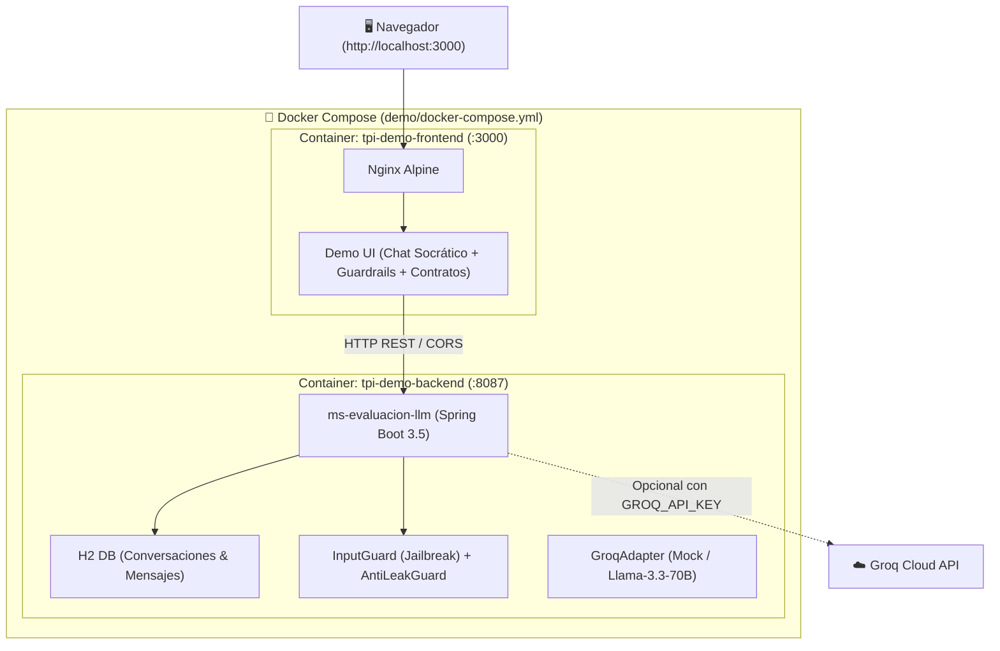

# 🚀 Suite de Demostración y Pruebas — Tema 07: Evaluación LLM

Aplicación frontend interactiva y entorno dockerizado para probar y defender de punta a punta todas las funcionalidades del **Tema 07 (Evaluación LLM & Tutor Socrático)** de la **Plataforma de Aprendizaje Gamificado** (UTN FRC · Programación IV).

---

## 🏗️ Arquitectura de la Demo



---

## ⚡ Inicio Rápido con Docker

### 1. Iniciar con un solo comando

Desde la raíz del repositorio:
```bash
docker compose -f demo/docker-compose.yml up --build -d
```

O desde la carpeta `demo/`:
* **Windows:** Doble clic en `run-demo.bat`
* **Linux / Mac / Git Bash:** `./run-demo.sh`

### 2. Acceder a las aplicaciones

| Servicio | URL | Descripción |
| :--- | :--- | :--- |
| **Frontend Demo** | [http://localhost:3000](http://localhost:3000) | Interfaz visual interactiva con chat y guardarraíles |
| **Backend REST** | [http://localhost:8087](http://localhost:8087) | Microservicio Spring Boot `ms-evaluacion-llm` |
| **H2 Console** | [http://localhost:8087/h2-console](http://localhost:8087/h2-console) | Base de datos de conversaciones en memoria |

---

## 🔑 Uso con API Key Real de Groq (Opcional)

Por defecto, el backend corre en **Modo Simulación (Mock)** sin consumir tokens ni requerir claves de API.

Si deseas que el tutor responda con el modelo de lenguaje real (`llama-3.3-70b-versatile` de Groq):

```bash
# En Windows PowerShell
$env:GROQ_API_KEY="tu_api_key_de_groq"
docker compose -f demo/docker-compose.yml up --build -d

# En Linux / Mac
export GROQ_API_KEY="tu_api_key_de_groq"
docker compose -f demo/docker-compose.yml up --build -d
```

---

## 🧪 Escenarios de Demostración para la Defensa

### 1. 💬 Tutor Socrático (Pestaña "Chat")
* Permite al alumno hacer consultas sobre desafíos de código.
* El tutor devuelve preguntas guía y pistas conceptuales, cumpliendo la directiva pedagógica de no entregar soluciones terminadas.
* Soporta multitenancy con `curso_cohorte_id`, `usuario_ref` y `desafio_id`.

### 2. 🛡️ Laboratorio de Guardarraíles y Seguridad (Pestaña "Playground")
Botones de 1 clic para probar en vivo los mecanismos de seguridad:
* **Sobrescritura de Instrucciones:** `InputGuard` detecta comandos como *"olvida tus instrucciones"* y responde con `estado: BLOQUEADO_INPUT`.
* **Ataque DAN (Do Anything Now):** Bloqueo automático de protocolos de jailbreak.
* **Evasión con Acentos / Normalización:** Demuestra que la normalización elimina diacríticos y detecta palabras clave independientemente de tildes o mayúsculas.
* **Extracción de System Prompt:** Protección de las directivas pedagógicas internas.

### 3. 🔌 Inspector de Contrato Inter-Equipos (Pestaña "Inspector")
* Prueba interactiva del endpoint `POST /ai/tutor`.
* Valida el formato del sobre estándar `AiRequest` y `AiResponse`, la propagación de `trace_id` y el tiempo de respuesta en milisegundos.

### 4. 📊 Historial y Persistencia (Pestaña "Sesiones")
* Audita las conversaciones registradas en la base de datos H2.
* Permite recargar cualquier sesión pasada en el chat.

---

## 🛑 Detener la Demo

```bash
docker compose -f demo/docker-compose.yml down
```
