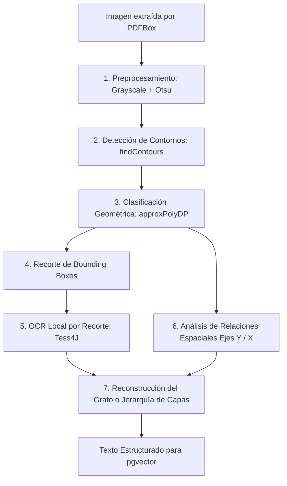

# Decodificación y Procesamiento de Imágenes en Pipelines RAG

> **Documento Técnico de Spike de Arquitectura**  
> **Proyecto:** Tutor IA Pedagógico (`demoLLMSpringAi`)  
> **Área:** Extracción de Información, Visión por Computadora y RAG Multi-Documento  
> **Fecha:** Septiembre 2026  

---

## 1. Resumen Ejecutivo y Planteo del Spike

En un sistema RAG (*Retrieval-Augmented Generation*), el objetivo principal es indexar el contenido de documentos (comúnmente archivos PDF) en una base de datos vectorial para que un modelo de lenguaje responda con contexto certero y citas exactas.

Sin embargo, los documentos reales —especialmente manuales de ingeniería, guías de arquitectura de software y material universitario— no son texto plano: **contienen diagramas de arquitectura en capas, diagramas de flujo, esquemas cliente-servidor y tablas**.

### El Desafío Central
1. **Extracción 100% desatendida:** El usuario que sube el archivo PDF al sistema no tiene que indicar qué imágenes hay ni cómo están compuestas. Todo el proceso de detección, extracción y análisis debe resolverse mediante código en el backend.
2. **La limitación del OCR plano ("Sopa de palabras"):** Si se aplica un OCR tradicional a ciegas sobre un diagrama, se extraen palabras desconectadas sin jerarquía ni dirección, perdiendo por completo la relación entre componentes o las decisiones condicionales.
3. **El dilema de la IA:** ¿Es estrictamente necesario invocar modelos multimodales externos (con costos por token y dependencias de red), o es posible decodificar la estructura visual de forma **100% determinística y sin IA** mediante visión por computadora clásica y teoría de grafos?

---

## 2. Diagnóstico de Documentos Reales (Caso de Estudio: UTN - Docker)

Tomando como referencia el material de estudio de la cátedra **Programación IV - Backend (Unidad 3: Docker)** de la UTN Facultad Regional Córdoba, se identificaron los siguientes patrones visuales:

```
+-----------------------------------------------------------------------------+
| TIPO DE IMAGEN ENCONTRADA               | EJEMPLO EN EL PDF                 |
+-----------------------------------------------------------------------------+
| 1. Diagrama de Capas (Stack Jerárquico) | Pág. 4 (Virtualización Clásica)   |
|                                         | Pág. 5 (Arquitectura de Docker)   |
| 2. Diagrama de Componentes Distribuidos | Pág. 9 (Docker Host, CLI, Registry)|
| 3. Tablas Comparativas                  | Pág. 6 (Docker vs Virtualización) |
| 4. Elementos Gráficos Institucionales   | Pág. 1, Logos y encabezados       |
+-----------------------------------------------------------------------------+
```

### Hallazgo Clave: Capas Vectoriales Nativas vs Imágenes Rasterizadas
Al inspeccionar documentos PDF generados desde procesadores de texto modernos (Word, PowerPoint, Canva o LaTeX):
- Muchos diagramas de bloques **no son mapas de bits ciegos (JPEG/PNG)**, sino **formas vectoriales con capas de texto reales**.
- En la página 4 y 5 del ejemplo de la UTN, el extractor de texto de **Apache PDFBox** ya puede leer directamente cadenas como:
  ```text
  Hardware
  Sistema Operativo Anfitrión
  Hypervisor / Docker Engine
  Máquina Virtual #1 / Contenedor #1
  SO / APP #1
  ```
- **Conclusión técnica:** El pipeline debe primero intentar extraer texto con coordenadas nativas del PDF. Solo si una región es un mapa de bits puro se debe activar el procesamiento visual.

---

## 3. Extracción de Imágenes en Backend con Apache PDFBox

En el formato PDF, las imágenes están incrustadas como flujos binarios de objetos de tipo `XObject` dentro del diccionario `/Resources` de cada página. 

El backend en Java puede recorrer el documento y extraer cada `BufferedImage` de forma desatendida:

```java
package com.example.demo.rag.service;

import org.apache.pdfbox.Loader;
import org.apache.pdfbox.cos.COSName;
import org.apache.pdfbox.pdmodel.PDDocument;
import org.apache.pdfbox.pdmodel.PDPage;
import org.apache.pdfbox.pdmodel.PDResources;
import org.apache.pdfbox.pdmodel.graphics.PDXObject;
import org.apache.pdfbox.pdmodel.graphics.image.PDImageXObject;
import org.springframework.stereotype.Service;

import java.awt.image.BufferedImage;
import java.io.File;
import java.io.IOException;
import java.util.ArrayList;
import java.util.List;

@Service
public class PdfImageExtractorService {

    public record ExtractedImage(int pageNumber, BufferedImage image, String format, int width, int height) {}

    public List<ExtractedImage> extractImages(File pdfFile) throws IOException {
        List<ExtractedImage> images = new ArrayList<>();

        try (PDDocument document = Loader.loadPDF(pdfFile)) {
            int pageNumber = 1;
            for (PDPage page : document.getPages()) {
                PDResources resources = page.getResources();
                if (resources == null) continue;

                for (COSName name : resources.getXObjectNames()) {
                    PDXObject xobject = resources.getXObject(name);
                    if (xobject instanceof PDImageXObject imgObj) {
                        // Filtro heurístico anti-ruido (ignorar iconos decorativos menores a 100x100)
                        if (imgObj.getWidth() > 100 && imgObj.getHeight() > 100) {
                            images.add(new ExtractedImage(
                                pageNumber,
                                imgObj.getImage(),
                                imgObj.getSuffix(),
                                imgObj.getWidth(),
                                imgObj.getHeight()
                            ));
                        }
                    }
                }
                pageNumber++;
            }
        }
        return images;
    }
}
```

---

## 4. El Enfoque 100% Sin IA (Algoritmos Clásicos y Geometría)

Para prescindir de modelos de lenguaje o redes neuronales generativas, el problema se modela mediante **Visión por Computadora Determinística, Geometría Computacional y Teoría de Grafos**.



### Etapa 1: Preprocesamiento y Binarización (OpenCV)
- **Conversión a escala de grises:** `Imgproc.cvtColor(src, gray, Imgproc.COLOR_BGR2GRAY)`
- **Binarización de Otsu:** `Imgproc.threshold(gray, binary, 0, 255, Imgproc.THRESH_BINARY_INV + Imgproc.THRESH_OTSU)`
- **Operación de Cierre Morfológico:** `Imgproc.morphologyEx(binary, closed, Imgproc.MORPH_CLOSE, kernel)` para reconectar líneas de borde que presenten pequeñas interrupciones.

### Etapa 2: Detección y Clasificación Geométrica de Figuras
Utilizando el algoritmo de aproximación poligonal de Douglas-Peucker (`Imgproc.approxPolyDP`):

| Forma Geométrica | Criterio Matemático | Significado Semántico |
| :--- | :--- | :--- |
| **Rombo** | 4 vértices, diagonales perpendiculares, ángulos \(\neq 90^\circ\) | **Decisión condicional (`If / Else`)** |
| **Rectángulo** | 4 vértices con ángulos rectos (\(\approx 90^\circ\)) | **Capa de software / Proceso / Componente** |
| **Óvalo / Círculo** | Factor de circularidad \(\frac{4\pi \cdot \text{Área}}{\text{Perímetro}^2} \approx 1\) | **Terminal (Inicio / Fin del flujo)** |
| **Paralelogramo** | 4 vértices, lados opuestos paralelos con inclinación | **Entrada / Salida de datos (`I/O`)** |

### Etapa 3: OCR Focalizado por Recorte (Tess4J)
**Principio:** Nunca ejecutar OCR sobre la imagen completa. Se toma cada caja delimitadora (*Bounding Box*) detectada en la Etapa 2 y se recorta su interior:

$$\text{ROI} = \text{Image}(x + \delta, y + \delta, \text{ancho} - 2\delta, \text{alto} - 2\delta)$$

Al procesar únicamente esa sub-imagen en Tesseract, se asocia el texto exclusivamente a la figura contenedora, garantizando que el texto *"Docker Engine"* pertenece exactamente al bloque de capa intermedio.

---

## 5. Decodificación de Diagramas de Arquitectura en Capas (Caso Páginas 4 y 5)

En los diagramas de arquitectura (como los de Docker y Virtualización del PDF), la relación de dependencia entre componentes no se expresa con flechas, sino mediante la **posición espacial relativa en el eje vertical (Y)** y **horizontal (X)**:

```
[APP #1]              [APP #2]              [APP #3]          <--- Nivel 3 (Columnas X1, X2, X3)
[Contenedor #1]       [Contenedor #2]       [Contenedor #3]
-------------------------------------------------------------
[                    Docker Engine                          ] <--- Nivel 2 (Y2)
-------------------------------------------------------------
[              Sistema Operativo Anfitrión                  ] <--- Nivel 1 (Y1)
-------------------------------------------------------------
[                       Hardware                            ] <--- Nivel 0 (Base Y0)
```

### Algoritmo Determinístico de Clustering Espacial:
1. **Ordenar cajas por eje Y (de abajo hacia arriba):**
   - El bloque con mayor coordenada Y (más cercano a la base física) es el nivel base (`Hardware`).
   - El siguiente bloque horizontal que cubre todo el ancho es el nivel intermedio (`Sistema Operativo Anfitrión`).
   - El tercer bloque horizontal es la capa de virtualización (`Hypervisor` en VM o `Docker Engine` en Docker).
2. **Agrupar por eje X cuando existen múltiples cajas a la misma altura Y:**
   - Detecta que en el nivel superior hay 3 columnas paralelas.
   - Cada columna agrupa verticalmente su contenedor/VM con su respectiva aplicación.

### Salida Estructurada Generada para `pgvector`:
```markdown
[Fuente: "UTN_Docker_Unidad3.pdf" | Página 5 | Tipo: Arquitectura en Capas]
Arquitectura del Sistema: Docker y Contenedores (Imagen 2)
Jerarquía de capas (desde la base física hacia las aplicaciones):
1. Capa Física Base: Hardware
2. Sistema Operativo Base: Sistema Operativo Anfitrión
3. Motor de Contenerización: Docker Engine (comparte el kernel del anfitrión)
4. Entornos de Aplicación Aislados (3 instancias paralelas):
   - Instancia 1: Contenedor #1 -> Ejecuta APP #1
   - Instancia 2: Contenedor #2 -> Ejecuta APP #2
   - Instancia 3: Contenedor #3 -> Ejecuta APP #3
```

---

## 6. Decodificación de Diagramas de Componentes Distribuidos (Caso Página 9)

Para diagramas como la **Imagen 3 (Docker CLI, Docker Host, Registry)**:

1. **Jerarquía de Contenedores (`cv::RETR_TREE`):**
   - OpenCV detecta contornos padre e hijos.
   - Contorno padre detectado: `Docker Host`.
   - Contornos hijos geométricamente contenidos dentro del padre: `Docker Daemon`, `Imágenes`, `Contenedores`.
2. **Detección de Flechas de Comunicación (Transformada de Hough):**
   - Se trazan líneas (`HoughLinesP`) entre el centro de la caja izquierda (`Docker CLI`) y el centro de `Docker Daemon`.
   - Conexión entre `Docker Daemon` y el bloque derecho (`Registry`).

### Salida Estructurada Generada:
```markdown
[Fuente: "UTN_Docker_Unidad3.pdf" | Página 9 | Tipo: Diagrama de Componentes]
Arquitectura de Componentes de Docker (Imagen 3):
- Cliente: Docker CLI (emite comandos: docker build, docker pull, docker run)
- Servidor: Docker Host
  * Núcleo: Docker Daemon (Dockerd)
  * Almacenamiento local: Imágenes
  * Procesos en ejecución: Contenedores
- Registro Externo: Registry (Docker Hub / repositorio privado de imágenes)
Interacciones: El cliente CLI envía solicitudes al Daemon en el Host; el Daemon descarga o sube imágenes al Registry y gestiona la ejecución de contenedores.
```

---

## 7. Matriz Comparativa de Enfoques

| Dimensión | Enfoque 100% Sin IA (OpenCV + Tess4J + Grafos) | Enfoque con IA Multimodal (Gemini Flash Vision) |
| :--- | :--- | :--- |
| **Costo por imagen** | **$0.00** (procesamiento local en CPU) | Fracción de centavo por token de visión (~$0.00015) |
| **Latencia / Tiempo** | **20 - 80 ms** por imagen | 800 - 2000 ms (requiere llamada HTTP externa) |
| **Privacidad / Offline** | **100% local**: Ningún byte sale del servidor | Requiere conexión a la API de Google / OpenAI |
| **Diagramas de Capas y Tablas** | **Excelente y exacto** (geometría ortogonal limpia) | **Excelente** (alta comprensión semántica) |
| **Diagramas con Flechas Curvas** | **Frágil**: Requiere heurísticas complejas de Splines | **Robusto**: Interpreta flechas sin importar el estilo |
| **Fotos o Ilustraciones artísticas** | **No aplica**: No puede describir una foto | **Excelente**: Describe cualquier escena natural |
| **Riesgo de Alucinación** | **0%**: Es puramente determinístico | Bajo, pero no nulo |
| **Complejidad de Código** | Alta (desarrollo y calibración de filtros de visión) | Muy baja (un prompt bien diseñado a la API) |

---

## 8. Stack de Dependencias Java Recomendadas (Sin IA)

Para incorporar este pipeline determinístico en el backend de Spring Boot, se requieren las siguientes dependencias Maven:

```xml
<!-- Extracción y parseo de PDFs (Ya presente en el proyecto) -->
<dependency>
    <groupId>org.apache.pdfbox</groupId>
    <artifactId>pdfbox</artifactId>
    <version>3.0.4</version>
</dependency>

<!-- Visión por Computadora clásica (OpenCV con binarios nativos automáticos) -->
<dependency>
    <groupId>org.bytedeco</groupId>
    <artifactId>opencv-platform</artifactId>
    <version>4.10.0-1.5.11</version>
</dependency>

<!-- OCR local determinístico acotado por figura -->
<dependency>
    <groupId>net.sourceforge.tess4j</groupId>
    <artifactId>tess4j</artifactId>
    <version>5.14.0</version>
</dependency>

<!-- Modelado de Grafos Dirigidos y recorridos topológicos -->
<dependency>
    <groupId>org.jgrapht</groupId>
    <artifactId>jgrapht-core</artifactId>
    <version>1.5.2</version>
</dependency>
```

---

## 9. Conclusión y Recomendación para la Arquitectura del Proyecto

1. **La premisa del usuario se cumple plenamente:** Es totalmente posible decodificar imágenes de diagramas de arquitectura y flujo **sin utilizar ninguna inteligencia artificial**, logrando costo cero, privacidad total y ejecución en milisegundos.
2. **Aprovechar primero la estructura nativa del PDF:** En documentos como los de la UTN analizados, gran parte del texto de los diagramas ya se encuentra vectorizado en el PDF. Un extractor inteligente de PDFBox con detección de coordenadas resuelve gran parte del problema antes de procesar píxeles.
3. **Estrategia en cascada recomendada:**
   - **Paso 1:** Extraer texto con coordenadas nativas de PDFBox.
   - **Paso 2:** Para imágenes de mapas de bits, aplicar el algoritmo de **Clustering Espacial de Capas (Ejes Y/X)** con OpenCV y Tess4J.
   - **Paso 3:** Serializar el resultado a texto jerárquico o sintaxis Mermaid.js y guardarlo en **Supabase `pgvector`** como un chunk enriquecido de alta relevancia semántica.
