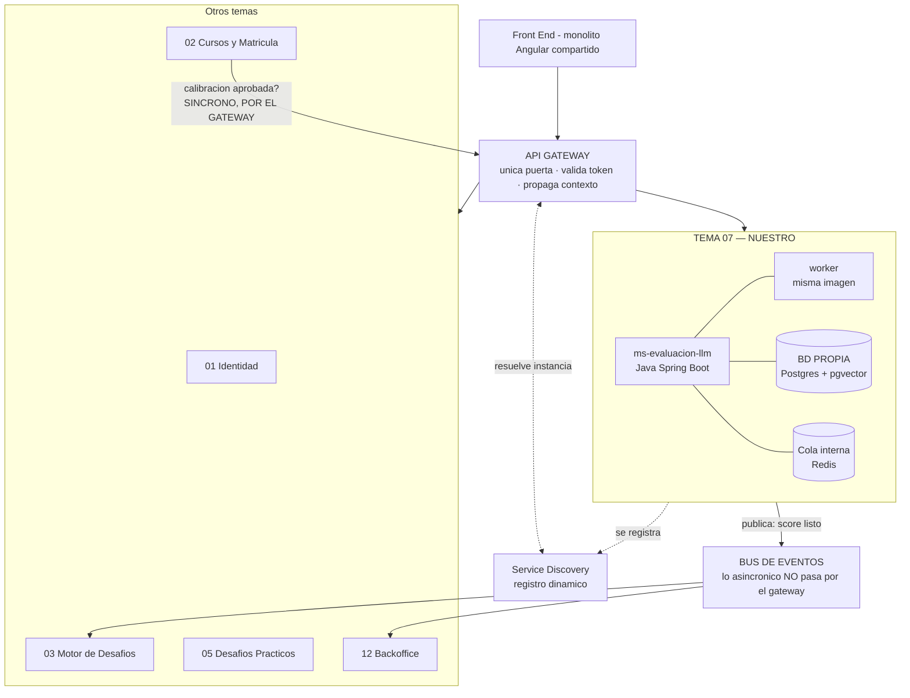
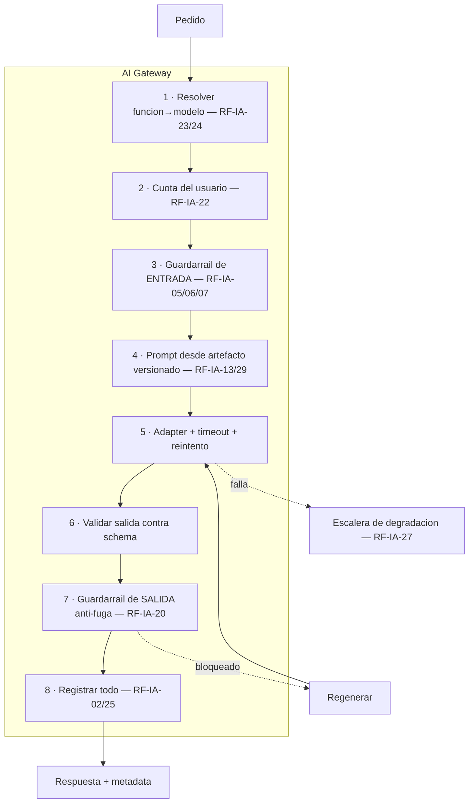

# 02 — Arquitectura y stack

> Cómo se conectan los servicios, qué hay adentro del nuestro, y en qué lenguaje se construye.

---

# Parte 1 — Arquitectura


> Cómo se conectan los servicios, qué hay adentro del nuestro y por qué cada decisión.
>
> *Consolida los antiguos 01 (arquitectura de IA), 15 (microservicios sí o no) y 16 (arquitectura de
> la cátedra). Donde hay conflicto, **manda el documento de la cátedra**.*

## 1. El marco: las reglas no negociables

`TUP_PIV_BE_PROPUESTA_ARQ.pdf` tiene una sección así titulada, y aclara: *"Lo que se define acá es de
plataforma y no se renegocia equipo por equipo."*

| Regla | Consecuencia para nosotros |
|---|---|
| El **API Gateway** es la única puerta de entrada | Ningún cliente llega directo a nuestro servicio |
| Los servicios se **registran dinámicamente** | Nuestro servicio se da de alta al levantar |
| **No hay comunicación directa entre microservicios** | Toda llamada síncrona vuelve a pasar por el gateway |
| **Cada servicio es dueño exclusivo de su base** | pgvector va en **nuestra base propia**, no en un esquema compartido |
| Lo asincrónico viaja por el **bus de eventos** | El score listo se publica como evento |
| Cada entidad tiene un **dueño único** | Nosotros damos el score; el motor de desafíos aplica el XP |

### Lo que sí seguimos decidiendo

El documento lo dice expresamente: *"Dentro de esos límites, **cada equipo decide el diseño interno de
su servicio**."*

**El AI Gateway interno, las rúbricas, el motor RAG, los workers y la organización en módulos son diseño interno nuestro.**

### La salvedad que el propio documento declara

La última página aclara que es *"una propuesta inicial... no necesariamente la solución definitiva"*,
que fue elaborada con asistencia de IA y **puede contener imprecisiones**, y que cada equipo debe
*"determinar si corresponde mantener esta propuesta, ajustarla o desarrollar una solución
superadora"*.

**Las reglas son el marco; los huecos de alcance son material para la sesión de integración.**

### Material para la defensa

Antes del documento de la cátedra, la recomendación era **monolito modular**, por un argumento que
sigue siendo cierto y conviene poder explicar:

> **Una base por microservicio rompe la atomicidad de la economía.** Otorgar XP + monedas + vidas +
> insignia + nivel es un solo acto; con bases separadas se convierte en transacción distribuida con
> sagas y compensaciones.

La cátedra llega a la misma conclusión por otro camino: *"si el 04 o el 05 pudieran otorgar XP por su
cuenta, las reglas de la economía quedarían escritas en tres lugares"*.

**Poder decir "elegimos no partir la gamificación porque otorgar XP es atómico" demuestra más criterio
que haber dibujado seis cajitas.**

## 2. El diagrama de sistema



### Cola interna vs bus de eventos — no confundirlos

| | **Cola interna** | **Bus de eventos** |
|---|---|---|
| Alcance | Dentro de nuestro servicio | Entre microservicios |
| Dueño | Nosotros | Plataforma (contrato del Tema 11) |
| Para qué | Que los workers procesen evaluaciones y generaciones | Avisar que un score quedó listo |
| ¿La regla lo prohíbe? | **No.** Es diseño interno | — |

**Los dos existen y no compiten.** Redis con workers es cómo resolvemos internamente el trabajo
diferido; el bus es cómo le contamos al mundo que terminamos.

## 3. Adentro: los ocho módulos

No son ocho microservicios: son **ocho carpetas con una interfaz explícita cada una**.

| Módulo | Qué hace | Depende de |
|---|---|---|
| **M1 · Gateway** | Registro modelo→función, adapters, reintentos, fallback, cuotas, log | — |
| **M2 · RAG** | Ingesta, chunking, embeddings, retrieval | — |
| **M3 · Evaluador** | Rúbrica versionada, prompt, scoring | M1 |
| **M4 · Calibración** | Golden set, runner, comparación con PAR-14, deriva | M1 + M3 |
| **M5 · Guardarraíles y moderación** | Filtro de entrada, salvaguarda anti-fuga con AST, moderador de chat (capa clásica + clasificador, ADR-012) | M1 |
| **M6 · Tutor** | Servicio + componente Angular | M1 + M2 + M5 |
| **M7 · Generador y corrector** | Blueprint, generación por slot, validación, corrección | M1 + M2 |
| **M8 · Plataforma** | Docker, API, contratos, cola, base, eventos | — |

## 4. El AI Gateway: la pieza central

**Toda llamada a un modelo pasa por acá.** Cuatro pasos antes y cuatro después.



### Por qué centralizarlo

El PRD pide seis propiedades que **no pertenecen a ninguna función en particular**: agnosticismo de
proveedor (RF-IA-11), asignación modelo→función por ADMIN (RF-IA-23/24), registro de toda interacción
(RF-IA-02), límites por usuario (RF-IA-22), trazabilidad de versiones (RF-IA-25) y degradación
(RF-IA-27).

**Son requerimientos del canal, no del caso de uso.** Centralizarlos es implementarlos una vez en vez
de cinco.

Y adentro del equipo vale la misma regla: **nadie llama a un proveedor por su cuenta.** Si cada uno
arma su llamada, terminás con seis formas de manejar errores, seis formatos de log y ninguna manera
de cambiar de modelo.

### Cómo se conectan los modelos

> **El código nunca nombra un modelo. Nombra una función, y una tabla dice qué modelo le toca hoy.**

```
llamar_modelo("evaluador", prompt)
        ↓
tabla:  evaluador → anthropic · haiku-4.5     ← editable por ADMIN, RF-IA-24
        ↓
adapter_anthropic  →  API del proveedor
```

- **Cambiar de modelo** = editar una fila. Sin deploy.
- **Sumar un proveedor** = escribir un adapter. Ninguna función se entera.

**No es teórico:** dos de los modelos más baratos tienen fecha de apagado dentro de la vida del
proyecto. Con la tabla, se cambia una fila; sin ella, es un deploy de urgencia en mitad del
cuatrimestre.

**El adapter normaliza en las dos direcciones:** hacia afuera el prompt, el system prompt y el pedido
de salida estructurada; hacia adentro el texto, los tokens, el motivo de corte y los errores.

### Las ocho responsabilidades

| # | Qué guarda o decide | Requerimiento |
|---|---|---|
| 1 | Tabla `funcion → proveedor + modelo + versión`, solo ADMIN. **Nunca hardcodeado** | RF-IA-23/24/35 |
| 2 | Contador por usuario/día y por usuario/desafío. Rechaza antes de gastar | RF-IA-22 |
| 3 | Injection, perímetro temático, lenguaje ofensivo | RF-IA-05/06/07/10 |
| 4 | Artefactos versionados (`rubric_version`, `prompt_version`). **Un solo criterio para todos los modelos** — RF-IA-29 prohíbe variantes | RF-IA-13/21/29 |
| 5 | Un adapter por proveedor. Es lo que hace real a RF-IA-11 | RF-IA-11/26 |
| 6 | Salida estructurada obligatoria en evaluador, corrector y generador | RF-IA-13/16 |
| 7 | Similitud contra la solución esperada. Bloquea y regenera | RF-IA-20 |
| 8 | `model_id`, `model_version`, `prompt_version`, `rubric_version`, tokens, costo, latencia, incidentes | RF-IA-02/25/33 |

**La #1 es la decisión con mejor relación esfuerzo/beneficio de todo el proyecto.** Si está bien
hecha, RF-IA-27, RF-IA-28 y RF-IA-32 se vuelven fáciles; si el modelo vive en el código, los tres se
vuelven imposibles sin refactor.

## 5. Las cinco funciones y sus perfiles

| Función | Latencia | Volumen | Riesgo si falla | Modo | Fallback de modelo |
|---|---|---|---|---|---|
| **Tutor** | < 2 s | Alto | Bajo — RF-IA-27: el alumno sigue sin él | Sincrónico | Sí |
| **Moderador** | < 300 ms ⚠️ | Muy alto | Medio | Sincrónico | Sí |
| **Evaluador** | Minutos | Bajo | **Alto — modifica XP, el XP define promoción** | Asincrónico | **NO (RF-IA-25)** |
| **Generador** | Minutos | Muy bajo | Bajo — hay revisión humana | Asincrónico | Sí |
| **Corrector** | Minutos | Medio | Alto — es una nota | Asincrónico | Sí |

> ⚠️ **Los 300 ms del moderador son dos presupuestos distintos, no uno.** La capa clásica resuelve en
> **< 1 ms** —es un match en memoria—, pero el clasificador externo se lleva un roundtrip HTTP que
> consume casi todo el margen. Por eso ADR-012 empuja tanto trabajo como puede al lado determinístico:
> **la latencia es uno de los dos motivos de esa decisión**, junto con el fail-open. El timeout hacia
> el proveedor es de 1 s ([14](14-sincronizacion-guia-didactica.md) A-3), y al vencerse aplica la
> degradación `prefiltro_solamente` del contrato.

## 6. Los contratos

### Síncronos (por el gateway)

| Quién llama | Qué pregunta |
|---|---|
| **Tema 02 — Cursos** | *"¿La calibración de este curso-cohorte está aprobada?"* — **bloquea la activación**. Es el ejemplo textual del documento de la cátedra |
| Tema 03 / 05 | Pedir una evaluación o corrección |
| Tema 12 — Backoffice | Estado de calibración, deriva, costo por curso |

### Eventos que publicamos

`score_de_ia_calculado` · `score_pendiente_diferido` · `calibracion_aprobada` /
`calibracion_fuera_de_tolerancia` · `incidente_de_jailbreak`

### Eventos que consumimos

`intento_cerrado` (dispara la evaluación) · `curso_archivado` (frena trabajos pendientes) ·
`modelo_llm_cambiado` (dispara recalibración, RF-IA-32)

> ⚠️ **El Tema 11 define el contrato de eventos para toda la plataforma y su decisión condiciona a
> cinco equipos. Si necesitás campos, pedilos antes de que lo cierren** — después es renegociar con
> todos. Los que necesitamos: `curso_cohorte_id`, `intento_id`, `alumno_id`, `rubric_version`,
> `model_id`, `model_version`, `score_agregado`, `confianza`, `estado`, `trace_id`.

### Cuatro reglas del contrato

1. **No escribimos en la base académica.** Devolvemos; el dueño persiste en su transacción.
2. **Sí somos dueños de nuestra base**: vectores y log de llamadas. Nadie más los toca.
3. **Autenticación entre servicios** por token interno. Nuestro servicio no se expone a internet.
4. **`trace_id` propagado en todas las llamadas.** Es lo único que te salva cuando algo falla.

## 7. El curso-cohorte: la clave que va en todo

El documento de la cátedra le dedica una sección entera y es su advertencia más práctica:

> *"Casi ninguna entidad existe fuera de un curso-cohorte... es la clave que viaja en cada operación y
> contra la que se acota cada consulta. **Si un equipo modela sus entidades sin esa clave, después no
> hay forma de acotarlas sin migrar datos.**"*

**`curso_cohorte_id` va en:** cada chunk del RAG, cada evaluación, cada calibración, cada trabajo de
la cola y cada evento que publiquemos.

| Concepto | Qué es | Nuestra lectura |
|---|---|---|
| **Curso template** | Se define y se reutiliza | El material del RAG cuelga de acá |
| **Curso-cohorte** | Ocurre, una vez, con sus alumnos | La calibración y las evaluaciones son de acá |

Lo respalda el Tema 02: *"calibración que se copia pero se reaprueba"* al clonar un curso.
**Confirmalo antes de definir el esquema del chunk.**

## 8. Dos detalles que se confunden

### Hay dos umbrales del 70% y son cosas distintas

| Umbral | Qué compara | Dueño |
|---|---|---|
| **PAR-11 / RF-IA-20** — anti-fuga | La respuesta del **tutor** contra la solución esperada | **Nuestro** |
| **Tema 05** — originalidad | La entrega de **un alumno** contra otra, y contra ediciones anteriores | Tema 05 |

Mismo número, problemas opuestos. **No compartas implementación asumiendo que son lo mismo.**

### La config del proveedor LLM está repartida

Tema 12 dice *"gestión del proveedor LLM, exclusiva de ADMIN"*; Tema 07 tiene *"configuración
centralizada"* en «podría ser». **Dos temas se la atribuyen.**

**Lectura razonable:** Tema 12 dueño de la pantalla y el dato; nosotros dueños de **aplicarla** en
cada llamada. Confirmarlo.

## 9. Frases del documento de la cátedra que confirman decisiones nuestras

**"El evaluador y el sandbox no conocen desafíos, cursos ni alumnos."** Es exactamente la
recomendación de corrección a ciegas: sin nombre, sin legajo, sin ranking. Menos sesgo y menos PII, de
un tiro.

*Tensión a resolver:* choca con "calibración por curso". Lectura razonable: no conoce **alumnos**,
pero sí recibe el `curso_cohorte_id` para elegir la calibración correcta.

**"El golden set depende de producción de contenido docente, no de desarrollo: es una dependencia
externa al equipo."** Confirma con las mismas palabras el riesgo de calendario que veníamos marcando.
**Usalo como respaldo cuando lo plantees.**

## 10. Qué se despliega

| Contenedor | Stack | Réplicas | Nota |
|---|---|---|---|
| `ms-evaluacion-llm` | Python FastAPI | 1-2 | Sin puerto publicado |
| `worker` | Python FastAPI | 2-6 | **Misma imagen, distinto comando** |
| `postgres` | Postgres + pgvector | 1 | **Base propia y exclusiva** |
| `redis` | Redis persistente | 1 | Cola + contadores de cuota |

Escalar el pico es `docker compose up --scale worker=6`. No hay código nuevo.

## 11. El lenguaje del servicio

**Decisión cerrada: Java Spring Boot.** Programación IV es una materia de Java, y la fricción de
meter un servicio Python en un ecosistema Spring Cloud cae justo sobre los tres puntos que la cátedra
declara no negociables.

**El fundamento completo —ventajas, desventajas, herramientas de cada uno y dónde conviene cada
lenguaje— está en [02](02-arquitectura-y-stack.md).**

Resumen de las tres conclusiones:

1. **Java gana por integración**, no por ser mejor lenguaje. El costo de ser el único servicio Python
   entre doce no se paga una vez: se paga cada vez que la plataforma cambia algo.
2. **Los argumentos de Python casi desaparecen al saber que el curso es de Java.** Si los desafíos son
   en Java, `JavaParser` es mejor que `tree-sitter` para el caso. Y los embeddings tienen camino en
   Java o por API.
3. **No construyan el componente Python todavía. Construyan las dos interfaces** que permiten
   agregarlo después si hace falta.


---

# Parte 2 — El stack: Java vs Python


> Ventajas, desventajas, herramientas concretas de cada uno, y en qué caso conviene cada lenguaje.
>
> **Decisión para este servicio: Java Spring Boot.** Pero el análisis sirve más allá de este TP —
> la pregunta "¿en qué lenguaje?" se repite en cada proyecto y casi nunca se responde bien.

## 1. Cómo se decide un lenguaje

**La pregunta "¿cuál es mejor?" no tiene respuesta.** La que sí la tiene es:

> **¿Cuál es la parte difícil de este servicio, y qué lenguaje la hace más fácil?**

Y hay tres criterios más que pesan tanto como los técnicos y que casi siempre se ignoran:

| Criterio | Pregunta |
|---|---|
| **Dificultad dominante** | ¿El problema es de integración, de correctitud, de datos o de iteración? |
| **Ecosistema** | ¿Las librerías que necesito existen y son maduras ahí? |
| **Entorno** | ¿Con qué habla este servicio, y en qué está escrito eso? |
| **Equipo** | ¿Quién lo va a mantener, y qué sabe? |

**Los dos últimos deciden más veces de las que uno admite**, y son los que más se subestiman al
empezar.

## 2. Qué necesita este servicio, capa por capa

Antes de comparar, hay que saber qué se está comparando.

| # | Capa | Qué tan crítica |
|---|---|---|
| 1 | Registrarse en Service Discovery e integrarse al API Gateway | 🔴 **No negociable** — lo impone la cátedra |
| 2 | Publicar y consumir eventos del bus compartido | 🔴 **No negociable** |
| 3 | API REST con validación de entrada y salida | 🔴 Crítica |
| 4 | Cola de trabajos y workers | 🔴 Crítica |
| 5 | Postgres con pgvector | 🔴 Crítica |
| 6 | Llamar a APIs de LLM con timeout, reintento y fallback | 🔴 Crítica |
| 7 | Validar salida estructurada contra schema | 🔴 Crítica |
| 8 | Extraer texto de PDF y documentos | 🟡 Importante |
| 9 | Generar embeddings | 🟡 Importante |
| 10 | Comparar código (AST o texto normalizado) | 🟡 Importante |
| 11 | Iterar prompts rápido | 🟢 Cómodo |
| 12 | Observabilidad: métricas, trazas, health checks | 🟡 Importante |

### 🔍 El dato que reordena todo

> **Llamar a una API de LLM no es trabajo de machine learning. Es HTTP con JSON.**

Es el error de razonamiento más común al elegir stack para un servicio de IA: *"como usa IA, va en
Python"*. Pero de las doce capas:

| | Capas |
|---|---|
| **Integración, servicio web y datos** | 1, 2, 3, 4, 5, 6, 7, 12 → **8 de 12** |
| **Genuinamente cercanas a ML** | 9 (embeddings) y parcialmente 10 → **1,5 de 12** |

**La dificultad dominante de este servicio es la integración y la correctitud, no el machine
learning.** Y encima, la parte pesada de la búsqueda vectorial la hace `pgvector` dentro de Postgres,
no el lenguaje.

---

## 3. Java — ficha completa

### Qué resuelve bien, y por qué

| Fortaleza | El porqué |
|---|---|
| **Contratos fuertes** | El compilador verifica antes de correr. En un servicio con 6 endpoints públicos y schemas estrictos, eso atrapa errores que en Python aparecen en producción |
| **Refactor seguro** | Renombrar algo en un proyecto de 6 personas es una operación mecánica, no una búsqueda de texto con miedo |
| **Concurrencia madura** | El pool de threads, el manejo de conexiones y los timeouts están resueltos y probados hace veinte años |
| **Transaccionalidad** | `@Transactional` con rollback automático. Para escrituras que tienen que ser atómicas, no hay competencia |
| **Integración empresarial** | **Es su terreno.** Service discovery, config centralizada, circuit breakers, health checks: todo viene resuelto |
| **Servicios de larga vida** | Está diseñado para procesos que corren meses. Gestión de memoria predecible, herramientas de diagnóstico maduras |

### Las herramientas, por capa

| Capa | Herramienta | Madurez |
|---|---|---|
| Framework | **Spring Boot 3.x** | 🟢 El estándar de facto |
| API REST | **Spring Web** | 🟢 |
| Validación | **Bean Validation** (Hibernate Validator) | 🟢 |
| Serialización | **Jackson** | 🟢 |
| **Service Discovery** | **Spring Cloud Netflix Eureka** — una anotación | 🟢 **Nativo** |
| **Config centralizada** | **Spring Cloud Config** | 🟢 **Nativo** |
| **Resiliencia** | **Resilience4j** — circuit breaker, retry, rate limiter | 🟢 Justo lo que pide RF-IA-27 |
| Cliente HTTP | **RestClient** · **WebClient** · **OpenFeign** | 🟢 |
| Persistencia | **Spring Data JPA** · **JdbcTemplate** | 🟢 |
| Migraciones | **Flyway** · **Liquibase** | 🟢 |
| pgvector | **pgvector-java**, o el tipo vector por JDBC | 🟡 Funciona, menos pulido |
| Cola | **Spring AMQP** (RabbitMQ) · **Spring Data Redis** · **Spring Kafka** | 🟢 |
| PDF | **Apache PDFBox** · **Apache Tika** | 🟢 Muy buenos |
| **AST** | **JavaParser** · **Eclipse JDT** | 🟢 **Para Java, lo mejor que hay** |
| Embeddings | **DJL** (Deep Java Library) · ONNX Runtime | 🟡 **Funciona, incómodo** |
| LLM | SDK oficial del proveedor · `RestClient` directo | 🟡 Menos ejemplos |
| Observabilidad | **Micrometer** · **Spring Boot Actuator** | 🟢 **Nativo** |
| Tests | **JUnit 5** · **Mockito** · **AssertJ** · **Testcontainers** · **WireMock** | 🟢 Excelente |

### Dónde brilla

- **Cuando el servicio vive dentro de un ecosistema que ya es Java.** Ahí la ventaja no es del
  lenguaje: es de no ser el raro.
- **Cuando hay que garantizar que algo es atómico.**
- **Cuando el código lo va a mantener gente que rota** — el tipado es documentación que no se
  desactualiza.
- **Cuando el servicio corre meses sin reiniciarse.**

### Dónde sufre

| Debilidad | Cuánto duele acá |
|---|---|
| **Ecosistema de ML pobre** | 🟡 Medio. Solo afecta embeddings locales |
| **Ciclo de iteración lento** | 🟡 Medio. Se mitiga con los prompts en archivos, no compilados |
| **Verboso** | 🟢 Bajo. Spring Boot moderno recortó mucho |
| **SDKs de LLM con menos ejemplos** | 🟡 Medio. Menos código de referencia para copiar |
| **AST fuera de Java** | 🟡 Medio, **pero irrelevante si los desafíos son en Java** |

### Problemas a futuro

| Escenario | Probabilidad | Qué hacer |
|---|---|---|
| Los desafíos incluyen Python, JS o C | 🟡 Media | Agregar el componente auxiliar con `tree-sitter`, o usar comparación de texto normalizado |
| Quieren embeddings locales por soberanía de datos | 🟡 Media | DJL, o el componente auxiliar |
| Aparece una técnica de IA que solo existe en Python | 🟡 Media | Ídem — **la interfaz ya está preparada** |

**Los tres tienen la misma solución y no es un refactor.**

---

## 4. Python — ficha completa

### Qué resuelve bien, y por qué

| Fortaleza | El porqué |
|---|---|
| **El ecosistema de IA vive ahí** | Toda técnica nueva sale primero en Python. No es preferencia: es dónde está la comunidad |
| **Iteración rapidísima** | Sin compilación. Para trabajo de prueba y error —que es exactamente el trabajo de prompts— importa |
| **Expresividad** | Menos código para lo mismo, sobre todo manipulando datos |
| **Pegamento** | Es el mejor lenguaje para conectar cosas que no fueron pensadas para conectarse |
| **Validación declarativa** | Pydantic es genuinamente mejor que Bean Validation para schemas complejos |
| **Notebooks** | Para explorar datos y evaluar prompts es imbatible |

### Las herramientas, por capa

| Capa | Herramienta | Madurez |
|---|---|---|
| Framework | **FastAPI** | 🟢 Excelente para APIs |
| Validación | **Pydantic** | 🟢 **Mejor que su equivalente Java** |
| Async | **asyncio** · **httpx** | 🟢 |
| **Service Discovery** | Clientes de Eureka de terceros | 🔴 **Ninguno de primera línea** |
| **Config centralizada** | A mano | 🔴 |
| Resiliencia | **tenacity** · **pybreaker** | 🟡 Funciona, menos integrado |
| Persistencia | **SQLAlchemy** · **psycopg3** | 🟢 |
| Migraciones | **Alembic** | 🟢 |
| **pgvector** | **pgvector-python** | 🟢 **Mejor soportado** |
| Cola | **Celery** · **RQ** · **Dramatiq** · **arq** | 🟢 |
| PDF | **pypdf** · **pdfplumber** · **PyMuPDF** · **unstructured** | 🟢 Más opciones |
| OCR | **pytesseract** · **PaddleOCR** | 🟢 **Mejor que Java** |
| **AST** | **tree-sitter** — decenas de lenguajes | 🟢 **Multi-lenguaje** |
| **Embeddings** | **sentence-transformers** · **FlagEmbedding** | 🟢 **Tres líneas de código** |
| LLM | SDK oficial de cada proveedor | 🟢 **De primera línea** |
| Observabilidad | **OpenTelemetry** · **structlog** | 🟡 Hay que armarlo |
| Tests | **pytest** · **respx** · **vcrpy** | 🟢 |

### Dónde brilla

- **Cuando el problema es genuinamente de datos o de ML**: entrenar, evaluar, transformar corpus.
- **Cuando la librería que necesitás solo existe ahí.** Es un argumento que gana solo.
- **Cuando lo que importa es la velocidad de exploración** — un prototipo, un análisis, un piloto.
- **Cuando el servicio es chico y aislado**, sin ecosistema al que integrarse.

### Dónde sufre

| Debilidad | Cuánto duele acá |
|---|---|
| **🔴 Integración con Spring Cloud** | **Alto.** Cae justo sobre lo no negociable |
| **Tipado opcional** | 🟡 Medio. Con type hints y Pydantic se mitiga, pero no lo verifica un compilador |
| **Refactor riesgoso** | 🟡 Medio. Con 6 personas tocando el mismo código, se nota |
| **Concurrencia con trampas** | 🟡 Medio. El GIL y mezclar sync con async traen sorpresas |
| **Observabilidad artesanal** | 🟡 Medio. Actuator te da health y métricas gratis; en Python los armás |

### El problema a futuro que no se resuelve

**Ser el único servicio distinto entre doce no es un costo único: es un costo recurrente.**

| Cuándo aparece | Qué pasa |
|---|---|
| La plataforma actualiza el discovery | Los alcanza último y a mano |
| Cambia el formato de eventos | Su cliente es distinto al de todos |
| Alguien estandariza los health checks | Hay que replicarlo |
| **Falla algo en la integración** | **La primera hipótesis va a ser "es el servicio Python"** |

Esa última fila es la más cara y no aparece en ninguna comparación técnica.

---

## 5. Comparación directa

| Capa | Java | Python | Gana |
|---|---|---|---|
| Service Discovery y Gateway | Spring Cloud, una anotación | Cliente de terceros, config a mano | 🟢 **Java, por lejos** |
| Bus de eventos | Mismo stack que los otros 11 | Cliente distinto | 🟢 **Java** |
| Resiliencia y circuit breaker | Resilience4j integrado | tenacity, a mano | 🟢 Java |
| Observabilidad | Actuator + Micrometer, gratis | Se arma | 🟢 Java |
| Transacciones | `@Transactional` | Manual | 🟢 Java |
| Refactor con 6 personas | El compilador ayuda | Búsqueda de texto | 🟢 Java |
| AST **de Java** | JavaParser, nativo | tree-sitter | 🟢 **Java** |
| API REST | Spring Web | FastAPI | 🟡 Empate |
| Validación de schema | Bean Validation | **Pydantic** | 🟡 Python, leve |
| Cola y workers | Spring AMQP | Celery | 🟡 Empate |
| pgvector | Funciona | Mejor soportado | 🟡 Python, leve |
| PDF y documentos | PDFBox, Tika | Más opciones | 🟡 Empate |
| OCR | Limitado | Mejor | 🟢 Python |
| SDK de LLM | Menos ejemplos | Primera línea | 🟢 Python |
| AST multi-lenguaje | Solo Java | **tree-sitter** | 🟢 **Python** |
| **Embeddings locales** | DJL, incómodo | **3 líneas** | 🟢 **Python, por lejos** |
| Iterar prompts | Compilación en el medio | Inmediato | 🟢 Python |

**Resultado: 7 capas para Java, 5 para Python, 5 empatadas.** Pero no se cuentan: **las dos primeras
filas son las que la cátedra hizo obligatorias.**

---

## 6. La decisión para este proyecto

### El fundamento, en cuatro puntos

1. **La dificultad dominante es la integración, no el ML.** 8 de 12 capas son servicio web y datos.
   Llamar a un LLM es HTTP con JSON.
2. **La cátedra impuso exactamente las capas donde Java gana.** Service Discovery, gateway y bus no
   son opcionales, y son las tres donde Python paga un costo semanal.
3. **Programación IV es una materia de Java.** El equipo lo conoce, los otros once equipos también, y
   la cláusula *"cada equipo decide el diseño interno"* probablemente no llega a cambiar de lenguaje.
4. **Los dos argumentos de Python casi desaparecen en este caso concreto:**
   - **AST:** si el curso es de Java, los desafíos son en Java, y **JavaParser es mejor que
     tree-sitter para Java**.
   - **Embeddings:** hay camino con DJL, o directamente por API mientras el corpus sea chico.

### Lo que se pierde, dicho sin edulcorar

- Iterar prompts va a ser más lento. Se mitiga poniendo los prompts en archivos, no en código.
- Los embeddings locales van a ser incómodos si algún día los quieren.
- Va a haber menos código de ejemplo para copiar.

**Ninguna de las tres bloquea nada.**

### El plan de contingencia: construir la frontera, no el componente

```
interface ComparadorDeCodigo    → JavaParserComparator        ← hoy
                                → HttpComparator (py-tools)   ← si hace falta

interface ProveedorEmbeddings   → ApiEmbeddings               ← hoy
                                → DjlEmbeddings               ← si importa la soberanía
                                → HttpEmbeddings (py-tools)   ← si DJL molesta
```

**Dos interfaces. Media hora de trabajo. La puerta queda abierta sin pagar nada hoy.**

### Si algún día se agrega el componente Python: NO es un microservicio

| | Microservicio | **Componente interno** |
|---|---|---|
| Se registra en el discovery | Sí | **No** |
| Otros lo llaman | Sí, por el gateway | **Solo nosotros, directo** |
| Base propia | Sí | **Ninguna: es cómputo puro** |
| Aparece en la topología | Sí | **No existe** |

> **No es un tecnicismo.** La cátedra prohíbe la comunicación directa entre microservicios. Si
> `py-tools` fuera un microservicio, llamarlo directo **violaría una regla no negociable**. Como
> componente interno, la regla ni aplica: está adentro de la frontera del servicio.

---

## 7. Cuándo elegiría cada uno (más allá de este TP)

Lo transferible.

| Situación | Lenguaje | Por qué |
|---|---|---|
| Servicio dentro de un ecosistema Java/Spring | **Java** | La integración pesa más que el lenguaje |
| Backend transaccional con reglas de negocio complejas | **Java** | Tipado y transacciones |
| Equipo grande o con rotación | **Java** | El compilador es documentación viva |
| Servicio de larga vida con SLA | **Java** | Diagnóstico y gestión de memoria maduros |
| **Pipeline de datos o entrenamiento de modelos** | **Python** | No hay competencia |
| **Prototipo o exploración** | **Python** | Velocidad de iteración |
| **La librería solo existe en Python** | **Python** | Gana solo, sin discusión |
| Servicio chico y aislado, sin ecosistema alrededor | **Python** | Menos ceremonia |
| Scripts, análisis, herramientas internas | **Python** | Obvio |

### La regla en una línea

> **Si la parte difícil es integrarse y no romper nada: Java. Si la parte difícil es manipular datos o
> usar una librería que solo existe ahí: Python.**
>
> **Y si el servicio vive rodeado de servicios en otro lenguaje, esa consideración le gana a casi
> todo lo demás.**

---

## 8. Lo que esta decisión NO decide

Para evitar que se extienda de más:

| | |
|---|---|
| **El front** | Angular, monolito compartido. Ya estaba decidido |
| **El resto del backend** | Java Spring Boot, y no es decisión nuestra |
| **El modelo de LLM** | Independiente del lenguaje. Vive en una tabla editable por ADMIN |
| **La base de datos** | Postgres + pgvector, propia y exclusiva |
| **La arquitectura interna** | Los 8 módulos y el AI Gateway son iguales en cualquier lenguaje |

**El lenguaje cambia las herramientas, no el diseño.** Todo lo de [02](02-arquitectura-y-stack.md) vale igual.

---

# Parte 3 — El contrato de la API en detalle

**Escribilo en OpenAPI antes de implementar nada.** El otro equipo arranca contra un mock mientras
ustedes construyen, y los dos avanzan en paralelo desde el día uno.

## Los seis endpoints

### 1 · Pedir una función de IA

`POST /ai/{funcion}` — funcion: `tutor` | `evaluador` | `moderador` | `generador` | `corrector`

```
Request
  contexto: { curso_cohorte_id, intento_id, desafio_id, usuario_ref }
  payload:  { ...específico de la función }
  modo:     "sync" | "async"
  idempotency_key: string

Response 200 (sync)   → { resultado, trace_id, metadata: { model_id, model_version, tokens } }
Response 202 (async)  → { job_id, estado: "pendiente" }
Response 429          → { error: "cuota_agotada", limite, reinicia_en }
Response 503          → { error: "proveedor_no_disponible", degradacion: "score_neutro" | "diferido" }
```

> **`idempotency_key` no es opcional.** Si el llamador reintenta por timeout, no queremos dos
> parciales generados ni dos evaluaciones del mismo intento.

### 2 · Estado de un trabajo

`GET /ai/jobs/{job_id}` → `{ estado, resultado?, error?, posicion_en_cola? }`

Estados: `pendiente` · `en_proceso` · `completado` · `fallido` · `reintentando`

### 3 · Indexar material de un curso

`POST /ai/ingesta` → `{ curso_template_id, documento_ref, hash }`

Devuelve `202` + `job_id`. Al terminar publica un evento con el **reporte de calidad de ingesta**
(páginas procesadas, páginas sospechosas, cobertura por unidad).

### 4 · Correr una calibración

`POST /ai/calibracion` → `{ curso_cohorte_id, golden_set_version, model_id }`

Devuelve `202` + `job_id`. Al terminar: desviación por dimensión y veredicto contra PAR-14.

### 5 · 🔴 Estado de calibración — el que bloquea al Tema 02

`GET /ai/calibracion/{curso_cohorte_id}`

```
{ aprobada: bool, desviacion_promedio, desviacion_maxima_dimension,
  model_id, model_version, rubric_version, golden_set_version, fecha }
```

**Es la dependencia más visible que otros tienen sobre nosotros.** El Tema 02 no puede activar un
curso sin esto. **Entregalo temprano aunque devuelva un mock.**

### 6 · Pendientes por curso — el que bloquea el cierre

`GET /ai/pendientes/{curso_cohorte_id}` → `{ cantidad, mas_antiguo_desde }`

RF-IA-34: el profesor no puede archivar un curso con scores pendientes. **`mas_antiguo_desde` importa
tanto como la cantidad**: un pendiente de hace tres días es más grave que cincuenta de hace una hora.

## Reglas transversales

| Regla | Detalle |
|---|---|
| **Identidad desde la sesión** | `curso_cohorte_id` y la identidad del usuario los deriva el servidor del token propagado por el gateway. **Nunca de un parámetro del cliente** |
| **`trace_id` en todo** | Se propaga y se devuelve. Es lo único que sirve cuando falla algo entre dos servicios |
| **Errores tipados** | Un código estable (`cuota_agotada`, `proveedor_no_disponible`, `calibracion_pendiente`), no un string libre |
| **Nunca devolvemos XP** | Devolvemos `score_agregado` 0-100 con su desglose. El Tema 10 aplica el modificador |
| **Versionado del contrato** | Un cambio incompatible sin aviso rompe al otro equipo en medio de su sprint |
