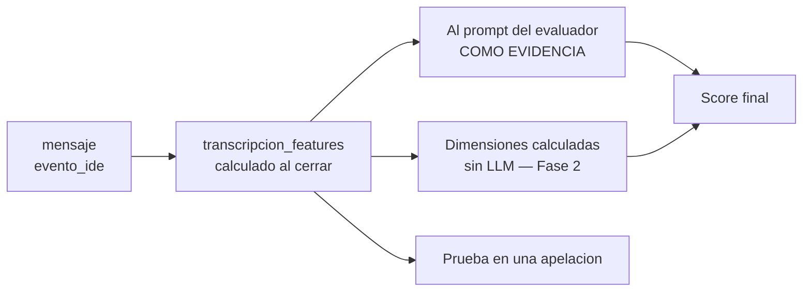

# 11 — Glosario y esquema de metadata

> 📝 **Los nombres de campos y tablas son una propuesta** (ítem E-15). El glosario, en cambio, tiene
> que acordarse en la sesión de integración, no decidirse acá (E-17). Ver
> [08](08-decisiones-y-pendientes.md), Parte C.

> Los pasos 0 y 2. Los dos primeros del plan, y los dos únicos que **no dependen de que nadie defina
> nada**.
>
> El glosario se lleva a la sesión de integración. El esquema de metadata se implementa ya, porque
> **es lo único que se pierde para siempre si se posterga**.

---

# Parte A — Glosario

## Por qué existe

**Tres temas usan la palabra "evaluación" para cosas distintas.** Si no se acuerda el vocabulario, la
sesión de integración va a cerrar acuerdos que cada equipo entiende diferente.

No es formalismo: es lo único de DDD que urge.

## Las siete colisiones

**Esta es la parte que hay que llevar a la integración.**

| Palabra ambigua | Qué entiende cada uno | Decir en su lugar |
|---|---|---|
| **"Evaluación"** | Tema 07: puntuar cómo usó la IA · Tema 03: el cierre del desafío · Tema 04: corregir · Habla común: el parcial | **Score de uso de IA** · **cierre de intento** · **corrección** · **instancia evaluada** |
| **"Corrección"** | Corregir una respuesta · o el override de un profesor | **Corrección** (solo lo primero) · **override** |
| **"Nota"** | La del desafío · el score de IA · el XP | **Resultado del desafío** · **score de uso de IA** · **XP** |
| **"Calibración"** | Suena a ajustar el modelo | **Verificación contra el golden set.** No se ajusta nada del modelo |
| **"Entrenar"** | Se usa para el RAG | **Indexar.** No se entrena ningún modelo en este proyecto |
| **"Umbral del 70%"** | Anti-fuga (Tema 07) · originalidad entre alumnos (Tema 05) | **PAR-11 / anti-fuga** · **umbral de originalidad** |
| **"Curso"** | El template reutilizable · la cohorte que ocurre | **Curso template** · **curso-cohorte** |

> **La de "entrenar" es la que más confusión genera fuera del equipo.** Cuando alguien dice "el
> sistema se entrena con el apunte", está describiendo RAG. Ningún modelo se entrena acá, y RF-IA-29
> prácticamente lo prohíbe al exigir que la rúbrica sea portable entre modelos.

## Los términos

### Evaluación y notas

| Término | Definición |
|---|---|
| **Score de uso de IA** | Puntaje 0-100 sobre **cómo** el alumno usó al tutor. Se calcula al cerrar cada intento. Modifica el XP ±20% (PAR-05). **No es una nota de contenido** |
| **Corrección** | Decidir si una respuesta está bien. Solo las **respuestas abiertas** necesitan un modelo |
| **XP** | Experiencia. La calcula el Tema 10, no nosotros. Nosotros damos el score; ellos aplican el modificador |
| **Override** | Un profesor sobrescribe un puntaje. **Se agrega, nunca pisa el original** (RF-IA-18) |
| **Apelación** | El alumno pide revisión humana de su score |
| **Confianza** | Qué tan seguro está el evaluador de su propio puntaje. Dirige la revisión humana (RF-IA-17) |

### Rúbrica y calibración

| Término | Definición |
|---|---|
| **Rúbrica** | Artefacto **declarativo** versionado: 5 dimensiones, sus pesos y sus anclas. **No es un prompt.** Un docente tiene que poder leerla |
| **Dimensión** | Cada uno de los 5 criterios. Se puntúan 0-100 por separado |
| **Ancla** | Ejemplo de qué es "bajo", "medio" y "alto" en una dimensión. Es lo que reduce la varianza entre personas |
| **Peso** | Cuánto aporta cada dimensión al total. Fijos a nivel plataforma: 30/25/20/15/10 |
| **Golden set** | Conjunto de transcripciones puntuadas **por personas**, usado como vara para medir al modelo. **Nunca puntuado por un modelo** |
| **Calibración** | Verificar que un modelo puntúa parecido a los docentes sobre el golden set |
| **Desviación** | La diferencia entre lo que puso el modelo y lo que pusieron los docentes |
| **Tolerancia (PAR-14)** | ±5 de desviación promedio y ±10 en cualquier dimensión. Fuera de eso, el modelo no se habilita |
| **Deriva** | Que el criterio del modelo se corra solo, porque el proveedor lo actualizó sin avisar (RF-IA-32) |

### Conversación

| Término | Definición |
|---|---|
| **Interacción** | Un mensaje del alumno y su respuesta del tutor |
| **Transcripción** | La conversación **completa** de un intento + su metadata. **Nunca se trunca** para evaluar |
| **Metadata** | Tiempos entre mensajes, ediciones de código, ejecuciones. **Es evidencia, no adorno** |
| **Feature** | Un valor calculado a partir de la metadata, sin LLM |
| **Intento** | Una pasada del alumno por un desafío. Cada intento tiene su transcripción y su score |

### RAG

| Término | Definición |
|---|---|
| **Ingesta** | Tomar el material del profesor y dejarlo indexado. **Una vez por curso**, no por consulta |
| **Chunk** | Un fragmento del material, de 500-800 tokens, con su metadata de origen |
| **Embedding** | La representación numérica de un chunk, para poder buscar por significado |
| **Retrieval** | Recuperar los chunks relevantes a una consulta |
| **RAG** | Buscar fragmentos y ponerlos en el prompt. **No es entrenar** |
| **Perímetro temático** | Que el tutor solo responda sobre el curso. **Lo hace cumplir el retrieval, no el prompt** (RF-IA-06) |

### Seguridad

| Término | Definición |
|---|---|
| **Guardarraíl de entrada** | Revisa el mensaje **del alumno** antes de llamar al modelo |
| **Guardarraíl de salida** | Revisa la respuesta **del modelo** antes de mostrarla |
| **Salvaguarda anti-fuga** | El guardarraíl de salida específico de RF-IA-20: compara contra la solución esperada y bloquea si supera PAR-11 |
| **Fuga** | Que la IA le entregue al alumno la solución, o algo equivalente a ella |
| **Jailbreak** | Intento de que el modelo ignore sus restricciones |
| **Incidente** | Un intento detectado, registrado y visible al profesor. **Cada uno cuenta: no hay umbral de tolerancia** (RF-IA-10) |
| **Prompt injection** | Texto del usuario que intenta pasar por instrucción del sistema |

### Modelos

| Término | Definición |
|---|---|
| **Función de IA** | Una de las cinco: tutor, evaluador, moderador, generador, corrector |
| **Proveedor** | La empresa: Anthropic, Google, OpenAI |
| **Modelo** | El modelo concreto. **Se asigna por función, y vive en una tabla editable por ADMIN** |
| **Adapter** | El código que traduce nuestro formato interno al de cada proveedor. Es un patrón GoF: por eso sumar un proveedor no toca ninguna función |
| **Batch** | Modo asincrónico del proveedor, 50% más barato |
| **Prompt caching** | Cobrar más barato el prefijo estable que se repite entre llamadas |

### Patrones de diseño

Los que aparecen por nombre en la documentación. **El mapa completo de qué patrón resuelve qué
decisión está en [04](04-funciones-de-ia.md) §2.3.4b —pipeline contra cadena— y §2.3.4c.**

| Término | Definición | Dónde se usa |
|---|---|---|
| **Pipes and Filters** (pipeline) | Etapas ordenadas; **corren todas** y cada una transforma el dato | La normalización previa al matching: acentos, leet, repetidos |
| **Chain of Responsibility** (cadena) | Eslabones; **corta en el primero que resuelve**. No corren todos | Solo el corte capa clásica → clasificador. **Dos eslabones**, no cinco: es el único lugar donde hay trabajo caro que evitar |
| **Strategy** | Varias implementaciones intercambiables detrás de una misma interfaz | Cada detector del moderador. Es lo que evita el `if/else` que crece con cada categoría |
| **Composite** | Tratar a un grupo de objetos como si fuera uno solo | Los detectores clásicos: corren todos y fusionan veredictos, porque `categorias` es un array |
| **Adapter** | Traduce entre nuestro formato y el de un tercero | Un adapter por proveedor de IA (M1, ADR-001) |
| **Factory Method** | Construir el objeto concreto según configuración, no según código fijo | Elegir el modelo por función, que RF-IA-11 exige editable por ADMIN |
| **Circuit Breaker** | Corta las llamadas a un servicio que está fallando y las reintenta más tarde | Todos los proveedores. **Resilience4j**, elegido en [02](02-arquitectura-y-stack.md) |
| **Rate Limiter** (token bucket) | Limita cuántas operaciones por unidad de tiempo se permiten | Spam por usuario en el moderador. También Resilience4j |
| **Idempotent Receiver** | Recibir dos veces el mismo pedido produce un solo efecto | El `idempotency_key` de todos los contratos `/ai/*` |
| **Buffer Interceptor** | Retiene la salida en streaming hasta poder validarla | Salvaguarda anti-fuga del tutor ([14](14-sincronizacion-guia-didactica.md) A-1) |

> ⚠️ **Pipeline y cadena se confunden todo el tiempo, y no son lo mismo.** En un **pipeline corren
> todas** las etapas y cada una **transforma**; en una **cadena se corta** en la primera que
> **decide**. El moderador usa los dos, en lugares distintos y por motivos distintos — el desarrollo
> está en [04](04-funciones-de-ia.md) §2.3.4b.

### Versionado

| Campo | Qué versiona | Se guarda con |
|---|---|---|
| `rubric_version` | Dimensiones, pesos y anclas | Cada score |
| `prompt_version` | La plantilla que se le manda al modelo | Cada llamada |
| `golden_set_version` | El conjunto de referencia | Cada calibración |
| `model_id` + `model_version` | Qué modelo lo hizo | Cada score y cada llamada |

**Regla:** cambiar dimensiones, pesos o anclas es una `rubric_version` nueva. Y **no se recalculan
puntajes históricos** (RF-IA-13).

---

# Parte B — Esquema de metadata

## El principio

> **Guardá los eventos crudos; los features se derivan después.**

Todavía no sabés exactamente qué features van a importar. Pero **de eventos crudos podés recalcular
cualquier feature; de features no podés recuperar los eventos.**

Y hay una asimetría que decide la urgencia:

| | ¿Se puede reconstruir después? |
|---|---|
| El **texto** de los mensajes | 🟢 Sí, si lo guardaste |
| Los **tiempos** entre mensajes | 🔴 **No. Nunca** |
| Las **ediciones de código** entre mensajes | 🔴 **No. Nunca** |
| Las **ejecuciones de tests** | 🔴 **No. Nunca** |

**Los tres últimos son la evidencia de autonomía — la dimensión que pesa 30%.** Si no se capturan en
el momento, esa dimensión queda inevaluable para siempre.

## Tabla 1 — `mensaje`

Un registro por mensaje, escrito **en el momento**.

| Campo | Tipo | Por qué |
|---|---|---|
| `mensaje_id` | uuid | |
| `conversacion_id` | uuid | Agrupa la transcripción |
| `intento_id` | uuid | Un intento = una transcripción = un score |
| `curso_cohorte_id` | uuid | 🔴 **La clave que va en todo.** Sin ella no se puede acotar nada después |
| `orden` | int | Secuencial dentro de la conversación. No confiar solo en el timestamp |
| `rol` | enum | `alumno` \| `tutor` |
| `contenido` | text | **Sin `alumno_id` incrustado adentro**, para poder anonimizar |
| `timestamp` | timestamptz | Con zona horaria |
| `ms_desde_anterior` | bigint | Derivable, **pero guardalo igual**: es la consulta más frecuente |
| `ms_desde_inicio_intento` | bigint | Para ver la curva de la conversación |
| `caracteres` | int | Señal barata de trivialidad |
| `desde_cache` | bool | Si la respuesta salió de caché |
| `model_id` / `model_version` | text | Solo en mensajes del tutor |
| `prompt_version` | text | Solo en mensajes del tutor |
| `tokens_in` / `tokens_out` | int | Costo y auditoría |
| `latencia_ms` | int | |
| `trace_id` | text | Para cruzar con el log técnico |

> **`orden` además de `timestamp`:** dos mensajes pueden caer en el mismo milisegundo, y los relojes
> se ajustan. El orden lo define un contador, no el reloj.

## Tabla 2 — `evento_ide`

**La tabla que casi nadie construye y sin la cual no se puede medir autonomía.**

| Campo | Tipo | Por qué |
|---|---|---|
| `evento_id` | uuid | |
| `intento_id` | uuid | |
| `curso_cohorte_id` | uuid | |
| `timestamp` | timestamptz | |
| `tipo` | enum | `edicion` \| `ejecucion` \| `envio` \| `apertura` |
| `lineas_agregadas` | int | Opcional, enriquece la señal |
| `lineas_eliminadas` | int | Opcional |
| `resultado_ejecucion` | enum | `paso` \| `fallo` \| `error`. Solo si `tipo = ejecucion` |

### Por qué `ejecucion` vale tanto

**Un alumno que corrió los tests, vio que fallaban y recién ahí preguntó, es distinto de uno que
preguntó sin ejecutar nada.** Es la señal más limpia de autonomía que existe en el sistema, y es
puramente objetiva.

> ⚠️ **Las ejecuciones vienen del sandbox (Tema 06) o del IDE (Tema 05), no de nosotros.** Hay que
> pedirles que nos publiquen ese evento. **Si no se pide ahora, no va a existir.**

## Tabla 3 — `transcripcion_features`

Calculada al cerrar el intento, a partir de las dos tablas anteriores. **Sin LLM.**

### Volumen y ritmo

| Feature | Alimenta |
|---|---|
| `mensajes_alumno` · `mensajes_tutor` | Eficiencia |
| `duracion_total_ms` | Contexto general |
| `mediana_ms_entre_mensajes` | Eficiencia · ritmo |
| `max_rafaga_3min` | Detección de flood |

### Autonomía — las tres que más pesan

| Feature | Por qué |
|---|---|
| `ms_hasta_primer_mensaje` | 🔴 **¿Pensó antes de preguntar?** |
| `ediciones_antes_primer_mensaje` | 🔴 **¿Intentó antes de preguntar?** |
| `ejecuciones_antes_primer_mensaje` | 🔴 **La más limpia de las tres** |
| `ediciones_totales` · `ejecuciones_totales` | Actividad del intento |
| `ediciones_entre_mensajes_mediana` | ¿Trabajó entre pregunta y pregunta, o solo esperó? |

### Calidad de la interacción

| Feature | Alimenta |
|---|---|
| `mensajes_triviales` | Eficiencia. Definición: menos de N caracteres y sin signos de contenido |
| `similitud_media_consecutivos` | **Progresión.** Alta similitud = está repitiendo la misma pregunta |
| `caracteres_promedio_alumno` | Señal débil de claridad |
| `incidentes_jailbreak` · `incidentes_pedido_solucion` | 🟢 **Cumplimiento de límites, casi directo** |
| `bloqueos_antifuga` | Cuántas veces hubo que regenerar |

## Cómo se usa esto

**Tres usos, y el primero se puede aprovechar ya:**

1. **Como evidencia en el prompt.** En vez de pedirle al modelo que adivine si el alumno intentó
   antes de preguntar, se lo decís: *"editó código 7 veces y ejecutó los tests 2 veces durante 3 min
   40 s antes de este mensaje"*. **El modelo juzga mejor con datos que sin ellos**, y esto es una
   línea del prompt.
2. **Para reemplazar dimensiones enteras** más adelante, cuando el golden set exista y haya contra
   qué ajustar las fórmulas.
3. **Como prueba en una apelación.** *"3 mensajes triviales, 0 ediciones antes de la primera
   pregunta"* es defendible de una forma que *"el modelo consideró que…"* no es.

## Reglas del esquema

| Regla | Por qué |
|---|---|
| 🔴 **`alumno_id` y `curso_cohorte_id` afuera del texto**, siempre | Si quedan incrustados en el contenido, **anonimizar es imposible** (RF-NFR-01) |
| **`curso_cohorte_id` en todas las tablas** | La cátedra: *"si un equipo modela sin esa clave, después no hay forma de acotarlas sin migrar datos"* |
| **Los eventos son inmutables** | Nada se edita ni se borra. Es producción académica (RF-NFR-01) |
| **Los features se recalculan** | Si mejorás una fórmula, la recalculás desde los eventos crudos |
| **`idioma` como campo desde ahora** | RF-NFR-08 exige recalibrar **por idioma**. Cuesta cero hoy y evita migrar datos después |

## Volumen

| | |
|---|---|
| Mensajes por cuatrimestre | ~19.200 |
| Eventos de IDE | ~100.000 |
| Tamaño estimado | **Decenas de MB** |

**No optimices por almacenamiento. Optimizá por poder encontrar las cosas:** índices por
`intento_id`, `curso_cohorte_id` y `timestamp`.

## Qué hacer esta semana

| # | Acción | Quién |
|---|---|---|
| 1 | Crear las tres tablas | P5 |
| 2 | Escribir en `mensaje` desde la primera versión del tutor | P5 + P6 |
| 3 | **Pedirle al Tema 05 / 06 el evento de ediciones y ejecuciones** | 🔴 P5 — **si no se pide ahora, no va a existir** |
| 4 | Calcular los features al cerrar el intento | P3 |
| 5 | Pasarle los features al prompt del evaluador como evidencia | P3 |

**El punto 3 es el único que depende de otro equipo, y es el más valioso.** Sin las ejecuciones de
tests, la señal más limpia de autonomía no existe.
