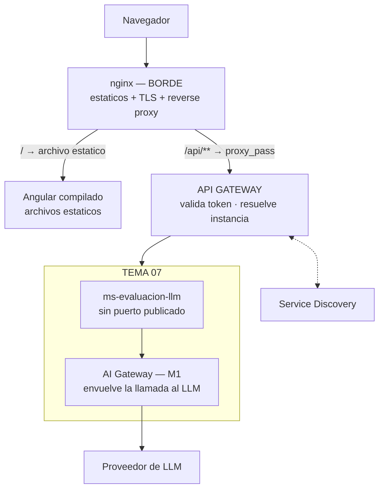

# 15 — Sincronización con la U1 de Front End

> Comparación con `TUP_PIV_FE_TEO_U1_ARQUITECTURA_DESPLIEGUE.pdf` (30 páginas, teórico de
> **Programación IV — Front End, Unidad 1: Arquitectura y Despliegue**).
>
> **Veredicto: no hay ningún conflicto de arquitectura, pero sí un hueco grande de nuestro lado.**
> La unidad no nos contradice: cubre temas sobre los que nuestra documentación no decía
> absolutamente nada —cómo se publica una versión, qué chequea una sonda de salud, qué es un entorno
> de staging—. **Adoptamos ocho cosas, descartamos ocho con fundamento, y descubrimos que dos ya
> las hacíamos sin saber cómo se llamaban.**

---

# Resumen ejecutivo

## Qué es este material y qué no

Es **teoría de la carrera de Front End**, no un requisito del Tema 07. No define contratos ni
entregables nuestros, y su caso guía —la Pizzería Don Nginx— es un negocio ficticio que crece de un
sitio estático a microservicios con balanceo.

**Pero es de la misma cátedra que escribió `TUP_PIV_BE_PROPUESTA_ARQ.pdf`**, cuyas reglas no
negociables gobiernan [02](02-arquitectura-y-stack.md) §1. Y llega desde el otro lado del sistema:
el borde por donde entra el tráfico, y el proceso por el que se publica una versión. Eso lo vuelve
material de defensa y, en varios puntos concretos, material de decisión.

**Lo que trae, en dos bloques:**

| Bloque | Temas |
|---|---|
| **A · Infraestructura** (pág. 3-19) | Cliente-servidor y el problema de escalar · servidor web · Nginx · forward vs reverse proxy · Nginx como gateway de microservicios · **BFF** · load balancing con `upstream` y cuatro algoritmos · Docker: build multietapa, `try_files`, `expose` vs `ports`, `depends_on` · configuración dinámica con `envsubst` |
| **B · Despliegue** (pág. 20-30) | Qué es desplegar y por qué es crítico · el despliegue en el ciclo de vida · **Blue-Green · Canary · Rolling Update · A/B Testing · Shadow · Feature Flags** · herramientas en cuatro categorías · tabla comparativa de riesgo y complejidad |

## Los tres hallazgos que ordenan todo lo demás

**1. "Gateway" ya significaba dos cosas acá, y la unidad trae una tercera.** Nginx como gateway (lo
que enseña), el API Gateway de la plataforma (lo que impone la cátedra de Back End) y el AI Gateway
interno (lo que llamamos así nosotros). Es la **octava colisión** del glosario y estaba sin
declarar.

**2. El readiness no puede mirar al proveedor de LLM, y eso lo descubrimos por esta unidad.** La
unidad pide health checks activos. Si nuestra sonda incluyera al proveedor, una caída del proveedor
sacaría la instancia de rotación — **exactamente lo que RF-IA-27 prohíbe**. Es ADR-014, y es una
decisión que no existiría sin este material.

**3. Shadow Deployment es el mejor aporte de la unidad a este proyecto, y no lo usamos para
desplegar.** Duplicar tráfico real y **descartar la respuesta** es exactamente cómo se valida una
`rubric_version` o un `prompt_version` nuevos sin tocar la nota de nadie. La calibración de
[04](04-funciones-de-ia.md) ya validaba contra el golden set; el shadow le agrega el tráfico real.

## Y dos cosas que ya hacíamos sin nombrarlas

**Feature flags.** *"Cambiar de modelo = editar una fila. Sin deploy"*
([02](02-arquitectura-y-stack.md)) y *"si lo cambia un ADMIN sin pedir un deploy, va en la base"*
([06](06-operacion-e-ingenieria.md)). Eso **es** un feature flag, con persistencia en tabla.
Ponerle el nombre de la cátedra no cambia el diseño, pero sirve en la defensa.

**Rolling update.** `docker compose up -d` con réplicas **es** un rolling update. Lo que faltaba no
era el mecanismo: era hacerse cargo del costo que trae —que las dos versiones convivan— y eso ahora
es ADR-013.

---

# El detalle

## 1. Erratas del PDF

Para no citarlo mal en la defensa:

| # | Qué |
|---|---|
| 1 | El pie de página dice **"Teórico - U2"** en las 30 páginas; la portada y el índice dicen **Unidad N.º 1** |
| 2 | **Falta la Figura 30**: las figuras saltan de la 29 (pág. 24) a la 31 (pág. 25) |
| 3 | El recuadro *"En producción: la detección básica de Nginx se apoya en fallos de conexión…"* está **repetido** en pág. 15 y pág. 18, y en la segunda aparición está fuera de contexto: habla de balanceo dentro de la sección de Docker Compose |
| 4 | Pág. 18: *"En producción: **En producción:** depends_on solo espera…"* — el prefijo quedó duplicado |

Ninguna afecta el contenido técnico. La 1 es la única que conviene tener presente: **si alguien
busca "U2", esta es la unidad que va a encontrar.**

## 2. Los tres gateways

**Esta es la parte que más confusión puede generar en la integración**, porque las tres cosas se
dicen igual y las tres aparecen en el mismo diagrama.

| Cuál | Qué hace | Dónde vive | Quién lo decide |
|---|---|---|---|
| **nginx (borde)** | Sirve el Angular compilado, termina TLS, hace de reverse proxy hacia adentro | Delante de todo | Infraestructura compartida |
| **API Gateway** | Única puerta a los microservicios. Valida el token, propaga contexto, resuelve instancia contra Service Discovery | Entre nginx y los servicios | **La cátedra: regla no negociable** |
| **AI Gateway** (M1) | Envuelve toda llamada a un LLM: cuota, guardarraíles, adapter, reintento, registro. **No rutea tráfico HTTP entrante** | Adentro de `ms-evaluacion-llm` | Nosotros, es diseño interno |

**La unidad enseña a Nginx como gateway de microservicios, con un `location` por servicio.**
Aplicado literalmente acá, chocaría con dos reglas no negociables: *"el API Gateway es la única
puerta de entrada"* y *"no hay comunicación directa entre microservicios"*. Un `proxy_pass` hacia
`ms-evaluacion-llm` abriría una segunda puerta que no valida el token, y dejaría el registro
dinámico sin sentido.

**No se contradicen: son dos capas distintas.** Nginx es el borde; el gateway es el ruteo. La
decisión y su condición de revisión están en ADR-015.

**Las tres flechas que importan son las que no están:** nginx nunca toca a `ms-evaluacion-llm`; el
API Gateway nunca sabe que existe un LLM; y el AI Gateway nunca recibe una petición de afuera.

## 3. Mapa tema por tema

| Tema de la U1 | Qué hacemos nosotros | Veredicto |
|---|---|---|
| **Servidor web / estáticos** | El Angular compilado lo sirve nginx en el borde. No es nuestro entregable | 🟡 Aplica, pero no a nuestro servicio |
| **Reverse proxy** | nginx delante del API Gateway | ✅ Es la arquitectura real, ahora explícita en [02](02-arquitectura-y-stack.md) §2 |
| **Nginx como gateway de microservicios** | El ruteo lo hace el API Gateway con Service Discovery | ❌ **No aplica.** Chocaría con dos reglas no negociables (ADR-015) |
| **BFF** | Ninguna de nuestras pantallas combina datos de varios microservicios | ❌ No aplica, y conviene poder decir por qué |
| **Load balancing con `upstream`** | El balanceo entre réplicas lo resuelve el gateway. El worker escala por cola, que es otro patrón | ❌ No aplica a nosotros |
| **`ip_hash` / sticky sessions** | Nuestro servicio es stateless: la identidad viene del token propagado | ❌ No aplica, **y es una propiedad que conviene defender** |
| **Build multietapa** | El `Dockerfile` del servicio todavía no existe | ✅ **Adoptado como requisito** para cuando se escriba |
| **`expose` vs `ports`** | *"Sin puerto publicado"* ya estaba en [01](01-problema-y-alcance.md) | 🟡 Ya lo hacíamos; la unidad le da el mecanismo exacto |
| **`envsubst`** | Spring lee variables en cada arranque | ❌ No hace falta, **y la propia unidad explica por qué** |
| **`depends_on` no espera readiness** | El compose todavía no existe | ✅ **Adoptado:** `healthcheck` + `condition: service_healthy` |
| **Health checks activos** | No había ninguna sonda definida | ✅ **Adoptado, con una excepción propia** (ADR-014) |
| **Blue-Green** | Duplicaría infraestructura y choca con migraciones append-only | ❌ Descartado (ADR-013) |
| **Canary** | Con 1-2 réplicas el mínimo es 50% | ❌ Descartado (ADR-013) |
| **Rolling Update** | Es lo que ya hace `docker compose up -d` | ✅ **Adoptado como estrategia declarada** (ADR-013) |
| **A/B Testing** | Compararía versiones sobre alumnos distintos | 🔴 **Inaceptable por el dominio**, no por la infraestructura |
| **Shadow Deployment** | La calibración ya validaba contra el golden set | ✅ **Adoptado, pero para calibrar**, no para desplegar |
| **Feature Flags** | La tabla `funcion → modelo` de RF-IA-24 | 🟡 **Ya lo hacíamos.** Lo que faltaba era el nombre |
| **Infraestructura como código (Terraform, Ansible)** | El server del CI ya existe y se administra a mano | ❌ Fuera de alcance |
| **Pipelines de CI/CD** | Tenemos la mitad izquierda construida ([16](16-pipeline-y-verificaciones.md)) | 🟡 **El hueco de CD ahora está declarado** |
| **Secretos (Vault)** | Los tres niveles están en [06](06-operacion-e-ingenieria.md) Parte 5 | 🟡 Coincidimos; la herramienta concreta sigue sin dueño |
| **Prometheus / Grafana** | Micrometer + Actuator, elegidos en [02](02-arquitectura-y-stack.md) | 🟡 Compatibles: Micrometer exporta a Prometheus |

## 4. ✅ Lo que adoptamos

| # | Qué | Por qué importa | Dónde va |
|---|---|---|---|
| **A-1** | 🔴 **El proveedor de LLM fuera del readiness** | Una sonda que lo incluyera sacaría la instancia de rotación cuando el proveedor cae — **justo lo que RF-IA-27 prohíbe**. Convierte una degradación prevista en una caída total | ADR-014 · [06](06-operacion-e-ingenieria.md) Parte 7 |
| **A-2** | 🔴 **Shadow deployment para calibrar** | Validar una `rubric_version` o un `prompt_version` nuevos contra transcripciones reales **descartando la salida**. El riesgo que la unidad marca —duplicar operaciones que escriben— no nos aplica: la evaluación en sombra no emite score | [04](04-funciones-de-ia.md) · [13](13-rubrica-y-prompts.md) |
| **A-3** | **Rolling update como estrategia declarada** | No cambia lo que hacemos: hace explícito el costo. Convierte el versionado del contrato de recomendación en requisito de despliegue | ADR-013 · [06](06-operacion-e-ingenieria.md) Parte 7 |
| **A-4** | **`healthcheck` + `condition: service_healthy`** | `depends_on` solo espera a que el contenedor inicie. Sin esto el arranque en frío falla intermitentemente y siempre parece otra cosa | [06](06-operacion-e-ingenieria.md) Parte 7 |
| **A-5** | **Build multietapa en el Dockerfile** | Ni Maven ni el código fuente llegan a la imagen que corre. El Dockerfile todavía no existe: se escribe con esta regla desde el primer día | [06](06-operacion-e-ingenieria.md) Parte 7 |
| **A-6** | **Staging como tercer entorno** | La Parte 5 hablaba solo de dev y producción. Staging es el que le da sentido a *"la misma imagen viaja a los tres"* | [06](06-operacion-e-ingenieria.md) Parte 7 |
| **A-7** | **Tag por SHA del commit, nunca `latest`** | Un `latest` no se puede revertir porque no nombra nada | [06](06-operacion-e-ingenieria.md) Parte 7 |
| **A-8** | **El vocabulario** | Reverse proxy, BFF, rolling update, feature flag, shadow, readiness. Aparece en la defensa | [11](11-glosario-y-metadata.md) |

> ### 🏆 A-1 y A-2 son los dos que valen el ejercicio
>
> **A-1** es una decisión que no existiría sin este material. Nuestra documentación mencionaba
> health checks solo como *"algo que Actuator te da gratis"*, sin preguntarse nunca qué tendrían que
> chequear. La pregunta la trajo la unidad; **la respuesta la impone RF-IA-27 y va en contra de lo
> que uno haría por reflejo.**
>
> **A-2** le pone nombre y encuadre a un problema que teníamos abierto: cómo probar que un cambio de
> rúbrica no empeora las notas, sin usar alumnos de conejillo de indias. Shadow es exactamente eso,
> y la objeción que la unidad le hace —duplicar efectos secundarios— es justo la que no nos toca.

## 5. ❌ Lo que no aplica, y por qué

**Esto está escrito como decisión, no como omisión.** Si alguien pregunta en la defensa por qué no
hay un canary, la respuesta no puede ser que no se nos ocurrió.

| Qué | Por qué no |
|---|---|
| **A/B Testing** | 🔴 **Es el único descarte que no es técnico.** Compara versiones sobre poblaciones distintas: dos alumnos con la misma transcripción recibirían notas de versiones distintas. Una nota no es una tasa de conversión, y esa diferencia no se justifica ante nadie |
| **Blue-Green** | Duplica la infraestructura, y su punto débil declarado son las migraciones de base. Las nuestras son append-only ([07](07-datos-y-terminos.md) §3.3), y van camino a triggers de inmutabilidad en la base ([14](14-sincronizacion-guia-didactica.md) A-5): dos esquemas vivos a la vez es peor acá que en un CRUD |
| **Canary** | Necesita repartir tráfico por porcentaje. Con 1-2 réplicas el mínimo alcanzable es 50%, que ya no es un canario |
| **Nginx como gateway de microservicios** | Chocaría con dos reglas no negociables. ADR-015 |
| **`ip_hash` / sticky sessions** | Nuestro servicio es stateless por diseño. **Y no es un detalle: es lo que permite que `--scale worker=6` funcione sin pensarlo.** Un servicio con afinidad de cliente no se escala cambiando un número |
| **`envsubst`** | **La propia unidad explica por qué no nos hace falta:** Angular lo necesita porque ya generó archivos estáticos y no queda proceso que consulte el entorno. Spring lee variables en cada arranque. Misma meta —una imagen para todos los entornos—, mecanismo distinto |
| **BFF** | Ninguna de nuestras pantallas combina datos de varios microservicios. Un BFF acá sería una capa sin trabajo que hacer |
| **Terraform / Ansible** | No hay infraestructura que provisionar: el server del CI ya existe y su inventario está en [16](16-pipeline-y-verificaciones.md) Parte 7 |

## 6. Lo que aportamos que la unidad no cubre

| # | Qué | Por qué importa |
|---|---|---|
| **B-1** | 🔴 **El techo del escalado no son las réplicas: es la cuota del proveedor** | La unidad razona en un mundo donde sumar instancias siempre suma capacidad. En [06](06-operacion-e-ingenieria.md) Parte 2 el cuello de botella está afuera del sistema: se pueden levantar seis workers y seguir esperando lo mismo |
| **B-2** | **El escalado por cola no es load balancing** | *Competing consumers*: los workers compiten por tomar trabajo de una cola, nadie reparte nada entre ellos. No hay algoritmo que elegir, ni instancia que se caiga y haya que sacar de rotación |
| **B-3** | **Una sonda de salud puede empeorar la disponibilidad** | Es el caso de A-1, y es contraintuitivo: la unidad presenta los health checks como una mejora sin contrapartida |
| **B-4** | **El rollback de código no repara una nota emitida** | Las notas son append-only ([07](07-datos-y-terminos.md) §3.3) y RF-IA-13 prohíbe recalcular puntajes históricos. Revertir el binario detiene el daño y no lo deshace: eso es un override de docente, que es otro camino |
| **B-5** | **Un servicio asincrónico puede parecer sano un buen rato** | Por eso la ventana posterior a un release se mide *hasta la primera evaluación completada*, no por reloj |

## 7. Qué hacer

### Ya hecho en esta sincronización

| # | Acción | Dónde |
|---|---|---|
| 1 | Los tres «gateway» separados, y la octava colisión declarada | [02](02-arquitectura-y-stack.md) §2 · [11](11-glosario-y-metadata.md) |
| 2 | El borde nginx en el diagrama de sistema | [02](02-arquitectura-y-stack.md) §2 |
| 3 | Estrategia de despliegue, rollback, ventana post-release, sonda de salud y staging | [06](06-operacion-e-ingenieria.md) Parte 7 |
| 4 | ADR-013, ADR-014 y ADR-015 | [08](08-decisiones-y-pendientes.md) |
| 5 | El hueco de CD declarado | [16](16-pipeline-y-verificaciones.md) |
| 6 | Corregido: la tabla *"Qué se despliega"* decía **Python FastAPI** contra ADR-005 | [02](02-arquitectura-y-stack.md) §10 |

### Pendiente

| # | Acción | Cuándo |
|---|---|---|
| 7 | Escribir el `Dockerfile` multietapa y el `docker-compose.yml` con healthchecks | Con el código del servicio |
| 8 | Construir la mitad derecha del pipeline: imagen, registro, deploy | Después del `Dockerfile` |
| 9 | **E-30** · Definir **quién** provee el gestor de secretos en producción. [06](06-operacion-e-ingenieria.md) dice *"secretos del orquestador"* sin decir cuál | Sesión de integración |
| 10 | **E-31** · Diseñar el modo shadow del evaluador (A-2): dónde se activa, dónde va la salida descartada, cómo se compara | Con el módulo de calibración |

### Cómo conviven los dos sets

Igual que con [14](14-sincronizacion-guia-didactica.md): **no se fusionan, se referencian.** La
unidad es material de cátedra que no se modifica; este documento es el único lugar donde vive la
traducción de esa unidad a nuestras decisiones.

**La diferencia con el caso de [14](14-sincronizacion-guia-didactica.md) es que acá no hubo
conflictos que resolver.** La guía didáctica proponía un stack distinto y había que elegir; esta
unidad enseña un tema del que nosotros no habíamos escrito nada. **Lo que había no era desacuerdo:
era silencio.**
