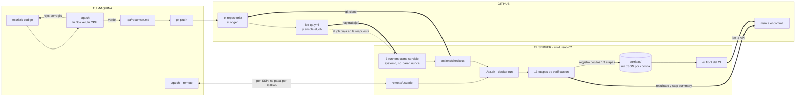
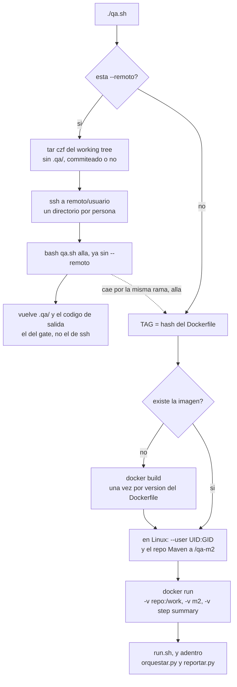
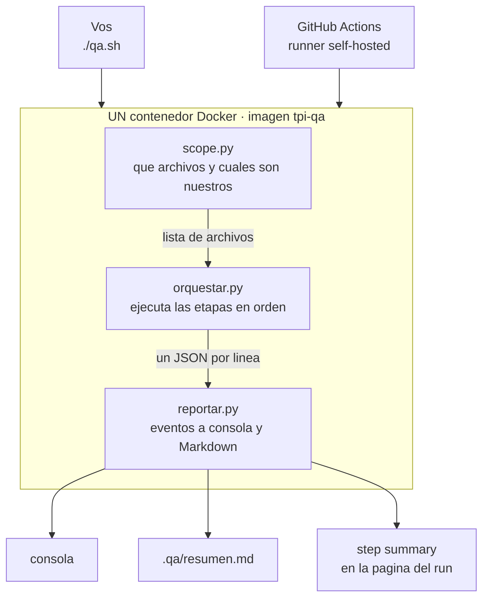
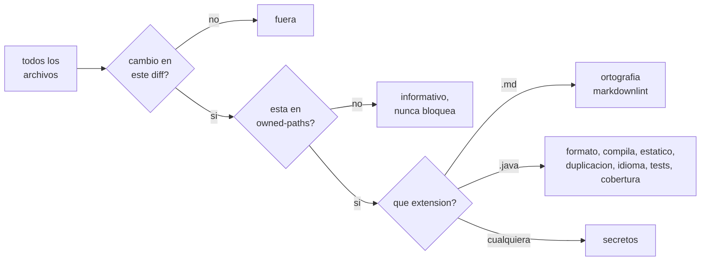
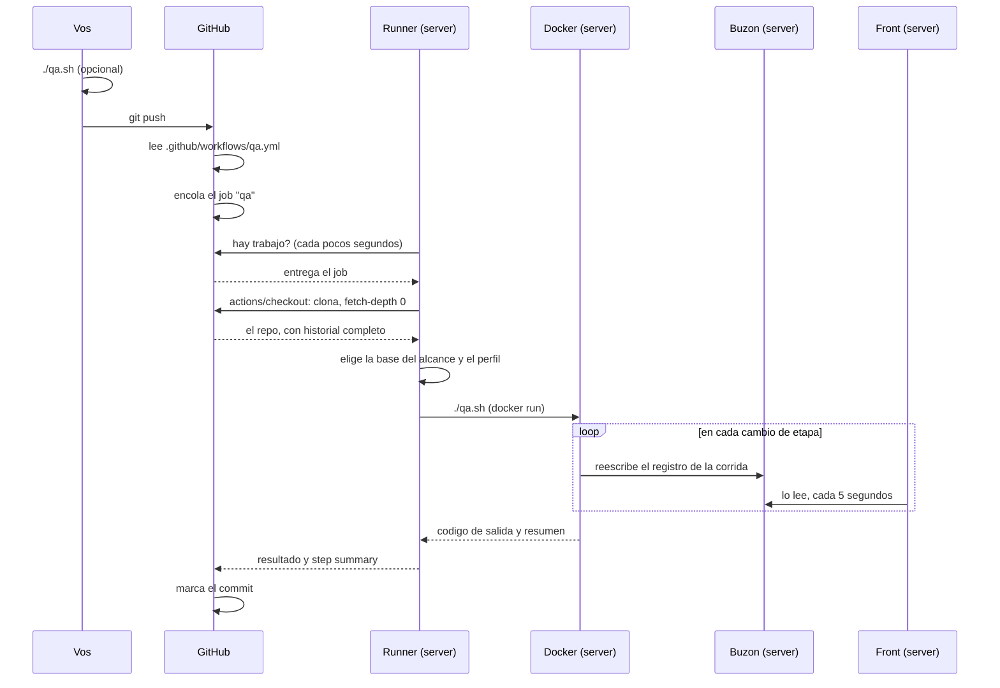
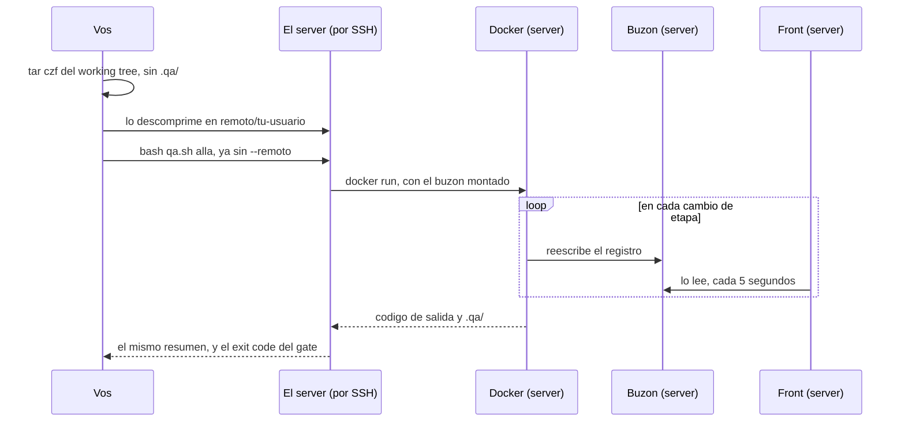

# 16 — El pipeline de calidad: qué hace, cómo funciona y dónde corre

> Todo el gate en un solo lugar: qué problema resuelve, con qué está hecho, qué
> comprueba cada etapa, qué hace cada comando, dónde se ejecuta cada cosa, y qué
> verificaciones conviene sumar más adelante.

---

# Parte 1 — Qué es y qué resuelve

Un **pipeline** es una cadena de verificaciones automáticas que corre sobre el
trabajo antes de que se integre con el de los demás. Se llama así porque las
etapas van encadenadas: la primera que falla corta el resto.

No es una herramienta, es un orden.

## Los cuatro problemas que resuelve

| Problema | Por qué duele en este equipo |
|---|---|
| **Alguien rompe `dev`** | Somos seis sobre el mismo servicio. El caso típico no es tu error de tipeo: es que cambiaste una firma y rompiste una clase que no abriste |
| **Cada IDE está configurado distinto** | No hay forma de verificar el IntelliJ de otro. El contenedor sí es verificable, porque es del repo |
| **La documentación se desincroniza sola** | 15 documentos con 173 links internos que se referencian entre sí. Ya encontró 22 anclas rotas que nadie había notado |
| **El error llega sin la solución** | Un log de Maven corrido no dice qué hacer. Cada hallazgo trae dónde, por qué y cómo se arregla |

## Lo que NO resuelve

Conviene tenerlo claro antes de confiar de más:

**No valida que lo que escribiste tenga sentido.** Si calculás mal el score de la
rúbrica, todo pasa en verde. Un gate verifica *forma*, no *verdad*. Eso lo agarra un
test que vos escribas, o una persona en la revisión.

**No reemplaza el code review.** Es un piso, no un techo.

**Un gate mal calibrado es peor que ninguno**, porque genera confianza que no
corresponde. Por eso las reglas nuevas arrancan avisando y no frenando.

---

---

# Parte 2 — Dónde corre cada cosa

Todo el CI vive repartido en tres lugares distintos. La mayor parte de la confusión
viene de mezclarlos.



**Las flechas gruesas son las cuatro conexiones que salen del server**: el *"¿hay
trabajo?"* de los runners, el `git clone` del checkout, el resultado de la corrida y la
lectura de la API que hace el front. La punteada no es una conexión entrante: es el job
bajando como respuesta a esa pregunta. Y `--remoto` es el único camino que puentea
GitHub por completo.

Fijate que `corridas/` recibe de las **dos** puntas que corren acá: una corrida del
runner y una `--remoto` pasan las dos por las mismas 13 etapas y dejan el mismo
registro. Por eso el front las puede poner una al lado de la otra.

## Quién hace qué

| | Tu máquina | GitHub | El server |
|---|---|---|---|
| Guarda el código | copia de trabajo | **origen** | copia efímera |
| Se entera del push | — | **sí** | — |
| Decide qué correr | — | **sí**, con `qa.yml` | — |
| **Ejecuta el gate** | si vos lo pedís | **nunca** | **sí** |
| Gasta CPU y disco | cuando corrés `qa.sh` | — | **en cada corrida** |
| Guarda el resultado | — | **sí** | — |

**GitHub no ejecuta nada.** Coordina: recibe el push, encola el trabajo y guarda el
resultado. El trabajo lo hace el server.

## La flecha que más se malinterpreta

**El server sale hacia GitHub. GitHub nunca entra al server.**

Los tres runners son procesos que no paran nunca y que cada pocos segundos abren una
conexión saliente preguntando *"¿hay trabajo para mí?"*. Cuando la respuesta es sí, se
bajan el job y lo ejecutan.

Tres consecuencias prácticas:

- **No hubo que abrir ningún puerto** en el firewall ni en el router. El server no
  expone nada hacia afuera para esto.
- Si el server se apaga, los jobs **quedan en cola**, no fallan. Cuando vuelve, los
  agarra.
- Es la razón de que un runner self-hosted funcione detrás de un NAT doméstico sin
  configuración de red.

## Por qué el resultado local y el del CI no pueden diferir

`qa.sh` es **una receta, no un botón**. Ejecutarla en tu máquina no dispara nada en el
server; ejecutarla en el server no necesita tu máquina.

| Vos escribís | Dónde corre | Quién se entera |
|---|---|---|
| `./qa.sh` | Tu Docker, tu CPU | Nadie |
| `./qa.sh --remoto` | El Docker del server | Nadie: no toca git |
| `git push` | — | GitHub encola; un runner escribe `./qa.sh` allá |

Son ejecuciones **independientes de la misma receta**. Y como el motor entero vive
dentro de una imagen Docker cuyo tag es el hash del `Dockerfile`, las tres puntas corren
exactamente el mismo binario. No hay emulación ni "equivalente local".

## `--remoto`, y por qué existe

`./qa.sh --remoto` manda tu working tree al server por SSH, corre el gate allá y te
trae el mismo resumen. No toca git ni el push: viaja lo que tenés ahora, incluido lo
que no commiteaste.

Existe por una razón que hoy no se nota pero que va a importar: **el runner
self-hosted solo sirve mientras el repositorio sea nuestro.** Darlo de alta necesita
permisos de administrador sobre el repo, y en un repositorio compartido con los otros
equipos ese runner le daría ejecución en nuestro server —como root, por el grupo
`docker`— a cualquiera que pueda abrir un pull request.

| | Runner self-hosted | `--remoto` |
|---|---|---|
| Permisos que hace falta tener en el repo | administrador | **ninguno** |
| Quién puede ejecutar en nuestro server | todo el que pueda pushear | **solo quien tenga SSH** |
| Anda con cambios sin commitear | no | **sí** |
| Necesita Docker en tu máquina | sí | **no** |

Medido sobre este repo: **7 segundos** en perfil rápido y **34** en completo,
transferencia incluida. El recorrido completo, paso a paso, está en la
[Parte 6](#el-otro-recorrido-una-corrida---remoto).

## Las dos ramas de `qa.sh`

El script tiene una sola decisión, y de ella salen los dos caminos de arriba. Todo lo
demás es preparar el contenedor: la lógica de verificación vive adentro de la imagen.



La flecha punteada es lo que más se malinterpreta de `--remoto`: **no es otro gate**. La
rama de la izquierda termina invocando la de la derecha en el server, sin el flag. Por
eso el resumen que te vuelve es idéntico al que verías corriéndolo local.

---

---

# Parte 3 — Todos los comandos

Un solo punto de entrada, `./qa.sh`, y unos pocos flags. Lo único que hace falta
instalado es Docker; con `--remoto`, ni siquiera eso.

## Lo que vas a usar todos los días

| Comando | Qué hace | Cuánto tarda |
|---|---|---|
| `./qa.sh` | Verifica **lo que cambiaste**, perfil `rapido` | ~2 s a 46 s |
| `./qa.sh --remoto` | Lo mismo, pero ejecutado en el server | ~9 s |
| `./qa.sh --all --perfil completo` | **Exactamente lo que corre el CI** al abrir un pull request | ~46 s |

## Los flags, uno por uno

| Flag | Qué controla | Detalle |
|---|---|---|
| *(ninguno)* | — | Perfil `rapido` sobre los archivos que cambiaste |
| `--all` | **El alcance** | Mira todo el repo, no solo tu diff |
| `--perfil completo` | **La severidad y el presupuesto** | Sube el presupuesto de 120 s a 600 s y endurece tres chequeos |
| `--only <etapa>` | Corre una sola etapa | Útil para iterar: `--only tests` |
| `--self-test` | Verifica **el gate, no el repo** | Quince fixtures, uno por chequeo |
| `--json` | Vuelca los eventos crudos | El contrato para construir encima |
| `--remoto` | **Dónde se ejecuta** | Manda el working tree al server por SSH |

> ### `--perfil` necesita el guion doble
>
> El perfil se decide con `"--perfil" in argumentos and "completo" in argumentos`.
> Escrito `perfil completo`, sin guiones, esas dos palabras **se ignoran y corre
> `rapido` en silencio**, sin avisar. La forma correcta es
> `./qa.sh --all --perfil completo`.

## Alcance y severidad son ejes distintos

Se confunden seguido, y son independientes:

- **`--all`** decide *sobre qué archivos* mira.
- **`--perfil completo`** decide *qué tan estricto* es y cuánto tiempo se permite.
- **`--remoto`** decide *en qué máquina* corre, y no cambia nada de lo anterior.

Se combinan libremente: `./qa.sh --remoto --all --perfil completo` es la corrida del
CI, ejecutada en el server, sin pushear nada.

## Las variables de entorno

| Variable | Para qué | Default |
|---|---|---|
| `CI` | Si está definida, degrada `arregla` a `bloquea` | vacía |
| `QA_BASE` | Contra qué commit medir el alcance | `origin/main` |
| `QA_M2_VOLUME` | Qué volumen usar como repositorio Maven | `tpi-qa-m2` |
| `QA_COBERTURA_MINIMA` | Umbral de cobertura sobre líneas nuevas | `70` |
| `QA_REMOTO` | Destino SSH para `--remoto` | — |
| `QA_REMOTO_PUERTO` | Puerto SSH | `22` |
| `QA_REMOTO_DIR` | Dónde trabaja en el server | `/opt/TP-Pipelines/remoto` |
| `QA_SPOOL` | Buzón donde dejar el registro de la corrida | vacía: no deja registro |
| `QA_SPOOL_REMOTO` | Qué buzón usa `--remoto` en el server | `/opt/TP-Pipelines/corridas` |
| `QA_ORIGEN` | Cómo se etiqueta la corrida en el buzón | `ci` si hay `CI`, si no `local` |

**`CI=1 ./qa.sh` es el truco útil:** hace que `formato` te **reporte** en vez de
reformatearte los archivos, usando el mismo mecanismo que aplica el CI.

## Qué modifica cada forma de correrlo

Es la pregunta que más aparece, y la respuesta corta es *casi nada*:

| | ¿Te toca archivos? |
|---|---|
| `./qa.sh` local | **Solo el formato de los `.java`** que ya cambiaste |
| `./qa.sh --remoto` | **Nada** |
| `CI=1 ./qa.sh` | **Nada** |
| El CI, al pushear | **Nada** |

Ese único caso es `formato`, que en `rapido` está en nivel `arregla` y ejecuta
`spotless:apply`: te ordena imports, indentación y espacios. **Nunca toca lógica** —
si compilaba antes, compila después. Los otros doce chequeos solo reportan: una
palabra mal escrita o un link roto te los informa, no te los corrige.

## Cómo se leen los hallazgos

Cada uno trae las cuatro cosas que hacen falta para arreglarlo:

```text
[bloquea] docs/16-pipeline-y-verificaciones.md:94     <- archivo y linea
    Palabra que no esta en el diccionario             <- que paso
    Unknown word (commiteaste)                        <- el detalle crudo
    -> Corregila. Si es un termino del dominio,       <- como se arregla
       agregala a tools/qa/config/proyecto/project-words.txt
```

Lo mismo queda en `.qa/resumen.md`, que es **el mismo Markdown** que GitHub muestra
en la página del run. Esa carpeta está en el `.gitignore`: nunca se commitea.

Como cada hallazgo incluye el arreglo, ese archivo sirve directamente como entrada
para pedirle a una IA que los corrija: *"leé `.qa/resumen.md` y arreglá los
hallazgos"*.

---

# Parte 4 — Cómo funciona por dentro

## El flujo



**El mismo contenedor lo lanzan las dos puntas.** Por eso local y CI no pueden dar
resultados distintos: no son dos implementaciones parecidas, es el mismo binario.

## Los tres filtros que deciden el alcance



Con una excepción deliberada: **links y referencias no pasan por el primer filtro**,
el del diff. Corren sobre todo, no solo sobre lo que tocaste, porque renombrar un
título en tu archivo rompe un ancla en el de otro.

Pero se plantan distinto frente al segundo:

| | Filtro del diff | Filtro de propiedad | Cómo evita bloquear por deuda ajena |
|---|---|---|---|
| `links` | no lo aplica | **sí** | solo mira el markdown que es nuestro |
| `referencias` | no lo aplica | no lo aplica | corre dos veces, en HEAD y en la base: bloquea solo lo que **este** cambio rompió |

Esa segunda pasada la hace [`diff_gate.py`](../tools/qa/lib/diff_gate.py), que
materializa el árbol de la base con `git worktree` sin tocar tu working tree. Es lo
que permite que un chequeo global no genere deuda retroactiva.

### El primer filtro es el que puede dejar el gate en nada

Todo el alcance cuelga de una sola pregunta: contra qué commit se compara. Y ahí hubo
un agujero que estuvo activo hasta el 1 de septiembre de 2026, y que conviene entender
porque es fácil de volver a introducir.

En tu máquina, `scope.py` compara contra el merge-base con el upstream de tu rama, y
funciona porque **tu upstream está atrasado**: lo que estás por pushear todavía no está
ahí. En el runner no: el checkout deja el upstream parado exactamente en `HEAD`. El
merge-base daba `HEAD`, el diff daba vacío, y las nueve etapas que dependen de qué
archivos cambiaste quedaban en `omitida`.

La corrida terminaba **en verde sin haber mirado un solo archivo**. Es la misma trampa
que el motor evita a nivel etapa —una etapa que no corrió no dijo que todo estaba
bien— pero corrida entera.

Por eso ahora **la base la define siempre el workflow**, nunca el fallback:

| Evento | Base | Por qué |
|---|---|---|
| Pull request | la base real del PR | es contra lo que se va a mergear |
| Push | `github.event.before` | lo que trajo ese push |
| Rama nueva, o force-push | merge-base con `origin/main` | ahí `before` viene en ceros, o el commit ya no está en el clon |

Se descubrió mirando el registro de la primera corrida de CI en el buzón: cuatro etapas
en verde y nueve en gris, sobre un push que tocaba dos `.md`. Sin ese detalle por etapa
—que es justo lo que la API de Actions no da— la corrida se veía simplemente verde.

## Con qué está hecho

| Lenguaje | Líneas | Para qué |
|---|---|---|
| **Python 3** | 1891 | El motor: alcance, orquestación, chequeos propios, reporte, self-test |
| **YAML y JSON** | ~390 | La política (`checks.yml`), el diagnóstico (`reglas.yml`) y la config de cada herramienta |
| **Bash** | 255 | Los dos puntos de entrada, `qa.sh` y `run.sh`, más comentario que código |
| **Python 3** (el front) | 398 | Lee la API de Actions y el buzón, normaliza las dos y las sirve |
| **HTML y JS** | 306 | La página del front, sin framework |
| **Java** | 33 | El esqueleto Spring Boot mínimo |

**El motor no usa ningún framework.** Todo es biblioteca estándar de Python, con una
sola dependencia externa: **PyYAML**, para leer la configuración — y hasta esa está
envuelta en un `try` con degradación, para que un entorno sin PyYAML no rompa el
gate entero.

Es deliberado: cada dependencia es una pieza que se actualiza, se rompe y hay que
mantener. Un gate que necesita mantenimiento propio deja de correrse.

## Las herramientas de la imagen

Todo vive dentro de una sola imagen de **1,31 GB**, construida sobre
`maven:3.9-eclipse-temurin-21`. Lo único que hace falta instalado en tu máquina es
Docker.

| Herramienta | Versión | Qué hace | Origen |
|---|---|---|---|
| **Java (Temurin)** | 21.0.12 | Compilar y ejecutar | imagen base |
| **Maven** | 3.9.16 | Orquestar el build de Java | imagen base |
| **Spotless** | 2.44 | Formato, con `palantir-java-format` | plugin Maven |
| **PMD** | 7.7 | Código muerto, complejidad, patrones peligrosos | plugin Maven |
| **CPD** | 7.7 | Duplicación de código | viene dentro de PMD |
| **JaCoCo** | 0.8.12 | Instrumentar y medir cobertura | plugin Maven |
| **diff-cover** | 10.5 | Cobertura **de las líneas nuevas** | pip, en un venv propio |
| **cspell** | 8.19 | Ortografía y control de idioma | npm |
| **markdownlint-cli2** | 0.14 | Formato del Markdown | npm |
| **gitleaks** | 8.28 | Secretos | binario |
| **lychee** | 0.18 | Links rotos, sobre el markdown propio | binario |
| **PyYAML** | 6.0 | Leer la configuración | apt |

Los chequeos propios —referencias colgadas, anclas rotas, documentos huérfanos,
runners que gastan minutos— no usan ninguna herramienta: son Python a mano, porque
no existe nada de mercado que los haga.

## En qué orden se ejecuta, y por qué

De lo barato a lo caro. **La primera etapa que bloquea corta la corrida**, así que
conviene que los segundos se gasten al final.

| # | Etapa | ~Tiempo | Por qué está donde está |
|---|---|---|---|
| 1 | workflows | <1 s | Un grep. Si alguien va a gastar minutos, mejor saberlo antes que nada |
| 2 | secretos | 1 s | Barato, y lo más urgente si aparece |
| 3 | ortografía | 3 s | Solo los `.md` que tocaste |
| 4 | markdownlint | 1 s | Ídem |
| 5 | referencias | 1 s | Repo entero, pero es Python puro |
| 6 | links | 2 s | Repo entero, sin red en el perfil rápido |
| 7 | formato | 2 s | Primera etapa de Java: arranca la JVM |
| 8 | compila | 4 s | Sin compilar no tiene sentido seguir |
| 9 | análisis estático | 4 s | Necesita el código compilado |
| 10 | duplicación | 4 s | Ídem |
| 11 | idioma del código | 2 s | Solo los `.java` que tocaste |
| 12 | **tests** | 19 s | La más cara. Va última de las que producen datos |
| 13 | cobertura | <1 s | **Tiene que ir después de los tests**: lee el reporte que ellos generan |

**Total: ~43 segundos** sobre el repo completo en perfil completo.

Dos dependencias de orden que no son negociables: el análisis estático necesita que
haya compilado, y la cobertura necesita que los tests hayan corrido.

## Las cuatro decisiones que lo sostienen

**El contenedor es la fuente de verdad.** Las diez herramientas, el JDK y Maven
viven adentro de una imagen. Lo único que hace falta instalado es Docker. Está
verificado: corre igual en Windows y en el Ubuntu del servidor, que ni siquiera
tiene Java.

**Todas las etapas hablan un solo idioma.** Ninguna imprime texto libre: todas
emiten el mismo JSON. Por eso la consola, el resumen de GitHub y el front muestran
lo mismo sin duplicar lógica.

**Solo mira lo que tocaste.** No revisa los 423 KB en cada corrida. La deuda vieja
no bloquea a nadie y se paga cuando alguien abre ese archivo. Es el modelo
*Clean as You Code*.

**El workflow va flaco.** Son cinco líneas que llaman a `./qa.sh`. Por eso correr
"lo mismo que el CI" en tu máquina es un comando y no una emulación, y por eso
mudarse de GitHub no toca el motor.

## Los cuatro niveles

Todo se configura en `tools/qa/config/checks.yml`:

| Nivel | Qué hace |
|---|---|
| `bloquea` | El hallazgo hace fallar la corrida |
| `avisa` | Se reporta y la corrida sigue |
| `arregla` | Solo formato: corrige en tu working tree en vez de protestar |
| `off` | No se ejecuta |

> ### Ninguna regla nace en `bloquea`, nace en `avisa`
>
> Se la deja avisando una o dos semanas, se mira qué encuentra sobre trabajo real, y
> se sube recién cuando demuestre que los hallazgos son ciertos.
>
> El riesgo real no es que se filtre un error de tipeo. Es que a la tercera semana
> todos pusheen con el gate desactivado.

---

---

# Parte 5 — Qué verifica cada etapa

Corren de lo barato a lo caro, para que los segundos se gasten al final.

| # | Etapa | Qué comprueba | Alcance |
|---|---|---|---|
| 1 | **workflows** | Que ningún workflow pida una máquina de GitHub y gaste minutos | repo |
| 2 | **secretos** | Credenciales con formato conocido | repo |
| 3 | **ortografía** | Palabras fuera del diccionario, en español y en inglés | **tus `.md`** |
| 4 | **markdownlint** | Formato del Markdown | **tus `.md`** |
| 5 | **referencias** | `RF-IA-*` inexistentes, anclas rotas, documentos huérfanos | repo, solo regresiones |
| 6 | **links** | Archivos destino que no existen | repo, solo regresiones |
| 7 | **formato** | Que el Java esté formateado igual para todos | módulo |
| 8 | **compila** | Que el código compile, incluyendo los tests | módulo |
| 9 | **análisis estático** | Código muerto, complejidad, `catch` vacíos, comparar objetos con `==` | módulo |
| 10 | **duplicación** | Bloques repetidos entre clases | módulo |
| 11 | **idioma del código** | Que los identificadores estén en inglés | **tus `.java`** |
| 12 | **tests** | Que la suite pase | **módulo entero** |
| 13 | **cobertura** | Que lo que agregaste tenga tests | **solo tus líneas** |

## La distinción que más se confunde

Las etapas 12 y 13 parecen lo mismo y son opuestas:

| Pregunta | Etapa | Alcance |
|---|---|---|
| **¿Rompí algo que andaba?** | tests | **Todos** los tests del módulo |
| **¿Testeé lo que escribí?** | cobertura | **Solo** las líneas nuevas |

Los tests corren completos porque **no se puede saber qué rompiste mirando qué
archivos tocaste**: cambiás la firma de un método y el test que se cae está en un
paquete que nunca abriste. Correr "solo tus tests" dejaría pasar exactamente el caso
que el gate vino a evitar.

La cobertura mide solo el diff porque un umbral global es inaplicable con once
equipos, y obligaría a cubrir código viejo que no escribiste.

## Lo que estas etapas ya encontraron

| Hallazgo | Dónde |
|---|---|
| **22 anclas rotas** en el índice de preguntas | `docs/09` |
| **Cero faltas de ortografía** en 423 KB | todo el corpus |
| **87 hallazgos de formato** de Markdown, auto-corregibles | varios |
| **Cuatro adaptadores rotos** del propio gate | el self-test |
| **La cobertura pasando en verde sin mirar nada** | el self-test |

## Dos mecanismos que no son obvios

**El gate de regresión.** Links y referencias corren sobre el repo entero **dos
veces** —en tu versión y en el punto de partida— y comparan. Lo que ya estaba roto
informa; lo que rompió tu cambio bloquea.

Existe porque filtrar solo por archivo modificado tiene un agujero real: renombrás
un título en tu documento y rompés un ancla en un documento que no tocaste. Está
verificado: se renombró un título en `docs/08` y el gate bloqueó señalando
`docs/15`, un archivo que no estaba en el cambio.

**El filtro de propiedad.** Lo que no esté listado en `owned-paths.txt` nunca
bloquea, aunque lo arrastre un merge. Cuando entre contenido de otros equipos al
repositorio, **no hay que agregarlo**.

## El gate se verifica a sí mismo

`./qa.sh --self-test` corre quince fixtures, uno por chequeo. Cada uno dispara su
regla **y ninguna otra**.

Existe porque son once herramientas de terceros que se actualizan solas y cambian el
formato de su salida. El día que una lo haga, su adaptador deja de leerla y ese
chequeo pasa a decir "no encontré nada" — en verde, sin error, y nadie lo nota. Un
gate que falla en silencio es peor que no tener gate.

No es teórico: al construirlo, **cuatro de los adaptadores estaban rotos** y
los encontró el self-test.

> **Su limitación conocida.** El fixture que espera cero hallazgos sigue pasando
> aunque la herramienta esté completamente muerta: "no encontró nada" y "no miró
> nada" se ven iguales desde ahí. Los que sostienen el self-test son los fixtures
> que sí esperan un hallazgo.

---

## Cuánto tarda cada una, medido

Sobre este repo, en una corrida `completo` con la imagen ya construida y el
repositorio Maven tibio:

| Etapa | Medido | | Etapa | Medido |
|---|---|---|---|---|
| workflows | <1 s | | análisis estático | 12 s |
| secretos | 1 s | | duplicación | incluida arriba |
| ortografía | 3 s | | idioma del código | 2 s |
| markdownlint | 1 s | | tests | 7 s |
| referencias | <1 s | | cobertura | <1 s |
| links | 2 s | | | |
| formato | 10 s | | **total** | **46 s** |

Dos dependencias de orden no son negociables: el análisis estático necesita que
haya compilado, y la cobertura necesita que los tests hayan corrido.

---

# Parte 6 — El recorrido de un push, paso a paso



Las dos ultimas flechas son las que llegan tarde: el check en el commit aparece cuando
la corrida termina. El buzón, en cambio, se escribe **mientras** corre, y por eso el
front puede mostrar la etapa en curso.

## Qué pasa en cada fase, con tiempos reales

Medidos sobre este repo, en `mk-luisao-02` (4 núcleos, 15 GB, Ubuntu 24.04).

| # | Fase | Dónde | Cuánto tardó | Qué pasa exactamente |
|---|---|---|---|---|
| 1 | `git push` | Tu máquina | <1 s | Subís los commits. No se dispara nada tuyo |
| 2 | Evento y encolado | GitHub | ~1 s | Detecta el push, lee `qa.yml`, crea el job con `runs-on: self-hosted` |
| 3 | Asignación | Server hacia GitHub | 1-5 s | El primer runner libre pregunta y se lleva el job |
| 4 | Checkout | Server | 2-4 s | Clona con `fetch-depth: 0`. El historial completo pesa 628 KB |
| 5 | Elegir la base y el perfil | Server | <1 s | Dos `if` de shell: contra qué commit se compara el alcance, y si va `rapido` o `completo` |
| 6 | Garantizar la imagen | Server | 0 s, o ~2 min | Si el tag ya existe, no hace nada. Si cambió el `Dockerfile`, la construye |
| 7 | **El gate** | Server, en Docker | 2 s a 46 s | Las 13 etapas. Depende del perfil y de qué tocaste |
| 8 | El registro | Server, al buzón | incluido en el 7 | Se reescribe en cada cambio de etapa, así que se ve avanzar en el front |
| 9 | Reporte | Server hacia GitHub | ~1 s | Sube el resumen y el resultado |
| 10 | El check | GitHub | inmediato | El commit queda marcado |

## Los tres números que importan

| Escenario | Medido |
|---|---|
| Corrida `rapido` de punta a punta, imagen ya construida | **12 segundos** |
| Corrida `completo`, con Maven compilando y corriendo tests | **46 segundos** |
| Primera corrida de todas, que tuvo que construir la imagen | **171 segundos** |

El caso de 171 segundos pasa **una sola vez por versión del `Dockerfile`**. Como el tag
de la imagen es el hash del archivo, se reconstruye únicamente cuando alguien cambia el
`Dockerfile`, y a partir de ahí todas las corridas del host la reusan.

## El otro recorrido: una corrida `--remoto`

El mismo gate, el mismo server, el mismo buzón — pero **GitHub no aparece en ningún
lado**. Ni se entera, ni hace falta que exista.



### Por dónde pasa cada cosa

| Qué viaja | Desde | Hasta |
|---|---|---|
| Tu working tree, sin `.qa/` | tu carpeta, commiteado o no | `/opt/TP-Pipelines/remoto/<tu-usuario>` |
| El repositorio Maven | — | un volumen Docker por persona, `tpi-qa-m2-remoto-<usuario>` |
| El registro de la corrida | `/qa-buzon` dentro del contenedor | `/opt/TP-Pipelines/corridas/` |
| El resumen | `.qa/` en el server | `.qa/` en tu máquina |
| El código de salida | el gate | tu shell: es el del gate, no el de `ssh` |

Un directorio y un volumen **por persona**: seis personas corriendo a la vez no se
pisan, por el mismo motivo por el que cada runner tiene el suyo.

### Cuánto tarda, medido

De punta a punta desde una máquina Windows, transferencia incluida, con la imagen ya
construida y el repositorio Maven tibio:

| Perfil | Medido |
|---|---|
| `rapido` | **7 segundos** |
| `completo`, con Maven compilando y corriendo los tests | **34 segundos** |

Y no necesitás Docker en tu máquina: el contenedor lo levanta el server.

---

---

# Parte 7 — El server por dentro

## El server

| Pieza | Tecnología | Versión |
|---|---|---|
| Sistema | Ubuntu Server | 24.04 LTS |
| Contenedores | Docker Engine | 29.4.1 |
| Compose | Docker Compose | v5.1.3 |
| Agente de CI | GitHub Actions Runner | 2.337.0 |
| Supervisión | systemd | 3 servicios, arrancan solos |
| Proxy | nginx | 1.24 |
| Front | Python 3.13, sin framework | biblioteca estándar |

## Dónde vive cada cosa

```text
/opt/TP-Pipelines/
├── front/                el front del CI, con su compose y su .env
├── runners/
│   ├── runner-1/         .env con QA_M2_VOLUME=tpi-qa-m2-1
│   ├── runner-2/         .env con QA_M2_VOLUME=tpi-qa-m2-2
│   └── runner-3/         .env con QA_M2_VOLUME=tpi-qa-m2-3
├── remoto/               un directorio por persona, para ./qa.sh --remoto
├── corridas/             un JSON por corrida: lo que el front muestra del server
└── test/                 un checkout de prueba
```

`remoto/` y `corridas/` tienen el bit sticky, como `/tmp`: cada persona crea y borra
lo suyo, y no puede tocar lo de otro.

## El buzón de corridas

Todo lo que el gate corre **en este server** deja un registro en `corridas/`: las
corridas del runner y las de `./qa.sh --remoto`, en el mismo formato. Es lo que le
permite al front mostrar las dos cosas por separado y compararlas etapa por etapa.

Lo escribe `reportar.py` cuando existe la variable `QA_SPOOL`, y trae **siempre las
13 etapas**, incluidas las que no se ejecutaron. Sin ese "no ejecutada" explícito,
una corrida `rapido` y una `completo` se ven iguales en la pantalla, que es
justamente lo que hay que poder distinguir.

| | El runner | `--remoto` | `./qa.sh` en tu máquina |
|---|---|---|---|
| De dónde sale `QA_SPOOL` | el `.env` del runner | la invocación por SSH | de ningún lado |
| Deja registro | **sí** | **sí** | no |

El último caso no es un olvido: tu máquina no tiene cómo escribir en el server, y el
camino que sí lo tiene ya existe y es `--remoto`.

El alta es una vez sola:

```text
sudo install -d -m 1777 /opt/TP-Pipelines/corridas
echo 'QA_SPOOL=/opt/TP-Pipelines/corridas' >> /opt/TP-Pipelines/runners/runner-1/.env
```

y lo mismo en `runner-2` y `runner-3`. Si el directorio no existe no se escribe nada
y todo sigue igual: el registro es información para la pantalla, no parte del
veredicto. Por el mismo motivo el barrido de registros viejos —una semana— va
archivo por archivo: con el sticky bit, cada persona limpia lo suyo y no puede tocar
lo de los demás.

## Los usuarios, y por qué son dos

| Usuario | Dueño de | Por qué |
|---|---|---|
| `runner-qa` | `runners/` | Corre los jobs. Está en el grupo `docker` |
| `sorias` | `front/`, `test/` | Administración. No necesita correr jobs |

**Estar en el grupo `docker` equivale a ser root en ese host.** Cualquiera que pueda
disparar un workflow puede ejecutar lo que quiera en el server. De ahí salen dos reglas
que no son negociables:

1. **El repo tiene que seguir siendo privado.** Con el repo público, cualquiera que
   abra un pull request ejecuta código en el server.
2. **La máquina tiene que ser dedicada.** Ese server corría la producción de otro
   proyecto, y bajarla fue condición previa a instalar el runner.

## Por qué tres runners

Un runner corre **una sola cosa por vez**. Con seis personas pusheando, el número sale
de dos cargas distintas:

- **Régimen normal.** Seis personas a unos cinco pushes por hora, a unos 12 segundos
  cada corrida, ocupan una fracción mínima. Con dos ya no hay cola perceptible.
- **La corrida cara.** Un pull request corre en perfil `completo` y puede ocupar un
  runner hasta 600 segundos. Con dos instalados, esa corrida deja **uno solo** para las
  otras cinco personas. Con tres, quedan dos libres, que es la capacidad de régimen.

El que decide es el segundo caso. Por eso son tres y no dos.

## Cada runner necesita su propio repositorio Maven

El volumen de Docker es único por host. Sin separarlos, dos corridas simultáneas
compartirían el mismo repositorio local de Maven y se pisarían las descargas: archivos
a medio bajar, marcas de actualización y contención de locks. Falla de forma
intermitente y difícil de atribuir.

Por eso cada directorio de runner tiene un `.env` que el servicio carga al arrancar,
con un nombre de volumen distinto.

## La red

| Puerto | Qué escucha | Alcance |
|---|---|---|
| 22 | SSH | LAN, y llega de afuera por NAT en el 2222 |
| 80 | nginx hacia el front | **internet**, con usuario y contraseña |
| 8088 | nginx hacia el front | LAN, para el túnel SSH |
| 8099 | el contenedor del front | **solo** loopback |

La cadena es: el contenedor escucha solo en loopback, y nginx con autenticación básica
es la única puerta. Importa porque el front muestra nombres de rama, mensajes de commit
y quién trabajó en qué.

**El 80 sale a internet, y es una decisión tomada a sabiendas.** El router lo reenvía,
así que la página es alcanzable por cualquiera que escanee esa IP, y como HTTP va en
texto plano la contraseña del basic auth viaja sin cifrar. Se eligió así para poder
mostrar el front sin depender de un dominio.

Para cerrarlo hacen falta dos cosas que hoy no tenemos: **un registro DNS apuntando a
`186.182.86.167`** y **el 443 reenviado** en el router. Con eso se pone Let's Encrypt
--el desafío usa el 80, que ya funciona-- y queda con certificado válido.

Mientras tanto, la alternativa cifrada y sin exponer nada es un túnel SSH:

```text
ssh -N -L 8088:192.168.10.102:8088 -p 2222 usuario@186.182.86.167
```

y abrir `http://localhost:8088`. Va cifrado de punta a punta.

## El front

Es de **solo lectura y no ejecuta nada**: si se cae, el CI sigue funcionando igual.

Muestra **dos listas, de dos fuentes independientes**:

| Lista | De dónde sale | Qué incluye |
|---|---|---|
| En curso e historial | la API de Actions | lo que se disparó con un push o un pull request |
| Corridas en el server | el buzón `corridas/` | lo que se corrió con `--remoto`, y también las del runner |

La segunda existe porque una corrida `--remoto` **no pasó por GitHub** —la API no
sabe que ocurrió— y porque de las que sí conoce, GitHub expone los tres steps del
workflow, no las 13 etapas del gate. El buzón se lee aunque no haya token y aunque
la API esté caída.

Por eso **el detalle por etapa de las dos listas sale del buzón**: la corrida de GitHub
se empareja con su registro por commit. A la API se le pide solo el listado, un pedido
por ventana de cache en vez de uno por corrida — de ~3120 pedidos por hora a ~240,
contra un límite de 5000.

**Las dos se ven en vivo, y la del server con menos retraso.** El gate reescribe el
registro en cada cambio de etapa, así que la corrida aparece apenas arranca y se la ve
avanzar etapa por etapa.

| Lista | Retraso | Por qué |
|---|---|---|
| Corridas en el server | ~5 s | solo el refresco de la página: el buzón es un directorio local |
| GitHub | hasta ~20 s | 5 de la página más 15 del cache, que existe para no quemar el rate limit del token |

El buzón queda deliberadamente **fuera del cache**: una corrida `rapido` dura unos 9
segundos, así que entraría entera en una sola ventana de 15 y se vería ya terminada,
sin etapas pasando. Que es justo lo que esta pantalla tiene que mostrar.

Si un registro deja de moverse por más de 600 segundos —el presupuesto más largo del
gate es 600 para la corrida entera—, el front la da por muerta y la muestra como
cancelada en vez de dejarla girando para siempre.

Necesita un token porque el repo es privado y GitHub no entrega esos datos sin
credencial. Va con permiso mínimo: **solo lectura de Actions**. Si se filtra, lo peor que
pasa es que alguien lea el historial de corridas.

Detalle completo en [`tools/ci-front/README.md`](../tools/ci-front/README.md).

---

---

# Parte 8 — Los dos perfiles

| Cuándo | Perfil | Presupuesto | Sobre qué corre |
|---|---|---|---|
| Antes de pushear, a mano | `rapido` | 120 s | Lo que cambiaste |
| Al pushear a tu rama | `rapido` | 120 s | Lo que cambiaste |
| Al abrir el pull request a `dev` o `main` | `completo` | 600 s | Todo el repo |
| Push directo a `dev` o `main` | `completo` | 600 s | Todo el repo |

**Lo elige el evento, no la persona.** Cada push tiene que ser barato o el gate deja de
ser una red y pasa a ser un embudo. La corrida cara se paga una sola vez, al abrir el
pull request, que es donde branch protection decide si el código entra.

El push directo a `dev` o `main` también va en `completo` por dos razones: ahí no hay
pull request que lo cubra, y sobre la propia rama principal la comparación con el punto
de partida da vacío, así que `rapido` no miraría ni un archivo.

## Cómo se nota cuál corrió

En el resumen, las etapas que el perfil `rapido` no necesitó aparecen como **"no
ejecutada"**. En `completo` corren todas. Es la forma más rápida de confirmar qué perfil
se usó.

---

---

# Parte 9 — Lo que solo aparece cuando el CI corre en Linux

Cuatro problemas que en Windows son invisibles y que rompieron las primeras corridas
reales. Están arreglados; se documentan porque van a volver a aparecer si alguien toca
esas piezas.

| Qué pasaba | Por qué no se veía antes |
|---|---|
| **El bit de ejecución.** `qa.sh` estaba marcado como no ejecutable, y el job moría con un error de permisos antes de empezar | Git Bash ignora el bit de ejecución. `./qa.sh` a mano siempre funcionó |
| **El contenedor escribía como root.** Dejaba archivos con dueño root dentro del working tree, y el checkout de la corrida siguiente no podía borrarlos | Windows no tiene dueños de archivo al estilo Unix. El CI se rompía solo cada dos corridas |
| **El resumen apuntaba afuera del contenedor.** La variable con la ruta del resumen apunta a una carpeta del host que no estaba montada, y el reporte moría al final | Esa variable solo existe cuando quien invoca es el runner |
| **El repositorio Maven compartido.** Los tres runners usaban el mismo volumen | Con un solo runner el problema no existe |

El tercero era el más traicionero: el gate pasaba sin un solo hallazgo, pero la corrida
quedaba en rojo. **El verde o el rojo dependía de un archivo que nadie podía escribir.**

## Dos cosas del runner que conviene saber

**El workspace sobrevive entre corridas.** No es un contenedor limpio: es un directorio
que se reusa. Lo que una corrida ensucia queda para la siguiente.

**El working tree es efímero igual.** El checkout lo resetea, así que cualquier archivo
que el gate corrija allá se descarta. Es exactamente el motivo de la degradación de
`arregla` a `bloquea` en CI.

---

---

# Parte 10 — Dónde mirar cuando algo falla

| Síntoma | Dónde mirar |
|---|---|
| Falló `./qa.sh` en tu máquina | El resumen en `.qa/`. Es el mismo Markdown que GitHub muestra en la página del run |
| Falló la corrida en GitHub | Pestaña **Actions**, la corrida, el step de verificación |
| Querés ver la cola | El front, en el 8088 |
| Querés ver una corrida tuya del server | El front, lista "Corridas en el server". Aparece apenas arranca `--remoto` |
| El job no arranca nunca | **Settings, Actions, Runners**: si los tres figuran fuera de línea, el server está apagado o el servicio caído |
| El job falla en segundos, sin llegar al gate | Casi siempre es el checkout: algo en el workspace que el usuario del runner no puede borrar |

## Comandos útiles en el server

```text
systemctl status 'actions.runner.*'     estado de los tres servicios
docker ps                               que esta corriendo ahora
docker images tpi-qa                    version de la imagen del gate
```

Los logs de cada runner están en su propio directorio, bajo `_diag/`: unos registran la
conexión con GitHub y otros cada job.

---

---

# Parte 11 — Qué más conviene verificar

Nada de esto está en el flujo estándar de la materia. Está ordenado por lo que más
rinde para el Tema 07.

## 4.1 · Sobre los tests

### Cobertura, pero no el 80% global

El 80% sobre todo el proyecto es una mala meta, y conviene decirlo antes de
adoptarla: **premia testear getters y castiga testear lo difícil**. Se llega al 80%
escribiendo tests triviales sobre DTOs mientras el motor de scoring queda sin
cubrir, y el número queda verde igual.

Tres formas mejores, en orden de valor:

| Enfoque | Qué mide | Herramienta |
|---|---|---|
| **Cobertura sobre código nuevo** | Que *lo que agregaste en este cambio* esté cubierto. Coherente con el resto del gate, que ya solo mira lo que tocaste | JaCoCo sobre el diff |
| **Cobertura por módulo, con umbrales distintos** | 90% en el evaluador y la rúbrica, 40% en los adaptadores. No todo el código vale lo mismo | JaCoCo con reglas por paquete |
| **Tests de mutación** | Que el test *verifique* la línea, no solo que la ejecute. Cambia un `>` por un `>=` y ve si algún test se queja | PIT |

La mutación es el chequeo más honesto de los tres: una cobertura del 80% con tests
que no afirman nada da 80%; con mutación da cerca de cero.

### Tests inestables

Correr la suite dos veces y comparar. Un test que pasa una vez y falla la otra es
peor que un test que falla siempre, porque enseña al equipo a ignorar el rojo.

Importa especialmente acá: parte del sistema **no es determinístico por
naturaleza**, así que hay que poder distinguir "el modelo varió" de "el test está
mal escrito".

## 4.2 · Específicas del Tema 07

Estas son las que ninguna herramienta de mercado trae, y las que más valen porque
protegen decisiones que ya están tomadas en los otros documentos.

| Verificación | Por qué acá | Qué evita |
|---|---|---|
| **Que los pesos de la rúbrica sumen exactamente 1** | Las cinco dimensiones tienen peso propio | Un peso mal puesto cambia **todas** las notas en silencio, sin que nada falle |
| **Que el score calculable sea reproducible** | Entre el 45% y el 60% del puntaje se calcula con código, no con un modelo | Que esa parte deje de ser determinística sin que nadie se entere |
| **Que la solución de referencia no llegue al contexto del tutor** | Es ADR-008 y es la salvaguarda anti-fuga | Que un refactor la meta sin querer. Hoy es una convención; un test la vuelve imposible |
| **Presupuesto de tokens por función** | La palanca del costo no es qué modelo elegís, es cuántos tokens mandás | Que el contexto crezca de a poco hasta triplicar el costo del cuatrimestre |
| **Que el evento publicado cumpla el contrato** | El contrato del bus lo define otro equipo | Romperle la integración a otro equipo sin enterarte hasta la demo |
| **Que la calibración siga dentro de tolerancia** | PAR-14 exige ±5 de desviación promedio y ±10 por dimensión | Deriva silenciosa: el modelo empieza a puntuar distinto y nadie lo mide |

La última es la más ambiciosa y la más valiosa: **correr el evaluador contra el
golden set como si fuera un test**. No entra en el gate de cada push —cuesta plata y
minutos— pero sí como corrida programada semanal.

Es, literalmente, "una IA evaluando a otra IA, y hay que demostrar que la nota es
confiable" convertido en un chequeo automático.

## 4.3 · Reglas de arquitectura

El diseño de los ocho módulos hoy es un diagrama. **ArchUnit lo convierte en tests
que fallan**:

- Ninguna clase del evaluador puede llamar a un modelo salteando el Gateway
- Ningún módulo puede importar del paquete interno de otro
- El worker y la API comparten dominio pero no controladores

Cuesta poco y hace que la arquitectura se defienda sola en vez de depender de que
alguien la recuerde en la revisión.

## 4.4 · Genéricas que rinden

| Verificación | Qué aporta | Costo |
|---|---|---|
| **Vulnerabilidades en dependencias** | Avisa cuando una librería que usás tiene un CVE conocido | Bajo. Una vez por día, no por push |
| **Licencias de dependencias** | Saber qué arrastra el proyecto. En un trabajo académico que se publica, importa | Muy bajo |
| **Migraciones de base** | Que todo cambio de esquema tenga su migración y aplique sobre una base limpia | Medio |
| **Tamaño del cambio** | Avisar si un pull request pasa de N líneas. Un cambio de 2000 líneas no se revisa: se aprueba | Trivial |
| **Presupuesto de latencia** | Que el tiempo hasta el primer token no supere el objetivo | Medio |

## 4.5 · Qué NO agregaría

Por completitud, porque descartar también es diseño:

**Corrector gramatical automático.** Se evaluó y se descartó: imagen de 1 GB, hay
que extraer la prosa de las tablas y los diagramas, y sobre texto técnico en español
con anglicismos tira falsos positivos constantes. El corrector ortográfico da el 80%
del valor al 5% del costo.

**SonarQube como gate local.** Necesita su propia base de datos y minutos por
análisis. Sirve en el CI, no en algo que corrés cada media hora.

**Cobertura global al 80% como meta dura.** Ya explicado arriba.

---

---

# Parte 12 — En qué orden sumarlas

No todo junto. El criterio es el mismo de siempre: **nace avisando, se sube cuando
demuestre que sirve.**

| Orden | Qué | Por qué primero |
|---|---|---|
| 1 | Pesos de la rúbrica y reproducibilidad del score | Son dos tests chicos que protegen lo más caro de equivocar |
| 2 | Cobertura sobre código nuevo | Aplica desde el primer commit y no genera deuda retroactiva |
| 3 | ArchUnit con dos o tres reglas | Cuando existan los módulos. Empezar con pocas y ciertas |
| 4 | Contrato de eventos | Cuando el Tema 11 cierre el contrato |
| 5 | Vulnerabilidades y licencias | Corrida diaria, no por push |
| 6 | Golden set como corrida programada | Cuando haya golden set aprobado |
| 7 | Mutación sobre el motor de scoring | Al final: es el más caro de correr y el más exigente de escribir |

---

---

# Parte 13 — Qué cambia cuando esto se mude al monorepo

El gate nació en un repositorio del equipo. Cuando la carpeta se mude al monorepo de
la materia, la mayor parte sigue funcionando sin pedirle permiso a nadie. Hay tres
archivos que tocar, una cosa que no conviene ni pedir, y una que queda por resolver.

## Lo que no necesita permisos

`./qa.sh` y `./qa.sh --remoto` no tocan git ni GitHub: son un script, Docker y SSH.
Andan aunque no tengas permiso de escritura sobre el repositorio. Y la lista
"Corridas en el server" del front se alimenta del buzón, que tampoco pasa por GitHub.
**El gate y el tablero siguen enteros para el equipo, pase lo que pase con el
monorepo.**

## Lo que sí, y lo que no conviene ni pedir

| Qué | Qué hace falta |
|---|---|
| Runner self-hosted | **administrador** sobre el repositorio |
| Un archivo en `.github/workflows/` | que los dueños del repo acepten algo que dispara para todos |
| Token del front | un PAT sobre un repo ajeno suele necesitar aprobación del owner |
| Branch protection | no lo controla el equipo |

**Lo del runner no es burocracia, es seguridad.** Estar en el grupo `docker` de
`mk-luisao-02` equivale a ser root en esa máquina. En un repositorio compartido,
cualquiera que pueda abrir un pull request ejecutaría código en nuestro server. Es
exactamente la razón por la que existe `--remoto`.

## Los archivos que hay que editar

**1. `owned-paths.txt`, prefijando cada ruta con la carpeta del equipo.** Hoy dice
`docs/**`, `codigo-ejemplo/ms-evaluacion-llm/**`, `tools/qa/**` y `tools/ci-front/**`, que son rutas
de raíz. Todo lo que no matchee ahí se cae del alcance, así que los archivos de los
otros equipos se ignoran solos: **el mecanismo ya está, solo hay que apuntarlo.**

Ojo con `*.md`: el glob tiene semántica de rutas —`*` no cruza barras, a propósito—
así que matchea solo la raíz. En el monorepo eso sería el README de la cátedra. Ese
hay que sacarlo.

**2. El workflow, que se identifica por nombre y no por carpeta.** `.github/` vive en
la raíz del repositorio y en el monorepo es **una sola carpeta compartida**: no se
puede prefijar. Hay que renombrar `qa.yml` a algo como `tema-07-qa.yml` y ajustar esa
línea de `owned-paths.txt`. Sin ese ajuste, la etapa `workflows` dejaría de mirar el
nuestro —revisa solo lo que matchea— y pasaría en verde sin verificar nada.

**3. El disparo.** Sin runner propio no hay job de Actions del equipo: el pipeline
pasa a ser `--remoto` antes de pushear. Si el monorepo tiene su propio CI, el gate se
engancha con una línea, porque el workflow es flaco justamente para esto:

```bash
./qa.sh --all --perfil completo
```

## Lo que queda por resolver

`qa.sh` resuelve la raíz con `git rev-parse --show-toplevel`, así que `--remoto`
empaqueta **el repositorio entero** en cada corrida. Con este repo son 7 segundos;
con un monorepo grande la transferencia pasa a dominar. Se arregla acotando el `tar`
a la carpeta del equipo más `tools/`, pero hay que hacerlo.

---

# Lo que todavía falta

> ### El hueco más grande es la mitad derecha del pipeline
>
> La [U1 de Front End](15-sincronizacion-arquitectura-y-despliegue.md) dibuja el recorrido completo:
> **push → tests → build de imagen → registro → deploy**. Este documento cubre el tramo hasta los
> tests, con un detalle que esa unidad no tiene —runners propios, dos perfiles, gate de regresión,
> front del CI—. **De ahí a la derecha no hay nada construido.**
>
> Falta: construir la imagen del servicio, etiquetarla con el SHA del commit, empujarla a un
> registro y disparar el despliegue. Es CD, y hoy el repositorio solo tiene CI. La estrategia de
> despliegue que ese paso tendría que ejecutar ya está decidida —rolling update, ADR-013— y los
> artefactos que faltan están especificados en [06](06-operacion-e-ingenieria.md) Parte 7 §6.
>
> **No es una omisión del gate:** el gate hace lo que promete. Es que el proyecto todavía no tiene
> qué desplegar.

- **La rama `dev` y el branch protection.** Es lo único que hace que el gate frene
  algo: hoy informa y marca el commit, pero no bloquea ningún merge. El
  procedimiento está en [`tools/qa/README.md`](../tools/qa/README.md).
- ~~**El token del front.**~~ Cargado el 1 de septiembre de 2026: el front lee la
  API real y ya no muestra datos de prueba.
- **El fixture de cobertura del self-test falla.** Espera un hallazgo y no obtiene
  ninguno. Se verificó a mano que la cadena real funciona —JaCoCo produce el
  reporte, diff-cover imprime el porcentaje y el adaptador lo parsea—, así que lo
  roto es el arnés del fixture, no el chequeo. Igual hay que arreglarlo: un
  self-test roto es exactamente lo que después esconde una regresión de verdad.
- **ArchUnit**, cuando existan los ocho módulos.

---

*Documento vivo. El gate está en [`tools/qa/`](../tools/qa/README.md); el front del
CI, en [`tools/ci-front/`](../tools/ci-front/README.md).*
