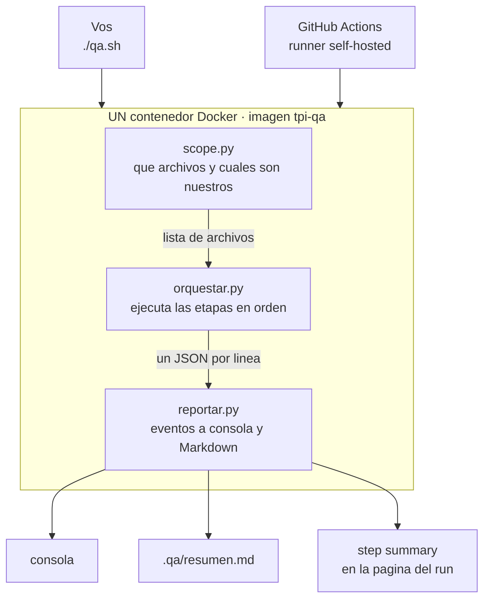
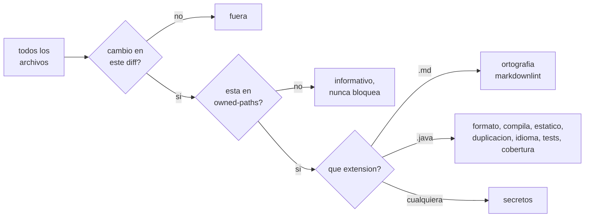

# 16 — El pipeline de calidad y qué más conviene verificar

> Qué hace el gate, cómo funciona, qué comprueba cada etapa, y las verificaciones
> que valdría la pena sumar y que no están en el flujo estándar de la materia.

---

# Parte 1 — Qué es y qué resuelve

Un **pipeline** es una cadena de verificaciones automáticas que corre sobre el
trabajo antes de que se integre con el de los demás. Se llama así porque las
etapas van encadenadas: la primera que falla corta el resto.

No es una herramienta, es un orden.

## Los cuatro problemas que resuelve

| Problema | Por qué duele en este equipo |
|---|---|
| **Alguien rompe `dev`** | Somos seis sobre el mismo servicio. El caso típico no es tu error de tipeo: es que cambiaste una firma y rompiste una clase que no abriste |
| **Cada IDE está configurado distinto** | No hay forma de verificar el IntelliJ de otro. El contenedor sí es verificable, porque es del repo |
| **La documentación se desincroniza sola** | 15 documentos con 173 links internos que se referencian entre sí. Ya encontró 22 anclas rotas que nadie había notado |
| **El error llega sin la solución** | Un log de Maven corrido no dice qué hacer. Cada hallazgo trae dónde, por qué y cómo se arregla |

## Lo que NO resuelve

Conviene tenerlo claro antes de confiar de más:

**No valida que lo que escribiste tenga sentido.** Si calculás mal el score de la
rúbrica, todo pasa en verde. Un gate verifica *forma*, no *verdad*. Eso lo agarra un
test que vos escribas, o una persona en la revisión.

**No reemplaza el code review.** Es un piso, no un techo.

**Un gate mal calibrado es peor que ninguno**, porque genera confianza que no
corresponde. Por eso las reglas nuevas arrancan avisando y no frenando.

---

# Parte 2 — Cómo funciona

## El flujo

**El mismo contenedor lo lanzan las dos puntas.** Por eso local y CI no pueden dar
resultados distintos: no son dos implementaciones parecidas, es el mismo binario.

## Los tres filtros que deciden el alcance

Con una excepción deliberada: **links y referencias no pasan por el primer filtro.**
Corren sobre el repo entero y comparan contra el punto de partida, porque renombrar
un título en tu archivo rompe un ancla en el de otro.

## Con qué está hecho

| Lenguaje | Líneas | Para qué |
|---|---|---|
| **Python 3** | ~1950 | El motor completo: alcance, orquestación, chequeos propios, reporte, self-test |
| **YAML y JSON** | ~390 | La política (`checks.yml`), el diagnóstico (`reglas.yml`) y la config de cada herramienta |
| **Bash** | 85 | Solo los dos puntos de entrada: `qa.sh` y `run.sh` |
| **HTML y JS** | ~290 | El front del CI, sin framework |
| **Java** | 33 | El esqueleto Spring Boot mínimo |

**El motor no usa ningún framework.** Todo es biblioteca estándar de Python, con una
sola dependencia externa: **PyYAML**, para leer la configuración — y hasta esa está
envuelta en un `try` con degradación, para que un entorno sin PyYAML no rompa el
gate entero.

Es deliberado: cada dependencia es una pieza que se actualiza, se rompe y hay que
mantener. Un gate que necesita mantenimiento propio deja de correrse.

## Las herramientas de la imagen

Todo vive dentro de una sola imagen de **1,31 GB**, construida sobre
`maven:3.9-eclipse-temurin-21`. Lo único que hace falta instalado en tu máquina es
Docker.

| Herramienta | Versión | Qué hace | Origen |
|---|---|---|---|
| **Java (Temurin)** | 21.0.12 | Compilar y ejecutar | imagen base |
| **Maven** | 3.9.16 | Orquestar el build de Java | imagen base |
| **Spotless** | 2.44 | Formato, con `palantir-java-format` | plugin Maven |
| **PMD** | 7.7 | Código muerto, complejidad, patrones peligrosos | plugin Maven |
| **CPD** | 7.7 | Duplicación de código | viene dentro de PMD |
| **JaCoCo** | 0.8.12 | Instrumentar y medir cobertura | plugin Maven |
| **diff-cover** | 10.5 | Cobertura **de las líneas nuevas** | pip, en un venv propio |
| **cspell** | 8.19 | Ortografía y control de idioma | npm |
| **markdownlint-cli2** | 0.14 | Formato del Markdown | npm |
| **gitleaks** | 8.28 | Secretos | binario |
| **lychee** | 0.18 | Links rotos | binario |
| **PyYAML** | 6.0 | Leer la configuración | apt |

Los chequeos propios —referencias colgadas, anclas rotas, documentos huérfanos,
runners que gastan minutos— no usan ninguna herramienta: son Python a mano, porque
no existe nada de mercado que los haga.

## En qué orden se ejecuta, y por qué

De lo barato a lo caro. **La primera etapa que bloquea corta la corrida**, así que
conviene que los segundos se gasten al final.

| # | Etapa | ~Tiempo | Por qué está donde está |
|---|---|---|---|
| 1 | workflows | <1 s | Un grep. Si alguien va a gastar minutos, mejor saberlo antes que nada |
| 2 | secretos | 1 s | Barato, y lo más urgente si aparece |
| 3 | ortografía | 3 s | Solo los `.md` que tocaste |
| 4 | markdownlint | 1 s | Ídem |
| 5 | referencias | 1 s | Repo entero, pero es Python puro |
| 6 | links | 2 s | Repo entero, sin red en el perfil rápido |
| 7 | formato | 2 s | Primera etapa de Java: arranca la JVM |
| 8 | compila | 4 s | Sin compilar no tiene sentido seguir |
| 9 | análisis estático | 4 s | Necesita el código compilado |
| 10 | duplicación | 4 s | Ídem |
| 11 | idioma del código | 2 s | Solo los `.java` que tocaste |
| 12 | **tests** | 19 s | La más cara. Va última de las que producen datos |
| 13 | cobertura | <1 s | **Tiene que ir después de los tests**: lee el reporte que ellos generan |

**Total: ~43 segundos** sobre el repo completo en perfil completo.

Dos dependencias de orden que no son negociables: el análisis estático necesita que
haya compilado, y la cobertura necesita que los tests hayan corrido.

## Las cuatro decisiones que lo sostienen

**El contenedor es la fuente de verdad.** Las diez herramientas, el JDK y Maven
viven adentro de una imagen. Lo único que hace falta instalado es Docker. Está
verificado: corre igual en Windows y en el Ubuntu del servidor, que ni siquiera
tiene Java.

**Todas las etapas hablan un solo idioma.** Ninguna imprime texto libre: todas
emiten el mismo JSON. Por eso la consola, el resumen de GitHub y el front muestran
lo mismo sin duplicar lógica.

**Solo mira lo que tocaste.** No revisa los 423 KB en cada corrida. La deuda vieja
no bloquea a nadie y se paga cuando alguien abre ese archivo. Es el modelo
*Clean as You Code*.

**El workflow va flaco.** Son cinco líneas que llaman a `./qa.sh`. Por eso correr
"lo mismo que el CI" en tu máquina es un comando y no una emulación, y por eso
mudarse de GitHub no toca el motor.

## Los cuatro niveles

Todo se configura en `tools/qa/config/checks.yml`:

| Nivel | Qué hace |
|---|---|
| `bloquea` | El hallazgo hace fallar la corrida |
| `avisa` | Se reporta y la corrida sigue |
| `arregla` | Solo formato: corrige en tu working tree en vez de protestar |
| `off` | No se ejecuta |

> ### Ninguna regla nace en `bloquea`, nace en `avisa`
>
> Se la deja avisando una o dos semanas, se mira qué encuentra sobre trabajo real, y
> se sube recién cuando demuestre que los hallazgos son ciertos.
>
> El riesgo real no es que se filtre un error de tipeo. Es que a la tercera semana
> todos pusheen con el gate desactivado.

---

# Parte 3 — Qué verifica cada etapa

Corren de lo barato a lo caro, para que los segundos se gasten al final.

| # | Etapa | Qué comprueba | Alcance |
|---|---|---|---|
| 1 | **workflows** | Que ningún workflow pida una máquina de GitHub y gaste minutos | repo |
| 2 | **secretos** | Credenciales con formato conocido | repo |
| 3 | **ortografía** | Palabras fuera del diccionario, en español y en inglés | **tus `.md`** |
| 4 | **markdownlint** | Formato del Markdown | **tus `.md`** |
| 5 | **referencias** | `RF-IA-*` inexistentes, anclas rotas, documentos huérfanos | repo, solo regresiones |
| 6 | **links** | Archivos destino que no existen | repo, solo regresiones |
| 7 | **formato** | Que el Java esté formateado igual para todos | módulo |
| 8 | **compila** | Que el código compile, incluyendo los tests | módulo |
| 9 | **análisis estático** | Código muerto, complejidad, `catch` vacíos, comparar objetos con `==` | módulo |
| 10 | **duplicación** | Bloques repetidos entre clases | módulo |
| 11 | **idioma del código** | Que los identificadores estén en inglés | **tus `.java`** |
| 12 | **tests** | Que la suite pase | **módulo entero** |
| 13 | **cobertura** | Que lo que agregaste tenga tests | **solo tus líneas** |

## La distinción que más se confunde

Las etapas 12 y 13 parecen lo mismo y son opuestas:

| Pregunta | Etapa | Alcance |
|---|---|---|
| **¿Rompí algo que andaba?** | tests | **Todos** los tests del módulo |
| **¿Testeé lo que escribí?** | cobertura | **Solo** las líneas nuevas |

Los tests corren completos porque **no se puede saber qué rompiste mirando qué
archivos tocaste**: cambiás la firma de un método y el test que se cae está en un
paquete que nunca abriste. Correr "solo tus tests" dejaría pasar exactamente el caso
que el gate vino a evitar.

La cobertura mide solo el diff porque un umbral global es inaplicable con once
equipos, y obligaría a cubrir código viejo que no escribiste.

## Lo que estas etapas ya encontraron

| Hallazgo | Dónde |
|---|---|
| **22 anclas rotas** en el índice de preguntas | `docs/09` |
| **Cero faltas de ortografía** en 423 KB | todo el corpus |
| **87 hallazgos de formato** de Markdown, auto-corregibles | varios |
| **Cuatro adaptadores rotos** del propio gate | el self-test |
| **La cobertura pasando en verde sin mirar nada** | el self-test |

## Dos mecanismos que no son obvios

**El gate de regresión.** Links y referencias corren sobre el repo entero **dos
veces** —en tu versión y en el punto de partida— y comparan. Lo que ya estaba roto
informa; lo que rompió tu cambio bloquea.

Existe porque filtrar solo por archivo modificado tiene un agujero real: renombrás
un título en tu documento y rompés un ancla en un documento que no tocaste. Está
verificado: se renombró un título en `docs/08` y el gate bloqueó señalando
`docs/15`, un archivo que no estaba en el cambio.

**El filtro de propiedad.** Lo que no esté listado en `owned-paths.txt` nunca
bloquea, aunque lo arrastre un merge. Cuando entre contenido de otros equipos al
repositorio, **no hay que agregarlo**.

## El gate se verifica a sí mismo

`./qa.sh --self-test` corre quince fixtures, uno por chequeo. Cada uno dispara su
regla **y ninguna otra**.

Existe porque son once herramientas de terceros que se actualizan solas y cambian el
formato de su salida. El día que una lo haga, su adaptador deja de leerla y ese
chequeo pasa a decir "no encontré nada" — en verde, sin error, y nadie lo nota. Un
gate que falla en silencio es peor que no tener gate.

No es teórico: al construirlo, **cuatro de los adaptadores estaban rotos** y
los encontró el self-test.

> **Su limitación conocida.** El fixture que espera cero hallazgos sigue pasando
> aunque la herramienta esté completamente muerta: "no encontró nada" y "no miró
> nada" se ven iguales desde ahí. Los que sostienen el self-test son los fixtures
> que sí esperan un hallazgo.

---

# Parte 4 — Qué más conviene verificar

Nada de esto está en el flujo estándar de la materia. Está ordenado por lo que más
rinde para el Tema 07.

## 4.1 · Sobre los tests

### Cobertura, pero no el 80% global

El 80% sobre todo el proyecto es una mala meta, y conviene decirlo antes de
adoptarla: **premia testear getters y castiga testear lo difícil**. Se llega al 80%
escribiendo tests triviales sobre DTOs mientras el motor de scoring queda sin
cubrir, y el número queda verde igual.

Tres formas mejores, en orden de valor:

| Enfoque | Qué mide | Herramienta |
|---|---|---|
| **Cobertura sobre código nuevo** | Que *lo que agregaste en este cambio* esté cubierto. Coherente con el resto del gate, que ya solo mira lo que tocaste | JaCoCo sobre el diff |
| **Cobertura por módulo, con umbrales distintos** | 90% en el evaluador y la rúbrica, 40% en los adaptadores. No todo el código vale lo mismo | JaCoCo con reglas por paquete |
| **Tests de mutación** | Que el test *verifique* la línea, no solo que la ejecute. Cambia un `>` por un `>=` y ve si algún test se queja | PIT |

La mutación es el chequeo más honesto de los tres: una cobertura del 80% con tests
que no afirman nada da 80%; con mutación da cerca de cero.

### Tests inestables

Correr la suite dos veces y comparar. Un test que pasa una vez y falla la otra es
peor que un test que falla siempre, porque enseña al equipo a ignorar el rojo.

Importa especialmente acá: parte del sistema **no es determinístico por
naturaleza**, así que hay que poder distinguir "el modelo varió" de "el test está
mal escrito".

## 4.2 · Específicas del Tema 07

Estas son las que ninguna herramienta de mercado trae, y las que más valen porque
protegen decisiones que ya están tomadas en los otros documentos.

| Verificación | Por qué acá | Qué evita |
|---|---|---|
| **Que los pesos de la rúbrica sumen exactamente 1** | Las cinco dimensiones tienen peso propio | Un peso mal puesto cambia **todas** las notas en silencio, sin que nada falle |
| **Que el score calculable sea reproducible** | Entre el 45% y el 60% del puntaje se calcula con código, no con un modelo | Que esa parte deje de ser determinística sin que nadie se entere |
| **Que la solución de referencia no llegue al contexto del tutor** | Es ADR-008 y es la salvaguarda anti-fuga | Que un refactor la meta sin querer. Hoy es una convención; un test la vuelve imposible |
| **Presupuesto de tokens por función** | La palanca del costo no es qué modelo elegís, es cuántos tokens mandás | Que el contexto crezca de a poco hasta triplicar el costo del cuatrimestre |
| **Que el evento publicado cumpla el contrato** | El contrato del bus lo define otro equipo | Romperle la integración a otro equipo sin enterarte hasta la demo |
| **Que la calibración siga dentro de tolerancia** | PAR-14 exige ±5 de desviación promedio y ±10 por dimensión | Deriva silenciosa: el modelo empieza a puntuar distinto y nadie lo mide |

La última es la más ambiciosa y la más valiosa: **correr el evaluador contra el
golden set como si fuera un test**. No entra en el gate de cada push —cuesta plata y
minutos— pero sí como corrida programada semanal.

Es, literalmente, "una IA evaluando a otra IA, y hay que demostrar que la nota es
confiable" convertido en un chequeo automático.

## 4.3 · Reglas de arquitectura

El diseño de los ocho módulos hoy es un diagrama. **ArchUnit lo convierte en tests
que fallan**:

- Ninguna clase del evaluador puede llamar a un modelo salteando el Gateway
- Ningún módulo puede importar del paquete interno de otro
- El worker y la API comparten dominio pero no controladores

Cuesta poco y hace que la arquitectura se defienda sola en vez de depender de que
alguien la recuerde en la revisión.

## 4.4 · Genéricas que rinden

| Verificación | Qué aporta | Costo |
|---|---|---|
| **Vulnerabilidades en dependencias** | Avisa cuando una librería que usás tiene un CVE conocido | Bajo. Una vez por día, no por push |
| **Licencias de dependencias** | Saber qué arrastra el proyecto. En un trabajo académico que se publica, importa | Muy bajo |
| **Migraciones de base** | Que todo cambio de esquema tenga su migración y aplique sobre una base limpia | Medio |
| **Tamaño del cambio** | Avisar si un pull request pasa de N líneas. Un cambio de 2000 líneas no se revisa: se aprueba | Trivial |
| **Presupuesto de latencia** | Que el tiempo hasta el primer token no supere el objetivo | Medio |

## 4.5 · Qué NO agregaría

Por completitud, porque descartar también es diseño:

**Corrector gramatical automático.** Se evaluó y se descartó: imagen de 1 GB, hay
que extraer la prosa de las tablas y los diagramas, y sobre texto técnico en español
con anglicismos tira falsos positivos constantes. El corrector ortográfico da el 80%
del valor al 5% del costo.

**SonarQube como gate local.** Necesita su propia base de datos y minutos por
análisis. Sirve en el CI, no en algo que corrés cada media hora.

**Cobertura global al 80% como meta dura.** Ya explicado arriba.

---

# Parte 5 — En qué orden sumarlas

No todo junto. El criterio es el mismo de siempre: **nace avisando, se sube cuando
demuestre que sirve.**

| Orden | Qué | Por qué primero |
|---|---|---|
| 1 | Pesos de la rúbrica y reproducibilidad del score | Son dos tests chicos que protegen lo más caro de equivocar |
| 2 | Cobertura sobre código nuevo | Aplica desde el primer commit y no genera deuda retroactiva |
| 3 | ArchUnit con dos o tres reglas | Cuando existan los módulos. Empezar con pocas y ciertas |
| 4 | Contrato de eventos | Cuando el Tema 11 cierre el contrato |
| 5 | Vulnerabilidades y licencias | Corrida diaria, no por push |
| 6 | Golden set como corrida programada | Cuando haya golden set aprobado |
| 7 | Mutación sobre el motor de scoring | Al final: es el más caro de correr y el más exigente de escribir |

---

*Documento vivo. El gate está en [`tools/qa/`](../tools/qa/README.md); el front del
CI, en [`tools/ci-front/`](../tools/ci-front/README.md).*
