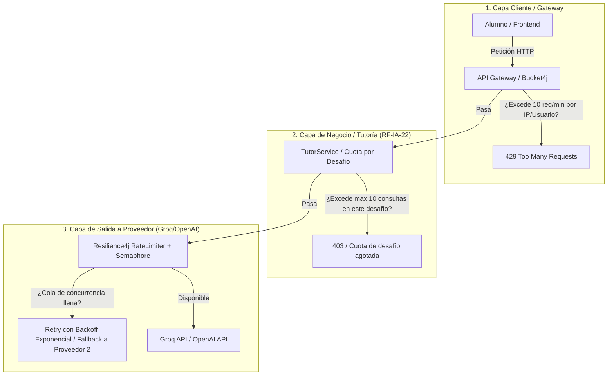

# 19 — Guía de Modernización, Seguridad y Rate Limiting en LLM

> **Estado:** Documento de Arquitectura y Referencia Técnica  
> **Propósito:** Consolidar las técnicas modernas de integración con modelos de lenguaje (LLMs), el análisis de mejoras del código actual y el diseño del sistema de Rate Limiting y Cuotas (FinOps & Seguridad).

---

## 1. ¿Por qué es crítico agregar Rate Limiting y Cuotas?

El Rate Limiting **no es opcional** cuando se trabaja con LLMs. Sin un control de tasa en capas, el sistema queda expuesto a:

1. **Ataques de agotamiento de presupuesto (*Denial of Wallet* / DoW):**
   Un script automatizado o un usuario malintencionado puede enviar miles de peticiones. Aunque el modelo no sufra un jailbreak, el costo de tokens o el consumo de la cuota del proveedor dejará el servicio fuera de línea para todos.
2. **Saturación de límites del proveedor (HTTP 429 Too Many Requests):**
   Proveedores como Groq, OpenAI o Anthropic aplican límites estrictos de peticiones por minuto (RPM) y tokens por minuto (TPM). Si varios alumnos consultan simultáneamente en un práctico, el proveedor rechazará las solicitudes si no hay un control de concurrencia local.
3. **Fuerza bruta contra Guardarraíles (*Prompt Fuzzing*):**
   Los atacantes prueban variaciones automáticas de prompts para eludir filtros de seguridad. El rate limit frena en seco los intentos de fuzzing.
4. **Objetivo Pedagógico (RF-IA-22):**
   Un alumno no debe usar al tutor como un "autocompletar". Limitar la cantidad de consultas por desafío (ej. 10 consultas por ejercicio) obliga al estudiante a reflexionar antes de preguntar.

---

## 2. Arquitectura de Rate Limiting en 3 Capas



### Tabla de Configuración de Límites

| Capa | Mecanismo | Configuración Típica | Objetivo |
| :--- | :--- | :--- | :--- |
| **Capa 1: Red/IP** | `Bucket4j` / Redis Token Bucket | Max 15 req/minuto por usuario autenticado | Mitigar DoS / Fuzzing |
| **Capa 2: Negocio** | Base de datos / Redis | Max 10-20 preguntas por desafío | Pedagógico (evitar dependencia del LLM) |
| **Capa 3: Proveedor** | `Resilience4j RateLimiter` | Acorde al tier del proveedor (ej. 25 RPM en Groq free tier) | Evitar errores 429 en cascada |

---

## 3. Matriz de Mejoras Técnicas del Proyecto

### Resumen Comparativo

| Área | Implementación Actual | Mejora Moderna Recomendada | Prioridad |
| :--- | :--- | :--- | :--- |
| **Seguridad de Claves** | API Keys hardcodeadas en `application.properties` | Inyección por variables de entorno (`${GROQ_API_KEY:}`) | 🔴 **Crítica** |
| **Filtro Anti-Jailbreak** | Lista estática de palabras (`contains`) | Filtro semántico / Llama Guard 3 en Groq | 🔴 **Alta** |
| **Estructura de Prompts** | Concatenación plana de texto en `.user(...)` | Array nativo de mensajes (`system`, `user`, `assistant`) | 🟡 **Media-Alta** |
| **Latencia / UX** | Bloqueante (`.call().content()`) | Streaming reactivo con Server-Sent Events (`Flux<String>`) | 🟡 **Media** |
| **Anti-Fuga de Solución** | Conteo de líneas de código (> 8 líneas) | Normalización de código y comparación AST | 🟡 **Media** |
| **Resiliencia** | Catch genérico con texto de error | Circuit Breaker + Fallback a proveedor alternativo | 🟢 **Media-Baja** |
| **Observabilidad** | Logs estándar en consola | Trazabilidad LLMOps (tokens, latencia, costos con Micrometer/Langfuse) | 🟢 **Media-Baja** |

---

## 4. Ejemplos de Implementación de Mejoras

### A. Rate Limiting con Bucket4j en Spring Boot

```java
@Configuration
public class RateLimitConfig {

    private final Map<String, Bucket> buckets = new ConcurrentHashMap<>();

    public Bucket resolveBucket(String usuarioId) {
        return buckets.computeIfAbsent(usuarioId, id -> Bucket.builder()
                .addLimit(Bandwidth.builder()
                        .capacity(10)
                        .refillGreedy(10, Duration.ofMinutes(1))
                        .build())
                .build());
    }
}
```

```java
// En el Controller o Interceptor:
Bucket bucket = rateLimitConfig.resolveBucket(usuarioRef);
if (!bucket.tryConsume(1)) {
    return ResponseEntity.status(HttpStatus.TOO_MANY_REQUESTS)
            .body(new ErrorResponse("Has alcanzado el límite de consultas por minuto. Espera unos segundos."));
}
```

---

### B. Separación Estructural de Mensajes (Prompt Seguro)

```java
// En lugar de concatenar texto plano en user():
List<Map<String, String>> messages = new ArrayList<>();

// 1. Mensaje de Sistema (Instrucción con máxima prioridad)
messages.add(Map.of("role", "system", "content", systemPrompt));

// 2. Historial de Conversación
for (MensajeEntity m : historico) {
    String role = m.getRol().equalsIgnoreCase("tutor") ? "assistant" : "user";
    messages.add(Map.of("role", role, "content", m.getContenido()));
}

// 3. Consulta actual del Alumno (marcada como dato)
messages.add(Map.of("role", "user", "content", preguntaAlumno));
```

---

### C. Streaming con Server-Sent Events (SSE)

```java
@GetMapping(value = "/{id}/stream", produces = MediaType.TEXT_EVENT_STREAM_VALUE)
public Flux<String> streamRespuestaTutor(@PathVariable UUID id, @RequestParam String pregunta) {
    // Valida guardarraíl de entrada
    if (inputGuard.esJailbreak(pregunta)) {
        return Flux.just(TutorServiceImpl.RESPUESTA_BLOQUEADA);
    }

    return chatClient.prompt()
            .system(systemPromptCache)
            .user(pregunta)
            .stream()
            .content();
}
```

---

### D. Resiliencia y Fallback (Resilience4j)

```yaml
# application.yml
resilience4j.circuitbreaker:
  instances:
    llmService:
      slidingWindowSize: 10
      failureRateThreshold: 50
      waitDurationInOpenState: 10s

resilience4j.ratelimiter:
  instances:
    groqLimiter:
      limitForPeriod: 25
      limitRefreshPeriod: 1m
      timeoutDuration: 2s
```

---

## 5. Checklist de Verificación de Producción

- [ ] **Secretos:** Ninguna API key commiteada en el repositorio.
- [ ] **Rate Limit Nivel 1:** Límite de peticiones por minuto por usuario/IP.
- [ ] **Rate Limit Nivel 2:** Límite de consultas pedagógicas por desafío (RF-IA-22).
- [ ] **Rate Limit Nivel 3:** Control de concurrencia hacia la API de Groq para evitar HTTP 429.
- [ ] **Mensajes:** Roles `system`, `user` y `assistant` desacoplados.
- [ ] **Ventana de Contexto:** Truncado / deslizamiento de historial (máximo últimos 8-10 mensajes).
- [ ] **Anti-Fuga:** La solución del desafío nunca entra al prompt del tutor.
- [ ] **Observabilidad:** Métricas de tokens y latencia registradas.
