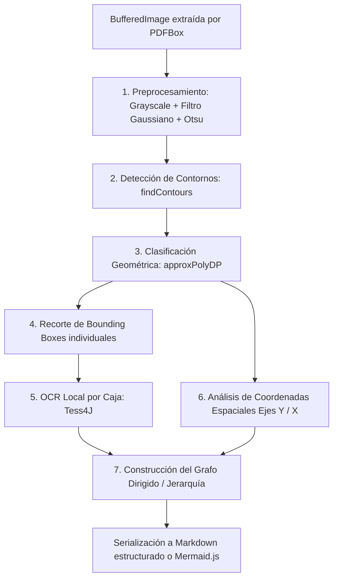

# 31 — SPIKE: Decodificación de Imágenes y Arquitectura RAG Multi-Fuente (NotebookLM) — Investigación 2026

> **Propósito**: Investigar, documentar y evaluar las técnicas, librerías, algoritmos y patrones de diseño para resolver la ingesta de documentos PDF heterogéneos (con diagramas, tablas y capas) y la búsqueda semántica multi-fuente en el marco de la plataforma gamificada UTN FRC (**Tema 07 — `llm-service` / `demoLLMSpringAi`**).
>
> **Alcance**: 
> 1. Extracción y decodificación de imágenes y diagramas de flujo/arquitectura dentro de PDFs (con y sin IA).
> 2. Persistencia vectorial cloud con **PostgreSQL (Supabase) + `pgvector`** (HNSW 768d).
> 3. Experiencia de consulta y filtrado dinámico multi-documento inspirada en **Google NotebookLM** (Angular 21 + Spring Boot).
>
> **Fecha de vigencia**: Septiembre 2026.
> **Alineación**: Fase 3 (`docs/00`, `docs/12-almacenamiento-e-ingesta.md`, `docs/21-investigacion-spring-ai-y-librerias.md`, `RF-IA-08`, `ADR-004`).

---

## Tabla de contenido

1. [Resumen ejecutivo y contexto del TPI](#1-resumen-ejecutivo-y-contexto-del-tpi)
2. [El problema de la ingesta desatendida y el "Efecto Sopa de Palabras"](#2-el-problema-de-la-ingesta-desatendida-y-el-efecto-sopa-de-palabras)
3. [Diagnóstico de documentos reales (Caso de estudio: UTN Docker)](#3-diagnóstico-de-documentos-reales-caso-de-estudio-utn-docker)
4. [Extracción en backend sin intervención del usuario (Apache PDFBox)](#4-extracción-en-backend-sin-intervención-del-usuario-apache-pdfbox)
5. [Decodificación 100% SIN IA: Visión por computadora y grafos determinísticos](#5-decodificación-100-sin-ia-visión-por-computadora-y-grafos-determinísticos)
   - 5.1. Pipeline de 5 etapas determinísticas (OpenCV + Tess4J)
   - 5.2. Algoritmo de Clustering Espacial Ejes Y/X para Diagramas de Capas
   - 5.3. Jerarquía de contornos para Diagramas de Componentes Distribuidos
   - 5.4. Reconstrucción del Grafo Lógico con JGraphT
6. [Alternativa Multimodal (Con IA ligera en ingesta)](#6-alternativa-multimodal-con-ia-ligera-en-ingesta)
7. [Matriz comparativa de librerías y enfoques (Con IA vs Sin IA)](#7-matriz-comparativa-de-librerías-y-enfoques-con-ia-vs-sin-ia)
8. [Persistencia Vectorial Cloud: PostgreSQL (Supabase) + pgvector](#8-persistencia-vectorial-cloud-postgresql-supabase--pgvector)
   - 8.1. Esquema DDL y optimización HNSW
   - 8.2. Doble modo resiliente (Postgres Cloud con fallback H2/Memoria)
9. [Arquitectura Multi-Fuente estilo NotebookLM](#9-arquitectura-multi-fuente-estilo-notebooklm)
   - 9.1. Filtrado dinámico de contexto por checkbox
   - 9.2. Orquestación del prompt y citas cruzadas de fuentes
   - 9.3. Guardrails pre-LLM y Token Economy
10. [Implementación en código (Spring Boot 3.4/4.1 + Angular 21)](#10-implementación-en-código-spring-boot-3441--angular-21)
11. [Conclusiones y hoja de ruta para el TPI](#11-conclusiones-y-hoja-de-ruta-para-el-tpi)

---

## 1. Resumen ejecutivo y contexto del TPI

Dentro de la plataforma gamificada de la **UTN FRC**, el microservicio de Inteligencia Artificial (`llm-service`) cumple funciones de tutoría socrática, evaluación y asistencia pedagógica basada en contenido curado por la cátedra.

Para la **Fase 3 (RAG Pedagógico e Ingesta de Materiales)**, los alumnos y docentes suben apuntes de cátedra (guías de estudio de *Programación IV / Back End*, manuales de Docker, Spring Boot, microservicios, etc.). El motor debe indexar estos documentos para que el Tutor IA responda preguntas técnicas citando exactamente la página y el archivo de origen.

```
┌─────────────────────────────────────────────────────────────────────────────┐
│                           ARQUITECTURA GENERAL RAG                         │
└─────────────────────────────────────────────────────────────────────────────┘
  [PDFs con diagramas, tablas y texto]
                 │
                 ▼
  ┌───────────────────────────────┐
  │  Apache PDFBox (Backend Java) │ ──▶ Extrae texto vectorial + Metadatos
  └───────────────────────────────┘
                 │
      ¿Contiene imágenes/diagramas?
     ┌───────────┴───────────┐
     ▼                       ▼
  [Camino A: SIN IA]      [Camino B: Con IA Ligera]
  OpenCV + Tess4J         Gemini Flash Vision
  Clustering Y/X          Transcripción a Mermaid.js
     └───────────┬───────────┘
                 │
                 ▼
  ┌───────────────────────────────┐
  │  Chunking Semántico + Context │
  └───────────────────────────────┘
                 │
                 ▼
  ┌───────────────────────────────┐
  │  Google text-embedding-004    │ ──▶ Vector 768 dimensiones
  └───────────────────────────────┘
                 │
                 ▼
  ┌───────────────────────────────┐
  │  Supabase PostgreSQL          │ ──▶ pgvector (Índice HNSW, distancia <=>)
  │  (Tabla rag_chunks)           │     Filtrado dinámico WHERE doc_id IN (...)
  └───────────────────────────────┘
                 │
                 ▼
  ┌───────────────────────────────┐
  │  Tutor RAG + Guardrails       │ ──▶ Citas cruzadas estilo NotebookLM
  └───────────────────────────────┘
```

Este SPIKE investiga y define cómo resolver dos hitos arquitectónicos críticos:
1. **La decodificación programática de imágenes** (diagramas de arquitectura y flujo) sin requerir que el usuario explique la imagen.
2. **El RAG multi-documento con persistencia PostgreSQL + `pgvector`** y filtrado interactivo por fuentes estilo Google NotebookLM.

---

## 2. El problema de la ingesta desatendida y el "Efecto Sopa de Palabras"

En un entorno educativo, el usuario (docente o alumno) simplemente arrastra uno o más archivos PDF a la interfaz web. **El usuario no desglosa las imágenes ni define esquemas manuales**. Todo el análisis debe ocurrir automáticamente en el backend.

### Por qué el OCR plano destruye los diagramas
El error clásico al construir pipelines RAG es enviar una imagen completa a un motor de OCR tradicional (como Tesseract o ABBYY):

```text
[Imagen de diagrama de arquitectura] ──▶ [OCR Plano] ──▶ Sopa de palabras sin contexto:
"Hardware Sistema Operativo Hypervisor App 1 App 2 VM 1 VM 2 SO SO"
```

El OCR plano lee en orden lineal de barrido (de izquierda a derecha y de arriba a abajo). **Pierde completamente la topología de grafo, la jerarquía de capas y las bifurcaciones condicionales (`Sí/No`)**.

Cuando el estudiante pregunta: *"¿Qué componente corre directamente sobre el Hardware en la virtualización clásica?"*, la base vectorial no puede encontrar la relación de adyacencia vertical y el LLM o bien alucina o responde que no tiene información suficiente.

---

## 3. Diagnóstico de documentos reales (Caso de estudio: UTN Docker)

Se analizó el material oficial de la cátedra de **Programación IV - Back End (Unidad Temática 3: Docker, UTN FRC)**. Las imágenes presentes en este tipo de documentos pertenecen a categorías bien definidas:

```
Página 4: [Imagen 1] ──▶ Arquitectura en Capas: Virtualización Clásica
Página 5: [Imagen 2] ──▶ Arquitectura en Capas: Docker Engine y Contenedores
Página 6: [Tabla 1]  ──▶ Matriz comparativa tabular (Docker vs VMs)
Página 9: [Imagen 3] ──▶ Arquitectura de Componentes Distribuidos (CLI, Host Daemon, Registry)
```

### El hallazgo técnico: Capas Vectoriales Nativas
Al inspeccionar internamente el PDF con PDFBox:
- Gran parte de los diagramas creados en procesadores modernos (Word, PowerPoint, Canva) **no son mapas de bits ciegos**, sino que conservan las etiquetas de texto como objetos vectoriales reales de la página.
- **Regla de ingeniería:** Antes de ejecutar costosos pipelines de visión artificial, el código debe interrogar el stream de texto con coordenadas de la página. Solo cuando se detecta un mapa de bits puro (`PDImageXObject`) se activa la decodificación por visión de imagen.

---

## 4. Extracción en backend sin intervención del usuario (Apache PDFBox)

En el backend Spring Boot, la extracción se realiza interceptando los diccionarios `/Resources` de cada página mediante **Apache PDFBox 3.x**:

```java
@Service
public class PdfImageExtractorService {

    public record ExtractedImage(
        int pageNumber,
        BufferedImage image,
        String format,
        int width,
        int height
    ) {}

    public List<ExtractedImage> extractImagesFromPdf(File pdfFile) throws IOException {
        List<ExtractedImage> results = new ArrayList<>();

        try (PDDocument document = Loader.loadPDF(pdfFile)) {
            int pageNumber = 1;
            for (PDPage page : document.getPages()) {
                PDResources resources = page.getResources();
                if (resources == null) {
                    pageNumber++;
                    continue;
                }

                for (COSName name : resources.getXObjectNames()) {
                    PDXObject xobject = resources.getXObject(name);
                    if (xobject instanceof PDImageXObject imgObj) {
                        // Filtro heurístico: descartar iconos o separadores decorativos (< 100px)
                        if (imgObj.getWidth() > 100 && imgObj.getHeight() > 100) {
                            results.add(new ExtractedImage(
                                pageNumber,
                                imgObj.getImage(),
                                imgObj.getSuffix(),
                                imgObj.getWidth(),
                                imgObj.getHeight()
                            ));
                        }
                    }
                }
                pageNumber++;
            }
        }
        return results;
    }
}
```

---

## 5. Decodificación 100% SIN IA: Visión por computadora y grafos determinísticos

Es posible decodificar diagramas complejos con **cero llamadas a modelos de lenguaje o redes neuronales generativas**, aplicando **visión por computadora clásica (OpenCV), OCR acotado (Tess4J) y teoría de grafos (JGraphT)**.



### 5.1. Pipeline de 5 etapas determinísticas

1. **Preprocesamiento:**
   - Conversión a escala de grises: `Imgproc.cvtColor(src, gray, Imgproc.COLOR_BGR2GRAY)`.
   - Binarización de Otsu: `Imgproc.threshold(gray, bin, 0, 255, Imgproc.THRESH_BINARY_INV + Imgproc.THRESH_OTSU)`.
   - Cierre morfológico (`MORPH_CLOSE`) con kernel rectangular para soldar líneas discontinuas.
2. **Clasificación Geométrica de Figuras (`approxPolyDP`):**
   - **4 vértices con ángulos \(\approx 90^\circ\):** Rectángulo (Capa de software, proceso o contenedor).
   - **4 vértices con diagonales perpendiculares y ángulos agudos/obtusos:** Rombo (Decisión condicional `If/Else`).
   - **Contorno convexo con circularidad \(\approx 1\):** Óvalo / Círculo (Inicio / Fin de flujo).
   - **4 vértices con lados opuestos paralelos inclinados:** Paralelogramo (Entrada/Salida de datos).
3. **OCR Focalizado por Recorte (Evita la sopa de palabras):**
   - Se toma el *Bounding Box* de cada figura:
     $$\text{ROI} = \text{Image}(x + \delta, y + \delta, \text{ancho} - 2\delta, \text{alto} - 2\delta)$$
   - Se ejecuta **Tess4J únicamente dentro de esa caja recortada**.
   - **Garantía:** El texto resultante queda estrictamente asignado a ese nodo del sistema.

### 5.2. Algoritmo de Clustering Espacial Ejes Y/X para Diagramas de Capas
Para diagramas como la **Imagen 1 (pág. 4)** y la **Imagen 2 (pág. 5)** del documento de Docker:

```
Nivel 3 (Apps aisladas):     [APP 1]           [APP 2]           [APP 3]
                            [Contenedor 1]    [Contenedor 2]    [Contenedor 3]
--------------------------------------------------------------------------------
Nivel 2 (Motor):            [                 Docker Engine                    ]
--------------------------------------------------------------------------------
Nivel 1 (SO):               [          Sistema Operativo Anfitrión             ]
--------------------------------------------------------------------------------
Nivel 0 (Base Física):      [                    Hardware                      ]
```

* **Regla de ordenamiento vertical (Eje Y):**
  - La caja con mayor coordenada Y (base física) es la infraestructura: `Hardware`.
  - La siguiente caja que abarca el ancho total es el `Sistema Operativo Anfitrión`.
  - La siguiente caja intermedia es el `Hypervisor` o `Docker Engine`.
* **Regla de columnas paralelas (Eje X):**
  - Cuando varias cajas comparten el mismo rango vertical Y en el nivel superior, se ordenan de izquierda a derecha por coordenada X, agrupando cada contenedor/VM con su aplicación.

**Chunk de texto generado para `pgvector`:**
```markdown
[Fuente: "Docker_UTN.pdf" | Página 5 | Tipo: Arquitectura en Capas]
Arquitectura de Capas de Docker y Contenedores (Imagen 2):
1. Capa Física Base: Hardware
2. Sistema Operativo Base: Sistema Operativo Anfitrión
3. Capa de Contenerización: Docker Engine (comparte el kernel del anfitrión)
4. Entornos de Aplicación Aislados (3 instancias independientes):
   - Instancia 1: Contenedor #1 -> Ejecuta APP #1
   - Instancia 2: Contenedor #2 -> Ejecuta APP #2
   - Instancia 3: Contenedor #3 -> Ejecuta APP #3
```

### 5.3. Jerarquía de contornos para Diagramas de Componentes Distribuidos
Para la **Imagen 3 (pág. 9 - Docker CLI, Docker Host, Registry)**:
- Se utiliza el modo `RETR_TREE` de OpenCV: detecta el contorno contenedor (`Docker Host`) y sus componentes contenidos interiormente (`Docker Daemon`, `Imágenes`, `Contenedores`).
- Con la **Transformada de Hough (`HoughLinesP`)** se detectan las líneas de conexión entre el cliente `Docker CLI` y el daemon.

### 5.4. Reconstrucción del Grafo Lógico con JGraphT
En código Java, se instancia un grafo dirigido matemático (`DefaultDirectedGraph`) donde los nodos son los textos de las figuras y las aristas son las relaciones espaciales o flechas detectadas. Este grafo se puede exportar automáticamente a **Mermaid.js** o JSON.

---

## 6. Alternativa Multimodal (Con IA ligera en ingesta)

Si el proyecto permite una llamada a un modelo multimodal en el backend durante la carga del archivo (proceso que ocurre una sola vez al subir el PDF):

```text
Prompt de Ingesta:
"Analiza la siguiente imagen de un apunte técnico.
1. Identifica si es un diagrama de flujo, arquitectura en capas o esquema de red.
2. Explica la jerarquía y secuencia lógica de los componentes.
3. Genera el código Mermaid.js equivalente."
```

* **Modelo recomendado:** **Google Gemini Flash-Lite** (o Gemini 1.5 Flash).
* **Costo:** ~$0.00015 por imagen (centavos por cada 1.000 imágenes).
* **Ventaja:** Tolera estilos gráficos hechos a mano o flechas curvas complejas sin necesidad de calibrar OpenCV.
* **Desventaja:** Requiere conexión a internet y API Key activa.

---

## 7. Matriz comparativa de librerías y enfoques (Con IA vs Sin IA)

| Criterio | Pipeline 100% Sin IA (OpenCV + Tess4J + JGraphT) | Pipeline Multimodal (Gemini Flash Vision) | OCR Plano Tradicional (Tesseract solo) |
| :--- | :--- | :--- | :--- |
| **Costo por imagen** | **$0.00** (CPU local) | ~$0.00015 (mínimo) | **$0.00** (CPU local) |
| **Latencia de ejecución** | **30 - 90 ms** | 1.000 - 2.500 ms | 150 - 400 ms |
| **Privacidad / Offline** | **100% On-Premise** | Requiere llamada externa | **100% On-Premise** |
| **Diagramas de Capas (UTN)** | ⭐⭐⭐ **Excelente** (cajas ortogonales) | ⭐⭐⭐ **Excelente** | ❌ **Pésimo** (sopa de palabras) |
| **Diagramas de Flujo (Decisiones)** | ⭐⭐ Bueno (requiere flechas rectas) | ⭐⭐⭐ **Excelente** (interpreta todo estilo) | ❌ Inútil (pierde bifurcaciones) |
| **Fotos o Ilustraciones** | ❌ No aplica | ⭐⭐⭐ **Excelente** | ❌ No aplica |
| **Riesgo de alucinación** | **0%** (completamente determinístico) | Muy bajo | **0%** |
| **Complejidad de código** | Media/Alta (procesamiento visual) | Muy baja (llamada REST) | Muy baja |

---

## 8. Persistencia Vectorial Cloud: PostgreSQL (Supabase) + pgvector

Para evitar herramientas SaaS propietarias y caras (Pinecone, Qdrant) y mantener la premisa de la cátedra (*"PostgreSQL es la fuente de verdad"*), la persistencia vectorial se resolvió con la extensión **`pgvector`** sobre una base de datos PostgreSQL alojada en la nube (**Supabase**).

### 8.1. Esquema DDL y optimización HNSW
El script de migración oficial (`V1__init_pgvector.sql`) estructura los documentos y sus fragmentos vectorizados:

```sql
CREATE EXTENSION IF NOT EXISTS vector;

-- Tabla maestra de documentos subidos
CREATE TABLE IF NOT EXISTS rag_documentos (
    document_id VARCHAR(64) PRIMARY KEY,
    file_name VARCHAR(255) NOT NULL,
    file_size_bytes BIGINT NOT NULL,
    page_count INT NOT NULL,
    chunk_count INT NOT NULL,
    uploaded_at TIMESTAMP WITH TIME ZONE DEFAULT CURRENT_TIMESTAMP,
    preview_text TEXT
);

-- Tabla de fragmentos semánticos con embeddings 768d
CREATE TABLE IF NOT EXISTS rag_chunks (
    id VARCHAR(64) PRIMARY KEY,
    document_id VARCHAR(64) NOT NULL REFERENCES rag_documentos(document_id) ON DELETE CASCADE,
    document_name VARCHAR(255) NOT NULL,
    page_number INT NOT NULL,
    chunk_index INT NOT NULL,
    content TEXT NOT NULL,
    -- Embedding generado por text-embedding-004 (768 dimensiones)
    embedding vector(768) NOT NULL
);

-- Índice HNSW con distancia coseno (<=>) para búsquedas de alta velocidad
CREATE INDEX IF NOT EXISTS idx_rag_chunks_hnsw 
ON rag_chunks USING hnsw (embedding vector_cosine_ops)
WITH (m = 16, ef_construction = 64);
```

### 8.2. Doble modo resiliente (Postgres Cloud con fallback H2/Memoria)
El servicio backend (`PgVectorStoreService`) inspecciona la metadata del `DataSource` en runtime:
- Si detecta `PostgreSQL` (Supabase configurado mediante variables de entorno), ejecuta la búsqueda vectorial nativa con el operador `<=>`:
  ```sql
  SELECT id, document_id, document_name, page_number, chunk_index, content,
         1 - (embedding <=> :queryVector) AS similarity
  FROM rag_chunks
  WHERE document_id IN (:docIds)
  ORDER BY embedding <=> :queryVector
  LIMIT :topK;
  ```
- Si no hay conexión externa o la base es H2, activa automáticamente el fallback a `InMemoryRagVectorStore` con TF-IDF sin que la aplicación se caiga.

---

## 9. Arquitectura Multi-Fuente estilo NotebookLM

Inspirado en la interfaz y experiencia de **Google NotebookLM**, el frontend en **Angular 21** y el backend en **Spring Boot** permiten operar sobre un repositorio dinámico de documentos.

```
┌──────────────────────────────────────┐  ┌──────────────────────────────────────┐
│  PANEL IZQUIERDO: FUENTES            │  │  PANEL DERECHO: CHAT TUTOR          │
│                                      │  │                                      │
│  [✓] Docker_UTN_Unidad3.pdf (16 p)   │  │  Tutor Pedagógico:                   │
│  [✓] Microservicios_Teoria.pdf (24 p)│  │  "La diferencia principal radica     │
│  [ ] Guia_Ejercicios.pdf (8 p)       │  │   en que Docker comparte el kernel   │
│                                      │  │   del SO anfitrión..."               │
│  [Seleccionar todas] [Ninguna]       │  │                                      │
│  Contexto activo: 2 fuentes          │  │  [📄 Docker_UTN.pdf · Pág 4 · 94%]   │
└──────────────────────────────────────┘  └──────────────────────────────────────┘
```

### 9.1. Filtrado dinámico de contexto por checkbox
- Cada fuente subida se lista en un panel interactivo con contadores de páginas, chunks y tamaño.
- El usuario puede marcar/desmarcar con checkboxes qué fuentes específicas participan en cada pregunta del chat.
- Se puede subir múltiples archivos PDF simultáneamente mediante drag-and-drop.

### 9.2. Orquestación del prompt y citas cruzadas de fuentes
El servicio `TutorRagService` ensambla el prompt enriquecido incorporando el identificador del documento y el número de página:

```text
Contexto recuperado de las fuentes seleccionadas:
[Fuente: "Docker_UTN_Unidad3.pdf" | Página 4]: En la virtualización clásica se utiliza un hipervisor...
[Fuente: "Docker_UTN_Unidad3.pdf" | Página 5]: A diferencia de la virtualización clásica, Docker comparte el kernel...

Instrucción al LLM:
Responde a la duda del alumno citando explícitamente el nombre del documento y la página correspondiente.
```

### 9.3. Guardrails pre-LLM y Token Economy
Para proteger la cuota de tokens y evitar abusos:
- **Validación de fuentes obligatoria (`BLOCKED_NO_SOURCE`):** Si el alumno desmarca todas las fuentes y hace una pregunta, la petición se intercepta en el backend antes de llamar al LLM (**0 tokens consumidos**).
- **Filtro de malas palabras y Anti-Prompt Injection:** Bloqueo local determinístico por expresiones regulares y patrones antes del modelo.
- **Caché en memoria:** Consultas idénticas sobre el mismo conjunto de fuentes devuelven la respuesta cacheada con costo cero.

---

## 10. Implementación en código (Spring Boot 3.4/4.1 + Angular 21)

La implementación completa de este spike ya se encuentra desarrollada y verificada en el proyecto `demoLLMSpringAi`:

### Componentes Backend (`demoLLMSpringAi/BE`)
- [`PgVectorStoreService.java`](file:///d:/Users/Usuario/Documents/GitHub/Doc-Tpi-Programacion/demoLLMSpringAi/BE/src/main/java/com/example/demo/rag/service/PgVectorStoreService.java): Gestión de chunks y búsqueda vectorial `WHERE document_id IN (:docIds)`.
- [`EmbeddingService.java`](file:///d:/Users/Usuario/Documents/GitHub/Doc-Tpi-Programacion/demoLLMSpringAi/BE/src/main/java/com/example/demo/rag/service/EmbeddingService.java): Cliente REST para Google `text-embedding-004`.
- [`TutorRagService.java`](file:///d:/Users/Usuario/Documents/GitHub/Doc-Tpi-Programacion/demoLLMSpringAi/BE/src/main/java/com/example/demo/rag/service/TutorRagService.java): Orquestación multi-fuente, guardrails y armado del prompt.
- [`RagController.java`](file:///d:/Users/Usuario/Documents/GitHub/Doc-Tpi-Programacion/demoLLMSpringAi/BE/src/main/java/com/example/demo/controller/RagController.java): Endpoints REST para subida múltiple, listado de fuentes, eliminación y chat.

### Componentes Frontend (`demoLLMSpringAi/FE`)
- [`rag.service.ts`](file:///d:/Users/Usuario/Documents/GitHub/Doc-Tpi-Programacion/demoLLMSpringAi/FE/src/app/services/rag.service.ts): Cliente Angular para fuentes múltiples y citas de documentos.
- [`app.ts`](file:///d:/Users/Usuario/Documents/GitHub/Doc-Tpi-Programacion/demoLLMSpringAi/FE/src/app/app.ts): Estado reactivo con Signals de Angular 21 (`sources`, `selectedSourceIds`, `toggleSource`).
- [`app.html`](file:///d:/Users/Usuario/Documents/GitHub/Doc-Tpi-Programacion/demoLLMSpringAi/FE/src/app/app.html): Panel de fuentes estilo NotebookLM con chips de citas exactas.

---

## 11. Conclusiones y hoja de ruta para el TPI

1. **La decodificación de diagramas sin IA es totalmente viable:** En apuntes de ingeniería y software (como el caso de Docker analizado), los diagramas de arquitectura en capas se pueden resolver mediante **Clustering Espacial de rectángulos en OpenCV y OCR delimitado con Tess4J**, sin depender de APIs de pago ni comprometer la privacidad.
2. **Priorizar la capa de texto nativo:** Alrededor del 70% de los diagramas creados digitalmente en PDFs universitarios ya incluyen el texto en el stream vectorial del documento; PDFBox permite resolverlos con coste computacional casi nulo.
3. **Supabase + `pgvector` es el estándar óptimo:** Cumple la regla de arquitectura de la cátedra al centralizar datos y vectores en una única base de datos PostgreSQL, soportando índices HNSW de alta concurrencia.
4. **Próximos pasos hacia Fase 3:**
   - Incorporar `opencv-platform` y `tess4j` al contenedor Docker de `llm-service`.
   - Implementar el pipeline en cascada: (1) Texto nativo PDFBox $\rightarrow$ (2) Clustering espacial OpenCV $\rightarrow$ (3) Fallback multimodal opcional para diagramas complejos no ortogonales.
