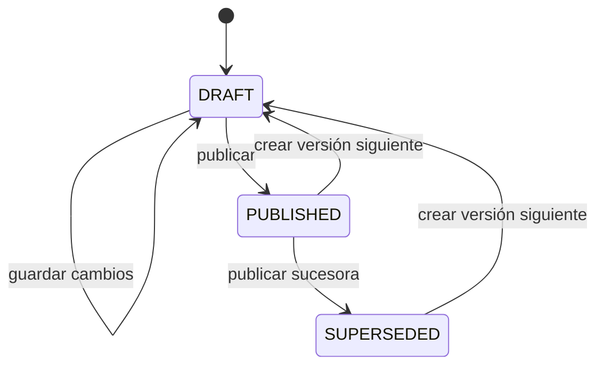

# Especificación funcional de Golden Set y calibración

> **Estado:** vigente para implementación  
> **Fecha:** 2026-09-06  
> **Base normativa:** PRD RF-IA-12, RF-IA-13, RF-IA-23, RF-IA-30, RF-IA-31, RF-IA-32, RF-IA-36 y PAR-14; adendas [ADR-017 y ADR-018](08-decisiones-y-pendientes.md).

## 1. Propósito y límite

El evaluador puntúa **cómo el alumno utilizó al tutor de IA** durante un intento. Analiza la
conversación completa, el contexto del desafío y la metadata disponible. Devuelve un puntaje entero
de 0 a 100 para cada una de las cinco dimensiones obligatorias y un puntaje final ponderado.

El Golden Set permite comprobar que ese evaluador se aproxima a puntuaciones humanas de referencia.
No contiene respuestas académicas esperadas y no sirve para decidir si la solución del alumno es
correcta. La aprobación del desafío se resuelve mediante reglas determinísticas del dominio o
revisión docente.

## 2. Roles

| Rol | Responsabilidades |
|---|---|
| ADMIN | Configurar adaptadores, credenciales y modelos; administrar y publicar el Golden Set base; ejecutar la calibración base de los modelos. |
| Docente | Administrar borradores y versiones de rúbricas y Golden Set del curso; puntuar casos; iniciar calibraciones; activar una calibración aprobada; confirmar migraciones de desafíos sin intentos. |
| Sistema | Validar invariantes, ejecutar trabajos asíncronos, aplicar PAR-14, bloquear asociaciones, programar recalibraciones y mantener auditoría. |
| Alumno | Consultar el resultado sobre su uso de IA y solicitar revisión mediante el flujo de apelación definido por el PRD. |

Las operaciones docentes se limitan a cursos sobre los que el actor tiene permisos. El docente elige
modelos habilitados; nunca carga claves, endpoints ni parámetros secretos.

## 3. Cinco dimensiones obligatorias

Las cinco dimensiones definidas por el PRD forman la identidad estable de la rúbrica. Una versión no
puede agregar, eliminar, duplicar ni reemplazar dimensiones. El docente sí puede editar en borrador:

- nombre visible y descripción, conservando el identificador estable de cada dimensión;
- criterios y anclas de puntuación;
- prompt o instrucciones específicas para el evaluador;
- peso relativo.

Cada peso debe ser un número válido y el total debe sumar exactamente 100 %. Las puntuaciones de
referencia y las producidas por el modelo son enteros de 0 a 100 inclusive.

## 4. Versionado e inmutabilidad

Rúbricas y Golden Sets se organizan en una familia y versiones correlativas.



- `DRAFT`: editable, con autosave en backend y control de concurrencia.
- `PUBLISHED`: inmutable y apta para calibrar.
- `SUPERSEDED`: inmutable, conservada para reproducir calibraciones y evaluaciones históricas.

Editar una versión publicada significa crear una nueva versión en estado `DRAFT`. No se sobrescriben
filas, prompts, pesos, puntuaciones ni artefactos ya utilizados.

## 5. Golden Set base y del curso

ADMIN mantiene un Golden Set base de plataforma. Al habilitar el evaluador en un curso, el sistema
crea una copia independiente y versionada. Las modificaciones del curso no alteran la base ni otros
cursos.

Cuando ADMIN publica una versión base nueva:

1. el sistema notifica al docente;
2. presenta diferencias y casos incorporables;
3. permite crear un borrador nuevo del Golden Set del curso;
4. incorpora los cambios que el docente seleccione;
5. exige publicar y recalibrar antes de activar esa versión.

Nunca se modifica automáticamente una versión del curso.

## 6. Contenido de un caso

Cada caso debe incluir:

| Grupo | Datos obligatorios |
|---|---|
| Identidad técnica | ID, versión de Golden Set, orden y estado de revisión. |
| Conversación | Lista ordenada y no vacía de mensajes con rol `STUDENT` o `TUTOR` y contenido no vacío. |
| Contexto | ID externo y enunciado/contexto pedagógico del desafío; sin solución esperada. |
| Metadata | Datos del intento útiles para la rúbrica, sin identidad personal del alumno. |
| Procedencia | `REAL` o `SYNTHETIC`, autor y fecha. |
| Referencia humana | Un entero 0–100 para cada dimensión; justificación opcional. |

Una conversación sintética puede ser propuesta por un LLM. Debe quedar marcada como `SYNTHETIC` y
no se incorpora hasta que un docente revise la conversación y asigne personalmente las cinco
puntuaciones. El modelo nunca produce la referencia definitiva.

## 7. Interacciones reales y anonimización

Una interacción real se anonimiza **antes** de crear el caso. El proceso elimina o generaliza datos
que permitan identificar al alumno en mensajes, metadata y contexto. El caso resultante no conserva
ID del alumno, ID reversible del intento ni una tabla de correspondencia.

La vista previa debe mostrar el contenido ya anonimizado. Si la anonimización no puede garantizarse,
la interacción se rechaza y no entra al staging.

## 8. Formas de carga

### 8.1 Formulario manual

El docente construye la conversación por mensajes, completa contexto y metadata, declara procedencia
y autor, y carga las cinco puntuaciones. El borrador se guarda en backend.

### 8.2 Importación JSON o CSV

La importación crea un staging editable:

1. cargar archivo;
2. detectar formato y mapear columnas cuando corresponda;
3. validar cada fila y cada mensaje;
4. mostrar errores junto al campo afectado;
5. permitir corregir filas en el staging;
6. mostrar una vista previa completa;
7. confirmar el lote.

El commit es atómico: se incorporan todas las filas cuando el lote completo es válido o ninguna. La
repetición con la misma clave de idempotencia no duplica casos.

### 8.3 Selección de interacciones reales

El docente selecciona conversaciones elegibles de la plataforma. El sistema las anonimiza, muestra
la vista previa resultante y las incorpora al mismo staging de validación.

## 9. Inicio y ejecución de una calibración

El docente selecciona explícitamente:

- versión publicada de la rúbrica;
- versión publicada del Golden Set;
- proveedor, modelo y versión habilitados por ADMIN;
- parámetros no secretos permitidos por la plataforma.

Antes de confirmar se muestra un resumen con las versiones exactas y la cantidad de casos. La
solicitud crea un trabajo asíncrono con estado durable:

```text
QUEUED -> RUNNING -> PASSED | FAILED
                 \-> CANCELLED
```

El progreso se consulta por ID. Cerrar o recargar la página no cancela ni pierde el trabajo. Los
reintentos internos y las solicitudes repetidas deben ser idempotentes.

Por cada caso se guarda la salida estructurada del evaluador, las cinco desviaciones absolutas, el
puntaje final humano, el puntaje final del modelo y su desviación. También se guardan proveedor,
modelo, versión, parámetros, rúbrica, Golden Set, prompt efectivo y timestamps.

## 10. Cálculo de PAR-14

Para un caso `c` y una dimensión `d`:

```text
error_dimension(c,d) = abs(score_modelo(c,d) - score_humano(c,d))
final(c) = suma(score(c,d) * peso(d) / 100)
error_final(c) = abs(final_modelo(c) - final_humano(c))
MAE_final = promedio(error_final(c))
max_error_individual = max(error_dimension(c,d))
```

La ejecución queda `PASSED` únicamente cuando se cumplen ambas condiciones:

1. `MAE_final <= 5`;
2. `max_error_individual <= 10`.

El promedio por dimensión puede mostrarse como diagnóstico, pero no reemplaza el máximo individual.

Ejemplos:

| MAE final | Máximo individual | Resultado | Motivo |
|---:|---:|---|---|
| 4,8 | 10 | `PASSED` | Cumple ambas condiciones. |
| 5,1 | 7 | `FAILED` | Supera el MAE final. |
| 3,2 | 11 | `FAILED` | Existe un caso/dimensión fuera de tolerancia. |

## 11. Activación y asociación con desafíos

Solo una ejecución `PASSED`, con calibración base vigente para el mismo modelo, puede activarse. Un
curso tiene como máximo una calibración activa.

Al habilitar un desafío, el sistema copia el ID de la calibración activa a una asociación propia del
desafío. El primer intento iniciado bloquea esa asociación de forma permanente.

Al activar otra calibración, el sistema prepara una vista previa con:

- desafíos futuros o todavía no habilitados, que usarán la nueva calibración;
- desafíos habilitados con cero intentos iniciados, que pueden migrarse;
- desafíos con uno o más intentos iniciados, que permanecen bloqueados.

El docente confirma si desea migrar los desafíos elegibles. Activación y migración ocurren en una
transacción auditable. La ausencia de confirmación conserva sus asociaciones actuales.

## 12. Recalibración, suspensión y cola

El sistema inicia una recalibración:

- una vez por mes;
- cuando detecta una versión distinta del modelo;
- cuando el docente la solicita manualmente.

Si una recalibración obligatoria falla, la calibración deja de estar habilitada para **nuevas
evaluaciones**. Los cierres de intentos se guardan en una cola durable con la versión de rúbrica,
Golden Set y asociación que les corresponde. Cuando vuelve a existir una calibración válida, los
trabajos se reanudan de forma idempotente.

Las evaluaciones completadas no se recalculan, sobrescriben ni reinterpretan.

## 13. Auditoría

Se auditan como mínimo:

- creación, modificación, publicación y clonación de versiones;
- importaciones y sus errores;
- incorporación de casos reales o sintéticos;
- inicio, cambio de estado y resultado de calibraciones;
- activación de una calibración;
- preview y confirmación de migraciones;
- bloqueo de asociación por primer intento;
- suspensión y reanudación de evaluaciones.

Cada evento registra actor, rol, curso, recurso, versión, fecha, request ID y datos mínimos para
explicar la transición sin guardar PII eliminada.

## 14. Criterios de aceptación

- Una versión publicada no admite mutaciones.
- El backend rechaza una rúbrica sin las cinco dimensiones o cuyos pesos no suman 100 %.
- El backend rechaza puntuaciones fuera de 0–100 o no enteras.
- Un caso real no conserva identidad ni referencia reversible al alumno.
- Una calibración que falla cualquiera de las dos condiciones de PAR-14 no puede activarse.
- El cambio de calibración requiere confirmación para migrar desafíos habilitados sin intentos.
- Un desafío con un intento iniciado nunca cambia de calibración.
- Una evaluación histórica conserva sus versiones exactas.
- Una caída o recalibración fallida no pierde solicitudes: las deja pendientes y las procesa una vez.
- Ninguna pantalla ni contrato presenta el score de uso de IA como corrección académica.

