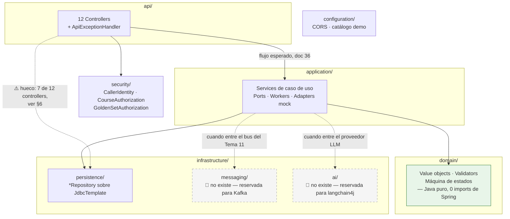

# 37 — Estructura de carpetas del backend (`llm-service`)

> **Qué es.** Foto del árbol real de `llm-service/` mapeada a las capas obligatorias de
> [36 §4](36-playbook-de-construccion.md), más la guía de "esto nuevo, ¿en qué carpeta va". Un solo
> lugar para consultarlo en vez de repetirlo en 02 y 36.
>
> **Qué NO es.** No reemplaza a 36 (ahí vive la regla y su porqué) ni a 02 (ahí viven los 8 módulos
> lógicos M1–M8, que son un corte distinto y ortogonal a estas carpetas). No cubre `llm-workbench`
> (frontend); si hace falta un equivalente, va en un doc aparte.
>
> **Alcance:** sólo `llm-service/`. Código importado — no se edita para "prolijarlo"; ver
> [[no-tocar-codigo-ajeno]]. Fecha de la foto: 2026-09-12.

---

## 0. Un solo servicio — lo demás es ejemplo

**`llm-service/` es el único servicio real.** Es una decisión cerrada del proyecto (README, "Decisiones
cerradas"): *"Un microservicio, no cinco"* — las cinco funciones de IA (tutor, moderador, evaluador,
generador) y el golden set/calibración comparten un mismo gateway interno, guardarraíles, cuotas y
log; no se separan en servicios distintos. Todo lo que describe este documento — las ocho capas, el
scaffold de §3 — es **de ese único servicio**.

**🟢 2026-09-12 — ya pasó.** Hasta esta fecha existía `codigo-ejemplo/`, con dos proyectos que
**no eran otro servicio ni una alternativa a `llm-service/`**: `ms-evaluacion-llm/` (esqueleto
histórico de referencia, de antes de que existiera `llm-service/`) y
`lara-heredia-demo-llm-spring-ai/` (demo de tutor con Spring AI, aporte de otra rama). Lo que
servía se portó **adentro** de `llm-service/`, en la capa que corresponde (§4) — el puerto de
invocación de modelos + fake en `domain/ai/` e `infrastructure/ai/` (EP-02/H10) y los
guardarraíles del tutor en el mismo `domain/ai/` (EP-05) — y la carpeta se eliminó. Detalle en
[`docs/estado-implementacion/ep-02/h10.md`](estado-implementacion/ep-02/h10.md) y
[`ep-05/interactions.md`](estado-implementacion/ep-05/interactions.md); los artefactos no-código
que este documento seguía citando quedaron preservados en
[`docs/estado-implementacion/codigo-ejemplo/fuentes/`](estado-implementacion/codigo-ejemplo/fuentes/).

## 1. La regla (fuente: doc 36)

> "La estructura de paquetes se decide en S1, pero debe conservar estas fronteras: `api`,
> `application`, `domain`, `infrastructure/persistence`, `infrastructure/messaging`,
> `infrastructure/ai`, `security` y `configuration`. Los nombres físicos pueden variar; las
> dependencias no: **`api` no conoce JPA, y `domain` no conoce Spring, Kafka ni proveedores**."
> — [36](36-playbook-de-construccion.md)

Y el flujo de una petición, del mismo documento:

```
Consumidor -> API Gateway -> /api/llm/** -> controller -> aplicación/dominio
```

Paquete raíz real: **`ar.edu.utn.frc.tup.piv.llm`** (bajo
`llm-service/src/main/java/ar/edu/utn/frc/tup/piv/llm/`, espejado en `src/test/java/...`).

## 2. El diagrama de capas



**Verde** = la única capa sin dependencia de framework (`domain/`). **Gris punteado** = capas
reservadas que todavía no existen. **Flecha punteada roja-ish (`hueco`)** = el atajo que hoy usan 7
controllers, contrario al flujo de doc 36 — detallado en §6.

## 3. El scaffold completo

```
llm-service/
├── pom.xml · Dockerfile · compose.yaml (+ .workbench.yaml)
├── src/main/resources/
│   ├── application.yml (+ -workbench)
│   └── db/migration/            — V1…V12, Flyway
├── src/main/java/ar/edu/utn/frc/tup/piv/llm/     ← el paquete, capas de doc 36
│   ├── api/                     — 12 controllers + ApiExceptionHandler
│   ├── application/             — services de caso de uso · ports · workers
│   ├── domain/                  — java puro, sin Spring (verificado)
│   ├── infrastructure/
│   │   ├── persistence/         — *Repository sobre JdbcTemplate
│   │   ├── messaging/            🔲 reservada — Kafka, Tema 11
│   │   └── ai/                   🔲 reservada — langchain4j, M1
│   ├── security/                — CallerIdentity · CourseAuthorization · GoldenSetAuthorization
│   └── configuration/           — WorkbenchCorsConfiguration · WorkbenchDemoCatalog
└── src/test/java/ar/edu/utn/frc/tup/piv/llm/     ← espejo de main
    (api/ · application/ · domain/ · infrastructure/persistence/ · security/)
```

`messaging/` y `ai/` van marcadas 🔲 porque son carpetas de destino, no carpetas que existan hoy —
se crean cuando entre esa capacidad (§2 y §5 explican por qué).

## 4. El árbol de hoy, capa por capa

| Capa (doc 36) | Carpeta real | Qué hay ahora | Puede depender de | No puede depender de |
|---|---|---|---|---|
| **api** | `api/` | 12 `@RestController` + `ApiExceptionHandler` | `application`, `security`, `domain` | JPA/JDBC directo — hoy hay 7 excepciones, ver §6 |
| **application** | `application/` | Services de caso de uso, ports (`AttemptStartedPort`, `ChallengeEnablementPort`), workers (`CalibrationRunWorker`, `PendingEvaluationWorker`), adapters mock | `domain`, `infrastructure/persistence` | — |
| **domain** | `domain/` | `CalibrationMetrics`, `CalibrationStateMachine`, `RubricValidator`, `TranscriptSanitizer`, `RealCaseAnonymizer` — **verificado: cero imports de Spring/framework** | sólo `java.*` | Spring, JDBC, Kafka, SDK de proveedor |
| **infrastructure/persistence** | `infrastructure/persistence/` | 11 `*Repository` sobre `JdbcTemplate` (no JPA — el `pom.xml` sólo trae `spring-boot-starter-jdbc`) | Spring JDBC, `domain` (para mapear filas) | — |
| **infrastructure/messaging** | *no existe* | — | — | Reservada para cuando entre Kafka (contrato del Tema 11, ver [02 §6](02-arquitectura-y-stack.md)) |
| **infrastructure/ai** | *no existe* | — | — | Reservada para los adapters `langchain4j` detrás de `LlmAdapter` (M1, ADR-016) |
| **security** | `security/` | `CallerIdentity`, `CourseAuthorization`, `GoldenSetAuthorization` | `application`, `api` los consumen | — |
| **configuration** | `configuration/` | `WorkbenchCorsConfiguration`, `WorkbenchDemoCatalog` | Spring `@Configuration` | — |

`infrastructure/messaging` e `infrastructure/ai` **no faltan por descuido**: EP-03/S1 es sólo golden
set y calibración, sin integración a Kafka ni llamada real a un proveedor LLM todavía. Se crean
cuando entre esa capacidad.

## 5. Código nuevo: en qué carpeta va

| Si vas a escribir... | Va en... | Nota |
|---|---|---|
| Un endpoint HTTP nuevo | `api/` | Llama a un service de `application/`, no a un repository. Ver el hueco de §6 antes de copiar un controller existente como plantilla |
| Una regla de negocio sin I/O (cálculo, validación, máquina de estados) | `domain/` | Debe compilar sin ninguna dependencia de Spring |
| Un caso de uso que orquesta domain + persistencia | `application/` | Es la capa que sí puede tocar `infrastructure` |
| Una tabla, query o migración nueva | `infrastructure/persistence/` + `resources/db/migration/V*.sql` (Flyway) | El repository expone tipos que `application/` consume; que no se filtren directo a `api/` |
| Un adapter a un proveedor LLM | `infrastructure/ai/` (crearla) | Detrás de la interfaz `LlmAdapter` (doc 02 §4), un módulo `langchain4j` por proveedor |
| Publicar o consumir un evento del bus | `infrastructure/messaging/` (crearla) | Contrato lo define el Tema 11; no confundir con la cola interna (Postgres `SKIP LOCKED`), que es `infrastructure/persistence/` |
| Un chequeo de token, scope u ownership | `security/` | |
| Un bean de configuración, perfil o CORS | `configuration/` | |

## 6. Hueco conocido — no corregido acá

Al armar este mapa quedó a la vista que **7 de los 12 controllers de `api/`** importan un
`*Repository` de `infrastructure/persistence/` directo y lo usan como colaborador, sin pasar por
`application/` — rompe el flujo `controller -> aplicación/dominio` de §1 (es la flecha punteada del
diagrama en §2):

`ModelDeploymentController`, `CourseEvaluationStatusController`, `CourseGoldenSetController`,
`GoldenSetUpdateProposalController`, `CalibrationActivationController`, `CalibrationRunController`,
`GoldenSetImportController`.

Este documento **no lo corrige** (es código importado con dueño, [[no-tocar-codigo-ajeno]]): el
detalle completo, con los 7 archivos y el fragmento de código, está transcripto en
[`llm-service/CORRECCIONES-SUGERIDAS.md`](../llm-service/CORRECCIONES-SUGERIDAS.md).

## 7. Chequeo contra las 10 épicas — ¿alcanzan las 8 capas para todo el servicio?

Este documento nació mirando sólo EP-03 (golden set). Para no dejar una falsa sensación de
completitud, se cruzó cada una de las 10 fichas de [`docs/epicas/`](epicas/README.md) contra las 8
capas de §1 — qué necesita cada épica y si ya tiene una carpeta destino.

| Épica | Qué necesita que no esté hoy | ¿Tiene carpeta destino en este scaffold? |
|---|---|---|
| EP-01 · Plataforma/contratos | Registro en discovery, dedupe de eventos | Sí — `configuration/`, `infrastructure/messaging/` (reservada) |
| EP-02 · AI Gateway/modelos | Catálogo modelo→función, adapters con reintentos | Sí — `infrastructure/ai/` (reservada), es literalmente para esto |
| EP-03/EP-04 · Golden set/calibración | — | Ya construido, es lo que mapea §4 |
| EP-05 · Tutor | Guardarraíl de salida, streaming con retención de bloques de código | Sí — `api/` (SSE), `domain/` (guardarraíl), `infrastructure/ai/` |
| EP-06 · Evaluación/score | Consumir `intento_cerrado`, publicar score, puntajes pendientes | Sí — `infrastructure/messaging/` (reservada) deja de ser teórica acá |
| EP-07 · Operación/cuotas | Panel de costo/cuotas, salud independiente del proveedor | Sí — `configuration/` (Actuator) + `application/` |
| EP-08 · Moderación (F2) | Reglas rápidas + clasificador externo para casos dudosos | Sí — `domain/` (reglas), `infrastructure/ai/` (clasificador) |
| **EP-09 · RAG (F3)** | Ingesta, chunking, embeddings, búsqueda por similitud (pgvector) | **⚠️ No decidido.** Doc 36 no nombra dónde vive: ¿`infrastructure/persistence/` (es "otra query a Postgres") o una `infrastructure/rag/` propia? |
| EP-10 · Personalización/agente (F3) | Generación de desafíos, guardia anti-bucle de menciones | Sí — `application/` (job de generación), `domain/` (guardia) |

**Conclusión:** las 8 capas alcanzan para 9 de las 10 épicas sin agregar nada. La única decisión
pendiente es dónde vive el pipeline de RAG (EP-09) — y no es urgente: esa épica arranca en **S14**,
muy lejos todavía. Queda anotado para no descubrirlo recién ahí.

## 9. Qué se copia como raíz al integrar con el proyecto de cátedra

El árbol de §3 es el de este repo de trabajo (TP). Cuando llegue el momento de integrar con el
proyecto completo de la cátedra (gateway + discovery + microservicios de los demás grupos), **la
carpeta que se copia/renombra como raíz real es `llm-service/` en sí misma** — no una carpeta
envolvente, y no junto a `llm-workbench/` (ver [00](00-fuentes-de-verdad-y-convenciones.md) y
[gateway-y-discovery/03](gateway-y-discovery/03-convenciones-nombres-y-ruteo.md) para la convención
de nombre `llm-service`, sufijo `-service`).

De ese árbol de trabajo, **no viajan** a esa raíz:

| Archivo/carpeta | Por qué se queda solo en este repo |
|---|---|
| `llm-workbench/` | Es un frontend Angular temporal de dev/demo (S1); su propio README aclara que no reemplaza el monolito Angular compartido de la cátedra |
| `llm-service/CORRECCIONES-SUGERIDAS.md` | Nota de trabajo interna (detalle del hueco de §6), no parte de la raíz de despliegue |
| `llm-service/compose.workbench.yaml` | Hace `build: ../llm-workbench`; se rompe si `llm-service` queda sola como raíz sin ese sibling |
| `docs/` | Material del TP (documentación), no del servicio |

Lo que sí viaja es todo el resto de `llm-service/` de §3 (`pom.xml`, `Dockerfile`, `compose.yaml`,
`.env.example`, `src/`, `scripts/`) — ya con el cliente Eureka agregado a `pom.xml`/`application.yml`
para registrarse contra el discovery real del proyecto integrado.

`infrastructure/messaging/` e `infrastructure/ai/` siguen sin crearse (🔲, §3-§4): esta decisión de
"qué es la raíz" no adelanta esas capas — se crean recién cuando entre Kafka (Tema 11) o el proveedor
LLM real (M1/ADR-016), como ya estaba definido.

## 10. Ver también

- [02 — Arquitectura y stack](02-arquitectura-y-stack.md) — los 8 módulos lógicos (M1–M8) y el AI
  Gateway; es un corte funcional, no de carpetas.
- [36 — Playbook de construcción](36-playbook-de-construccion.md) — la regla de fronteras y por qué,
  y la secuencia obligatoria para construir una capacidad nueva.
