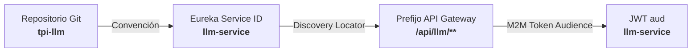

# Informe de Auditoría y Conformidad de Convenciones de Arquitectura

> **Estado posterior a la auditoría.** Este informe conserva evidencia del desalineamiento detectado
> en la presentación. La norma vigente para todo el repositorio y para el desarrollo futuro es
> [00](00-fuentes-de-verdad-y-convenciones.md), apoyada directamente en `idea.pptx.pdf`; los
> contratos v1 reemplazan sus sugerencias de endpoints anteriores.
**Documento Auditado:** `presentacion-microservicio-tema07.html`  
**Base Normativa Obligatoria:** `idea.pptx.pdf` (Componente de Borde · Tema 01 · UTN FRC)  
**Microservicio Auditado:** `llm-service` (Tema 07 — Evaluación LLM y Asistencia Socrática)  
**Fecha de Evaluación:** 2026-09-04  

---

## 1. Resumen Ejecutivo y Dictamen

El análisis de arquitectura realizado sobre el código fuente de `presentacion-microservicio-tema07.html` frente a la especificación canónica obligatoria definida en [`idea.pptx.pdf`](../idea.pptx.pdf) arroja las siguientes conclusiones:

> [!WARNING]
> **Dictamen: NO CONFORME (Requiere Adecuación de Nomenclatura y Enrutamiento)**  
> Si bien la presentación respeta correctamente los principios de diseño de alto nivel (Puerta Única en API Gateway, aislamiento Zero-Trust, Base de Datos propia por microservicio y resiliencia con Resilience4j/Circuit Breaker), **rompe de manera directa las convenciones estrictas de nombres de microservicios, derivación dinámica de rutas en el Gateway, modelo de autorización y nomenclatura de tokens de usuario vs. tokens técnicos M2M.**

---

## 2. Contrato Canónico de Nombres para el Microservicio (`llm-service`)

Conforme a la regla de tres niveles establecida en las **Diapositivas 6, 7, 20 y 23** de `idea.pptx.pdf`, la identidad del microservicio debe ser unívoca en todo el ecosistema:

| Capa / Ámbito | Convención Obligatoria (`idea.pptx.pdf`) | Valor Canónico para Tema 07 | Estado en la Presentación HTML |
| :--- | :--- | :--- | :--- |
| **Nombre de Repositorio** | `tpi-{nombre}` | `tpi-llm` | ❌ Figura como `ms-evaluacion-llm` |
| **`spring.application.name` (Eureka)** | `{nombre}-service` (kebab-case) | `llm-service` | ❌ Figura como `ms-evaluacion-llm` |
| **Prefijo de Ruta en Gateway** | `/api/{nombre}/**` | `/api/llm/**` | ❌ Endpoints huérfanos sin prefijo |
| **Rutas Públicas** | `/api/{nombre}/public/**` | `/api/llm/public/**` | ❌ Sin contemplar prefijo canónico |
| **Audience de Token M2M (`aud`)** | `{nombre}-service` | `llm-service` | ⚠️ Figura como `evaluations-service` (Slide 3) |

---

## 3. Detalle de Rupturas de Convención Detectadas

### 3.1. Nomenclatura del Microservicio (`ms-evaluacion-llm` vs. `llm-service`)
* **Ubicación en HTML:** Diapositivas 1 (línea 140), 2 (línea 176), 3 (línea 361), 4 (línea 450).
* **Violación:** Utiliza el prefijo `ms-` (`ms-evaluacion-llm`). `idea.pptx.pdf` estipula de forma explícita que todo microservicio debe terminar con el sufijo `-service` (ej. `users-service`, `mailing-service`, `challenges-service`).
* **Corrección requerida:** Renombrar todas las referencias del servicio a **`llm-service`** y el repositorio a **`tpi-llm`**.

---

### 3.2. Rutas y Endpoints Fuera del Estándar del Discovery Locator
* **Ubicación en HTML:** Diapositivas 4, 7, 8 y 9.
* **Violación:** En `idea.pptx.pdf` (Diapositivas 5, 6, 7, 24, 25 y 26), el API Gateway implementa un *Discovery Locator Gobernado* que mapea:
  $$\text{ServiceId: } \texttt{llm-service} \implies \text{Predicate: } \texttt{/api/llm/**} \implies \text{Forwarded Path: } \texttt{/api/llm/**}$$
  El HTML presenta rutas sin el prefijo `/api/llm/` o inventando prefijos ajenos como `/ai/`.

#### Matriz de Corrección de Endpoints

| Slide HTML | Línea | Endpoint Actual en Presentación | Endpoint Canónico Requerido | Observación |
| :--- | :--- | :--- | :--- | :--- |
| **Slide 4** | 429 | `GET /calibracion` | `GET /api/llm/calibracion` | Invocado por Tema 02 (síncrono/M2M). |
| **Slide 4** | 463 | `POST /tutor` | `POST /api/llm/tutor` *(o `/api/llm/stream`)* | Invocado por Tema 05 / SPA. |
| **Slide 4** | 471 | `POST /moderador` | `POST /api/llm/moderador` | Invocado por Tema 11 / Salas. |
| **Slide 7** | 633 | `POST /stream` | `POST /api/llm/stream` | Stream reactivo SSE del tutor. |
| **Slide 8** | 745 | `POST /calibracion` | `POST /api/llm/calibracion` | Carga de Golden Set (REST Asíncrono 202). |
| **Slide 8** | 796 | `GET /calibracion/{job_id}` | `GET /api/llm/calibracion/{job_id}` | Polling no bloqueante de calibración. |
| **Slide 9** | 855 | `GET /desglose/{id}` | `GET /api/llm/desglose/{id}` | Consulta de rúbrica 5D por alumno. |
| **Slide 9** | 907 | `POST /ai/apelar` | `POST /api/llm/apelar` | Prefijo `/ai/` reemplazado por `/api/llm/`. |

---

### 3.3. Confusión Conceptual: Token M2M vs. Token de Usuario y Rol del Gateway
* **Ubicación en HTML:** Diapositiva 8 (Paso 2, línea 745).
* **Texto actual en HTML:**
  > `"2. API Gateway: Recibe POST /calibracion, valida rol DOCENTE y token M2M (60s)."`
* **Violación de Principios de `idea.pptx.pdf`:**
  1. **Naturaleza del Token:** La Diapositiva 8 describe una acción iniciada por un Docente interactuando con el navegador (Front End / Workbench Docente). Por lo tanto, el cliente envía un **JWT de Usuario** (`Authorization: Bearer <user-jwt>`, `type=user`), **no un Token M2M de 60 segundos**. Los tokens M2M son de uso exclusivo backend-to-backend (Slide 12: `sub={micro-origen}`, `type=service`, `aud=llm-service`).
  2. **Separación de Responsabilidades:** La Diapositiva 4 establece taxativamente que el API Gateway **NO hace autorización de negocio ni guarda permisos de dominio**. El Gateway valida la validez criptográfica del JWT y propaga los headers; el microservicio (`llm-service`) es quien autoriza si el rol `DOCENTE` tiene permiso sobre la operación mediante `@RolesAllowed("DOCENTE")` o Spring Security local.
* **Corrección requerida:** Cambiar a:
  > *"2. API Gateway: Recibe `POST /api/llm/calibracion`, valida JWT de usuario, propaga identidad (`X-Principal-Type: user`, `X-User-Roles: DOCENTE`) y el microservicio autoriza el rol."*

---

### 3.4. Identificación de Microservicios del Ecosistema
* **Ubicación en HTML:** Diapositivas 2, 3, 4 y 5.
* **Violación:** La presentación referencia a los otros componentes mediante números de tema informales (`"Tema 01"`, `"Tema 02"`, `"Tema 03"`, etc.).
* **Corrección requerida:** Incorporar los `serviceId` oficiales del proyecto:
  * Tema 01 $\rightarrow$ `users-service` / `api-gateway`
  * Tema 02 $\rightarrow$ `courses-service` (o `cohorts-service`)
  * Tema 03 $\rightarrow$ `challenges-service`
  * Tema 05 $\rightarrow$ `practice-service`
  * Tema 07 $\rightarrow$ `llm-service`
  * Tema 11 $\rightarrow$ `chat-service`
  * Tema 12 $\rightarrow$ `admin-service` / `backoffice-service`

---

### 3.5. Estandarización de Headers de Trazabilidad y Salida
* **Ubicación en HTML:** Diapositiva 5 (línea 551), Diapositiva 9 (líneas 889 y 907).
* **Violación:** Utiliza la clave informal `trace_id` en snake_case.
* **Regla en `idea.pptx.pdf` (Diapositivas 8, 10, 14 y 18):**
  * Salida garantizada por el Gateway:
    * `X-Principal-Type: user | service`
    * `X-User-Id` / `X-User-Roles` (para usuarios)
    * `X-Service-Id` / `X-Service-Scopes` (para servicios)
    * `X-Delegated-User` (para M2M con usuario delegado)
    * `traceparent` + `X-Request-Id` (para correlación y observabilidad)

---

## 4. Aspectos Arquitectónicos que SÍ Cumplen con la Base

> [!NOTE]
> Los siguientes pilares estratégicos implementados en `presentacion-microservicio-tema07.html` concuerdan plenamente con las directivas de `idea.pptx.pdf`:

1. **Topología de Red Zero-Trust (Slide 3):** Ningún microservicio se comunica directamente con otro por IP privada; todo tráfico síncrono pasa obligatoriamente por el API Gateway.
2. **Propiedad Exclusiva de Persistencia (Slides 2 y 16):** El microservicio `llm-service` administra su propia base de datos (PostgreSQL 16 + pgvector y Redis) sin compartir acceso directo con terceros.
3. **Resiliencia y Circuit Breaking (Slides 15, 19 y 27):** Protección integral mediante Resilience4j (timeouts por ruta, retry controlado con jitter, bulkhead, degradación con respuestas Problem Details 503/504).
4. **Desacoplamiento Asíncrono (Slides 16 y 17):** Integración por eventos vía Apache Kafka para tareas diferidas (`intento_cerrado`, `score_de_ia_calculado`).
5. **Separación de Responsabilidades Core (SRP):** El microservicio emite el vector objetivo (0-100) y delega la aplicación de XP y reglas de negocio de gamificación a `challenges-service`.

---

## 5. Checklist de Modificaciones Recomendadas para el HTML

- [ ] **Slide 1 (Portada):** Reemplazar `ms-evaluacion-llm` por `llm-service` (Repo: `tpi-llm`).
- [ ] **Slide 2 (Alcance):** Actualizar subtítulo y menciones a `llm-service`.
- [ ] **Slide 3 (M2M):**
  - Reemplazar `ms-evaluacion-llm` por `llm-service`.
  - Asegurar `aud=llm-service` en la ficha técnica de credencial M2M.
- [ ] **Slide 4 (Mapa de Conexiones):**
  - Actualizar el nodo central a `llm-service`.
  - Corregir rutas en tarjetas periféricas: `GET /api/llm/calibracion`, `POST /api/llm/tutor`, `POST /api/llm/moderador`.
  - Asignar nombres canónicos a microservicios emisores (`users-service`, `courses-service`, `challenges-service`, etc.).
- [ ] **Slide 7 (Front End Modo 1 - SSE):**
  - Corregir Paso 2 a `POST /api/llm/stream` (o `/api/llm/tutor`).
- [ ] **Slide 8 (Front End Modo 2 - REST Asíncrono):**
  - Corregir Paso 2 a `POST /api/llm/calibracion`, indicando validación de JWT de usuario y propagación de roles.
  - Corregir Paso 5 a `GET /api/llm/calibracion/{job_id}`.
- [ ] **Slide 9 (Front End Modo 3 - REST Síncrono):**
  - Corregir Paso 2 a `GET /api/llm/desglose/{id}`.
  - Corregir Paso 5 a `POST /api/llm/apelar`.
  - Estandarizar menciones de trazabilidad a `traceparent` / `X-Request-Id`.
- [ ] **Slide 12 & 15 (Configuración e Integración):**
  - Reafirmar `spring.application.name=llm-service`.
