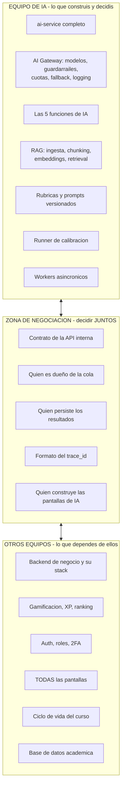
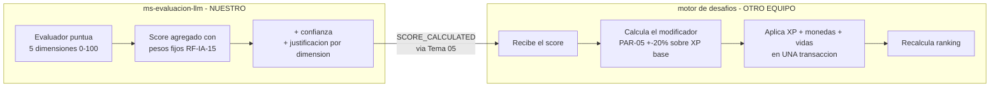

# 01 — El problema, el alcance y el equipo

> **Alineación 2026-09-04.** El alcance operativo se interpreta con [00](../00-gobierno-y-evolucion/01-fuentes-de-verdad-y-convenciones.md): MVP de evaluación/tutor seguro; moderación en Fase 2; RAG, ingesta y personalización en Fase 3. Las listas históricas de este documento no amplían ese alcance.

> Este documento existe porque el equipo se hace cargo **solo del LLM y la parte de IA**. Eso cambia
> qué decisiones son tuyas, cuáles hay que negociar, y —sobre todo— **qué cosas van a quedar en el
> medio y nadie va a construir si no las reclamás ahora.**

## 1. El hallazgo principal, primero

**5 de los 16 criterios de release del MVP dependen de la IA. Ninguno lo puede completar el equipo
de IA solo.**

| Criterio (Sección 19 del PRD) | Qué exige | Qué falta que no es tuyo |
|---|---|---|
| **DoD 7** | El tutor respeta las reglas por nivel de riesgo y el evaluador emite score **con desglose visible y vía de apelación** | Pantalla del desglose (RF-IA-16) y flujo de apelación (RF-IA-18) |
| **DoD 7b** | El golden set base existe y **está puntuado por docentes** | Herramienta para que los docentes carguen y puntúen transcripciones |
| **DoD 7c** | Cada curso tiene calibración aprobada y **el bloqueo draft→activo está verificado** | Integración con el ciclo de vida del curso, que es del otro equipo |
| **DoD 11** | Degradación controlada verificada ante caída del proveedor | Que el backend acepte la entrega y difiera el score |
| **DoD 13** | Auditoría sobre overrides de score académico | Modelo de auditoría del backend |

**Tu servicio puede estar perfecto y el MVP igual no sale.** Esto hay que plantearlo en la próxima
reunión de equipos, no en marzo.

## 2. Qué es tuyo, qué no

## 2b. Alcance confirmado (2026-08-29)

### Lo que construye el equipo de IA

| # | Pieza | Requerimientos | Nota |
|---|---|---|---|
| 0 | **RAG** — ingesta del material de la materia, chunking, embeddings, retrieval | RF-IA-08 | Base de todo. Ver [04](../03-capacidades-de-ia/02-funciones-de-ia.md)
| 1 | **Tutor en desafío** | RF-IA-01/04/06/07/19/20 | El más difícil. Sincrónico |
| 2 | **Generador de evaluaciones** | RF-DES-05 | Asincrónico, con gate humano |
| 3 | **Evaluador de uso de IA** | RF-IA-12 a 18, 25, 28 a 36 | **Emite los números.** No asigna XP. Ver §2c |
| 5 | **Moderador de chat** | RF-CHT-09 a 14 | Es función de IA aunque el chat sea de otro equipo. Ver [04](../03-capacidades-de-ia/02-funciones-de-ia.md) Parte 4 |
| 6 | **Agente `@mención` en canales de curso** | RF-CHT-05 | 🟡 **Fase 3 en el PRD.** Se diseña, no se construye este cuatrimestre |

> ⚠️ **Las dos piezas de chat no son MVP.** La Tabla 11 del PRD deja el **chat interno en Fase 2** y
> los **agentes de IA en canales grupales en Fase 3**. El moderador no figura como fuera de alcance,
> pero modera un chat que en el MVP no existe: es una inconsistencia del PRD que conviene llevar a
> revisión. Lo que sí hay que entregar ahora es el **contrato** `moderar(mensaje)`, para que el Tema
> 11 pueda diseñar su chat. El desarrollo completo está en [04](../03-capacidades-de-ia/02-funciones-de-ia.md) Parte 4.

Más lo transversal que las envuelve a todas: el **AI Gateway**, el **runner de calibración** y los
**workers asincrónicos**.

### Lo que explícitamente NO es del equipo de IA

Usuarios, roles, permisos, autenticación, 2FA, cursos, roadmap, el motor de desafíos, la economía de
gamificación (XP, monedas, vidas, insignias, equipamiento), el ranking, el cierre de curso, las
encuestas y **todas las pantallas**.

## 2c. La frontera del XP — tu instinto es el diseño correcto

> *"yo le doy los números; el desafío o motor de desafíos es el que tendría que asignar la XP"*

**Exacto, y es la decisión de diseño correcta.** Ya estaba en ADR-001, pero conviene dejarla escrita
como contrato porque es la zona gris que más se malinterpreta entre equipos.

> ⚠️ **Cambió el 2026-09-13.** El corte de responsabilidad de este diagrama sigue firme (vos das
> el score, el motor de desafíos aplica el XP), pero `POST /internal/ai-result` directo a Tema 03
> es un mecanismo descartado. Publicamos `SCORE_CALCULATED` por Kafka; lo recibe **Tema 05**,
> que se lo reenvía a Tema 03. Detalle en 17 · I-04
> 18 §4.2/§4.3

### Por qué el corte va justo ahí

| Motivo | Detalle |
|---|---|
| **Atomicidad** | Otorgar XP + monedas + vidas + insignia + nivel es un solo acto. Si vos escribieras el XP por tu lado, habría **dos escritores sobre la misma economía** y una condición de carrera esperando |
| **Un solo dueño de la economía** | PAR-01 a PAR-14 son parámetros globales de ADMIN. El que los interpreta es el motor de desafíos, no vos |
| **Vos no sabés el XP base** | El score de IA es un **modificador** (±20%, PAR-05) sobre un XP base que depende de dificultad, obligatoriedad, calidad de la solución y tiempo. Todo eso vive del otro lado |
| **RF-IA-27 es lógica de producto, no técnica** | "Si el evaluador no está: aceptar la entrega, otorgar XP base y monedas **ya**, diferir el score" — eso lo ejecuta el backend, no vos |

### Lo que hay que dejar por escrito en el contrato

Es lo que el usuario intuyó como *"algo a definir"*. Estos cuatro puntos:

1. **Vos devolvés `score_agregado` (0-100), el desglose por dimensión, la confianza y las
   justificaciones.** Nunca un valor de XP.
2. **El motor de desafíos traduce ese score a modificador** aplicando PAR-05, y lo suma a los otros
   criterios (calidad de solución, tiempo — PAR-04). El score de IA **no reemplaza** a los demás.
3. **Vos exponés el contador de scores pendientes por curso**; el backend lo consulta antes de dejar
   cerrar un curso (RF-IA-34).
4. **El backend implementa la degradación de RF-IA-27.** Si tu servicio no responde, la entrega se
   acepta igual y el XP base se otorga en el momento. **Eso no lo podés garantizar vos** — es una
   decisión del que escribe en la base.

> ⚠️ **El punto 4 es el que más se cae entre equipos.** El otro equipo suele asumir que "la
> resiliencia es cosa de la IA". No lo es: aceptar la entrega con el evaluador caído es lógica del
> backend. Si nadie la implementa, la caída de un proveedor externo bloquea a un alumno — que es
> exactamente lo que el principio rector de RF-IA-27 prohíbe.

---

### Lo que sí decidís vos

| Decisión | Documento |
|---|---|
| Arquitectura interna del `ai-service` | [02](../02-arquitectura-y-plataforma/01-arquitectura-y-stack.md)
| Qué modelos, qué proveedores, qué cuesta | [03](../03-capacidades-de-ia/01-modelos-costos-y-contexto.md)
| Sincrónico vs asincrónico, y la cola | [06](../06-operacion-calidad-y-pruebas/01-operacion-e-ingenieria.md)
| Pipeline del generador | [04](../03-capacidades-de-ia/02-funciones-de-ia.md)
| Rúbricas, calibración, umbrales | [04](../03-capacidades-de-ia/02-funciones-de-ia.md)
| Guardarraíles y defensa contra injection | [05](../04-seguridad-datos-y-cumplimiento/01-seguridad-y-guardarrailes.md)
| **El lenguaje del `ai-service`** | [02](../02-arquitectura-y-plataforma/01-arquitectura-y-stack.md)

### Lo que ya NO es tu decisión

**Java Spring Boot vs Python para el backend de negocio no es tu llamada.** Y tampoco lo es para el
`ms-evaluacion-llm`: **ADR-005 cerró esa decisión — el servicio va en Java Spring Boot**, igual que el
resto de la plataforma.

El fundamento completo —ventajas y desventajas de cada uno, herramientas por capa, y por qué Java gana
en este contexto— está en [02 · Arquitectura y stack](../02-arquitectura-y-plataforma/01-arquitectura-y-stack.md), Parte 2.

Lo que ADR-005 **sí** deja abierto: si hace falta un componente auxiliar para embeddings locales o AST
multilingüe, puede agregarse como **componente interno — no microservicio**. Las interfaces ya están
preparadas desde el diseño inicial.

## 3. Lo que necesitás pedirle a los otros equipos

Reclamalo temprano — cada ítem que llegue tarde te bloquea. El detalle completo, con requerimiento
y estado, vive en la carpeta de cada equipo, no acá:

- **Backend de negocio** — endpoint de contexto de desafío, endpoint para devolver resultados,
  disparador al cerrar un intento, aceptar la entrega con el evaluador caído, consulta de
  pendientes antes de cerrar un curso, consulta de calibración antes de activar, identidad y
  `curso_id` derivados de la sesión: [`equipos/backend-de-negocio/pendientes.md`](../07-planificacion-y-trabajo-equipo/11-equipos/backend-de-negocio/pendientes.md)
- **Front End** — las pantallas que faltan (la del golden set es la más urgente y la que más se
  subestima: sin calibración **ningún curso arranca**, RF-IA-36):
  [`equipos/frontend-angular/pendientes.md`](../07-planificacion-y-trabajo-equipo/11-equipos/frontend-angular/pendientes.md)
- **Product Owner** — las preguntas abiertas de [08](../00-gobierno-y-evolucion/02-decisiones-y-pendientes.md), empezando
  por quién produce el golden set y para cuándo (P-04) y si el free tier puede tocar datos de
  alumnos (P-06): [`equipos/product-owner/pendientes.md`](../07-planificacion-y-trabajo-equipo/11-equipos/product-owner/pendientes.md)

## 4. Las cosas que van a caer en el medio

Los puntos donde cada equipo asume que lo hace el otro. **Estos son los que fallan.**

| Zona gris | El malentendido típico | Cómo resolverlo |
|---|---|---|
| **¿Quién es dueño de la cola?** | IA asume que el backend encola; el backend asume que la IA se encarga | **Recomendación: tuya.** Es tu resiliencia (RF-IA-27) y tu control de cuota. El backend solo llama a un endpoint |
| **¿Quién persiste el score?** | Los dos escriben, o ninguno | **El backend.** Vos devolvés; él lo aplica en su transacción. Un solo dueño de la economía |
| **El contador de pendientes de RF-IA-34** | Nadie lo construye hasta el día del cierre | Es tuyo exponerlo, del backend consumirlo. Definilo en el contrato desde el día uno |
| **Ingesta del material del curso** | ¿Sube el archivo el backend y te avisa, o lo recibís vos? | **Recomendación:** el backend guarda el archivo, te pasa una referencia, vos indexás. Vos no manejás archivos de usuario |
| **Prueba de carga con IA (DoD 10)** | Cada equipo prueba lo suyo y nadie prueba el conjunto | Es conjunta por definición. Agendala explícitamente |
| **Detección de deriva (RF-IA-32)** | Corre mensual... ¿quién lo dispara? | Tuyo, con un scheduler propio dentro del `ai-service`. No dependas de otro equipo para algo periódico |
| **Los T&C (RF-NFR-09)** | Nadie escribe qué proveedores se usan | Vos sos el único que sabe la lista. **Entregala vos, escrita** |

## 5. El contrato: tu artefacto más importante

Cuando la frontera es entre equipos y no solo entre servicios, **el contrato deja de ser
documentación y pasa a ser el acuerdo de trabajo**. Tres reglas:

1. **Escribilo primero, en OpenAPI, antes de implementar nada.** El otro equipo puede empezar contra
   un mock mientras vos construís lo de verdad. Los dos avanzan en paralelo desde el día uno.
2. **Mantenelo chico.** 6 endpoints ([02](../02-arquitectura-y-plataforma/01-arquitectura-y-stack.md) §8). Cada endpoint nuevo es
   una negociación nueva.
3. **Versionalo.** Un cambio incompatible sin aviso rompe al otro equipo en medio de su sprint.

**El `ai-service` nunca se expone a internet.** Sin puerto publicado en el Compose, autenticación por
token interno. Solo el backend le habla.

## 6. Qué cambia en la demo

Como el equipo solo hace IA, **la demo debería demostrar el `ai-service` solo, sin depender de que
nadie más tenga nada listo.**

| Paso | Qué mostrar | Sin depender de |
|---|---|---|
| D1 | Ingesta de un PDF → chunks → búsqueda que devuelve el fragmento correcto | Front, backend, auth |
| D2 | Generación de parcial por API, con parámetros | Ídem |
| D3 | Evaluación de uso de IA con conversación completa y desglose 5D | Ídem |
| D4 | Tutor con RAG y guardarraíles | Ídem |

Una UI mínima propia — dos páginas feas, sin diseño — **solo para poder mostrarlo**. No es la UI del
producto: es tu banco de pruebas. Sirve para tres cosas y las tres valen:

1. Demostrarle al equipo qué hace el servicio.
2. Iterar prompts sin esperar al front.
3. **Ser el prototipo de las pantallas que el otro equipo va a tener que construir** — mostrarles
   una versión fea que funciona vale más que cualquier especificación escrita.

## 7. Los tres riesgos del recorte de alcance

| Riesgo | Por qué pasa | Mitigación |
|---|---|---|
| **La IA queda lista y no se puede usar** | Faltan las pantallas de [`equipos/frontend-angular/pendientes.md`](../07-planificacion-y-trabajo-equipo/11-equipos/frontend-angular/pendientes.md) | Reclamalas ahora, con los IDs de requerimiento y los puntos del DoD en la mano |
| **El golden set no existe el día del go-live** | Nadie lo agendó porque no es trabajo de desarrollo | 🔴 Escalá P-04 al PO **esta semana**. Es el único DoD que no depende de ningún equipo técnico |
| **El backend no implementa la degradación de RF-IA-27** | Asume que la resiliencia es "cosa de la IA" | La degradación es **de producto**, no técnica: aceptar la entrega y otorgar XP con el evaluador caído es lógica del backend. Explicitalo en el contrato |
