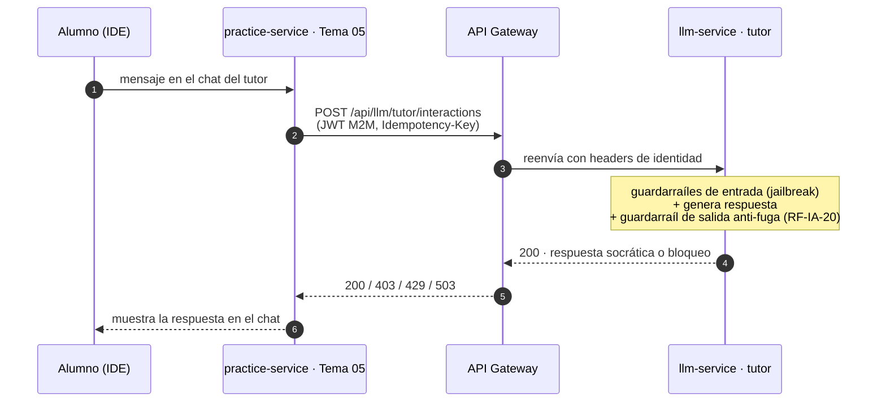

# Alcance de Tema 07 (`llm-service`) y contrato con Desafíos Prácticos

> **Para:** equipo de Desafíos Prácticos (`practice-service`, Tema 05).
> **De:** Tema 07 — Evaluación LLM (Grupo G03, `llm-service`, repo `tpi-llm`).
> **Objetivo del documento:** que sepan qué construimos, qué no construimos, y el contrato concreto
> (HTTP + lo que necesitamos de ustedes) que nos une, con detalle suficiente para diseñar su lado sin
> esperarnos.
>
> Este documento es un recorte, hecho **solo para ustedes**, de nuestro contrato interno completo
> (que cubre también a los otros tres equipos con los que integramos). Ante cualquier diferencia
> futura entre lo que dice acá y lo que se acuerde en la sesión de integración, **manda lo que se
> firme en esa sesión**.

---

## 0. Quiénes somos y qué relación tenemos con ustedes

Somos el equipo de IA (Tema 07). Con Desafíos Prácticos tenemos **tres puntos de contacto** — el tercero se agregó con una decisión de diseño del 2026-09-13 que centraliza en ustedes todo el intercambio del evaluador con el Motor de Desafíos (Tema 03), que antes era directo entre
nosotros y Tema 03:

1. **Ustedes nos llaman en vivo**, mientras el alumno resuelve un desafío, para que el **tutor
   socrático** le responda. Es la única llamada síncrona entre los dos equipos.
2. **Nosotros les pedimos datos suyos** — contexto del desafío, la solución esperada y una señal de actividad del IDE — porque sin ellos no podemos tutorear ni evaluar bien. Esta parte todavía tiene puntos abiertos (§5) y es la que más nos bloquea.
3. **Nos avisan cuando cierra un intento, y les devolvemos el score.** Ustedes publican el
   evento de cierre de intento (con la transcripción completa) y nosotros les entregamos el
   resultado del evaluador por el mismo canal (evento Kafka, `SCORE_CALCULATED`). Ustedes son quienes se lo reenvían a Tema 03 para el impacto en XP — nosotros ya no hablamos directo con el Motor de Desafíos. Detalle completo en [`contracts/equipos/tema-05-desafios-practicos.md`](../../contracts/equipos/tema-05-desafios-practicos.md).

El punto 1 sigue siendo HTTP síncrono vía Gateway — eso no cambia. El punto 3 es Kafka: es el
único evento que hoy corre entre `llm-service` y `practice-service`, con el mismo estado que el resto de este documento (acordado en contenido, todavía no volcado al AsyncAPI ejecutable). El punto 2 se resuelve con los mecanismos a acordar en §5.

---

## 1. Lo que hacemos (alcance de Tema 07, relevante para Desafíos Prácticos)

| #   | Función                                       | Qué hace                                                                                                                                          | Síncrono/Asíncrono                         | Relación con ustedes                                                                                                                                                                                       |
| --- | --------------------------------------------- | ------------------------------------------------------------------------------------------------------------------------------------------------- | ------------------------------------------ | ---------------------------------------------------------------------------------------------------------------------------------------------------------------------------------------------------------- |
| 1   | **Tutor socrático en el desafío**             | Responde al alumno sin darle la solución; ajusta el nivel de ayuda según `riskLevel`                                                              | Síncrono, objetivo `< 2 s`                 | ✅ Es el endpoint que ustedes llaman                                                                                                                                                                        |
| 2   | **Salvaguarda anti-fuga** (RF-IA-20 / PAR-11) | Compara la respuesta del tutor contra la solución esperada del desafío **antes** de mostrarla; si supera 70% de similitud, la descarta y regenera | Corre dentro de la llamada al tutor        | ✅ Necesita un dato suyo — ver §5.2                                                                                                                                                                         |
| 3   | **Evaluador de uso de IA** (async)            | Puntúa cómo el alumno usó al tutor durante el intento, 5 dimensiones 0-100                                                                        | Asíncrono, vía evento de cierre de intento | Directo con ustedes desde el 2026-09-13 (ver §0.3): nos avisan el cierre y les devolvemos el score para que se lo reenvíen a Tema 03. Además necesita señales suyas para 2 de las 5 dimensiones — ver §5.3 |
| 4   | **Golden Set y calibración**                  | Aprueba la rúbrica por curso-cohorte                                                                                                              | —                                          | Indirecto — bloquea si el curso puede tener evaluaciones válidas                                                                                                                                           |

El tutor **nunca** ve la solución esperada ni tests ocultos. Ve enunciado, código actual del alumno,
teoría/reglas y el nivel de riesgo. La comparación contra la solución corre en un guardarraíl de
salida, **fuera del prompt del modelo** (ADR-008).

---

## 2. Lo que NO hacemos (y por qué les importa a ustedes específicamente)

| No hacemos | Quién lo hace | Por qué el corte va ahí |
|---|---|---|
| **Validar si la solución del desafío está bien resuelta** | Ustedes / reglas determinísticas | El tutor y el evaluador miden **uso pedagógico de la IA**, no corrección de la entrega. Son ejes ortogonales |
| **Comparar la entrega de un alumno contra otra (originalidad/plagio)** | Ustedes (Tema 05) | Es un guardarraíl distinto, con datos distintos (código de dos alumnos, no una solución de referencia). Lo tenemos documentado internamente como fuera de nuestro alcance |
| **Guardar la solución esperada** | Ustedes | La usamos y la descartamos en el momento de comparar. Nunca entra al prompt del modelo, nunca se persiste, nunca se loguea (ADR-008) |
| **Streaming token a token del tutor, hoy** | — | RF-IA-20 exige comparar contra la solución esperada **antes** de mostrar la respuesta — eso impide emitir texto en vivo en el contrato vigente. Ya tenemos diseñada una variante en streaming ("Buffer Interceptor", ver §4.3) pero **no está fusionada al contrato**: depende de una decisión interna nuestra pendiente y de que ustedes acuerden consumir ese formato |
| **Persistir la transcripción alumno-tutor a largo plazo** | Abierto — ver §5.4 (B-2) | No hay dueño confirmado todavía; nuestra recomendación es que la retenga quien es dueño de la UI del chat, no nosotros |
| **Asignar XP o cualquier efecto de gamificación** | Motor de Desafíos (Tema 03) — ustedes se lo reenvían, pero no lo aplican | Fuera de nuestro alcance por completo. Desde el 2026-09-13 el score les llega a ustedes primero (§0.3) y ustedes lo reenvían a Tema 03 — pero reenviar no es aplicar: el modificador de XP (PAR-05) lo sigue calculando y aplicando el Motor de Desafíos, ni ustedes ni nosotros |
| **Comunicarnos directo con el Motor de Desafíos (Tema 03)** | Ustedes — todo el intercambio del evaluador pasa por Desafíos Prácticos | Decisión de diseño del 2026-09-13: un solo canal para el evaluador (nosotros ↔ ustedes ↔ Tema 03) en vez de que cada equipo hable con todos |
| **Detectar jailbreaks del alumno contra el tutor y frenarlos** | Nosotros — esto sí es nuestro | Aclarado para que no asuman que también es de ustedes: el filtro de entrada corre de nuestro lado |

> **La frase que hay que repetir en cualquier reunión de integración: el tutor nunca ve, nunca dice
> y nunca guarda la solución del desafío. Solo la usa un guardarraíl de salida, y la descarta al
> toque.**

---

## 3. El único canal síncrono: llamar al tutor



- `practice-service` tiene el scope M2M **`llm.tutor.interact`**. Es el único scope que necesitan
  hacia nosotros.
- Nunca hay llamada directa: siempre pasa por el API Gateway, que valida el JWT de servicio
  (`aud=llm-service`) y agrega los headers de identidad (`X-User-Id`, `X-User-Roles`, etc.).
- Correlación: `traceparent` + `X-Request-Id` en headers. Los cuerpos JSON no llevan `trace_id`.

---

## 4. El endpoint, campo por campo

### 4.1 `POST /api/llm/tutor/interactions`

```
POST /api/llm/tutor/interactions
Authorization: Bearer <JWT de servicio, aud=llm-service>
Idempotency-Key: <uuid>          ← obligatorio
Content-Type: application/json
```

**Request (`TutorInteractionRequest`):**

```json
{
  "attemptId": "uuid",
  "challengeId": "uuid",
  "courseCohortId": "uuid",
  "learnerId": "uuid",
  "message": "texto del alumno",
  "riskLevel": "high | medium | low",
  "conversacionId": "uuid (opcional)",
  "expectedSolution": "string (opcional, ver §5.2)"
}
```

Los seis primeros campos son obligatorios. `conversacionId` agrupa los turnos de una misma conversación:
si no lo mandan, creamos una y la devolvemos en la respuesta; reenvíenla en los turnos siguientes.
`expectedSolution` es opcional: solo se usa en memoria para el guardarraíl anti-fuga y nunca se guarda. `courseCohortId` y `learnerId` los deriva el Gateway de la
identidad de la llamada — igual los piden explícitos en el body porque el contrato HTTP actual no
los saca del token, así que **mándenlos siempre coherentes con la sesión del alumno**, no un valor
arbitrario del cliente.

**Response 200 (`TutorInteractionResponse`):**

```json
{
  "message": "respuesta socrática del tutor",
  "state": "completed | blocked | unavailable",
  "conversacionId": "uuid"
}
```

| `state` | Qué significa |
|---|---|
| `completed` | Respuesta generada y validada, lista para mostrar |
| `blocked` | El guardarraíl anti-fuga descartó la respuesta tras agotar los reintentos de regeneración — mostrar un mensaje genérico, nunca un error técnico al alumno |
| `unavailable` | El proveedor del modelo no respondió — degradación, no error del alumno |

**Errores** (RFC 7807 Problem Details, `requestId` como extensión):

| HTTP | Cuándo |
|---|---|
| `400` | Falta el header `Idempotency-Key` o el cuerpo no es JSON válido |
| `401` | Servicio o scope incorrecto (falta `llm.tutor.interact`) |
| `403` | Identidad delegada ausente o inválida |
| `409` | Misma `Idempotency-Key` con la solicitud original todavía en curso — reintentar en unos segundos |
| `422` | Cuerpo inválido (campo obligatorio ausente, `riskLevel` fuera de high/medium/low) o `Idempotency-Key` reusada con otro payload |

No hay `429` ni `503` en este endpoint: cualquier falla del modelo (timeout, proveedor caído, presupuesto
agotado) responde `200` con `state: unavailable`. Timeout de la llamada: hasta 25 s en el peor caso, así
que configuren 30 s de su lado.

### 4.2 `riskLevel`: por qué lo necesitamos exacto

| Valor | Cuándo | Efecto en el guardarraíl |
|---|---|---|
| `high` / `medium` | Desafío con una solución de referencia contra la que comparar (la mayoría) | El guardarraíl anti-fuga corre siempre, con retención completa del bloque de código hasta validarlo |
| `low` | Formatos sin una única solución esperada (hackathon, code review) | No hay contra qué comparar por similitud — el criterio de riesgo cambia, según RF-IA-19 |

Si `riskLevel` no refleja bien el tipo de desafío, el guardarraíl puede sobre-bloquear (falsos
positivos) o no proteger nada (si mandan siempre `low`). Es un campo que vale la pena revisar juntos
antes de integrar en serio.

### 4.3 Streaming (no vigente, para que lo tengan en el radar)

Tenemos diseñada (pero no implementada ni fusionada al contrato) una variante
`POST /api/llm/tutor/interactions/stream` en formato SSE (Server-Sent Events), con un modelo de
eventos `token` (prosa en vivo) / `hold` (se congela la emisión al abrir un bloque de código) /
`segment` (se libera un tramo ya validado) / `blocked` (un bloque de código superó el umbral de
similitud y se descarta) / `done` (evento terminal con metadata) / `error`.

**No está en el contrato ejecutable todavía.** Se fusiona solo si:

1. Nosotros cerramos internamente la decisión de propagar streaming o quedarnos con respuesta en
   bloque completo, y
2. Ustedes confirman que van a consumir SSE del lado del cliente (IDE).

No lo asuman disponible hasta que se lo confirmemos explícitamente y les pasemos el contrato
actualizado.

---

## 5. Lo que necesitamos de ustedes — y por qué es crítico

Estos son los puntos que **nos bloquean a nosotros**, no al revés. Es la parte más importante del
documento para la sesión de integración.

### 5.1 🟡 Endpoint de contexto del desafío (RF-IA-19)

Para tutorear necesitamos, antes de poder armar el prompt:

- Enunciado del desafío
- Código actual del alumno (o referencia a dónde leerlo)
- Tipo de desafío
- Nivel de riesgo (el mismo valor que ustedes nos mandan en `riskLevel` — confirmar que sale de la
  misma fuente para que no se desincronicen)

Hoy este contrato **no está cerrado como endpoint HTTP nuestro**: en el diseño actual asumimos que
**ustedes nos lo entregan ya armado dentro del `TutorInteractionRequest`**, o bien que exponen un
endpoint propio que nosotros consultamos. Cualquiera de las dos formas sirve — lo que no puede pasar
es que quede sin definir, porque bloquea directamente la calidad del tutor.

### 5.2 🔴 Cómo accedemos a la solución esperada — el punto más sensible

La salvaguarda anti-fuga (nuestra, sin discusión) necesita comparar la respuesta del tutor contra
**la solución esperada del desafío**, que hoy vive de su lado y no está expuesta a nadie.

**Sabemos que les vamos a pedir exponer algo que hoy consideran interno y sensible.** Por eso les
dejamos por escrito, desde ahora, la garantía que ofrecemos a cambio:

| Garantía nuestra | Detalle |
|---|---|
| Solo la vemos nosotros | Un endpoint interno, con scope M2M dedicado (ej. `llm.challenge.solution.read`), llamable únicamente por `llm-service` |
| Nunca la guardamos | Se usa en memoria para el guardarraíl de salida de esa interacción puntual y se descarta |
| Nunca entra al prompt del modelo | La comparación es determinística (similitud + AST), fuera del contexto que ve el LLM — así ningún jailbreak puede extraerla, porque el modelo nunca la tuvo |
| Nunca se loguea ni aparece en trazas | Nuestros logs de observabilidad no incluyen el contenido de la solución |

**Propuesta de forma del contrato** (a confirmar en la sesión de integración — todavía es
propuesta, no algo cerrado):

```
GET /internal/challenges/{challengeId}/expected-solution
```
llamado por `llm-service` hacia `practice-service`, vía Gateway, con un scope M2M que **solo**
nosotros tenemos.

Mientras esto no se acuerde, nuestro guardarraíl anti-fuga corre contra una **solución mock** en
desarrollo — funciona para demostrar el mecanismo, pero la integración real queda como deuda anotada
hasta que este punto se cierre.

### 5.3 🔴 Evento de actividad en el IDE — y ojo, **no todo es de ustedes**

El evaluador de uso de IA reparte el score en 5 dimensiones. La que más pesa —**autonomía, 30%**—
necesita saber si el alumno editó el código y corrió tests **antes** de preguntarle al tutor, o si
copió la respuesta tal cual. Hoy esa señal **no existe en ningún contrato**.

Sin ella, la dimensión que más pesa queda sin evidencia objetiva y el evaluador tiene que inferirla
solo de la conversación, que es mucho más débil y más fácil de "gamear".

El evento tentativo que necesitamos (nombre interno `evento_ide`, no cerrado) tiene cuatro tipos de
señal, y **no todas vienen de la misma fuente**:

| Tipo de señal | Ejemplo de campo | ¿De dónde sale? |
|---|---|---|
| `apertura` / `envio` de código | timestamp | **Ustedes** — es actividad del editor/IDE |
| `edicion` (líneas agregadas/eliminadas) | timestamp, líneas | **Ustedes** — mismo motivo |
| `ejecucion` de tests (resultado: paso/falló/error) | timestamp, resultado | **No necesariamente ustedes.** El repo lo deja explícito: *"las ejecuciones vienen del sandbox (Tema 06) o del IDE (Tema 05)"* — depende de dónde corre realmente el test runner en su arquitectura |

**Lo que les pedimos concretamente a ustedes:** el evento de `apertura`/`envio`/`edicion` de código, que
es indiscutiblemente suyo. Para el evento de `ejecucion` de tests, necesitamos que **nos digan quién
lo corre en su diseño** — si el sandbox es un servicio propio de Tema 06, esa parte del pedido va para
ellos, no para ustedes, y conviene coordinar los tres equipos (07, 05 y 06) en la misma conversación
para no terminar con dos contratos que no calzan.

> ⚠️ **Si esto no se pide ahora, no va a existir.** No es algo que se pueda reconstruir después de
> que el intento ya cerró — y da igual si el dueño final resulta ser Tema 05 o Tema 06.

### 5.4 🟡 Quién es dueño de la transcripción alumno-tutor (abierto, no bloqueante hoy)

Nosotros no persistimos la conversación del tutor — respondemos mensaje a mensaje y no guardamos
historial de largo plazo de nuestro lado. Pero el evaluador necesita la conversación completa al
cerrar el intento. Dos opciones sobre la mesa:

| Opción | Cómo | Nuestra recomendación |
|---|---|---|
| **A** | Quien es dueño de la UI del chat (ustedes) guarda la transcripción y la entrega completa cuando se dispara la evaluación | ✅ Preferida — menos PII de nuestro lado, coincide con "el evaluador no conoce desafíos, cursos ni alumnos" fuera de lo que se le pasa por parámetro |
| **B** | La guardamos nosotros | Nos hace dueños de datos personales con obligaciones de retención que hoy no tenemos previstas |

No es bloqueante para que ustedes empiecen a integrar el tutor — sí lo es para que el evaluador
funcione con datos reales en vez de mocks.

---

## 6. Agenda mínima para la sesión de integración

| # | Punto | Bloquea a | Prioridad |
|---|---|---|---|
| 1 | Forma del endpoint de contexto del desafío (¿lo mandan ustedes en el request, o lo exponen para que lo consultemos?) | Nosotros — calidad del tutor | 🟡 |
| 2 | Mecanismo para acceder a la solución esperada, con las garantías de §5.2 | Nosotros — la salvaguarda anti-fuga no tiene contra qué comparar sin esto | 🔴 |
| 3 | Evento de edición/apertura/envío de código en el IDE (suyo) + aclarar quién corre las ejecuciones de tests (¿ustedes o el Sandbox de Tema 06?) | Nosotros — la dimensión de autonomía (30% del score) queda sin evidencia objetiva | 🔴 |
| 4 | Quién persiste la transcripción alumno-tutor hasta el cierre del intento | Ambos — hoy no tiene dueño confirmado | 🟡 |
| 5 | Si van a consumir la variante SSE del tutor (define si fusionamos la adenda) | Ninguno todavía — decisión de UX de su lado | 🟢 |

---

*Este documento es un recorte para el equipo de Desafíos Prácticos, no un contrato nuevo. No decide
nada que no esté ya acordado de nuestro lado; donde algo no está cerrado, se marca 🔴/🟡 en vez de
inventarlo. Cualquier duda sobre un punto puntual, la coordinamos directamente en la sesión de
integración.*
