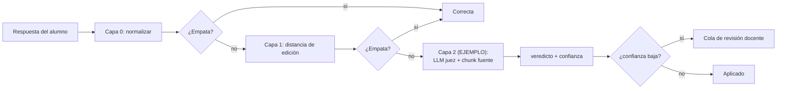

# 🚧 EJEMPLO — Boceto de contrato con Tema 04 (corrección semántica)

> ## ESTO NO ES UN CONTRATO ACORDADO
>
> Es un boceto para **visualizar** cómo se vería una integración técnica con Tema 04 *si* en algún
> momento se decide construir el corrector semántico. Hoy esa decisión **no existe** — está
> explícitamente fuera de alcance por
> [P-01](../../00-gobierno-y-evolucion/02-decisiones-y-pendientes.md#-p-01--corrector-de-respuestas-abiertas-fuera-de-alcance)
> (resuelta el 2026-09-06). Nada de lo que sigue está implementado, ofrecido a Tema 04, ni
> aprobado por el Product Owner.
>
> **No usar este documento como si fuera [`alcance-y-contrato-para-desafios-practicos.md`](alcance-y-contrato-para-desafios-practicos.md).**
> Ese es real y vigente. Este es un "qué pasaría si", para que la conversación de reabrir P-01
> tenga algo concreto para criticar en vez de discutir en abstracto.
>
> **Antes de que una sola línea de esto exista de verdad, hace falta (en este orden):**
> 1. Llevar el caso a la sesión con el PO y reabrir P-01 con requisitos, riesgos, responsable y
>    validación propios — no es una decisión de Tema 07 ni de Tema 04 solos.
> 2. Si se aprueba, un golden set real (ejemplos de respuestas de alumnos ya corregidas a mano)
>    para calibrar el juez antes de confiar en él con notas reales.
> 3. Recién ahí, algo parecido a lo de abajo.

---

## 0. La idea que se estaría contratando

Extender el pipeline de dos capas de la
[recomendación técnica](recomendacion-correccion-respuestas-cortas.md) con una tercera, **solo
para lo que las dos primeras no puedan resolver**:



Las Capas 0 y 1 las implementa Tema 04, sin nosotros (eso es lo real, ya escrito). La Capa 2 es la
parte hipotética de este boceto.

## 1. El endpoint (hipotético)

```
POST /api/llm/theoretical-answers/grade
Authorization: Bearer <JWT de servicio, aud=llm-service>
Idempotency-Key: <uuid>
```

**Request (`TheoreticalAnswerGradeRequest`, EJEMPLO):**

```json
{
  "questionId": "b1e2c3d4-0010-4a00-8000-000000000010",
  "courseCohortId": "b1e2c3d4-0003-4a00-8000-000000000003",
  "questionType": "respuesta_corta",
  "acceptedAnswers": ["API", "Application Programming Interface", "interfaz de programación de aplicaciones"],
  "studentAnswer": "aplicacion",
  "sourceChunkId": "chunk-00042"
}
```

- `acceptedAnswers`: la lista que Tema 04 ya debería tener por la recomendación de la Capa 1 — acá
  se reusa, no se pide de nuevo.
- `sourceChunkId`: el **chunk trazado** del que salió la pregunta (no una búsqueda libre en el
  RAG) — mismo mecanismo y misma razón que ya está documentada en
  [`05-seguridad.md`](../../04-seguridad-datos-y-cumplimiento/01-seguridad-y-guardarrailes.md#por-qué-el-chunk-trazado-y-no-una-búsqueda-libre): una
  búsqueda guiada por la respuesta del alumno "encuentra lo que el alumno dijo, no lo que la
  pregunta evaluaba".

**Response 200 (`TheoreticalAnswerGradeResponse`, EJEMPLO):**

```json
{
  "verdict": "partial",
  "score": 40,
  "confidence": 0.55,
  "justification": "El alumno identifica que API es parte de una aplicación pero no menciona que es una interfaz de programación — respuesta incompleta según el material de la unidad.",
  "suggestedAnswerVariant": null,
  "rubricVersion": "corrector-teorico-v0.1-EJEMPLO"
}
```

| Campo | Qué significa |
|---|---|
| `verdict` | `correct` \| `partial` \| `incorrect` |
| `confidence` | Igual patrón que el evaluador de uso de IA: confianza baja → cola de revisión docente, nunca aplica sola |
| `suggestedAnswerVariant` | Si el juez reconoce una variante nueva y válida, se sugiere para sumar a `acceptedAnswers` de Tema 04 — así la próxima vez la resuelve la Capa 1 sin gastar un token |
| `rubricVersion` | Mismo principio que `rubric_version` del evaluador (RF-IA-13): cambiar el criterio es una versión nueva, no recalcula histórico |

## 2. Los mismos guardarraíles que ya existen para el evaluador (EJEMPLO, reusando patrón real)

- La respuesta del alumno y el chunk recuperado son **DATO, nunca instrucción** — mismo principio
  RF-IA-14 que protege al evaluador de uso de IA.
- Salida estructurada obligatoria, sin texto libre suelto — mismo patrón "LLM como juez" de
  [`04-funciones-de-ia.md` §2](../../03-capacidades-de-ia/02-funciones-de-ia.md#2-el-patrón-común-llm-como-juez).
- Confianza baja o muestreo → cola de revisión docente, nunca aplica un score solo.
- Golden set propio para este corrector antes de confiar en él — no reusa el golden set del
  evaluador de uso de IA, porque mide algo distinto (04 §1c ya aclara que "ninguno de esos flujos
  utiliza el Golden Set del evaluador").

## 3. Lo que este boceto deja sin decidir (a propósito — es un ejemplo, no una propuesta cerrada)

- Sync vs async: ¿el alumno espera el veredicto al entregar el examen, o se corrige en batch
  después?
- Quién es dueño del corte "partial" vs "incorrect" — hoy no hay rúbrica de puntaje parcial para
  respuesta corta en ningún documento.
- Costo y cuota: cada llamada a Capa 2 es un LLM real, a diferencia de las Capas 0-1. Necesitaría
  su propia política de cuota (como RF-IA-22 para el tutor).
- **Sobre todo: si el PO decide, al reabrir P-01, que la respuesta sigue siendo "no" — este
  documento se descarta entero.** No es una propuesta que exista fuera de esa decisión.

---

> **Recordatorio final: este es un ejemplo para pensar, no un contrato.** El documento real y
> vigente con Tema 04 es [`recomendacion-correccion-respuestas-cortas.md`](recomendacion-correccion-respuestas-cortas.md),
> que no requiere nada de esto.
