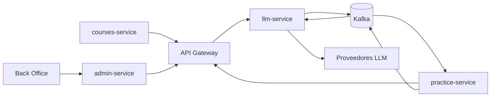

# 02 — Arquitectura y fronteras

## Regla de comunicación

Toda llamada HTTP a Tema 07 entra por API Gateway con el prefijo `/api/llm/**`. Kafka transporta
hechos de dominio y resultados diferidos. El Gateway no reescribe el path ni permite que el
frontend llame directo al servicio.

## Responsabilidades

| Componente | Es dueño de | No debe hacer |
|---|---|---|
| `llm-service` | Tutor, guardarraíl anti-fuga, rúbricas, Golden Set, calibración, evaluación de uso de IA y credenciales cifradas. | Otorgar XP, calificar académicamente, publicar prácticas o resolver membresías por cuenta propia. |
| `practice-service` | Práctica, intento, transcripción pertinente y recepción del score para su flujo posterior. | Inventar score de IA o exponer la solución esperada al alumno. |
| `courses-service` | Cohorte y pertenencia/rol docente. | Duplicar el estado de rúbricas o calibraciones. |
| `admin-service` | Orquestar Back Office y propagar identidad docente. | Guardar o devolver secretos de proveedores. |
| Proveedor LLM | Generación/evaluación del modelo configurado. | Recibir identidad, datos innecesarios o secretos de la plataforma. |

## Proveedores

El servicio encapsula proveedores. El contrato administrativo reconoce `ANTHROPIC`, `GEMINI` y
`OPENAI_COMPATIBLE`; este último cubre OpenAI, Groq y proveedores futuros compatibles con esa API.
Los equipos pares nunca invocan un proveedor directamente ni dependen de su formato de respuesta.

## Contratos aplicables

- HTTP expuesto: [llm-service.openapi.yaml](contracts/llm-service.openapi.yaml).
- Eventos publicados: [llm-service.asyncapi.yaml](contracts/llm-service.asyncapi.yaml).
- Datos que deben aportar otros equipos: [requisitos-a-otros-micros.md](contracts/requisitos-a-otros-micros.md).
