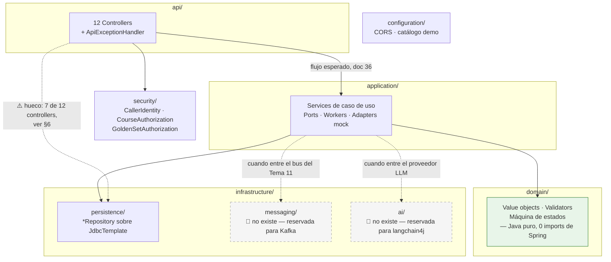

# 37 — Estructura de carpetas del backend (`llm-service`)

> **Qué es.** Foto del árbol real de `llm-service/` mapeada a las capas obligatorias de
> [36 §4](../07-planificacion-y-trabajo-equipo/06-playbook-de-construccion.md), más la guía de "esto nuevo, ¿en qué carpeta va". Un solo
> lugar para consultarlo en vez de repetirlo en 02 y 36.
>
> **Qué NO es.** No reemplaza a 36 (ahí vive la regla y su porqué) ni a 02 (ahí viven los 8 módulos
> lógicos M1–M8, que son un corte distinto y ortogonal a estas carpetas). No cubre `llm-workbench`
> (frontend) como *código*; si hace falta un equivalente, va en un doc aparte. Sí importa dónde vive
> `llm-workbench/` como *carpeta* — ver §0.1.
>
> **Alcance:** sólo el árbol de código de `llm-service/` (§1–§7). Código importado — no se edita
> para "prolijarlo"; ver [[no-tocar-codigo-ajeno]]. Fecha de la foto: 2026-09-12.

---

## 0. Un solo servicio — lo demás es ejemplo

**`llm-service/` es el único servicio real.** Es una decisión cerrada del proyecto (README, "Decisiones
cerradas"): *"Un microservicio, no cinco"* — las cinco funciones de IA (tutor, moderador, evaluador,
generador) y el golden set/calibración comparten un mismo gateway interno, guardarraíles, cuotas y
log; no se separan en servicios distintos. Todo lo que describe este documento — las ocho capas, el
scaffold de §3 — es **de ese único servicio**.

**🟢 2026-09-12 — ya pasó.** Hasta esta fecha existía `codigo-ejemplo/`, con dos proyectos que
**no eran otro servicio ni una alternativa a `llm-service/`**: `ms-evaluacion-llm/` (esqueleto
histórico de referencia, de antes de que existiera `llm-service/`) y
`lara-heredia-demo-llm-spring-ai/` (demo de tutor con Spring AI, aporte de otra rama). Lo que
servía se portó **adentro** de `llm-service/`, en la capa que corresponde (§4) — el puerto de
invocación de modelos + fake en `domain/ai/` e `infrastructure/ai/` (EP-02/H10) y los
guardarraíles del tutor en el mismo `domain/ai/` (EP-05) — y la carpeta se eliminó. Detalle en
[`docs/estado-implementacion/ep-02/h10.md`](../06-operacion-calidad-y-pruebas/04-estado-de-implementacion/ep-02/h10.md)
[`ep-05/interactions.md`](../06-operacion-calidad-y-pruebas/04-estado-de-implementacion/ep-05/interactions.md); los artefactos no-código
que este documento seguía citando quedaron preservados en
[`docs/estado-implementacion/codigo-ejemplo/fuentes/`](../06-operacion-calidad-y-pruebas/04-estado-de-implementacion/codigo-ejemplo/fuentes)

## 0.1. Por qué `docs/`, `llm-workbench/` y AGENTS.md viven ahora dentro de `llm-service/`

**🟢 2026-09-12.** Antes de esta fecha `docs/`, `llm-workbench/` y `llm-service/` eran tres carpetas
hermanas en la raíz del repo, y `README.md`/`AGENTS.md` vivían en esa misma raíz. Se consolidó todo
dentro de `llm-service/` para tener **una sola carpeta para copiar y pegar** con todo el TP hasta la
fecha: backend, frontend de prueba, documentación y las instrucciones de trabajo (`AGENTS.md`)
juntos y autocontenidos, sin depender de hermanas que se puedan perder al copiar o compartir la
carpeta suelta. La raíz del repo quedó sin `README.md` propio (el de `llm-service/` es el único) —
GitHub ya no renderiza una portada al entrar al repo, es el costo aceptado de esta consolidación.

Esto es ortogonal a la integración con el proyecto de cátedra (§9): ese caso sigue queriendo sólo
el microservicio pelado, así que ahí `docs/`, `llm-workbench/` y `AGENTS.md` se **excluyen a mano**
de la copia en vez de quedar afuera solos por ser hermanos.

## 1. La regla (fuente: doc 36)

> "La estructura de paquetes se decide en S1, pero debe conservar estas fronteras: `api`,
> `application`, `domain`, `infrastructure/persistence`, `infrastructure/messaging`,
> `infrastructure/ai`, `security` y `configuration`. Los nombres físicos pueden variar; las
> dependencias no: **`api` no conoce JPA, y `domain` no conoce Spring, Kafka ni proveedores**."
> — [36](../07-planificacion-y-trabajo-equipo/06-playbook-de-construccion.md)

Y el flujo de una petición, del mismo documento:

```
Consumidor -> API Gateway -> /api/llm/** -> controller -> aplicación/dominio
```

Paquete raíz real: **`ar.edu.utn.frc.tup.piv.llm`** (bajo
`llm-service/app/src/main/java/ar/edu/utn/frc/tup/piv/llm/`, espejado en `app/src/test/java/...`).

## 2. El diagrama de capas



**Verde** = la única capa sin dependencia de framework (`domain/`). **Gris punteado** = capas
reservadas que todavía no existen. **Flecha punteada roja-ish (`hueco`)** = el atajo que hoy usan 7
controllers, contrario al flujo de doc 36 — detallado en §6.

## 3. La estructura real

> Foto verificada contra `integracion/main-a-dev` el 2026-09-21, tras el refactor a reactor Maven
> multi-módulo de `main` y la [integración de `dev`](../registro/2026-09-21-integracion-main-a-dev.md).
> Los nombres de capas de documentos históricos no deben usarse para crear carpetas nuevas.

```text
llm-service/
├── app/                         aplicación Spring Boot ejecutable
├── provider-spi/                puerto común para proveedores LLM
├── provider-openai-compatible/  adaptador OpenAI-compatible
├── provider-anthropic/          adaptador Anthropic
├── provider-gemini/             adaptador Gemini
├── llm-workbench/               consumidor Angular temporal
├── lab/                          Gateway/Courses simulados
├── compose.yaml                 PostgreSQL + app privados
└── docs/                        documentación canónica
```

El `pom.xml` raíz es un reactor Maven con esos cinco módulos. La aplicación está en:

```text
app/src/main/
├── java/ar/edu/utn/frc/tup/piv/llm/
│   ├── adapter/in/web/          controllers bajo /api/llm/**
│   ├── adapter/out/ai/          adaptadores a proveedores
│   ├── adapter/out/http/        clientes HTTP, incluido Courses
│   ├── adapter/out/persistence/ JDBC y repositorios
│   ├── application/             casos de uso, puertos, modelos y workers
│   ├── domain/                  reglas de negocio sin I/O
│   ├── configuration/           configuración Spring
│   ├── messaging/kafka/         productor, outbox, consumidores y dedup
│   ├── moderation/              EP-08, con sus propias capas internas
│   └── shadow/                  shadow runs del evaluador, ídem
└── resources/db/migration/      migraciones Flyway
```

`moderation/` y `shadow/` son **subsistemas verticales**: traen adentro su propio
`api/application/domain/infrastructure` y no se desarman en las capas de arriba. Código nuevo de
moderación o de shadow va dentro de su vertical. A `shadow/` además le cuida las fronteras
`ArchitectureTest` (no puede tocar el outbox, Kafka, `pending_evaluations` ni `calibration_*`);
`moderation/` todavía no tiene esa regla escrita.

`messaging/kafka/` es la mensajería del servicio. La integración descartó las clases
`adapter/in|out/messaging` que traía `main` y conservó esta implementación, que además de publicar
tiene outbox transaccional, deduplicación por `eventId` y dead-letter en tabla.

Quedan 4 clases sueltas en `infrastructure/` (`agent/`, `rag/`) que la integración no reubicó:
son la excepción, no el patrón. Ver los pendientes del
[registro de la integración](../registro/2026-09-21-integracion-main-a-dev.md).

Los tests viven en `app/src/test/java/...`. No existe un árbol ejecutable `src/main` en la raíz de
`llm-service`; toda incorporación nueva debe respetar el módulo `app` y los `provider-*`.

El frontend no llama a `app` directamente. En local atraviesa `gateway-mock`; el cliente
`GatewayCoursesMembershipClient` también sale por Gateway con M2M. MockServer permanece fuera del
backend y representa sólo la dependencia Courses.

## 4. Código nuevo: en qué carpeta va

| Cambio | Ubicación |
|---|---|
| Endpoint HTTP | `app/.../adapter/in/web` |
| Caso de uso | `app/.../application` |
| Regla sin I/O | `app/.../domain` |
| JDBC o migración | `adapter/out/persistence` + `resources/db/migration` |
| Proveedor LLM | módulo `provider-*` + `adapter/out/ai` |
| Cliente a otro microservicio | `adapter/out/http` |
| Kafka | `messaging/kafka` (productor y outbox) y `messaging/kafka/consumer` |
| Moderación o shadow runs | dentro de su vertical: `moderation/**`, `shadow/**` |

## 5. Chequeo contra las 10 épicas — ¿alcanzan las 8 capas para todo el servicio?

> **Nota (2026-09-21).** Este chequeo se escribió contra el árbol anterior al refactor
> multi-módulo y nombra las capas viejas (`api/`, `infrastructure/ai/`, …). El análisis por
> épica sigue valiendo; para el nombre actual de cada carpeta, ver §3.

Este documento nació mirando sólo EP-03 (golden set). Para no dejar una falsa sensación de
completitud, se cruzó cada una de las 10 fichas de [`docs/epicas/`](../07-planificacion-y-trabajo-equipo/09-epicas-historias-tareas-sprints/epicas/README.md) contra las 8
capas de §1 — qué necesita cada épica y si ya tiene una carpeta destino.

| Épica | Qué necesita que no esté hoy | ¿Tiene carpeta destino en este scaffold? |
|---|---|---|
| EP-01 · Plataforma/contratos | Registro en discovery, dedupe de eventos | Sí — `configuration/`, `infrastructure/messaging/` (reservada) |
| EP-02 · AI Gateway/modelos | Catálogo modelo→función, adapters con reintentos | Sí — `infrastructure/ai/` (reservada), es literalmente para esto |
| EP-03/EP-04 · Golden set/calibración | — | Ya construido, es lo que mapea §4 |
| EP-05 · Tutor | Guardarraíl de salida, streaming con retención de bloques de código | Sí — `api/` (SSE), `domain/` (guardarraíl), `infrastructure/ai/` |
| EP-06 · Evaluación/score | Consumir `intento_cerrado`, publicar score, puntajes pendientes | Sí — `infrastructure/messaging/` (reservada) deja de ser teórica acá |
| EP-07 · Operación/cuotas | Panel de costo/cuotas, salud independiente del proveedor | Sí — `configuration/` (Actuator) + `application/` |
| EP-08 · Moderación (F2) | Reglas rápidas + clasificador externo para casos dudosos | Sí — `domain/` (reglas), `infrastructure/ai/` (clasificador) |
| **EP-09 · RAG (F3)** | Ingesta, chunking, embeddings, búsqueda por similitud (pgvector) | **⚠️ No decidido.** Doc 36 no nombra dónde vive: ¿`infrastructure/persistence/` (es "otra query a Postgres") o una `infrastructure/rag/` propia? |
| EP-10 · Personalización/agente (F3) | Generación de desafíos, guardia anti-bucle de menciones | Sí — `application/` (job de generación), `domain/` (guardia) |

**Conclusión:** las 8 capas alcanzan para 9 de las 10 épicas sin agregar nada. La única decisión
pendiente es dónde vive el pipeline de RAG (EP-09) — y no es urgente: esa épica arranca en **S14**,
muy lejos todavía. Queda anotado para no descubrirlo recién ahí.

## 6. Qué se copia como raíz al integrar con el proyecto de cátedra

**🟡 2026-09-12 — cambió la forma, no el fondo.** Hasta esta fecha `docs/` y `llm-workbench/` eran
carpetas hermanas de `llm-service/` en la raíz del repo, así que quedaban afuera "solas" al copiar
únicamente `llm-service/`. Ahora viven **adentro** de `llm-service/docs/` y
`llm-service/llm-workbench/` — precisamente para que `llm-service/` sea la carpeta única que se
puede copiar y pegar con todo el TP adentro (código + docs + frontend de prueba), ver §0.1. Eso
significa que integrar con la cátedra ya no las deja afuera gratis por ser hermanas: **hay que
borrarlas a mano** de la copia antes de integrar.

El árbol de §3 es el de este repo de trabajo (TP). Cuando llegue el momento de integrar con el
proyecto completo de la cátedra (gateway + discovery + microservicios de los demás grupos), **la
carpeta que se copia/renombra como raíz real sigue siendo `llm-service/` en sí misma** — no una
carpeta envolvente (ver [00](../00-gobierno-y-evolucion/01-fuentes-de-verdad-y-convenciones.md)
[gateway-y-discovery/03](06-gateway-y-discovery/03-convenciones-nombres-y-ruteo.md) para la convención
de nombre `llm-service`, sufijo `-service`) — pero antes de copiarla hay que **quitarle** varias
carpetas y archivos:

| Carpeta/archivo a borrar de la copia | Por qué no viaja a la integración |
|---|---|
| `llm-service/llm-workbench/` | Es un frontend Angular temporal de dev/demo (S1); su propio README aclara que no reemplaza el monolito Angular compartido de la cátedra |
| `llm-service/docs/` | Material del TP (documentación), no del servicio |
| `llm-service/AGENTS.md` | Instrucciones de trabajo para agentes de este TP (comandos, convenciones de branch); no son del servicio ni de la cátedra |
| `llm-service/CORRECCIONES-SUGERIDAS.md` | Nota de trabajo interna (detalle del hueco de §6), no parte de la raíz de despliegue |
| `llm-service/compose.workbench.yaml` | Hace `build: ./llm-workbench`; queda apuntando a nada si se borra `llm-workbench/` sin borrar también este archivo |

Lo que sí viaja es todo el resto de `llm-service/` de §3 (`pom.xml`, `Dockerfile`, `compose.yaml`,
`.env.example`, `src/`, `scripts/`) — ya con el cliente Eureka agregado a `pom.xml`/`application.yml`
para registrarse contra el discovery real del proyecto integrado.

`infrastructure/messaging/` e `infrastructure/ai/` siguen sin crearse (🔲, §3-§4): esta decisión de
"qué es la raíz" no adelanta esas capas — se crean recién cuando entre Kafka (Tema 11) o el proveedor
LLM real (M1/ADR-016), como ya estaba definido.

## 7. Ver también

- [02 — Arquitectura y stack](01-arquitectura-y-stack.md) — los 8 módulos lógicos (M1–M8) y el AI
  Gateway; es un corte funcional, no de carpetas.
- [36 — Playbook de construcción](../07-planificacion-y-trabajo-equipo/06-playbook-de-construccion.md) — la regla de fronteras y por qué,
  y la secuencia obligatoria para construir una capacidad nueva.

