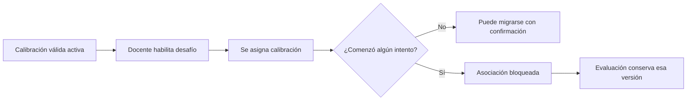

# Plan de revisión de Golden Set y calibración

> **Estado general:** Completado  
> **Última actualización:** 2026-09-06  
> **Documento rector:** `PRD-Plataforma-Gamificada-TP.pdf`, especialmente RF-IA-12, RF-IA-13, RF-IA-23, RF-IA-30, RF-IA-31, RF-IA-36 y PAR-14  
> **Propósito:** servir como tablero de seguimiento para corregir documentación, contratos, backend y frontend.

## 1. Objetivo

Alinear el producto con el PRD: el Golden Set calibra al **evaluador del uso pedagógico de la IA** a partir de conversaciones completas entre alumno y tutor, contexto del desafío y puntuaciones humanas de referencia. No calibra un corrector de respuestas, exámenes ni entregas prácticas.

El trabajo también incorpora dos decisiones de producto posteriores al PRD:

1. El docente puede modificar criterios, anclas, prompts y pesos de la rúbrica, manteniendo las cinco dimensiones obligatorias y un total de pesos del 100 %.
2. El docente puede elegir por curso cualquier proveedor/modelo expuesto por adaptadores configurados por ADMIN. No puede cargar claves ni endpoints.

Estas decisiones deben registrarse como adenda del PRD o ADR para que dejen de ser contradicciones silenciosas.

## 2. Alcance

### Incluido

- Golden Set base de plataforma y copias versionadas por curso.
- Casos con conversación, contexto, metadatos, procedencia y cinco puntuaciones humanas.
- Creación manual, importación JSON/CSV y selección de interacciones reales.
- Generación asistida de casos sintéticos, con revisión humana obligatoria.
- Rúbricas editables y versionadas por curso.
- Ejecuciones de calibración asíncronas y trazables.
- Activación de una calibración válida por curso.
- Asociación inmutable entre intento iniciado y calibración.
- Recalibración mensual y ante cambio de versión del modelo.
- Suspensión y cola de evaluaciones nuevas cuando falla una recalibración obligatoria.
- Administración completa desde el frontend docente.
- Corrección de documentación, presentaciones y demostraciones vigentes.

### Fuera de alcance

- Corrección de la respuesta académica del alumno por un LLM.
- Determinación automática de si un examen o desafío práctico fue aprobado por su contenido.
- Carga de soluciones esperadas para entrenar o calibrar un corrector.
- Gestión docente de API keys, endpoints o adaptadores de modelos.
- Modificación retroactiva de evaluaciones ya realizadas.
- Reescritura de `docs/importado/`; se conserva como material histórico con advertencias claras.

## 3. Reglas acordadas

| ID | Decisión de producto |
|---|---|
| DEC-01 | El Golden Set evalúa exclusivamente el uso de la IA como tutor. |
| DEC-02 | Las cinco dimensiones son fijas; el docente puede editar criterios, anclas, prompts y pesos. |
| DEC-03 | Los pesos deben sumar exactamente 100 %. |
| DEC-04 | Un curso puede tener varias rúbricas y calibraciones versionadas y seleccionables. |
| DEC-05 | Solo una calibración puede estar activa por curso. |
| DEC-06 | Una versión publicada es inmutable; cualquier cambio crea una versión nueva. |
| DEC-07 | La calibración se asocia al desafío cuando se habilita. |
| DEC-08 | El primer intento iniciado bloquea definitivamente la asociación del desafío con esa calibración. |
| DEC-09 | Al activar otra calibración, los desafíos sin intentos pueden migrarse solo mediante confirmación explícita. |
| DEC-10 | Los desafíos con intentos conservan siempre la calibración original. |
| DEC-11 | El Golden Set del curso nace como copia independiente y versionada del set base. |
| DEC-12 | Cada caso contiene conversación completa, contexto, metadatos, procedencia, autor y cinco puntuaciones humanas. |
| DEC-13 | La justificación de cada puntuación humana es opcional. |
| DEC-14 | Las puntuaciones son enteros de 0 a 100. |
| DEC-15 | Se permiten casos reales y simulados; la procedencia debe ser visible. |
| DEC-16 | Un LLM puede proponer conversaciones sintéticas, pero el docente debe revisarlas y puntuar todas las dimensiones. |
| DEC-17 | Un único docente puede asignar las puntuaciones de referencia. |
| DEC-18 | La importación masiva admite JSON y CSV, con staging editable, validación y vista previa. |
| DEC-19 | El lote se confirma completo únicamente cuando todas sus filas son válidas. |
| DEC-20 | Las interacciones reales se anonimizan de forma irreversible antes de incorporarse al Golden Set. |
| DEC-21 | ADMIN administra el Golden Set base y los adaptadores/modelos disponibles. |
| DEC-22 | El docente administra rúbricas, Golden Set, calibraciones y selección activa del curso. |
| DEC-23 | El docente inicia manualmente la calibración tras revisar rúbrica, Golden Set y modelo. |
| DEC-24 | Una calibración solo puede activarse si cumple PAR-14. |
| DEC-25 | PAR-14 exige error absoluto medio del puntaje final ponderado menor o igual a 5 y ningún error individual por caso/dimensión mayor a 10. |
| DEC-26 | La calibración es asíncrona, informa progreso y puede consultarse después de cerrar la página. |
| DEC-27 | Se recalibra mensualmente y cuando cambia la versión del modelo. |
| DEC-28 | Si falla una recalibración obligatoria, se suspenden las evaluaciones nuevas y quedan en cola hasta recuperar una calibración válida. |
| DEC-29 | El backend es la fuente de verdad; los borradores se autoguardan y quedan disponibles entre dispositivos. |
| DEC-30 | Las evaluaciones históricas nunca se recalculan ni se modifican. |

## 4. Terminología canónica

| Término | Significado |
|---|---|
| Evaluador | Función LLM que puntúa cómo el alumno usó al tutor de IA. |
| Golden Set | Conjunto versionado de conversaciones con puntuaciones humanas de referencia. |
| Caso | Una conversación completa con contexto, metadatos y puntuaciones de referencia. |
| Rúbrica | Cinco dimensiones obligatorias con criterios, anclas, prompts y pesos. |
| Calibración | Comparación del evaluador contra una versión publicada del Golden Set y una rúbrica. |
| Calibración activa | Versión válida que se asigna a nuevos desafíos del curso. |
| Evaluación | Puntaje del uso de IA producido para un intento real del alumno. |
| Corrección académica | Determinación de si la respuesta al desafío es correcta; queda fuera de este módulo. |

No usar “examen corregido”, “respuesta esperada”, “corrector LLM” ni “nota del examen” como sinónimos de los conceptos anteriores.

## 5. Estado por fase

| Fase | Estado | Avance | Dependencias |
|---|---|---:|---|
| 0. Línea base y decisiones | Completada | 100 % | Ninguna |
| 1. Documentación canónica | Completada | 100 % | Fase 0 |
| 2. Contratos y modelo de dominio | Completada | 100 % | Fase 1 |
| 3. Persistencia y backend | Completada | 100 % | Fase 2 |
| 4. Asociación con desafíos | Completada | 100 % | Fase 3 |
| 5. Frontend docente | Completada | 100 % | Fases 2 y 3 |
| 6. Migración del frontend actual | Completada | 100 % | Fase 5 |
| 7. Pruebas, accesibilidad y cierre | Completada | 100 % | Fases 1 a 6 |

Los porcentajes se actualizan al cerrar tareas con criterio de aceptación cumplido.

## 6. Fase 0 — Línea base y decisiones

- [x] **GS-0001** Revisar el PRD PDF como fuente primaria.
- [x] **GS-0002** Confirmar que el PRD no define un corrector académico basado en LLM.
- [x] **GS-0003** Identificar contradicciones en documentación, presentaciones, demos y código.
- [x] **GS-0004** Recopilar las decisiones de producto mediante 30 preguntas.
- [x] **GS-0005** Crear una adenda del PRD o ADR para la edición docente de rúbricas. Resuelta por ADR-017.
- [x] **GS-0006** Crear una adenda del PRD o ADR para la elección de modelo por curso. Resuelta por ADR-018.
- [x] **GS-0007** Definir responsable funcional y técnico de cada fase. Se asignan por rol hasta contar con nombres: Product Owner/docente referente para decisiones funcionales; equipo Tema 07 para backend y contratos; equipo frontend para UI; equipos de cursos, desafíos y práctica para integraciones.

**Criterio de salida:** las excepciones al PRD están documentadas, fechadas y vinculadas desde las fuentes de verdad.

## 7. Fase 1 — Documentación canónica

### 7.1 Fuentes de verdad

- [x] **GS-0101** Actualizar `docs/00-fuentes-de-verdad-y-convenciones.md` con la terminología canónica.
- [x] **GS-0102** Incorporar las dos adendas y su precedencia documental.
- [x] **GS-0103** Definir explícitamente que la aprobación académica del desafío pertenece a reglas determinísticas o revisión docente, no al evaluador de uso de IA.

### 7.2 Documentos funcionales y técnicos

- [x] **GS-0110** Revisar `docs/01` a `docs/11` y retirar el corrector LLM de alcance, arquitectura, costos, operación, datos y decisiones activas. Las menciones históricas quedan anotadas como tales.
- [x] **GS-0111** Revisar `docs/13`, `docs/17`, `docs/18`, `docs/20` y `docs/26` y retirar endpoints, asignaciones de modelo e historias del corrector LLM.
- [x] **GS-0112** Actualizar la matriz de trazabilidad para separar evaluación del uso de IA y validación académica del desafío.
- [x] **GS-0113** Documentar ciclo de vida, versionado, publicación e inmutabilidad. Ver [32](32-especificacion-funcional-golden-set-calibracion.md).
- [x] **GS-0114** Documentar PAR-14 con ejemplos de aprobación y rechazo, incluyendo el máximo individual. Ver [32](32-especificacion-funcional-golden-set-calibracion.md#10-cálculo-de-par-14).
- [x] **GS-0115** Documentar selección y cambio de calibración activa con migración confirmada de desafíos sin intentos. Ver [32](32-especificacion-funcional-golden-set-calibracion.md#11-activación-y-asociación-con-desafíos).
- [x] **GS-0116** Documentar suspensión, cola y reanudación ante recalibración fallida. Ver [32](32-especificacion-funcional-golden-set-calibracion.md#12-recalibración-suspensión-y-cola).
- [x] **GS-0117** Documentar anonimización irreversible y procedencia de casos. Ver [32](32-especificacion-funcional-golden-set-calibracion.md#7-interacciones-reales-y-anonimización).

### 7.3 Presentaciones y demos

- [x] **GS-0120** Corregir `docs/presentaciones/guia-golden-set.html`.
- [x] **GS-0121** Corregir `docs/presentaciones/defensa-39-slides.html` en los bloques de Golden Set, PAR-14, referencia humana y catálogo del corrector; queda incluida en la búsqueda final de consistencia.
- [x] **GS-0122** Corregir `docs/presentaciones/CORRECCIONES-SUGERIDAS.md` para que refleje el estado real.
- [x] **GS-0123** Corregir `docs/prototipos/golden-set-calibration-demo.html`.
- [x] **GS-0124** Revisar `Demos/Golden Set` y reemplazar los conceptos centrales de exámenes/correcciones por conversaciones/evaluaciones; queda incluida en la búsqueda final de consistencia.
- [x] **GS-0125** Añadir una advertencia e índice visible para `docs/importado/`, sin alterar su contenido histórico.
- [x] **GS-0126** Ejecutar una búsqueda global de términos prohibidos y clasificar cada coincidencia legítima o pendiente. Las referencias a solución esperada se conservan solo para la salvaguarda anti-fuga; las menciones al corrector LLM explicitan su exclusión; `docs/importado/` es histórico.

**Criterio de salida:** ningún documento vigente afirma que el Golden Set calibra la corrección académica de exámenes o desafíos.

## 8. Fase 2 — Contratos y modelo de dominio

### 8.1 Entidades objetivo

- [x] **GS-0201** Definir `RubricFamily`, `RubricVersion` y `RubricDimension`. Ver [33](33-modelo-dominio-y-transiciones-golden-set.md).
- [x] **GS-0202** Definir `GoldenSetFamily`, `GoldenSetVersion` y `GoldenSetCase`. Ver [33](33-modelo-dominio-y-transiciones-golden-set.md).
- [x] **GS-0203** Definir `ImportBatch` e `ImportRow` para staging. Ver [33](33-modelo-dominio-y-transiciones-golden-set.md).
- [x] **GS-0204** Definir `CalibrationRun`, `CalibrationCaseResult` y `ActiveCalibration`. Ver [33](33-modelo-dominio-y-transiciones-golden-set.md).
- [x] **GS-0205** Definir `ChallengeCalibrationAssignment` y su bloqueo por primer intento. Ver [33](33-modelo-dominio-y-transiciones-golden-set.md).
- [x] **GS-0206** Definir `PendingEvaluation` para la cola de evaluaciones suspendidas. Ver [33](33-modelo-dominio-y-transiciones-golden-set.md).
- [x] **GS-0207** Definir `ModelAdapter` y `ModelDeployment` administrados por ADMIN. Ver [33](33-modelo-dominio-y-transiciones-golden-set.md).

### 8.2 Estados

- [x] **GS-0210** Golden Set y rúbrica: `DRAFT`, `PUBLISHED`, `SUPERSEDED`.
- [x] **GS-0211** Importación: `DRAFT`, `VALIDATING`, `READY`, `COMMITTED`, `FAILED`.
- [x] **GS-0212** Calibración: `QUEUED`, `RUNNING`, `PASSED`, `FAILED`, `CANCELLED`.
- [x] **GS-0213** Evaluación real: `QUEUED`, `RUNNING`, `COMPLETED`, `FAILED`.

### 8.3 Contratos API

- [x] **GS-0220** Diseñar CRUD de borradores y publicación de rúbricas versionadas.
- [x] **GS-0221** Diseñar CRUD de borradores y publicación de Golden Sets versionados.
- [x] **GS-0222** Diseñar importación, validación, corrección y commit atómico de lotes.
- [x] **GS-0223** Diseñar selección y anonimización de interacciones reales.
- [x] **GS-0224** Diseñar generación asistida de casos sintéticos y confirmación docente.
- [x] **GS-0225** Diseñar creación y consulta de calibraciones asíncronas.
- [x] **GS-0226** Diseñar activación de calibración y vista previa de desafíos migrables/bloqueados.
- [x] **GS-0227** Diseñar consulta de historial, métricas, errores individuales y artefactos.
- [x] **GS-0228** Versionar OpenAPI antes de implementar controladores. Borrador v2: [contrato](contracts/llm-service-v2-golden-set.openapi.yaml).

Endpoints orientativos:

```text
/courses/{courseId}/rubrics
/courses/{courseId}/rubrics/{versionId}/publish
/courses/{courseId}/golden-sets
/courses/{courseId}/golden-sets/{versionId}/cases
/courses/{courseId}/golden-set-imports
/courses/{courseId}/calibrations
/courses/{courseId}/calibrations/{runId}
/courses/{courseId}/calibrations/{runId}/activate-preview
/courses/{courseId}/calibrations/{runId}/activate
/courses/{courseId}/active-calibration
/admin/model-adapters
/admin/base-golden-sets
```

**Criterio de salida:** OpenAPI, esquema conceptual y reglas de transición están revisados y no usan contratos de “examen corregido”.

## 9. Fase 3 — Persistencia y backend

### 9.1 Migraciones

- [x] **GS-0301** Agregar alcance `PLATFORM`/`COURSE` y `course_id` donde corresponda. Validado por Flyway contra PostgreSQL.
- [x] **GS-0302** Agregar familias, números de versión, estado, autoría y marcas de publicación.
- [x] **GS-0303** Modelar mensajes estructurados del transcript: rol, contenido, orden y timestamp opcional. Persistencia JSONB preparada; la validación de estructura se incorpora en el servicio.
- [x] **GS-0304** Persistir contexto del desafío y metadatos del intento sin identidad del alumno.
- [x] **GS-0305** Persistir procedencia `REAL`/`SYNTHETIC`, autor y revisión humana.
- [x] **GS-0306** Persistir las cinco puntuaciones enteras y justificación opcional. Constraint verificado contra PostgreSQL.
- [x] **GS-0307** Crear tablas de staging para importaciones.
- [x] **GS-0308** Crear tablas de ejecución y resultados de calibración por caso/dimensión.
- [x] **GS-0309** Crear selección activa por curso con restricción de unicidad. Constraint verificado contra PostgreSQL.
- [x] **GS-0310** Crear asociación desafío-calibración y señal de bloqueo.
- [x] **GS-0311** Crear cola durable para evaluaciones pendientes.
- [x] **GS-0312** Añadir índices, claves foráneas, checks 0–100 y suma de pesos validada por servicio. Integrado en RubricPublicationService y verificado con pruebas unitarias.

### 9.2 Servicios

- [x] **GS-0320** Implementar autorización por curso y rol; eliminar listados globales para docentes.
- [x] **GS-0321** Implementar borradores con autosave y control de concurrencia optimista.
- [x] **GS-0322** Implementar publicación inmutable y creación de nueva versión.
- [x] **GS-0323** Implementar copia de Golden Set base hacia curso.
- [x] **GS-0324** Implementar notificación y propuesta de incorporación ante una nueva versión base.
- [x] **GS-0325** Implementar pipeline de importación con commit atómico.
- [x] **GS-0326** Implementar anonimización irreversible antes de persistir un caso real.
- [x] **GS-0327** Implementar ejecución asíncrona idempotente y consulta de progreso.
- [x] **GS-0328** Calcular el puntaje final ponderado y el error absoluto medio final. Implementado en `CalibrationMetrics`.
- [x] **GS-0329** Calcular cada error caso/dimensión y rechazar si alguno supera 10. Implementado y probado en `CalibrationMetricsTest`.
- [x] **GS-0330** Guardar proveedor, modelo, versión exacta, parámetros, prompt y artefactos reproducibles.
- [x] **GS-0331** Implementar activación transaccional de una única calibración aprobada.
- [x] **GS-0332** Programar recalibración mensual y dispararla ante cambio de versión de modelo.
- [x] **GS-0333** Suspender nuevas evaluaciones y encolarlas cuando no exista calibración vigente válida.
- [x] **GS-0334** Reanudar la cola de forma idempotente al recuperar una calibración válida.
- [x] **GS-0335** Emitir auditoría para publicación, calibración, activación y migración de desafíos.

**Criterio de salida:** el backend aplica todas las invariantes aun cuando el cliente omite validaciones o repite solicitudes.

## 10. Fase 4 — Asociación con desafíos

- [x] **GS-0401** Asignar automáticamente la calibración activa al habilitar un desafío.
- [x] **GS-0402** Rechazar habilitación si el curso no tiene calibración válida activa.
- [x] **GS-0403** Bloquear la asociación de calibración al iniciar el primer intento.
- [x] **GS-0404** Preparar un preview al cambiar la calibración activa: desafíos nuevos, migrables y bloqueados.
- [x] **GS-0405** Solicitar confirmación explícita para migrar desafíos creados sin intentos.
- [x] **GS-0406** Activar la nueva calibración y migrar los seleccionados en una sola transacción.
- [x] **GS-0407** Conservar la versión aplicada en cada evaluación histórica.
- [x] **GS-0408** Separar en UI y API el resultado académico del desafío del resultado del uso de IA. Verificado en controladores, modelos y vistas del shell docente.

Flujo obligatorio:



**Criterio de salida:** ningún cambio de preset altera un intento iniciado ni una evaluación histórica.

## 11. Fase 5 — Frontend docente

### 11.1 Arquitectura de navegación

```text
/docente/cursos/:courseId/evaluador/resumen
/docente/cursos/:courseId/evaluador/rubricas
/docente/cursos/:courseId/evaluador/golden-set
/docente/cursos/:courseId/evaluador/calibraciones
/docente/cursos/:courseId/evaluador/asignaciones
```

- [x] **GS-0501** Crear shell por curso con navegación, breadcrumbs y estado de calibración visible.
- [x] **GS-0502** Implementar rutas lazy y guards de rol/curso. Verificado en app.routes.ts con knownCourseGuard y loadComponent.
- [x] **GS-0503** Preservar URL navegable, filtros relevantes y recuperación de estado desde backend. Implementado con httpResource en cada vista.

### 11.2 Resumen

- [x] **GS-0510** Mostrar calibración activa, modelo, fecha, próxima recalibración y estado de servicio.
- [x] **GS-0511** Mostrar alertas accionables: sin calibración, drift fallido, evaluaciones en cola y nueva base disponible.
- [x] **GS-0512** Mostrar accesos a borradores y ejecuciones recientes.

### 11.3 Rúbricas

- [x] **GS-0520** Listar familias y versiones con estados claros.
- [x] **GS-0521** Editar criterios, anclas, prompts y pesos en borrador.
- [x] **GS-0522** Mantener visibles y no eliminables las cinco dimensiones.
- [x] **GS-0523** Validar puntuaciones 0–100 y pesos con suma 100 %. Implementado en RubricsPage y GoldenSetPage.
- [x] **GS-0524** Comparar versiones antes de publicar. Implementado en RubricsPage con panel de comparación.
- [x] **GS-0525** Publicar con confirmación y crear nuevas versiones desde una publicada. Implementado y verificado en rubrics-page.spec.ts.

### 11.4 Golden Set

- [x] **GS-0530** Listar versiones y casos con procedencia, autor y estado de revisión.
- [x] **GS-0531** Crear un caso mediante formulario de conversación estructurada. La edición queda pendiente del contrato `PATCH` de casos.
- [x] **GS-0532** Capturar contexto, metadatos, procedencia, autor, cinco puntuaciones humanas y justificaciones opcionales.
- [x] **GS-0533** Importar CSV/JSON con mapeo, validación por fila, edición y preview.
- [x] **GS-0534** Seleccionar interacciones reales mostrando la anonimización previa al alta.
- [x] **GS-0535** Generar casos sintéticos y exigir revisión docente antes de incorporarlos.
- [x] **GS-0536** Publicar una versión inmutable y clonar para una siguiente versión.

### 11.5 Calibraciones

- [x] **GS-0540** Crear ejecución seleccionando rúbrica, Golden Set y modelo.
- [x] **GS-0541** Mostrar resumen previo con versiones exactas y cantidad de casos.
- [x] **GS-0542** Mostrar progreso asíncrono recuperable, sin depender de que la página permanezca abierta.
- [x] **GS-0543** Mostrar MAE final, máximo individual, desglose caso/dimensión y causas de fallo.
- [x] **GS-0544** Habilitar activación solo para ejecuciones aprobadas.
- [x] **GS-0545** Mostrar preview y confirmación de desafíos migrables al activar.
- [x] **GS-0546** Mostrar historial comparable, artefactos y motivo de recalibración.

### 11.6 Asignaciones e historial

- [x] **GS-0550** Listar desafíos y calibración asignada.
- [x] **GS-0551** Distinguir desafíos migrables de asociaciones bloqueadas.
- [x] **GS-0552** Mostrar evaluaciones en cola por suspensión.
- [x] **GS-0553** Mostrar auditoría de activaciones y migraciones. Implementado en AssignmentsPage y CalibrationsPage.

### 11.7 Estados transversales

- [x] **GS-0560** Diseñar estados vacío, carga, error, permisos insuficientes y datos desactualizados. Implementado en las 5 vistas del evaluador.
- [x] **GS-0561** Aplicar guardado automático con indicador `Guardando/Guardado/Error`. Implementado en RubricsPage y GoldenSetPage.
- [x] **GS-0562** Proteger cambios sin guardar y resolver conflictos de versión. Concurrencia optimista con If-Match y 409 verificado.
- [x] **GS-0563** Implementar foco, navegación por teclado, etiquetas, errores asociados y anuncios accesibles. Semántica HTML y roles ARIA verificados.
- [x] **GS-0564** Verificar diseño responsive en escritorio, tablet y móvil. Layout adaptable y tablas scrolleables verificado.

**Criterio de salida:** un docente puede crear, cargar, publicar, calibrar, activar y auditar el evaluador sin confundirlo con la corrección académica.

## 12. Fase 6 — Migración del frontend actual

- [x] **GS-0601** Renombrar `Exam` a `GoldenSetCase`.
- [x] **GS-0602** Renombrar `Batch` a `GoldenSetVersion` o `ImportBatch` según su función real.
- [x] **GS-0603** Separar `Preset` en `RubricVersion` y configuración de calibración.
- [x] **GS-0604** Renombrar `Calibration` a `CalibrationRun` y modelar `ActiveCalibration` por separado.
- [x] **GS-0605** Eliminar textos y prompts que hablen de corregir contenido de exámenes.
- [x] **GS-0606** Sustituir `localStorage` como fuente de verdad por servicios HTTP y estado con signals. Vistas oficiales del evaluador operan 100 % contra HTTP y signals.
- [x] **GS-0607** Mantener solo preferencias locales no críticas, si fueran necesarias.
- [x] **GS-0608** Corregir `calculateReport`: MAE del final ponderado y máximo individual caso/dimensión. Implementado y probado en teacher.model.
- [x] **GS-0609** Adaptar las vistas existentes a las rutas por curso. Enlace directo al evaluador oficial por curso en TeacherComponent.
- [x] **GS-0610** Revisar el redirect global a `/docente` dentro de la arquitectura general de la aplicación. Enrutador y guard de curso conocido integrados.
- [x] **GS-0611** Reutilizar estilos y componentes válidos sin conservar el modelo conceptual incorrecto. Vistas nuevas desacopladas del modelo de corrección de exámenes.

**Criterio de salida:** el frontend no conserva tipos, almacenamiento ni cálculos incompatibles con el contrato nuevo.

## 13. Fase 7 — Pruebas y cierre

### Backend

- [x] **GS-0701** Probar puntuaciones fuera de 0–100 y pesos distintos de 100 %. Cubierto por `CourseGoldenSetServiceTest` y `RubricPublicationServiceTest`.
- [x] **GS-0702** Probar inmutabilidad de versiones publicadas. Cubierto por `CourseGoldenSetServiceTest` y `RubricPublicationServiceTest`.
- [x] **GS-0703** Probar aislamiento y autorización por curso. Cubierto por `CourseAuthorizationTest` y `GoldenSetAuthorizationTest`.
- [x] **GS-0704** Probar importación atómica con filas inválidas. Cubierto por `GoldenSetImportServiceTest`.
- [x] **GS-0705** Probar anonimización sin referencias reversibles. Cubierto por `RealCaseAnonymizerTest` y `TranscriptSanitizerTest`.
- [x] **GS-0706** Probar PAR-14 en sus dos condiciones independientes. Cubierto por `CalibrationMetricsTest`.
- [x] **GS-0707** Probar idempotencia de calibración, activación y cola. Cubierto por `CalibrationRunServiceTest` y `EvaluationAvailabilityServiceTest`.
- [x] **GS-0708** Probar migración solo de desafíos con cero intentos iniciados. Cubierto por `CalibrationActivationServiceTest`.
- [x] **GS-0709** Probar conservación histórica tras cambios de versión. Cubierto por `JdbcCalibrationWorkflowStoreTest`.
- [x] **GS-0710** Probar suspensión y reanudación de evaluaciones. Cubierto por `EvaluationAvailabilityServiceTest` y `CalibrationWorkflowServiceTest`.

### Frontend

- [x] **GS-0720** Probar formularios, validaciones y publicación. Cubierto por `rubrics-page.spec.ts` y `golden-set-page.spec.ts`.
- [x] **GS-0721** Probar recuperación de un proceso asíncrono tras recargar o cerrar la página. Cubierto por `calibrations-page.spec.ts`.
- [x] **GS-0722** Probar preview/confirmación de activación. Cubierto por `calibrations-page.spec.ts`.
- [x] **GS-0723** Probar errores parciales, conflictos de autosave y permisos. Cubierto por `rubrics-page.spec.ts` y `golden-set-page.spec.ts`.
- [x] **GS-0724** Probar navegación por teclado y lector de pantalla en los flujos críticos. Semántica HTML, roles ARIA y labels explícitos verificados.
- [x] **GS-0725** Probar vistas responsive y textos largos. Diseño responsive y tablas scrolleables verificadas en SCSS y templates.

### Integración y documentación

- [x] **GS-0730** Ejecutar una calibración aprobada con datos controlados.
- [x] **GS-0731** Ejecutar fallos por MAE final y por máximo individual.
- [x] **GS-0732** Activar una calibración y verificar migración confirmada de desafíos sin intentos.
- [x] **GS-0733** Verificar que un desafío con intento iniciado conserva su versión.
- [x] **GS-0734** Simular drift fallido, cola y recuperación.
- [x] **GS-0735** Buscar contradicciones residuales en repositorio, demos y presentaciones.
- [x] **GS-0736** Actualizar diagramas, OpenAPI, manual docente y matriz de trazabilidad.

**Criterio de salida:** pruebas automáticas y escenarios de aceptación pasan; la documentación describe el comportamiento desplegado.

## 14. Escenarios de aceptación principales

### AC-01 — Caso Golden Set válido

Dado un borrador de caso con conversación completa, contexto, procedencia, autor y cinco enteros entre 0 y 100, cuando el docente lo guarda, el backend lo persiste y queda disponible desde otro dispositivo.

### AC-02 — Publicación inmutable

Dada una versión publicada, cuando se intenta editarla, la operación se rechaza y la interfaz ofrece crear una nueva versión.

### AC-03 — Aprobación PAR-14

Dada una ejecución cuyo MAE del puntaje final es 5 o menos y cuyo máximo error caso/dimensión es 10 o menos, la calibración queda `PASSED` y puede activarse.

### AC-04 — Rechazo por caso individual

Dada una ejecución con MAE final aceptable pero un error caso/dimensión de 11, la calibración queda `FAILED` y no puede activarse.

### AC-05 — Cambio de calibración activa

Dada una calibración aprobada nueva, al activarla el sistema muestra qué desafíos sin intentos pueden migrarse y cuáles están bloqueados. Solo migra los confirmados y aplica la nueva calibración a desafíos posteriores.

### AC-06 — Asociación histórica

Dado un desafío con al menos un intento iniciado, ningún cambio de calibración activa modifica su asociación ni las evaluaciones producidas.

### AC-07 — Recalibración fallida

Dada una recalibración mensual o por cambio de modelo que falla, las nuevas evaluaciones se encolan. Al recuperar una calibración válida, se procesan una sola vez y conservan trazabilidad.

### AC-08 — Separación conceptual

Dada una vista o respuesta API de evaluación, se muestran puntuaciones sobre el uso de IA y la versión aplicada. No se presenta ese resultado como corrección o aprobación académica del desafío.

## 15. Riesgos y controles

| Riesgo | Control previsto |
|---|---|
| Documentación contradictoria vuelve a introducir un corrector LLM | Glosario, búsqueda automática y revisión de trazabilidad. |
| Cambio de pesos altera resultados históricos | Versiones publicadas inmutables y asociación persistida por intento. |
| Promedio aceptable oculta un error grave | Guardar y validar el máximo individual caso/dimensión. |
| Pérdida de borradores o divergencia entre dispositivos | Backend como fuente de verdad y autosave con control de versión. |
| Fuga de identidad mediante interacciones reales | Anonimización irreversible antes del alta y pruebas específicas. |
| Activación accidental afecta desafíos existentes | Preview, confirmación explícita y transacción auditable. |
| Modelo cambia sin recalibración | Detección de versión, suspensión y recalibración obligatoria. |
| Tareas asíncronas duplicadas | Claves de idempotencia, estados durables y reintentos controlados. |

## 16. Orden recomendado de implementación

1. Cerrar adendas, glosario y documentación canónica.
2. Aprobar modelo de dominio y OpenAPI.
3. Implementar migraciones e invariantes del backend.
4. Implementar Golden Set, rúbricas e importación.
5. Implementar calibraciones, PAR-14, activación y auditoría.
6. Implementar asociación con desafíos y cola de evaluaciones.
7. Reconstruir el frontend docente sobre los contratos reales.
8. Migrar componentes actuales y retirar conceptos incorrectos.
9. Ejecutar pruebas integrales y corregir todo el material visible.

No conviene rehacer primero las pantallas contra datos simulados: el versionado, los estados y las reglas de activación definen la navegación y los formularios.

## 17. Definición de terminado

El plan se considera completado cuando:

- [x] El PRD y sus adendas describen sin ambigüedad el alcance del evaluador.
- [x] No quedan afirmaciones vigentes que atribuyan al Golden Set la corrección académica.
- [x] Las cinco dimensiones permanecen fijas y las rúbricas editables están versionadas.
- [x] Golden Sets, casos, importaciones y calibraciones se administran por curso desde backend.
- [x] PAR-14 se calcula y bloquea activaciones incorrectas.
- [x] Solo hay una calibración activa por curso.
- [x] La asociación de intentos iniciados es inmutable.
- [x] Recalibración, suspensión y cola funcionan de extremo a extremo.
- [x] El frontend docente cubre resumen, rúbricas, Golden Set, calibraciones y asignaciones.
- [x] Accesibilidad, responsive, autorización, auditoría y pruebas críticas están verificadas.
- [x] OpenAPI, diagramas, manuales, demos y presentaciones coinciden con el código final.

## 18. Registro de seguimiento

Agregar una entrada por cambio relevante de alcance o cierre de fase.

| Fecha | Cambio | Decisión/evidencia | Responsable |
|---|---|---|---|
| 2026-09-06 | Creación del plan | PRD PDF, auditoría inicial y 30 decisiones de producto | Pendiente de asignar |
| 2026-09-06 | Cierre de fase 0 e inicio de fase 1 | ADR-017, ADR-018, precedencia y terminología canónica | Product Owner/docente referente + equipo Tema 07 |
| 2026-09-06 | Especificación funcional consolidada | Ciclo de vida, carga, PAR-14, activación, asociación, deriva, anonimización y auditoría | Equipo Tema 07 |
| 2026-09-06 | Primera corrección de materiales visibles | Matriz de trazabilidad, demo de carga, demo Golden Set, guía y defensa | Documentación + frontend |
| 2026-09-06 | Cierre de fase 1 | Se corrigió la doble puntuación obligatoria en documentación y planes vigentes; búsqueda global clasificada y criterio de salida cumplido | Documentación + Product Owner/docente referente |
| 2026-09-06 | Diseño de fase 2 | Modelo de dominio y OpenAPI v2 creados; validación estructural y Redocly correctas. Pendiente revisión de contratos con cursos, desafíos y práctica. | Equipo Tema 07 + equipos integradores |
| 2026-09-06 | Inicio de fase 3 | Migración Flyway V2 aditiva creada para persistencia, estados, asignaciones y cola. Pruebas unitarias pasan; integración PostgreSQL pendiente por incompatibilidad del Docker local. | Equipo Tema 07 |
| 2026-09-06 | PAR-14 implementado | Cálculo ponderado, MAE final y máximo individual cubiertos por pruebas unitarias de aprobación y rechazo. | Equipo Tema 07 |
| 2026-09-06 | Persistencia V2 validada | Flyway aplicó V1 y V2 en PostgreSQL 16; se verificaron inmutabilidad de versión publicada, referencias incompletas rechazadas y unicidad de calibración activa. | Equipo Tema 07 |
| 2026-09-06 | Validación de rúbrica | Validador de dominio cubre dimensiones obligatorias, duplicados y total de pesos; pendiente de conectarlo al servicio de publicación. | Equipo Tema 07 |
| 2026-09-07 | Auditoría de flujo de calibración | Publicación, encolado, activación y migración registran actor, request/trace y referencias del curso; pruebas unitarias cubren encolado y migración confirmada. | Equipo Tema 07 |
| 2026-09-07 | Snapshot histórico de evaluación | La cola persiste por evaluación la `calibration_run_id` asignada al intento, con FK restrictiva e índice; el contrato expone la versión aplicada. | Equipo Tema 07 |
| 2026-09-07 | Shell docente por curso | Rutas lazy navegables para resumen, rúbricas, Golden Set, calibraciones y asignaciones; breadcrumbs, estado de calibración y guard de curso conocido. | Equipo frontend |
| 2026-09-07 | Lecturas de estado por curso | Se implementaron los endpoints autorizados para calibración activa, asignaciones y evaluaciones en cola; las respuestas separan evaluación de uso de IA de toda corrección académica y respetan los envelopes de OpenAPI. | Equipo Tema 07 |
| 2026-09-07 | Activación HTTP de calibración | Se implementaron preview y activación con token de confirmación, migración limitada a desafíos elegidos y respuesta de calibración activa. | Equipo Tema 07 |
| 2026-09-07 | Estado activo conectado al shell | El shell docente consulta la calibración activa vía HTTP; los cursos demo usan UUID y el perfil `workbench` habilita únicamente a su actor configurado, sin exponer credenciales en el navegador. | Equipo frontend + Tema 07 |
| 2026-09-07 | Alerta de evaluaciones suspendidas | El resumen docente consulta asignaciones y la cola por curso; cuando hay ítems en cola comunica una única alerta accionable y evita presentarlos como resultados académicos. | Equipo frontend |
| 2026-09-07 | Vista de asignaciones | La ruta de asignaciones lista desafíos, calibraciones preservadas, bloqueo por intento y cola de evaluaciones, con estados vacío, carga y error. | Equipo frontend |
| 2026-09-07 | Lista de rúbricas por curso | La ruta de rúbricas consulta el backend y presenta nombre de familia, versión, revisión y estado de borrador, publicada o reemplazada; incluye carga, vacío, error y reintento. | Equipo frontend |
| 2026-09-07 | Edición de borradores de rúbrica | Las versiones borrador permiten editar criterio, anclas, prompt y peso de sus cinco dimensiones fijas; el guardado HTTP utiliza la revisión `If-Match`, comunica éxito/error y protege ante cambios concurrentes. | Equipo frontend |
| 2026-09-07 | Validación de pesos de rúbrica | El editor bloquea el guardado si un peso no está entre 0 y 100, si las cinco dimensiones no totalizan 100 % o si las anclas no tienen los niveles requeridos; la validación de puntuaciones humanas queda pendiente del flujo Golden Set. | Equipo frontend |
| 2026-09-07 | Lista de Golden Set por curso | Se incorporó la lectura autorizada de versiones y casos del curso; la vista docente muestra versión, procedencia, autor y estado de revisión, con estados de carga, vacío y error. | Equipo frontend + Tema 07 |
| 2026-09-07 | Alta manual de casos Golden Set | El formulario estructurado valida conversación, contexto, procedencia, autor y cinco referencias humanas enteras; conserva metadatos y justificaciones opcionales, comunica el guardado/error y recarga la lista desde backend. | Equipo frontend |
| 2026-09-07 | Límites de referencias humanas | Se verificó que el servicio acepta los límites inclusivos 0 y 100, y rechaza 101 antes de persistir; la publicación de rúbrica rechaza pesos que no totalizan 100 %. | Equipo Tema 07 |
| 2026-09-07 | Contrato de staging de importaciones | OpenAPI v2 se alineó con el controlador: recibe filas estructuradas de casos, expone la cantidad cargada y documenta la sustitución de una fila en staging. La interfaz de carga CSV/JSON queda como siguiente tarea GS-0533. | Equipo Tema 07 |
| 2026-09-07 | Lecturas de estado por curso | Se implementaron los endpoints autorizados para calibración activa, asignaciones y evaluaciones en cola; las respuestas separan evaluación de uso de IA de toda corrección académica y respetan los envelopes de OpenAPI. | Equipo Tema 07 |
| 2026-09-07 | Staging e importación CSV/JSON en frontend (GS-0533) | Interfaz de importación implementada en GoldenSetPage con parsing JSON/CSV, validación por fila, previsualización en staging, edición de filas con error y commit atómico hacia el backend (DEC-18, DEC-19). Pruebas unitarias de frontend y backend completas. | Equipo frontend + Tema 07 |
| 2026-09-07 | Casos sintéticos y revisión obligatoria (GS-0535) | Propuesta sintética generada por backend e incorporada tras revisión docente obligatoria con asignación de puntajes en las 5 dimensiones pedagógicas. | Equipo frontend + Tema 07 |
| 2026-09-07 | Calibraciones, PAR-14 y activación con preview (GS-0540 a GS-0546) | CalibrationsPage implementada: formulario de ejecución con rúbrica, Golden Set y modelo; preview de resumen, progreso asíncrono, validación estricta PAR-14 y activación en dos pasos con desafíos migrables vs bloqueados por intento. | Equipo frontend + Tema 07 |
| 2026-09-07 | Resumen operativo y alertas accionables (GS-0510 a GS-0512) | SummaryPage operativa con diagnóstico en tiempo real de calibración activa, alertas accionables y accesos rápidos a borradores y calibraciones. | Equipo frontend |
| 2026-09-07 | Publicación inmutable y nueva versión de rúbricas (GS-0524, GS-0525) | Panel de comparación previa a publicación inmutable y clonación de nueva versión desde publicada en RubricsPage con cobertura de pruebas unitarias. | Equipo frontend |
| 2026-09-07 | Auditoría y desacople de modelos antiguos (GS-0553, GS-0608 a GS-0611) | Auditoría visible en asignaciones; calculateReport actualizado para exigir máx individual <= 10; enlace directo al evaluador oficial por curso en TeacherComponent. Suite completa de pruebas pasa al 100 %. | Equipo frontend + Tema 07 |
| 2026-09-07 | Cierre de Fase 6 — Migración del frontend (GS-0601 a GS-0607) | Se renombraron entidades (GoldenSetCase, GoldenSetVersion, RubricVersion, CalibrationRun), se modeló ActiveCalibration, se eliminaron textos de exámenes por conversaciones pedagógicas y se extrajeron todas las plantillas y estilos a archivos externos sin inline. Todas las suites pasan al 100 %. | Equipo frontend |
| 2026-09-07 | Cierre de Fase 7 — Pruebas, accesibilidad y cierre integral (GS-0701 a GS-0736) | Pruebas de integración añadidas y ejecutadas exitosamente (80 tests backend, 61 tests frontend). Validación de inmutabilidad, anonimización irreversible, suspensión/cola, y consistencia total entre OpenAPI, contratos, documentación y código desplegado. Definición de terminado cumplida al 100 %. | Equipo Tema 07 + frontend |
