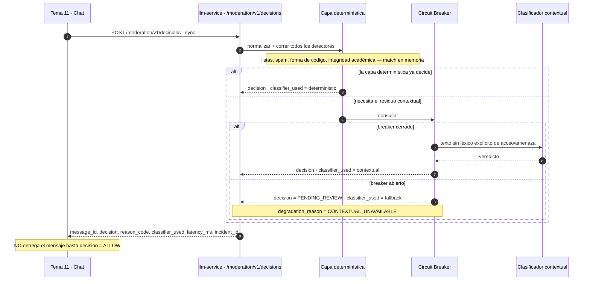

# Tema 11 — Chat — contratos

> Contrato completo y vigente con Tema 11. El schema ejecutable es
> [`llm-service-v1-moderacion.openapi.yaml`](../llm-service-v1-moderacion.openapi.yaml) (v1.1.0).
> Lo que Tema 11 todavía debe cerrar está en
> [`moderacion-pendientes-chat-service.md`](../moderacion-pendientes-chat-service.md).
> Contexto adicional: [02-funciones-de-ia.md](../../03-capacidades-de-ia/02-funciones-de-ia.md)
> ("qué construimos y qué no").

## Qué nos llama

**`POST /moderation/v1/decisions`** — síncrono, siempre antes de entregar el mensaje al hilo.
Vigente desde 2026-09-19; timeout interno **800 ms**: si vence, responde `PENDING` y el chat NO
debe publicar (nunca se aprueba automáticamente un mensaje que no pudo verificarse). Idempotente
por `message_id`: reenviarlo devuelve la decisión original aunque cambie el texto.

Requiere principal de **servicio** (`X-Principal-Type: service`, `X-Service-Id: chat-service`,
`X-Service-Scopes: moderation:decide`).

### Request (`ModerationDecisionRequest`)

| Campo | Obligatorio | Descripción |
|---|---:|---|
| `message_id` | Sí | Clave de idempotencia. |
| `course_id` | Sí | — |
| `sender_id` | Sí | Dueño del incidente; obligatorio desde v1.1.0 (anti-IDOR: solo su dueño apela). |
| `sender_role` | Sí | `student` \| `teacher` \| `system`. |
| `text` | Sí | 1–4096 caracteres. |
| `context_flags` | No | Solo contexto inmediato, **nunca historial** del chat. |

`context_flags` es donde Tema 11 puede indicar señales como si el emisor tiene un desafío activo
— la heurística de integridad académica (bloque de código pegado en el chat) lo necesita para
decidir sin acceso al historial.

### Arquitectura de la decisión

Dos capas antes de responder: una capa determinística en memoria (listas, spam por frecuencia,
forma de código, integridad académica) y, solo para el residuo que esa capa no resuelve, un
clasificador contextual (`omni-moderation-latest`) protegido por Circuit Breaker.

### Response (`ModerationDecisionResponse`)

| Campo | Descripción |
|---|---|
| `decision` | `ALLOW` \| `BLOCK` \| `PENDING` \| `PENDING_REVIEW`. |
| `reason_code` | `CLEAN`, `SPAM`, `OFFENSIVE`, `CODE_OBFUSCATION`, `NEEDS_REVIEW`, `ENGINE_UNAVAILABLE`… |
| `classifier_used` | `deterministic` \| `contextual` \| `fallback`. |
| `latency_ms` | — |
| `incident_id` | Presente si `decision != ALLOW`. |
| `degradation_reason` | Solo en modo degradado: `CONTEXTUAL_UNAVAILABLE` \| `FULL_ENGINE_UNAVAILABLE`. |

**Tema 11 no entrega el mensaje al hilo hasta recibir `decision: ALLOW`.**

## Qué más expone el contrato

- `DELETE /moderation/v1/decisions/{message_id}` — retirar una decisión ya tomada. Un `ALLOW`
  nunca abre incidente, así que retirarlo es `409 PROTOCOL_VIOLATION`.
- `POST /moderation/v1/appeals` y `GET /moderation/v1/appeals/{appealId}` — el alumno apela un
  `BLOCK` propio (`incident_id`, `appeal_reason`, 20–1000 caracteres). Solo el `sender_id` dueño
  del incidente puede apelar.
- `GET /moderation/v1/incidents` y `GET /moderation/v1/incidents/{incidentId}` — el docente lista
  y revisa incidentes de su curso (`X-Teacher-Course-Ids`), paginado, máx. 50 por página.
- `POST /moderation/v1/incidents/{incidentId}/resolve` — el docente confirma o revierte el
  bloqueo (`resolution: CONFIRMED | REVERSED`, `resolution_reason` obligatoria, auditado con
  `resolved_by`).
- `GET/PUT /operations/retention-policy/moderation` — un `ADMIN` lee o cambia los días de
  retención de evidencia por tipo de incidente, sin redespliegue.

Detalle completo de cada endpoint, ejemplos y errores tipados en el YAML — no se duplica acá.

## Qué pasa si esto falla

Técnica común en
[transversales del README](../README.md#resiliencia-y-manejo-de-errores-técnica-común-a-todos-los-endpoints).

- **Clasificador contextual caído (Circuit Breaker abierto):** `decision: PENDING_REVIEW`,
  `classifier_used: fallback`, `degradation_reason: CONTEXTUAL_UNAVAILABLE` — la capa
  determinística sigue decidiendo sola; el mensaje queda para revisión docente en vez de
  bloquearse a ciegas.
- **Motor completo no disponible / timeout (800 ms vencido):** `decision: PENDING`,
  `degradation_reason: FULL_ENGINE_UNAVAILABLE` — el chat no publica hasta que se resuelva.

**Decisión de producto (fail-open con red):** ante cualquier falla del clasificador contextual el
sistema no bloquea el chat entero — degrada a revisión docente en vez de rechazar todo. La capa
determinística es la que hace ese fail-open tolerable: sin ella, degradar significaría *sin
ninguna moderación*.

## Deslinde de alcance ya acordado

**"El chat es del Tema 11. Nosotros aportamos una función, no una funcionalidad."** De ellos: el
chat completo (canales, hilos, citas, entrega), la pantalla del dashboard de incidentes, el envío
de notificaciones, la ejecución de la purga al archivar el curso. De nosotros: la capa
determinística + clasificador, el registro de incidentes, las apelaciones, y la política de
retención.
